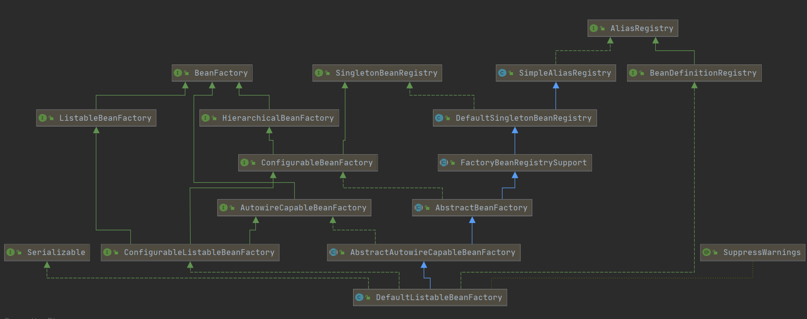
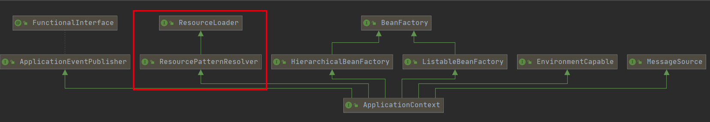

# spring ioc的使用

```
@ComponentScan(value = {"com.ctsi.ioc"},
        excludeFilters = {@ComponentScan.Filter(type = FilterType.ASSIGNABLE_TYPE, classes = {Configuration1.class})})
public class AnnotaionConfiguration{

        public static void main(String[] args) {
        //使用全注解的方式获得spring ioc工厂，入参为标注有@ComponentScan注解的类
        AnnotationConfigApplicationContext context = new AnnotationConfigApplicationContext(AnnotaionConfiguration.class);
//        AnnotationConfigApplicationContext context = new AnnotationConfigApplicationContext();
//		可以使用context的scan方法注册beandefinition
//        context.scan("com.ctsi.ioc");
        //从ioc中获得指定类型的bean
        DemoController controller=context.getBean(DemoController.class);
        //使用获取到的bean
        System.out.println(controller);
    }

}
```

以上为通过编程的方式使用spring ioc工厂。主要分为两步：

- 初始化ioc工厂：创建ApplicationContext对象，因为通过注解的方式配置bean，可以初始化AnnotationConfigApplicationContext对象，入参为带有@ComponentScan注解的类对象
- 使用ioc工厂：用户可以利用applicationContext对象中的getBean方法获得指定类型的bean

可以看出spring ioc的工厂的起点是ApplicationContext。

## ApplicationContext继承体系

### ApplicationContext的父类


主要的父接口：

- BeanFactory

  用于创建、管理的bean对象的工厂

- ResourceLoader

  用于从不同源加载bean的配置信息

- MessageSource

  用于国际化

- ApplicationEventPublish

  用于发布applicationcontext运行过程中的各类事件

### ApplicationContext的实现类


主要的实现类有：

- AbstractApplicationContext

  使用模板方法模式，封装applicationcontext公共处理方法，将需要子类实现的方法通过抽象方法让子类实现。主要的方法：refresh

- ClassPathXMLApplicationContext、FileSystemXMLApplicationContext

  applicationcontext是通过xml的方式配置，配置文件分别是：classpath、文件系统

- AnnotationConfigApplicationContext

  applicationcontext是通过注解的方式配置

可以看出注解和xml配置的主要父类分别是：GeneriApplicationContext和AbstractRefreshableApplicationContext。因为前期spring主要使用xml，注解的方式是后期加的。目前spring推荐在GeneriApplicationContext的基础上扩展出不同配置源的ApplicationContext。

### BeanFactory的继承体系


ApplicationContext虽然是BeanFactory的子类，但是实际上将getBean的请求委托给DefaultListableBeanFactory，BeanFactory的主要子类：

- Beanfactory

  工厂类的父接口

  - 代表接口：

    ```
    Object getBean(String name)
    ```

- ListableBeanFactory

  可以通过type获取一类bean对象

  - 代表接口：

    ```
    String[] getBeanNamesForType(@Nullable Class<?> type);
    ```

- HierarchicalBeanFactory

  实现beanfactory的继承结构，区别于java的继承结构，当子ioc获取不到对应bean，可以从父ioc中获取

  - 代表接口

    ```
    BeanFactory getParentBeanFactory();
    ```

- AutowireCapableBeanFactory

  - 代表接口

    ```
    <T> T createBean(Class<T> beanClass) throws BeansException;
    ```

## DefaultListableBeanFactory结构体系



DefaultListableBeanFactory类作为GenericApplicationContext类的默认BeanFactory的实现类。可以看出其主要的实现父接口：

- BeanFactory

- BeanDefinitionRegistry

  用于注册BeanDefinition对象到ioc工厂中，为接下类的实例化bean做准备

  - 代表方法

    ```
    void registerBeanDefinition(String beanName, BeanDefinition beanDefinition)
    			throws BeanDefinitionStoreException;
    ```

- SingletonBeanRegistry

  该接口主要用于单例bean的创建和注册

  - 代表方法

    ```
    Object getSingleton(String beanName);
    
    void registerSingleton(String beanName, Object singletonObject);
    ```

  - 代表实现类

    - org.springframework.beans.factory.support.DefaultSingletonBeanRegistry

      BeanFactory创建的单例bean都保存在该对象，依赖注入的接口也是通过该类的singletonObjects、singletonFactories、earlySingletonObjects三个map实现

# ioc容器的运行

## AnnotationConfigApplicationContext构造函数

```
	//读取注解信息创建Beandefinition
	private final AnnotatedBeanDefinitionReader reader;
	//从指定classpath下创建符合条件的Beandefinition，调用AnnotationConfigApplicationContext.scan方法时实际通过该scanner完成扫描工作
	private final ClassPathBeanDefinitionScanner scanner;
	

	public AnnotationConfigApplicationContext(Class<?>... componentClasses) {
		//将当前对象作为参数创建reader、scanner对象，
		this();
		//注册类对象到ioc中
		register(componentClasses);
		//调用AbstractBeanFactory的方法，对ioc执行刷新操作
		refresh();
	}
	

	public AnnotationConfigApplicationContext() {
		this.reader = new AnnotatedBeanDefinitionReader(this);
		this.scanner = new ClassPathBeanDefinitionScanner(this);
	}
	

	//使用reader从特定的class对象的注解中读取Beandefinition然后注册到ioc中
	public void register(Class<?>... componentClasses) {
		this.reader.register(componentClasses);
	}

```

主要过程：

- 初始化AnnotationBeanDefinitionReader和ClassPathBeandefinitionScanner

  AnnotationBeanDefinitionReader用于解析带有注解的配置类，然后将其注册到ioc，同时注册了处理注解的处理器。ClassPathBeandefinitionScanner从指定的路径扫描BeanDefinition然后注册到ioc

## debug验证


可以看到当执行完register方法后，ioc中已经注册的beandefinition主要有：

- org.springframework.context.annotation.ConfigurationClassPostProcessor

  BeanFactoryPostProcessor接口的子类，主要用于解析配置类。在本例中从配置类上获取到@ComponentScan注解，然后

- com.ctsi.ioc.AnnotaionConfiguration

  ConfigurationClassPostProcessor解析该类上的@Componentscann注解完成BeanDefinition

接着进入了工厂创建bean的主要方法：org.springframework.context.support.AbstractApplicationContext#refresh

## beanfactory的refresh

### AbstractApplicationContext#refresh

```
	
	public void refresh() throws BeansException, IllegalStateException {
		//保证要么加载所有的bean被加载，要么没有bean被加载，防止出现中间状态
		synchronized (this.startupShutdownMonitor) {
			// 设置工厂状态和记录启动时间
			prepareRefresh();

			// 获得子类的beanfactory实例，当AnnotationConfigApplicationContext初始化时会调用其父类GenericApplicationContext的构造方法，在GenericApplicationContext的构造方法中创建DefaultListableBeanFactory赋值给beanfactory。DefaultListableBeanFactory实例化的同时也会实例化DefaultSingletonBeanRegistry对象（其具有父子关系）
			ConfigurableListableBeanFactory beanFactory = obtainFreshBeanFactory();

			// 配置beanfactory，如增加ApplicationContextAwareProcessor
			prepareBeanFactory(beanFactory);

			try {
				//子类扩展点，为beanfactory添加额外的配置，如：自定义的BeanPostProcessor
				postProcessBeanFactory(beanFactory);

				// 此处调用BeanFactoryPostProcessor子类BeanDefinitionRegistyPostProcessor的postProcessBeanDefinitionRegistry方法（在此处可以注册新的Beandefinition到ioc中），及其BeanFactoryPostProcessor的实现类的postProcessorBeanFactory，如ConfigurationClassPostProcessor在此处解析配置类完成注册新的Beandefinition
				invokeBeanFactoryPostProcessors(beanFactory);

				// 从beanfactory中实例化所有类型为BeanPostProcessor然后将其添加到beanfactory的beanPostProcessors中。此时已经完成了所有的beandefinition。
				registerBeanPostProcessors(beanFactory);

				// 国际化资源方面的初始化
				initMessageSource();

				// 初始化事件发布器
				initApplicationEventMulticaster();

				// 子类可以实例化特殊的bean实例，在springboot中在次数实例化tomsever
				onRefresh();

				// 实例化ioc中的所有ApplicationListner对象并添加至ioc中
				registerListeners();

				//实例化所有的非懒加载的单例bean
				finishBeanFactoryInitialization(beanFactory);

				// Last step: publish corresponding event.
				finishRefresh();
			}

			catch (BeansException ex) {
				...
	}
```

#### 刷新前的准备

AbstractApplicationContext#prepareRefresh：

```
	protected void prepareRefresh() {
		// 记录启动时间和ioc的状态
		this.startupDate = System.currentTimeMillis();
		this.closed.set(false);
		this.active.set(true);

		if (logger.isDebugEnabled()) {
			if (logger.isTraceEnabled()) {
				logger.trace("Refreshing " + this);
			}
			else {
				logger.debug("Refreshing " + getDisplayName());
			}
		}

		// Initialize any placeholder property sources in the context environment.
		initPropertySources();
		//环境变量的属性校验
		// Validate that all properties marked as required are resolvable:
		// see ConfigurablePropertyResolver#setRequiredProperties
		getEnvironment().validateRequiredProperties();
		//将刷新前的applicationlisteners保存起来
		// Store pre-refresh ApplicationListeners...
		if (this.earlyApplicationListeners == null) {
			this.earlyApplicationListeners = new LinkedHashSet<>(this.applicationListeners);
		}
		else {
			// Reset local application listeners to pre-refresh state.
			this.applicationListeners.clear();
			this.applicationListeners.addAll(this.earlyApplicationListeners);
		}
		//初始化刷新前的applicationEvents
		// Allow for the collection of early ApplicationEvents,
		// to be published once the multicaster is available...
		this.earlyApplicationEvents = new LinkedHashSet<>();
	}

```


#### 刷新的beanfactory

AbstractApplicationContext#obtainFreshBeanFactory：

```
	/**告诉子类刷新beanfactory
	 * Tell the subclass to refresh the internal bean factory.
	 * @return the fresh BeanFactory instance
	 * @see #refreshBeanFactory()
	 * @see #getBeanFactory()
	 */
	protected ConfigurableListableBeanFactory obtainFreshBeanFactory() {
		refreshBeanFactory();
		//抽象方法，返回子类的beanfactory
		return getBeanFactory();
	}

```

##### GenericApplicationContext#refreshBeanFactory

```
	//子类GenericApplicationContext中只准刷新一次
	protected final void refreshBeanFactory() throws IllegalStateException {
		if (!this.refreshed.compareAndSet(false, true)) {
			throw new IllegalStateException(
					"GenericApplicationContext does not support multiple refresh attempts: just call 'refresh' once");
		}
		this.beanFactory.setSerializationId(getId());
	}
```

#### 配置beanfactory

AbstractApplicationContext#prepareBeanFactory：

```
	/**配置beanfactory：如classloader、BeanPostProcessor
	 * Configure the factory's standard context characteristics,
	 * such as the context's ClassLoader and post-processors.
	 * @param beanFactory the BeanFactory to configure
	 */
	protected void prepareBeanFactory(ConfigurableListableBeanFactory beanFactory) {
		//beanfactory和context的classloader一致
		// Tell the internal bean factory to use the context's class loader etc.
		beanFactory.setBeanClassLoader(getClassLoader());
		
		//注册StandardBeanExpressionResolver
		beanFactory.setBeanExpressionResolver(new StandardBeanExpressionResolver(beanFactory.getBeanClassLoader()));
		beanFactory.addPropertyEditorRegistrar(new ResourceEditorRegistrar(this, getEnvironment()));
		
		//添加BeanPostProcessor，ApplicationContextAwareProcessor用于处理：EnvironmentAware、EmbeddedValueResolverAware、ResourceLoaderAware、ApplicationEventPublisherAware、MessageSourceAware、ApplicationContextAware这几类Aware，
		// Configure the bean factory with context callbacks.
		beanFactory.addBeanPostProcessor(new ApplicationContextAwareProcessor(this));
		
		//当依赖中需要自动注入指定接口时忽略
		beanFactory.ignoreDependencyInterface(EnvironmentAware.class);
		beanFactory.ignoreDependencyInterface(EmbeddedValueResolverAware.class);
		beanFactory.ignoreDependencyInterface(ResourceLoaderAware.class);
		beanFactory.ignoreDependencyInterface(ApplicationEventPublisherAware.class);
		beanFactory.ignoreDependencyInterface(MessageSourceAware.class);
		beanFactory.ignoreDependencyInterface(ApplicationContextAware.class);

		//当bean的依赖中需要以下的类型是注入对应的实例对象
		// BeanFactory interface not registered as resolvable type in a plain factory.
		// MessageSource registered (and found for autowiring) as a bean.
		beanFactory.registerResolvableDependency(BeanFactory.class, beanFactory);
		beanFactory.registerResolvableDependency(ResourceLoader.class, this);
		beanFactory.registerResolvableDependency(ApplicationEventPublisher.class, this);
		beanFactory.registerResolvableDependency(ApplicationContext.class, this);

		//注册ApplicationListenerDetector，该对象检测出Applicationlistener然后对其注册到applicationcontext中
		// Register early post-processor for detecting inner beans as ApplicationListeners.
		beanFactory.addBeanPostProcessor(new ApplicationListenerDetector(this));

		//处理cglib的动态代理
		// Detect a LoadTimeWeaver and prepare for weaving, if found.
		if (beanFactory.containsBean(LOAD_TIME_WEAVER_BEAN_NAME)) {
			beanFactory.addBeanPostProcessor(new LoadTimeWeaverAwareProcessor(beanFactory));
			// Set a temporary ClassLoader for type matching.
			beanFactory.setTempClassLoader(new ContextTypeMatchClassLoader(beanFactory.getBeanClassLoader()));
		}

		//注册environment、SystemProperties、SystemEnvironment实例到beanfactory中
		// Register default environment beans.
		if (!beanFactory.containsLocalBean(ENVIRONMENT_BEAN_NAME)) {
			beanFactory.registerSingleton(ENVIRONMENT_BEAN_NAME, getEnvironment());
		}
		if (!beanFactory.containsLocalBean(SYSTEM_PROPERTIES_BEAN_NAME)) {
			beanFactory.registerSingleton(SYSTEM_PROPERTIES_BEAN_NAME, getEnvironment().getSystemProperties());
		}
		if (!beanFactory.containsLocalBean(SYSTEM_ENVIRONMENT_BEAN_NAME)) {
			beanFactory.registerSingleton(SYSTEM_ENVIRONMENT_BEAN_NAME, getEnvironment().getSystemEnvironment());
		}
	}

```

[registerResolvableDependency作用](https://blog.csdn.net/yuge1123/article/details/106053857)

#### 实例化非懒加载的单例bean

AbstractApplicationContext#finishBeanFactoryInitialization：

```
	protected void finishBeanFactoryInitialization(ConfigurableListableBeanFactory beanFactory) {
		// 注册beanfactory的ConversionService，常用于spring mvc中参数的转换
		if (beanFactory.containsBean(CONVERSION_SERVICE_BEAN_NAME) &&
				beanFactory.isTypeMatch(CONVERSION_SERVICE_BEAN_NAME, ConversionService.class)) {
			beanFactory.setConversionService(
					beanFactory.getBean(CONVERSION_SERVICE_BEAN_NAME, ConversionService.class));
		}

		
		// Register a default embedded value resolver if no bean post-processor
		// (such as a PropertyPlaceholderConfigurer bean) registered any before:
		// at this point, primarily for resolution in annotation attribute values.
		if (!beanFactory.hasEmbeddedValueResolver()) {
			beanFactory.addEmbeddedValueResolver(strVal -> getEnvironment().resolvePlaceholders(strVal));
		}
		
		//aspectj相关方法的内容
		// Initialize LoadTimeWeaverAware beans early to allow for registering their transformers early.
		String[] weaverAwareNames = beanFactory.getBeanNamesForType(LoadTimeWeaverAware.class, false, false);
		for (String weaverAwareName : weaverAwareNames) {
			getBean(weaverAwareName);
		}

		// Stop using the temporary ClassLoader for type matching.
		beanFactory.setTempClassLoader(null);

		//不允许beanfactory中的beandefinition再发送变化
		// Allow for caching all bean definition metadata, not expecting further changes.
		beanFactory.freezeConfiguration();
		
		//实例化并注册非懒加载的单例bean
		// Instantiate all remaining (non-lazy-init) singletons.
		beanFactory.preInstantiateSingletons();
	}

```

[spring mvc中的类型转换](https://blog.csdn.net/qq_36951116/article/details/108413386)

#### 实例化并注册非懒加载的单例bean

DefaultListableBeanFactory#preInstantiateSingletons：主要此时调用的是DefaultListableBeanFactory[中的方法](https://javadoop.com/post/spring-ioc)

```
	@Override
	public void preInstantiateSingletons() throws BeansException {
		if (logger.isTraceEnabled()) {
			logger.trace("Pre-instantiating singletons in " + this);
		}
		//beandefinition的name作为beanname
		// Iterate over a copy to allow for init methods which in turn register new bean definitions.
		// While this may not be part of the regular factory bootstrap, it does otherwise work fine.
		List<String> beanNames = new ArrayList<>(this.beanDefinitionNames);

		//遍历所有的beanname
		// Trigger initialization of all non-lazy singleton beans...
		for (String beanName : beanNames) {
			//处理beandefinition中的继承，覆盖或者继承parent的属性
			RootBeanDefinition bd = getMergedLocalBeanDefinition(beanName);
			//非抽象、非懒加载的单例bean
			if (!bd.isAbstract() && bd.isSingleton() && !bd.isLazyInit()) {
				//处理FactorBean
				if (isFactoryBean(beanName)) {	
					//在beanname前添加&获取factorybean对象
					Object bean = getBean(FACTORY_BEAN_PREFIX + beanName);
					if (bean instanceof FactoryBean) {
						final FactoryBean<?> factory = (FactoryBean<?>) bean;
						boolean isEagerInit;
						if (System.getSecurityManager() != null && factory instanceof SmartFactoryBean) {
							isEagerInit = AccessController.doPrivileged((PrivilegedAction<Boolean>)
											((SmartFactoryBean<?>) factory)::isEagerInit,
									getAccessControlContext());
						}
						else {
							isEagerInit = (factory instanceof SmartFactoryBean &&
									((SmartFactoryBean<?>) factory).isEagerInit());
						}
						if (isEagerInit) {
							getBean(beanName);
						}
					}
				}
				else {
					//实例化普通的bean
					getBean(beanName);
				}
			}
		}
		
		//需要实例化的bean已经完成，然后调用父类接口是SmartInitializingSingleton的bean的afterSingletonsInstantiated方法
		// Trigger post-initialization callback for all applicable beans...
		for (String beanName : beanNames) {
			//getSingleton为DefaultSingletonBeanRegistry中的方法
			Object singletonInstance = getSingleton(beanName);
			if (singletonInstance instanceof SmartInitializingSingleton) {
				final SmartInitializingSingleton smartSingleton = (SmartInitializingSingleton) singletonInstance;
				if (System.getSecurityManager() != null) {
					AccessController.doPrivileged((PrivilegedAction<Object>) () -> {
						smartSingleton.afterSingletonsInstantiated();
						return null;
					}, getAccessControlContext());
				}
				else {
					smartSingleton.afterSingletonsInstantiated();
				}
			}
		}
	}

```

[beandefinition中的继承](https://javadoop.com/post/spring-ioc)

#### 实例化bean对象

AbstractBeanFactory#getBean：类转换至AbstractBeanFactory中

```
	@Override
	public Object getBean(String name) throws BeansException {
		return doGetBean(name, null, null, false);
	}


	/**返回指定的bean实例
	 * Return an instance, which may be shared or independent, of the specified bean.
	 * @param name the name of the bean to retrieve
	 * @param requiredType the required type of the bean to retrieve
	 * @param args arguments to use when creating a bean instance using explicit arguments
	 * (only applied when creating a new instance as opposed to retrieving an existing one)
	 * @param typeCheckOnly whether the instance is obtained for a type check,
	 * not for actual use
	 * @return an instance of the bean
	 * @throws BeansException if the bean could not be created
	 */
	@SuppressWarnings("unchecked")
	protected <T> T doGetBean(final String name, @Nullable final Class<T> requiredType,
			@Nullable final Object[] args, boolean typeCheckOnly) throws BeansException {
		//获得beaname，处理别名、factorybean name的&前缀
		final String beanName = transformedBeanName(name);
		Object bean;

		//从缓存中获得bean实例，因为从缓存中取所以可以是单例的
		// Eagerly check singleton cache for manually registered singletons.
		Object sharedInstance = getSingleton(beanName);
		//获得bean实例，并且参数为null，处理factorybean的情况
		if (sharedInstance != null && args == null) {
			if (logger.isTraceEnabled()) {
				if (isSingletonCurrentlyInCreation(beanName)) {
					logger.trace("Returning eagerly cached instance of singleton bean '" + beanName +
							"' that is not fully initialized yet - a consequence of a circular reference");
				}
				else {
					logger.trace("Returning cached instance of singleton bean '" + beanName + "'");
				}
			}
			bean = getObjectForBeanInstance(sharedInstance, name, beanName, null);
		}

		else {
			//否则，抛出异常
			// Fail if we're already creating this bean instance:
			// We're assumably within a circular reference.
			if (isPrototypeCurrentlyInCreation(beanName)) {
				throw new BeanCurrentlyInCreationException(beanName);
			}

			//尝试从父工厂获取bean实例
			// Check if bean definition exists in this factory.
			BeanFactory parentBeanFactory = getParentBeanFactory();
			if (parentBeanFactory != null && !containsBeanDefinition(beanName)) {
				// Not found -> check parent.
				String nameToLookup = originalBeanName(name);
				if (parentBeanFactory instanceof AbstractBeanFactory) {
					return ((AbstractBeanFactory) parentBeanFactory).doGetBean(
							nameToLookup, requiredType, args, typeCheckOnly);
				}
				else if (args != null) {
					// Delegation to parent with explicit args.
					return (T) parentBeanFactory.getBean(nameToLookup, args);
				}
				else if (requiredType != null) {
					// No args -> delegate to standard getBean method.
					return parentBeanFactory.getBean(nameToLookup, requiredType);
				}
				else {
					return (T) parentBeanFactory.getBean(nameToLookup);
				}
			}

			if (!typeCheckOnly) {
				markBeanAsCreated(beanName);
			}

			try {
				//完成beandefinition中的继承
				final RootBeanDefinition mbd = getMergedLocalBeanDefinition(beanName);
				checkMergedBeanDefinition(mbd, beanName, args);
				
				//完成depends-on的功能
				// Guarantee initialization of beans that the current bean depends on.
				String[] dependsOn = mbd.getDependsOn();
				if (dependsOn != null) {
					for (String dep : dependsOn) {
						if (isDependent(beanName, dep)) {
							throw new BeanCreationException(mbd.getResourceDescription(), beanName,
									"Circular depends-on relationship between '" + beanName + "' and '" + dep + "'");
						}
						registerDependentBean(dep, beanName);
						try {
							getBean(dep);
						}
						catch (NoSuchBeanDefinitionException ex) {
							throw new BeanCreationException(mbd.getResourceDescription(), beanName,
									"'" + beanName + "' depends on missing bean '" + dep + "'", ex);
						}
					}
				}

				//当为单例bean时，因为此时获取非懒加载的单例bean，符合条件
				// Create bean instance.
				if (mbd.isSingleton()) {
					//在刚开始的地方已经通过getSingleton方法从缓存中取过了，程序能运行到此处说明缓存中没有对应的bean实例，所以需要调用AbstractAutowireCapableBeanFactory#createBean(String, RootBeanDefinition, Object[])createBean创建bean实例。DefaultSingletonBeanRegistry#getSingleton(java.lang.String, ObjectFactory<?>)getSingleton(String beanName, ObjectFactory<?> singletonFactory)可以创建bean实例并将其放入到缓存中
					sharedInstance = getSingleton(beanName, () -> {
						try {
							return createBean(beanName, mbd, args);
						}
						catch (BeansException ex) {
							//出现异常则销毁单例bean实例
							// Explicitly remove instance from singleton cache: It might have been put there
							// eagerly by the creation process, to allow for circular reference resolution.
							// Also remove any beans that received a temporary reference to the bean.
							destroySingleton(beanName);
							throw ex;
						}
					});
					//处理当bean实例为factorybean的情况
					bean = getObjectForBeanInstance(sharedInstance, name, beanName, mbd);
				}
				//创建的bean为原型时，每次调用就创建新的bean实例
				else if (mbd.isPrototype()) {
					// It's a prototype -> create a new instance.
					Object prototypeInstance = null;
					try {
						//创建原型bean实例前的扩展点
						beforePrototypeCreation(beanName);
						//调用AbstractAutowireCapableBeanFactory#createBean(String, RootBeanDefinition, Object[])createBean方法创建bean，不用加入缓存
						prototypeInstance = createBean(beanName, mbd, args);
					}
					finally {
	                    //创建原型bean实例后的扩展点	
						afterPrototypeCreation(beanName);
					}
					bean = getObjectForBeanInstance(prototypeInstance, name, beanName, mbd);
				}

				else {
					//当scope为用户自定义
					String scopeName = mbd.getScope();
					final Scope scope = this.scopes.get(scopeName);
					if (scope == null) {
						throw new IllegalStateException("No Scope registered for scope name '" + scopeName + "'");
					}
					try {
						//在scope实例中创建bean实例
						Object scopedInstance = scope.get(beanName, () -> {
							beforePrototypeCreation(beanName);
							try {
								return createBean(beanName, mbd, args);
							}
							finally {
								afterPrototypeCreation(beanName);
							}
						});
						bean = getObjectForBeanInstance(scopedInstance, name, beanName, mbd);
					}
					catch (IllegalStateException ex) {
						throw new BeanCreationException(beanName,
								"Scope '" + scopeName + "' is not active for the current thread; consider " +
								"defining a scoped proxy for this bean if you intend to refer to it from a singleton",
								ex);
					}
				}
			}
			catch (BeansException ex) {
				cleanupAfterBeanCreationFailure(beanName);
				throw ex;
			}
		}

		// Check if required type matches the type of the actual bean instance.
		if (requiredType != null && !requiredType.isInstance(bean)) {
			try {
				T convertedBean = getTypeConverter().convertIfNecessary(bean, requiredType);
				if (convertedBean == null) {
					throw new BeanNotOfRequiredTypeException(name, requiredType, bean.getClass());
				}
				return convertedBean;
			}
			catch (TypeMismatchException ex) {
				if (logger.isTraceEnabled()) {
					logger.trace("Failed to convert bean '" + name + "' to required type '" +
							ClassUtils.getQualifiedName(requiredType) + "'", ex);
				}
				throw new BeanNotOfRequiredTypeException(name, requiredType, bean.getClass());
			}
		}
		//返回bean实例
		return (T) bean;
	}

```

#### 创建bean对象

AbstractAutowireCapableBeanFactory#createBean：方法跳转至AbstractAutowireCapableBeanFactory类中

```
	protected Object createBean(String beanName, RootBeanDefinition mbd, @Nullable Object[] args)
			throws BeanCreationException {

		if (logger.isTraceEnabled()) {
			logger.trace("Creating instance of bean '" + beanName + "'");
		}
		RootBeanDefinition mbdToUse = mbd;

		//加载需要实例化bean的class对象
		// Make sure bean class is actually resolved at this point, and
		// clone the bean definition in case of a dynamically resolved Class
		// which cannot be stored in the shared merged bean definition.
		Class<?> resolvedClass = resolveBeanClass(mbd, beanName);
		if (resolvedClass != null && !mbd.hasBeanClass() && mbd.getBeanClassName() != null) {
			mbdToUse = new RootBeanDefinition(mbd);
			mbdToUse.setBeanClass(resolvedClass);
		}

		//准备lookup-method replaced-method
		// Prepare method overrides.
		try {
			mbdToUse.prepareMethodOverrides();
		}
		catch (BeanDefinitionValidationException ex) {
			throw new BeanDefinitionStoreException(mbdToUse.getResourceDescription(),
					beanName, "Validation of method overrides failed", ex);
		}

		try {
			//让InstantiationAwareBeanPostProcessor接口的方法可以执行，可以创建代理对象
			// Give BeanPostProcessors a chance to return a proxy instead of the target bean instance.
			Object bean = resolveBeforeInstantiation(beanName, mbdToUse);
			//获得代理对象则返回
			if (bean != null) {
				return bean;
			}
		}
		catch (Throwable ex) {
			throw new BeanCreationException(mbdToUse.getResourceDescription(), beanName,
					"BeanPostProcessor before instantiation of bean failed", ex);
		}

		try {
			//创建
			Object beanInstance = doCreateBean(beanName, mbdToUse, args);
			if (logger.isTraceEnabled()) {
				logger.trace("Finished creating instance of bean '" + beanName + "'");
			}
			return beanInstance;
		}
		catch (BeanCreationException | ImplicitlyAppearedSingletonException ex) {
			// A previously detected exception with proper bean creation context already,
			// or illegal singleton state to be communicated up to DefaultSingletonBeanRegistry.
			throw ex;
		}
		catch (Throwable ex) {
			throw new BeanCreationException(
					mbdToUse.getResourceDescription(), beanName, "Unexpected exception during bean creation", ex);
		}
	}

	//主要的逻辑：实例化bean实例，属性赋值，调用初始化方法
	protected Object doCreateBean(final String beanName, final RootBeanDefinition mbd, final @Nullable Object[] args)
			throws BeanCreationException {

		// Instantiate the bean.
		BeanWrapper instanceWrapper = null;
		if (mbd.isSingleton()) {
			instanceWrapper = this.factoryBeanInstanceCache.remove(beanName);
		}
			
		//创建bean实例，此时bean中的属性都为null
		if (instanceWrapper == null) {
			instanceWrapper = createBeanInstance(beanName, mbd, args);
		}
		
		//instanceWrapper封装bean实例
		final Object bean = instanceWrapper.getWrappedInstance();
		Class<?> beanType = instanceWrapper.getWrappedClass();
		if (beanType != NullBean.class) {
			mbd.resolvedTargetType = beanType;
		}

		// Allow post-processors to modify the merged bean definition.
		synchronized (mbd.postProcessingLock) {
			if (!mbd.postProcessed) {
				try {
					applyMergedBeanDefinitionPostProcessors(mbd, beanType, beanName);
				}
				catch (Throwable ex) {
					throw new BeanCreationException(mbd.getResourceDescription(), beanName,
							"Post-processing of merged bean definition failed", ex);
				}
				mbd.postProcessed = true;
			}
		}

		//只有创建单例bean实例，允许循环依赖和单例bean正在创建中
		// Eagerly cache singletons to be able to resolve circular references
		// even when triggered by lifecycle interfaces like BeanFactoryAware.
		boolean earlySingletonExposure = (mbd.isSingleton() && this.allowCircularReferences &&
				isSingletonCurrentlyInCreation(beanName));
		if (earlySingletonExposure) {
			if (logger.isTraceEnabled()) {
				logger.trace("Eagerly caching bean '" + beanName +
						"' to allow for resolving potential circular references");
			}
			//将beaname和创建单例bean的ObjectFactory增加至DefaultSingletonBeanRegistry的singletonFactories中
			addSingletonFactory(beanName, () -> getEarlyBeanReference(beanName, mbd, bean));
		}

		// Initialize the bean instance.
		Object exposedObject = bean;
		try {
			//bean实例属性赋值
			populateBean(beanName, mbd, instanceWrapper);
			//bean实例初始化
			exposedObject = initializeBean(beanName, exposedObject, mbd);
		}
		catch (Throwable ex) {
			if (ex instanceof BeanCreationException && beanName.equals(((BeanCreationException) ex).getBeanName())) {
				throw (BeanCreationException) ex;
			}
			else {
				throw new BeanCreationException(
						mbd.getResourceDescription(), beanName, "Initialization of bean failed", ex);
			}
		}
		
		//允许解决循环依赖
		if (earlySingletonExposure) {
			//allowEarlyReference为false，表示分别从singletonObjects、earlySingletonObjects中取bean实例
			Object earlySingletonReference = getSingleton(beanName, false);
			if (earlySingletonReference != null) {
				if (exposedObject == bean) {
					exposedObject = earlySingletonReference;
				}
				else if (!this.allowRawInjectionDespiteWrapping && hasDependentBean(beanName)) {
					String[] dependentBeans = getDependentBeans(beanName);
					Set<String> actualDependentBeans = new LinkedHashSet<>(dependentBeans.length);
					for (String dependentBean : dependentBeans) {
						if (!removeSingletonIfCreatedForTypeCheckOnly(dependentBean)) {
							actualDependentBeans.add(dependentBean);
						}
					}
					if (!actualDependentBeans.isEmpty()) {
						throw new BeanCurrentlyInCreationException(beanName,
								"Bean with name '" + beanName + "' has been injected into other beans [" +
								StringUtils.collectionToCommaDelimitedString(actualDependentBeans) +
								"] in its raw version as part of a circular reference, but has eventually been " +
								"wrapped. This means that said other beans do not use the final version of the " +
								"bean. This is often the result of over-eager type matching - consider using " +
								"'getBeanNamesOfType' with the 'allowEagerInit' flag turned off, for example.");
					}
				}
			}
		}
		
		//有必要的话注册bean实例到销毁bean map中
		// Register bean as disposable.
		try {
			registerDisposableBeanIfNecessary(beanName, bean, mbd);
		}
		catch (BeanDefinitionValidationException ex) {
			throw new BeanCreationException(
					mbd.getResourceDescription(), beanName, "Invalid destruction signature", ex);
		}

		return exposedObject;
	}


	protected BeanWrapper createBeanInstance(String beanName, RootBeanDefinition mbd, @Nullable Object[] args) {
		//确保获得class对象
		// Make sure bean class is actually resolved at this point.
		Class<?> beanClass = resolveBeanClass(mbd, beanName);

		if (beanClass != null && !Modifier.isPublic(beanClass.getModifiers()) && !mbd.isNonPublicAccessAllowed()) {
			throw new BeanCreationException(mbd.getResourceDescription(), beanName,
					"Bean class isn't public, and non-public access not allowed: " + beanClass.getName());
		}

		//从InstanceSupplier中创建bean实例
		Supplier<?> instanceSupplier = mbd.getInstanceSupplier();
		if (instanceSupplier != null) {
			return obtainFromSupplier(instanceSupplier, beanName);
		}

		//通过工厂方法创建bean实例
		if (mbd.getFactoryMethodName() != null) {
			return instantiateUsingFactoryMethod(beanName, mbd, args);
		}

		// Shortcut when re-creating the same bean...
		boolean resolved = false;
		boolean autowireNecessary = false;
		if (args == null) {
			synchronized (mbd.constructorArgumentLock) {
				if (mbd.resolvedConstructorOrFactoryMethod != null) {
					resolved = true;
					autowireNecessary = mbd.constructorArgumentsResolved;
				}
			}
		}
		if (resolved) {
			if (autowireNecessary) {
				//通过构造参数创建bean实例
				return autowireConstructor(beanName, mbd, null, null);
			}
			else {
				//无参构造
				return instantiateBean(beanName, mbd);
			}
		}

		// Candidate constructors for autowiring?
		Constructor<?>[] ctors = determineConstructorsFromBeanPostProcessors(beanClass, beanName);
		if (ctors != null || mbd.getResolvedAutowireMode() == AUTOWIRE_CONSTRUCTOR ||
				mbd.hasConstructorArgumentValues() || !ObjectUtils.isEmpty(args)) {
			//有参构造
			return autowireConstructor(beanName, mbd, ctors, args);
		}

		// Preferred constructors for default construction?
		ctors = mbd.getPreferredConstructors();
		if (ctors != null) {
			//有参构造		
			return autowireConstructor(beanName, mbd, ctors, null);
		}
        //无参构造
		// No special handling: simply use no-arg constructor.
		return instantiateBean(beanName, mbd);
	}


	protected BeanWrapper instantiateBean(final String beanName, final RootBeanDefinition mbd) {
		try {
			Object beanInstance;
			final BeanFactory parent = this;
			if (System.getSecurityManager() != null) {
				beanInstance = AccessController.doPrivileged((PrivilegedAction<Object>) () ->
						getInstantiationStrategy().instantiate(mbd, beanName, parent),
						getAccessControlContext());
			}
			else {
				//创建bean实例的主要方法
				beanInstance = getInstantiationStrategy().instantiate(mbd, beanName, parent);
			}
			BeanWrapper bw = new BeanWrapperImpl(beanInstance);
			initBeanWrapper(bw);
			return bw;
		}
		catch (Throwable ex) {
			throw new BeanCreationException(
					mbd.getResourceDescription(), beanName, "Instantiation of bean failed", ex);
		}
	}


	//获得创建bean实例的策略
	protected InstantiationStrategy getInstantiationStrategy() {
		return this.instantiationStrategy;
	}

	protected void populateBean(String beanName, RootBeanDefinition mbd, @Nullable BeanWrapper bw) {
		//bw为空说明没有初始化的bean实例
		if (bw == null) {
			if (mbd.hasPropertyValues()) {
				throw new BeanCreationException(
						mbd.getResourceDescription(), beanName, "Cannot apply property values to null instance");
			}
			else {
				// Skip property population phase for null instance.
				return;
			}
		}

		//在bean实例创建后，即将属性赋值之前调用InstantiationAwareBeanPostProcessor的postProcessAfterInstantiation方法，如果该方法返回false，则直接返回
		// Give any InstantiationAwareBeanPostProcessors the opportunity to modify the
		// state of the bean before properties are set. This can be used, for example,
		// to support styles of field injection.
		if (!mbd.isSynthetic() && hasInstantiationAwareBeanPostProcessors()) {
			for (BeanPostProcessor bp : getBeanPostProcessors()) {
				if (bp instanceof InstantiationAwareBeanPostProcessor) {
					InstantiationAwareBeanPostProcessor ibp = (InstantiationAwareBeanPostProcessor) bp;
					if (!ibp.postProcessAfterInstantiation(bw.getWrappedInstance(), beanName)) {
						return;
					}
				}
			}
		}

		PropertyValues pvs = (mbd.hasPropertyValues() ? mbd.getPropertyValues() : null);

		int resolvedAutowireMode = mbd.getResolvedAutowireMode();
		if (resolvedAutowireMode == AUTOWIRE_BY_NAME || resolvedAutowireMode == AUTOWIRE_BY_TYPE) {
			MutablePropertyValues newPvs = new MutablePropertyValues(pvs);
			// Add property values based on autowire by name if applicable.
			if (resolvedAutowireMode == AUTOWIRE_BY_NAME) {
				//通过bean实例的属性名对应的bean，没有的话对其进行实例化
				autowireByName(beanName, mbd, bw, newPvs);
			}
			// Add property values based on autowire by type if applicable.
			if (resolvedAutowireMode == AUTOWIRE_BY_TYPE) {
				//通过类型装配
				autowireByType(beanName, mbd, bw, newPvs);
			}
			pvs = newPvs;
		}
		
		//通过标识位判断是否使用InstantiationAwareBeanPostProcessor对其进行处理
		boolean hasInstAwareBpps = hasInstantiationAwareBeanPostProcessors();
		boolean needsDepCheck = (mbd.getDependencyCheck() != AbstractBeanDefinition.DEPENDENCY_CHECK_NONE);

		PropertyDescriptor[] filteredPds = null;
		if (hasInstAwareBpps) {
			if (pvs == null) {
				pvs = mbd.getPropertyValues();
			}
			for (BeanPostProcessor bp : getBeanPostProcessors()) {
				if (bp instanceof InstantiationAwareBeanPostProcessor) {
					InstantiationAwareBeanPostProcessor ibp = (InstantiationAwareBeanPostProcessor) bp;
					//AutowiredAnnotationBeanPostProcessor在此处@Autowired，@Value注解进行处理，为属性赋值。用户只需使用注解或者在构造方法中定义依赖关系就可以自动完成bean的依赖注入
					PropertyValues pvsToUse = ibp.postProcessProperties(pvs, bw.getWrappedInstance(), beanName);
					if (pvsToUse == null) {
						if (filteredPds == null) {
							filteredPds = filterPropertyDescriptorsForDependencyCheck(bw, mbd.allowCaching);
						}
						pvsToUse = ibp.postProcessPropertyValues(pvs, filteredPds, bw.getWrappedInstance(), beanName);
						if (pvsToUse == null) {
							return;
						}
					}
					pvs = pvsToUse;
				}
			}
		}
		if (needsDepCheck) {
			if (filteredPds == null) {
				filteredPds = filterPropertyDescriptorsForDependencyCheck(bw, mbd.allowCaching);
			}
			checkDependencies(beanName, mbd, filteredPds, pvs);
		}

		if (pvs != null) {
			//设置属性的值
			applyPropertyValues(beanName, mbd, bw, pvs);
		}
	}
	

	protected Object initializeBean(final String beanName, final Object bean, @Nullable RootBeanDefinition mbd) {
		if (System.getSecurityManager() != null) {
			AccessController.doPrivileged((PrivilegedAction<Object>) () -> {
				//调用Aware的方法
				invokeAwareMethods(beanName, bean);
				return null;
			}, getAccessControlContext());
		}
		else {
          //调用Aware的方法
			invokeAwareMethods(beanName, bean);
		}

		Object wrappedBean = bean;
		if (mbd == null || !mbd.isSynthetic()) {
			//调用BeanPostProcessor的postProcessBeforeInitialization方法
			wrappedBean = applyBeanPostProcessorsBeforeInitialization(wrappedBean, beanName);
		}

		try {
			//调用初始化方法
			invokeInitMethods(beanName, wrappedBean, mbd);
		}
		catch (Throwable ex) {
			throw new BeanCreationException(
					(mbd != null ? mbd.getResourceDescription() : null),
					beanName, "Invocation of init method failed", ex);
		}
		if (mbd == null || !mbd.isSynthetic()) {
			//调用BeanPostProcessor的postProcessAfterInitialization方法		
			wrappedBean = applyBeanPostProcessorsAfterInitialization(wrappedBean, beanName);
		}

		return wrappedBean;
	}

	//调用BeanNameAware、BeanClassLoaderAware、BeanFactoryAware的set方法
	private void invokeAwareMethods(final String beanName, final Object bean) {
		if (bean instanceof Aware) {
			if (bean instanceof BeanNameAware) {
				((BeanNameAware) bean).setBeanName(beanName);
			}
			if (bean instanceof BeanClassLoaderAware) {
				ClassLoader bcl = getBeanClassLoader();
				if (bcl != null) {
					((BeanClassLoaderAware) bean).setBeanClassLoader(bcl);
				}
			}
			if (bean instanceof BeanFactoryAware) {
				((BeanFactoryAware) bean).setBeanFactory(AbstractAutowireCapableBeanFactory.this);
			}
		}
	}


	public Object applyBeanPostProcessorsBeforeInitialization(Object existingBean, String beanName)
			throws BeansException {

		Object result = existingBean;
		for (BeanPostProcessor processor : getBeanPostProcessors()) {
			Object current = processor.postProcessBeforeInitialization(result, beanName);
			if (current == null) {
				return result;
			}
			result = current;
		}
		return result;
	}


	protected void invokeInitMethods(String beanName, final Object bean, @Nullable RootBeanDefinition mbd)
			throws Throwable {

		boolean isInitializingBean = (bean instanceof InitializingBean);
		if (isInitializingBean && (mbd == null || !mbd.isExternallyManagedInitMethod("afterPropertiesSet"))) {
			if (logger.isTraceEnabled()) {
				logger.trace("Invoking afterPropertiesSet() on bean with name '" + beanName + "'");
			}
			if (System.getSecurityManager() != null) {
				try {
					AccessController.doPrivileged((PrivilegedExceptionAction<Object>) () -> {
						//调用InitializingBean接口的afterPropertiesSet方法
						((InitializingBean) bean).afterPropertiesSet();
						return null;
					}, getAccessControlContext());
				}
				catch (PrivilegedActionException pae) {
					throw pae.getException();
				}
			}
			else {
						//调用InitializingBean接口的afterPropertiesSet方法			
				((InitializingBean) bean).afterPropertiesSet();
			}
		}

		if (mbd != null && bean.getClass() != NullBean.class) {
			String initMethodName = mbd.getInitMethodName();
			if (StringUtils.hasLength(initMethodName) &&
					!(isInitializingBean && "afterPropertiesSet".equals(initMethodName)) &&
					!mbd.isExternallyManagedInitMethod(initMethodName)) {
                    //调用beandefinition中的initMethod方法
				invokeCustomInitMethod(beanName, bean, mbd);
			}
		}
	}


	public Object applyBeanPostProcessorsAfterInitialization(Object existingBean, String beanName)
			throws BeansException {
			
		Object result = existingBean;
		for (BeanPostProcessor processor : getBeanPostProcessors()) {
			Object current = processor.postProcessAfterInitialization(result, beanName);
			if (current == null) {
				return result;
			}
			result = current;
		}
		return result;
	}

```

##### debug信息


可以看出对@Value修饰的field进行注入值

```
@Configuration
public class FeignConfig {

    @Value("${apiaddress.repository-api}")
    private String repositoryApiUrl;

    @Value("${apiaddress.user-center}")
    private String userCenterUrl;

    @Value("${apiaddress.ms-monitor-api}")
    private String msMonitorApiUrl;

    @Value("${apiaddress.ms-log-api}")
    private String msLogApiUrl;

    @Value("${apiaddress.common-api}")
    private String commonApiUrl;

    @Value("${apiaddress.pipeline-api}")
    private String pipelineApiUrl;

    @Value("${apiaddress.application-api}")
    private String applicationApiUrl;

    @Value("${apiaddress.deploy-env-api}")
    private String deployEnvApiUrl;
}
```


#### 通过无参构造创建bean实例

SimpleInstantiationStrategy#instantiate：

```
	public Object instantiate(RootBeanDefinition bd, @Nullable String beanName, BeanFactory owner) {
		//使用MethodOverrides，就用cglib，否则使用反射创建bean实例
		// Don't override the class with CGLIB if no overrides.
		if (!bd.hasMethodOverrides()) {
			Constructor<?> constructorToUse;
			synchronized (bd.constructorArgumentLock) {
				constructorToUse = (Constructor<?>) bd.resolvedConstructorOrFactoryMethod;
				if (constructorToUse == null) {
					//获得需要实例化bean的class对象
					final Class<?> clazz = bd.getBeanClass();
					if (clazz.isInterface()) {
						throw new BeanInstantiationException(clazz, "Specified class is an interface");
					}
					try {
						if (System.getSecurityManager() != null) {
							constructorToUse = AccessController.doPrivileged(
									(PrivilegedExceptionAction<Constructor<?>>) clazz::getDeclaredConstructor);
						}
						else {
							//从类对象中获得构造方法对象
							constructorToUse = clazz.getDeclaredConstructor();
						}
						bd.resolvedConstructorOrFactoryMethod = constructorToUse;
					}
					catch (Throwable ex) {
						throw new BeanInstantiationException(clazz, "No default constructor found", ex);
					}
				}
			}
            //通过构造对象创建bean实例
			return BeanUtils.instantiateClass(constructorToUse);
		}
		else {
			// Must generate CGLIB subclass.
			return instantiateWithMethodInjection(bd, beanName, owner);
		}
	}
```


# spring 经典面试题

## spring的bean的生命周期

主要有四个过程：

- 实例化
- 属性赋值
- 初始化
- 销毁

扩展接口：

- BeanPostProcessor
  - postProcessBeforeInitialization
  - postProcessAfterInitialization
- InstanceAwareBeanPostProcessor
  - postProcessBeforeInstantation
  - postProcessAfterInstantation

执行顺序：


### 源码剖析

#### 创建bean、属性注入、初始化

AbstractAutowireCapableBeanFactory#createBean：

```
	protected Object createBean(String beanName, RootBeanDefinition mbd, @Nullable Object[] args)
			throws BeanCreationException {
			...
			//InstantationAwareBeanPostProcessor的postProcessBeoreInstantation方法的执行点
			Object bean = resolveBeforeInstantiation(beanName, mbdToUse);
			...
			Object beanInstance = doCreateBean(beanName, mbdToUse, args);
			...
	}
	
	protected Object resolveBeforeInstantiation(String beanName, RootBeanDefinition mbd) {
            ...
            //postProcessBeoreInstantation方法执行
			bean = applyBeanPostProcessorsBeforeInstantiation(targetType, beanName);
            ...
		return bean;
	}
	
		
	protected Object doCreateBean(final String beanName, final RootBeanDefinition mbd, final @Nullable Object[] args)
			throws BeanCreationException {
			...
			//实例化
            instanceWrapper = createBeanInstance(beanName, mbd, args);
			...
			//属性赋值
			populateBean(beanName, mbd, instanceWrapper);
			//初始化
			exposedObject = initializeBean(beanName, exposedObject, mbd);
			...
		return exposedObject;
	}
	
	
	protected void populateBean(String beanName, RootBeanDefinition mbd, @Nullable BeanWrapper bw) {
    		...
    		//InstantationAwareBeanPostProcess的postProcessAfterInstantiation方法执行
            if (!ibp.postProcessAfterInstantiation(bw.getWrappedInstance(), beanName)) {
						return;
                }
            ...
            //属性赋值
      }
      
	protected Object initializeBean(final String beanName, final Object bean, @Nullable RootBeanDefinition mbd) {
    	...
    	invokeAwareMethods(beanName, bean);
    	...
    	wrappedBean = applyBeanPostProcessorsBeforeInitialization(wrappedBean, beanName);
    	invokeInitMethods(beanName, wrappedBean, mbd);
    	...
    	wrappedBean = applyBeanPostProcessorsAfterInitialization(wrappedBean, beanName);
    }
    
    //BeanNameAware、BeanClassLoaderAware和BeanFactoryAware的set方法执行
	private void invokeAwareMethods(final String beanName, final Object bean) {
		if (bean instanceof Aware) {
			if (bean instanceof BeanNameAware) {
				((BeanNameAware) bean).setBeanName(beanName);
			}
			if (bean instanceof BeanClassLoaderAware) {
				ClassLoader bcl = getBeanClassLoader();
				if (bcl != null) {
					((BeanClassLoaderAware) bean).setBeanClassLoader(bcl);
				}
			}
			if (bean instanceof BeanFactoryAware) {
				((BeanFactoryAware) bean).setBeanFactory(AbstractAutowireCapableBeanFactory.this);
			}
		}
	}
    
    //调用bean的初始化方法
	protected void invokeInitMethods(String beanName, final Object bean, @Nullable RootBeanDefinition mbd)
			throws Throwable {
            ...
            //afterPropertiesSet方法先执行
            ((InitializingBean) bean).afterPropertiesSet();
            ...
            //初始化方法后执行
            String initMethodName = mbd.getInitMethodName();
            ...
     }       
```

两类Aware：

- 第一类：

  - BeanNameAware
  - BeanClassLoaderAware
  - BeanFactoryAware

  该类Aware在初始化方法最先被执行

- 第二类

  - EnvironmentAware
  - EmbeddedValueResolverAware
  - ResourceLoaderAware
  - ApplicationEventPublisherAware
  - MessageSourceAware
  - ApplicationContextAware

  该类Aware在ApplicationContextAwareProcessor#postProcessBeforeInitialization方法中调用

#### 销毁bean

##### 销毁bean的入口处

AbstractApplicationContext#close：

```
	public void close() {
    	 ...
         doClose();
         ...
     }
```

##### 主要的销毁方法

DisposableBeanAdapter#destroy

```
public void destroy() {
	...
	//调用注解@PreDestroy注解的方法
    for (DestructionAwareBeanPostProcessor processor : this.beanPostProcessors) {
   		 processor.postProcessBeforeDestruction(this.bean, this.beanName);
    }
    ...
    //调用DisposableBean接口的destroy方法
    ((DisposableBean) this.bean).destroy();
    ...
}    
```

InitDestroyAnnotationBeanPostProcessor#postProcessBeforeDestruction：

```
public void postProcessBeforeDestruction(Object bean, String beanName) throws BeansException {
	...
	metadata.invokeDestroyMethods(bean, beanName);
	...
}	
```

InitDestroyAnnotationBeanPostProcessor类结构：


InitDestroyAnnotationBeanPostProcessor继承自DestructionAwareBeanPostProcessor，而DestructionAwareBeanPostProcessor也是一个BeanPostProcessor。

##### debug堆栈信息


通过调用AbstractApplicationContext的close关闭容器，实际的关闭是由其拥有的beanfactory关闭的，由此在DefaultListableBeanFactory中调用destroySingleton，因为DefaultListableBeanFactory中的所有单例bean都交给DefaultSingletonBeanRegistry管理，DefaultSingletonBeanRegistry调用destroyBean销毁单例bean。先调用所有实现DestructionAwareBeanPostProcessor接口的postProcessBeforeDestruction方法，在该方法中调用注解@PreDestroy修饰的方法，然后调用DisposableBean接口的destroy方法

#### BeanPostProcessor注册与执行顺序

BeanPostProcessor需要在bean实例化之前注册。

在AbstractApplicationContext#refresh方法中：

```
public void refresh() throws BeansException, IllegalStateException {
	...
	//注册BeanPostProcessor
    registerBeanPostProcessors(beanFactory);
    ...
    //实例化非懒加载的单例bean
    finishBeanFactoryInitialization(beanFactory);
    ...
}    
```

BeanPostProcessor注册到Beanfactory中的顺序：PriorityOrder -> Oder -> 其余。注册实质就是将BeanPostProcessor添加到Beanfactory中的beanPostProcessor列表中，调用BeanPostProcessors会按照加入的顺序执行不同的BeanPostProcessor处理。

```
public static void registerBeanPostProcessors(
	...
    // 首先注册PriorityOrder修饰的BeanPostProcessor
    sortPostProcessors(priorityOrderedPostProcessors, beanFactory);
    registerBeanPostProcessors(beanFactory, priorityOrderedPostProcessors);
    ...
    // 接着注册PriorityOrder修饰的BeanPostProcessor    
    sortPostProcessors(orderedPostProcessors, beanFactory);
    registerBeanPostProcessors(beanFactory, orderedPostProcessors);
	...
    // 最后注册其余的BeanPostProcessor	
    sortPostProcessors(internalPostProcessors, beanFactory);
    registerBeanPostProcessors(beanFactory, internalPostProcessors);
	...
}
```

### 流程图

.png)

[spring生命周期](https://www.jianshu.com/p/1dec08d290c1)

## 属性循环依赖解决

循环依赖的场景是BeanA和BeanB在属性中相互依赖，spring需要在该情况下也完成Bean的初始化。

### 属性循环依赖解决的前置条件

- 就Scope来说：两个bean都不为原型

- 就注入方法来说：

  | BeanA注入方法 | BeanB注入方法 | 是否可以解决循环依赖 |
  | ------------- | ------------- | -------------------- |
  | 属性注入      | 属性注入      | YES                  |
  | 构造注入      | 构造注入      | NO                   |
  | 属性注入      | 构造注入      | A先创建则可以        |
  | 构造注入      | 属性注入      | B先创建则可以        |

### 解决属性循环依赖分析

#### 最简单的属性循环依赖代码展示

```
@Component
public class BeanA {

	//BeanA中依赖BeanB
    @Autowired
    private BeanB beanB;

}

@Component
public class BeanB {

	//BeanB中依赖BeanA
    @Autowired
    private BeanA beanA;

}
```

可以看出BeanA和BeanB的依赖相互引用，满足循环依赖的要求。

#### spring bean的创建流程分析

单例bean的创建由DefaultSingletonBeanRegistry管理，在其内部通过三个不同的map保存单例bean：

- 一级缓存：singletonObjects，保存完成初始化的bean实例
- 二级缓存：earlySingletonObjects，保存完成实例化的bean实例，此时bean未完成属性注入
- 三级缓存：singletonFactories，保存获取bean的ObjectFactory

##### 循环依赖bean创建流程图

.png)

##### 关键代码剖析

AbstractBeanFactory#doGetBean：

```
	protected <T> T doGetBean(final String name, @Nullable final Class<T> requiredType,
			@Nullable final Object[] args, boolean typeCheckOnly) throws BeansException {
			...
            //先从缓存中获取，当第一次获取beanA时缓存中没有beanA，返回null从而创建beanA；当对beanB属性输入beanA时获取beanA，此时三级缓存中已经存在beanA，直接返回beanA。注意：此处getSingleton的allowEarlyReference默认为true，可以从三级缓存中查找beanA
			Object sharedInstance = getSingleton(beanName);
			...
				if (mbd.isSingleton()) {
					//从DefaultSingletonBeanRegistry获取单例bean，注意createBean通过lambda的方式传给Objectfactory，在getSingleton方法内部调用
					sharedInstance = getSingleton(beanName, () -> {
						try {
							return createBean(beanName, mbd, args);
						}
				}
              ...  
```

DefaultSingletonBeanRegistry#getSingleton：

```
	public Object getSingleton(String beanName) {
		return getSingleton(beanName, true);
	}
	
	//先从一级缓存中查找，没有的话从二级缓存查找，没有的话再allowEarlyReference为true的情况下从三级缓存中查找，
	protected Object getSingleton(String beanName, boolean allowEarlyReference) {
		Object singletonObject = this.singletonObjects.get(beanName);
		if (singletonObject == null && isSingletonCurrentlyInCreation(beanName)) {
			synchronized (this.singletonObjects) {
				singletonObject = this.earlySingletonObjects.get(beanName);
				if (singletonObject == null && allowEarlyReference) {
					ObjectFactory<?> singletonFactory = this.singletonFactories.get(beanName);
					if (singletonFactory != null) {
						singletonObject = singletonFactory.getObject();
						this.earlySingletonObjects.put(beanName, singletonObject);
						this.singletonFactories.remove(beanName);
					}
				}
			}
		}
		return singletonObject;
	}
	
	//该方法通过调用createBean创建bean，同时将创建好的bean加入到一级缓存
	public Object getSingleton(String beanName, ObjectFactory<?> singletonFactory) {
		...
        singletonObject = singletonFactory.getObject();
        ...
        addSingleton(beanName, singletonObject);
        ...
	}        
	
	//将创建好的bean添加至一级缓存，从二级缓存、三级缓存中删除earlySingleton和singletonFactory对象
	protected void addSingleton(String beanName, Object singletonObject) {
		synchronized (this.singletonObjects) {
			this.singletonObjects.put(beanName, singletonObject);
			this.singletonFactories.remove(beanName);
			this.earlySingletonObjects.remove(beanName);
			this.registeredSingletons.add(beanName);
		}
	}	
```

AbstractAutowireCapableBeanFactory#doCreateBean：

```
	protected Object doCreateBean(final String beanName, final RootBeanDefinition mbd, final @Nullable Object[] args)
			throws BeanCreationException {
			...
			//实例化bean
            instanceWrapper = createBeanInstance(beanName, mbd, args);
            ...
            //当为单例bean，allowCircularReferences为true，当前单例bean正在创建返回true。循环依赖时每个添加都成立返回true
			boolean earlySingletonExposure = (mbd.isSingleton() && this.allowCircularReferences &&
				isSingletonCurrentlyInCreation(beanName));
			if (earlySingletonExposure) {
				//添加至三级缓存，getEarlyBeanReference只有为aop时才返回代理类，否则返回bean实例
				addSingletonFactory(beanName, () -> getEarlyBeanReference(beanName, mbd, bean));
			}
    		...
    		//属性注入
            populateBean(beanName, mbd, instanceWrapper);
            //初始化bean实例。当为aop时，如果getEarlyBeanReference方法没有被调用则在此处为bean实例生成代理对象。spring aop添加动态代理的时间点分为：1）AbstractAutowireCapableBeanFactory#getEarlyBeanReference；2）AbstractAutoProxyCreator#postProcessAfterInitialization
			exposedObject = initializeBean(beanName, exposedObject, mbd);
			...
			if (earlySingletonExposure) {
			//从一、二级缓存中获取bean实例，此处的allowEarlyReference为false（对比doGetBean方法的起始处的getSingleton(beanName))。如果不发生循环依赖，earlySingletonReference为null直接跳过。
			Object earlySingletonReference = getSingleton(beanName, false);
			if (earlySingletonReference != null) {
				if (exposedObject == bean) {
					exposedObject = earlySingletonReference;
				}
              ...
	}   
    
    //为bean实例创建动态代理时返回代理对象，否则返回bean实例本身
	protected Object getEarlyBeanReference(String beanName, RootBeanDefinition mbd, Object bean) {
		Object exposedObject = bean;
		if (!mbd.isSynthetic() && hasInstantiationAwareBeanPostProcessors()) {
			for (BeanPostProcessor bp : getBeanPostProcessors()) {
				if (bp instanceof SmartInstantiationAwareBeanPostProcessor) {
					SmartInstantiationAwareBeanPostProcessor ibp = (SmartInstantiationAwareBeanPostProcessor) bp;
					exposedObject = ibp.getEarlyBeanReference(exposedObject, beanName);
				}
			}
		}
		return exposedObject;
	}    
```

AbstractAutoProxyCreator#postProcessAfterInitialization：

```
	//三级缓存Objectfactory会在aop时调用该方法生成代理对象
	public Object getEarlyBeanReference(Object bean, String beanName) {
		Object cacheKey = getCacheKey(bean.getClass(), beanName);
		this.earlyProxyReferences.put(cacheKey, bean);
		return wrapIfNecessary(bean, beanName, cacheKey);
	}

	//没有发生循环依赖注入时通过该方法生成代理对象，此时虽然三级缓存中添加了Objectfactory，但是没有调用getEarlyBeanReference
	public Object postProcessAfterInitialization(@Nullable Object bean, String beanName) {
		if (bean != null) {
			Object cacheKey = getCacheKey(bean.getClass(), beanName);
			if (this.earlyProxyReferences.remove(cacheKey) != bean) {
				return wrapIfNecessary(bean, beanName, cacheKey);
			}
		}
		return bean;
	}
```

##### spring不同缓存添加bean实例的时机及其作用

- singletonFactories：在实例化bean后，在属性注入之前，将bean实例添加至三级缓存。三级缓存是为了解决循环依赖中对bean进行aop。
- earlySingletonObjects：发生循环依赖时beanA已经实例化，正在执行属性注入需要注入beanA的依赖，在doGetBean方法中获调用getSingleton将bean实例从三级缓存转移到二级缓存。保存已经实例化，但是没有进行属性注入和初始化的bean
- singletonObjects：bean初始化完成后通过addSingleton方法将singletonObject从二级缓存转移到一级缓存。保存初始化完成的bean实例

#### 扩展：spring可以使用二级缓存？

如果使用二级缓存解决循环依赖的话，需要在bean实例化完成后对需要代理的对象创建代理对象放入到二级缓存中，但是这个违背了spring的设计原则，spring aop是通过AnnotationAwareAspectJAutoProxyCreator类的postProcessAfterInitialization方法在bean实例初始化完成后创建代理对象的。而不是在实例化后立即创建代理对象。

## 总结

spring通过三级缓存的方式解决循环依赖问题的。假设beanA、beanB相互依赖，先创建beanA。实例化beanA后利用beanA创建ObjectFactory对象，将其加入到三级缓存。beanA属性注入时需要beanB，实例化beanB和Objectfactory，将beanB所属的Objectfactory添加至三级缓存。beanB的属性注入需要beanA，此时可以从三级缓存中获取beanA后完成beanB的属性注入和初始化。利用完成实例化的beanB完成beanA的属性注入和实例化，至此，完成了beanA和beanB的创建。

[spring循环依赖解决](https://developer.aliyun.com/article/766880)


# ApplicationContext的主要接口构成


## ResourceLoader



### org.springframework.core.io.ResourceLoader

```
/**
	用于加载资源（classpath，文件系统下的文件
 * Strategy interface for loading resources (e.. class path or file system
 * resources). An {@link org.springframework.context.ApplicationContext}
 * is required to provide this functionality, plus extended
 * {@link org.springframework.core.io.support.ResourcePatternResolver} support.
 *	
 DefaultResourceLoader作为该接口的一个实现，可以脱离ApplicationContext独立使用，可以参考ResourceEditor
 * <p>{@link DefaultResourceLoader} is a standalone implementation that is
 * usable outside an ApplicationContext, also used by {@link ResourceEditor}.
因为通过ApplicationContext加载资源的话会加载字符串或者字符串数组中的资源，所以需要特殊的加载策略，由此引出ResourcePatternResolver类
 * <p>Bean properties of type Resource and Resource array can be populated
 * from Strings when running in an ApplicationContext, using the particular
 * context's resource loading strategy.
 *
 * @author Juergen Hoeller
 * @since 10.03.2004
 * @see Resource
 * @see org.springframework.core.io.support.ResourcePatternResolver
 * @see org.springframework.context.ApplicationContext
 * @see org.springframework.context.ResourceLoaderAware
 */
public interface ResourceLoader {

	/**  Pseudo URL prefix for loading from the class path: "classpath:". */
	String CLASSPATH_URL_PREFIX = ResourceUtils.CLASSPATH_URL_PREFIX;


	/**	返回对应路径下的resource，需要支持url、classpath的path的加载，相对路径加载可以选择行支持（通过classcontextpath实现），可以从DefaultResourceLoader的getResource可以得证。有了resource对象并不代表资源存在，需要通过exists()验证
	 * Return a Resource handle for the specified resource location.
	 * <p>The handle should always be a reusable resource descriptor,
	 * allowing for multiple {@link Resource#getInputStream()} calls.
	 * <p><ul>
	 * <li>Must support fully qualified URLs, e.g. "file:C:/test.dat".
	 * <li>Must support classpath pseudo-URLs, e.g. "classpath:test.dat".
	 * <li>Should support relative file paths, e.g. "WEB-INF/test.dat".
	 * (This will be implementation-specific, typically provided by an
	 * ApplicationContext implementation.)
	 * </ul>
	 * <p>Note that a Resource handle does not imply an existing resource;
	 * you need to invoke {@link Resource#exists} to check for existence.
	 * @param location the resource location
	 * @return a corresponding Resource handle (never {@code null})
	 * @see #CLASSPATH_URL_PREFIX
	 * @see Resource#exists()
	 * @see Resource#getInputStream()
	 */
	Resource getResource(String location);

	/**	classloader需要通过resourceloader提供，而不是使用默认的thread context classloader
	 * Expose the ClassLoader used by this ResourceLoader.
	 * <p>Clients which need to access the ClassLoader directly can do so
	 * in a uniform manner with the ResourceLoader, rather than relying
	 * on the thread context ClassLoader.
	 * @return the ClassLoader
	 * (only {@code null} if even the system ClassLoader isn't accessible)
	 * @see org.springframework.util.ClassUtils#getDefaultClassLoader()
	 * @see org.springframework.util.ClassUtils#forName(String, ClassLoader)
	 */
	@Nullable
	ClassLoader getClassLoader();

}
```

#### org.springframework.util.ResourceUtils

```
public abstract class ResourceUtils {

	/** Pseudo URL prefix for loading from the class path: "classpath:". */
	public static final String CLASSPATH_URL_PREFIX = "classpath:";

}
```


### org.springframework.core.io.Resource

```
/**
	资源的抽象类
 * Interface for a resource descriptor that abstracts from the actual
 * type of underlying resource, such as a file or class path resource.
 *
 * <p>An InputStream can be opened for every resource if it exists in
 * physical form, but a URL or File handle can just be returned for
 * certain resources. The actual behavior is implementation-specific.
 *
 * @author Juergen Hoeller
 * @since 28.12.2003
 * @see #getInputStream()
 * @see #getURL()
 * @see #getURI()
 * @see #getFile()
 * @see WritableResource		可以看到常用的资源实现类
 * @see ContextResource	
 * @see UrlResource     前缀为url
 * @see FileUrlResource	前缀为file：
 * @see FileSystemResource	文件系统资源
 * @see ClassPathResource	classpath下的资源
 * @see ByteArrayResource
 * @see InputStreamResource
 */
public interface Resource extends InputStreamSource {
}
```

#### 

```
public interface InputStreamSource {

	/**
		返回输入流
	 */
	InputStream getInputStream() throws IOException;

}
```

#### 不同resource的实现的demo

```
    private static void testResource() throws MalformedURLException {
        Resource fileResource = new FileSystemResource(
                "D:\\code\\test-ms\\myapp\\src\\main\\java\\com\\ctsi\\ioc\\resourceloader\\ResourceMain.java");
        Resource claapathResource = new ClassPathResource("license.lc");
        Resource urlResource = new UrlResource("http://www.baidu.com/");
        System.out.println(fileResource);
        System.out.println(claapathResource);
        System.out.println(urlResource);
    }
```

### org.springframework.core.io.support.ResourcePatternResolver

支持不同path pattern的路径的解析，如：ant-style。该类的子类PathMatchingResourcePatternResolver可以独立于APplicationContext单独使用，使用classpath*:代表classpath下查找文件的前缀

```
/**	
 * Strategy interface for resolving a location pattern (for example,
 * an Ant-style path pattern) into Resource objects.
 *
 * <p>This is an extension to the {@link org.springframework.core.io.ResourceLoader}
 * interface. A passed-in ResourceLoader (for example, an
 * {@link org.springframework.context.ApplicationContext} passed in via
 * {@link org.springframework.context.ResourceLoaderAware} when running in a context)
 * can be checked whether it implements this extended interface too.
 *
 * <p>{@link PathMatchingResourcePatternResolver} is a standalone implementation
 * that is usable outside an ApplicationContext, also used by
 * {@link ResourceArrayPropertyEditor} for populating Resource array bean properties.
 *
 * <p>Can be used with any sort of location pattern (e.g. "/WEB-INF/*-context.xml"):
 * Input patterns have to match the strategy implementation. This interface just
 * specifies the conversion method rather than a specific pattern format.
 *
 * <p>This interface also suggests a new resource prefix "classpath*:" for all
 * matching resources from the class path. Note that the resource location is
 * expected to be a path without placeholders in this case (e.g. "/beans.xml");
 * JAR files or classes directories can contain multiple files of the same name.
 *
 * @author Juergen Hoeller
 * @since 1.0.2
 * @see org.springframework.core.io.Resource
 * @see org.springframework.core.io.ResourceLoader
 * @see org.springframework.context.ApplicationContext
 * @see org.springframework.context.ResourceLoaderAware
 */
public interface ResourcePatternResolver extends ResourceLoader {

	/**
		获得classpath下的所有匹配的资源
	 * Pseudo URL prefix for all matching resources from the class path: "classpath*:"
	 * This differs from ResourceLoader's classpath URL prefix in that it
	 * retrieves all matching resources for a given name (e.g. "/beans.xml"),
	 * for example in the root of all deployed JAR files.
	 * @see org.springframework.core.io.ResourceLoader#CLASSPATH_URL_PREFIX
	 */
	String CLASSPATH_ALL_URL_PREFIX = "classpath*:";

	/**
	 * Resolve the given location pattern into Resource objects.
	 * <p>Overlapping resource entries that point to the same physical
	 * resource should be avoided, as far as possible. The result should
	 * have set semantics.
	 * @param locationPattern the location pattern to resolve
	 * @return the corresponding Resource objects
	 * @throws IOException in case of I/O errors
	 */
	Resource[] getResources(String locationPattern) throws IOException;

}
```

#### org.springframework.core.io.DefaultResourceLoader

返回UrlResource和ClassPathResource的资源，不支持通配符

```
/**
 * Default implementation of the {@link ResourceLoader} interface.
 * Used by {@link ResourceEditor}, and serves as base class for
 * {@link org.springframework.context.support.AbstractApplicationContext}.
 * Can also be used standalone.
 *
 * <p>Will return a {@link UrlResource} if the location value is a URL,
 * and a {@link ClassPathResource} if it is a non-URL path or a
 * "classpath:" pseudo-URL.
 *
 * @author Juergen Hoeller
 * @since 10.03.2004
 * @see FileSystemResourceLoader
 * @see org.springframework.context.support.ClassPathXmlApplicationContext
 */
public class DefaultResourceLoader implements ResourceLoader {

	/**
		从classpath下加载路径时需要所以要提供classloader，
	 * Create a new DefaultResourceLoader.
	 * <p>ClassLoader access will happen using the thread context class loader
	 * at the time of this ResourceLoader's initialization.
	 * @see java.lang.Thread#getContextClassLoader()
	 */
	public DefaultResourceLoader() {
		this.classLoader = ClassUtils.getDefaultClassLoader();
	}


	public Resource getResource(String location) {
		Assert.notNull(location, "Location must not be null");
		//可以实现ProtocolResolver接口从而其定义解析的方式
		for (ProtocolResolver protocolResolver : getProtocolResolvers()) {
			Resource resource = protocolResolver.resolve(location, this);
			if (resource != null) {
				return resource;
			}
		}
		
		//如果是通过根路径开始
		if (location.startsWith("/")) {
			return getResourceByPath(location);
		}
		//以classpath开头则返回ClassPathResource
		else if (location.startsWith(CLASSPATH_URL_PREFIX)) {
			return new ClassPathResource(location.substring(CLASSPATH_URL_PREFIX.length()), getClassLoader());
		}
		else {
			try {
				//尝试返回UrlResource或者子类FileUrlResource
				// Try to parse the location as a URL...
				URL url = new URL(location);
				return (ResourceUtils.isFileURL(url) ? new FileUrlResource(url) : new UrlResource(url));
			}
			catch (MalformedURLException ex) {
				// No URL -> resolve as resource path.
				return getResourceByPath(location);
			}
		}
	}

	/**
		根据路径返回资源，
	 * Return a Resource handle for the resource at the given path.
	 * <p>The default implementation supports class path locations. This should
	 * be appropriate for standalone implementations but can be overridden,
	 * e.g. for implementations targeted at a Servlet container.
	 * @param path the path to the resource
	 * @return the corresponding Resource handle
	 * @see ClassPathResource
	 * @see org.springframework.context.support.FileSystemXmlApplicationContext#getResourceByPath
	 * @see org.springframework.web.context.support.XmlWebApplicationContext#getResourceByPath
	 */
	protected Resource getResourceByPath(String path) {
		return new ClassPathContextResource(path, getClassLoader());
	}


	/**
		如果不是classpath的前缀，url，则返回ClassPathContextResource，该类实现ContextResource
	 * ClassPathResource that explicitly expresses a context-relative path
	 * through implementing the ContextResource interface.
	 */
	protected static class ClassPathContextResource extends ClassPathResource implements ContextResource {

		public ClassPathContextResource(String path, @Nullable ClassLoader classLoader) {
			super(path, classLoader);
		}

		@Override
		public String getPathWithinContext() {
			return getPath();
		}

		@Override
		public Resource createRelative(String relativePath) {
			String pathToUse = StringUtils.applyRelativePath(getPath(), relativePath);
			return new ClassPathContextResource(pathToUse, getClassLoader());
		}
	}

}
```

##### DefaultResourceLoader的使用

```
    private static void testDefaultResourceLoader() {
        DefaultResourceLoader resourceLoader=new DefaultResourceLoader();
        Resource fileResource=resourceLoader.getResource(
                "D:\\code\\test-ms\\myapp\\src\\main\\java\\com\\ctsi\\ioc\\resourceloader\\ResourceMain.java"
        );
        System.out.println(fileResource instanceof FileSystemResource);  //返回false
        System.out.println(fileResource.exists());
        Resource clasPahtResource=resourceLoader.getResource("config/application.yml");	//返回true
        System.out.println(clasPahtResource instanceof ClassPathResource);
        System.out.println(clasPahtResource.exists());
        Resource urlResource=resourceLoader.getResource("http://www.baidu.com/");
        System.out.println(urlResource instanceof UrlResource);	//返回false
        System.out.println(urlResource.exists());
    }
```

#### org.springframework.core.io.ContextResource

用于context环境下的resource加载，此时path可以为/或者相对路径

```
/**
 * Extended interface for a resource that is loaded from an enclosing
 * 'context', e.g. from a {@link javax.servlet.ServletContext} but also
 * from plain classpath paths or relative file system paths (specified
 * without an explicit prefix, hence applying relative to the local
 * {@link ResourceLoader}'s context).
 *
 * @author Juergen Hoeller
 * @since 2.5
 * @see org.springframework.web.context.support.ServletContextResource
 */
public interface ContextResource extends Resource {

	/**
	 * Return the path within the enclosing 'context'.
	 * <p>This is typically path relative to a context-specific root directory,
	 * e.g. a ServletContext root or a PortletContext root.
	 */
	String getPathWithinContext();

}
```


### org.springframework.core.io.support.PathMatchingResourcePatternResolver

提供更多样化的加载资源的路径：指定文件、classpath*:前缀开始的路径、ant-style的路径。指定文件其实是利用resourceloader的getResource加载的，

```
/**
 * A {@link ResourcePatternResolver} implementation that is able to resolve a
 * specified resource location path into one or more matching Resources.
 * The source path may be a simple path which has a one-to-one mapping to a
 * target {@link org.springframework.core.io.Resource}, or alternatively
 * may contain the special "{@code classpath*:}" prefix and/or
 * internal Ant-style regular expressions (matched using Spring's
 * {@link org.springframework.util.AntPathMatcher} utility).
 * Both of the latter are effectively wildcards.
 *
 * <p><b>No Wildcards:</b>
 *
 * <p>In the simple case, if the specified location path does not start with the
 * {@code "classpath*:}" prefix, and does not contain a PathMatcher pattern,
 * this resolver will simply return a single resource via a
 * {@code getResource()} call on the underlying {@code ResourceLoader}.
 * Examples are real URLs such as "{@code file:C:/context.xml}", pseudo-URLs
 * such as "{@code classpath:/context.xml}", and simple unprefixed paths
 * such as "{@code /WEB-INF/context.xml}". The latter will resolve in a
 * fashion specific to the underlying {@code ResourceLoader} (e.g.
 * {@code ServletContextResource} for a {@code WebApplicationContext}).
 *
 * <p><b>Ant-style Patterns:</b>
 *
 * <p>When the path location contains an Ant-style pattern, e.g.:
 * <pre class="code">
 * /WEB-INF/*-context.xml
 * com/mycompany/**&#47;applicationContext.xml
 * file:C:/some/path/*-context.xml
 * classpath:com/mycompany/**&#47;applicationContext.xml</pre>
 * the resolver follows a more complex but defined procedure to try to resolve
 * the wildcard. It produces a {@code Resource} for the path up to the last
 * non-wildcard segment and obtains a {@code URL} from it. If this URL is
 * not a "{@code jar:}" URL or container-specific variant (e.g.
 * "{@code zip:}" in WebLogic, "{@code wsjar}" in WebSphere", etc.),
 * then a {@code java.io.File} is obtained from it, and used to resolve the
 * wildcard by walking the filesystem. In the case of a jar URL, the resolver
 * either gets a {@code java.net.JarURLConnection} from it, or manually parses
 * the jar URL, and then traverses the contents of the jar file, to resolve the
 * wildcards.
 *
 * <p><b>Implications on portability:</b>
 *
 * <p>If the specified path is already a file URL (either explicitly, or
 * implicitly because the base {@code ResourceLoader} is a filesystem one,
 * then wildcarding is guaranteed to work in a completely portable fashion.
 *
 * <p>If the specified path is a classpath location, then the resolver must
 * obtain the last non-wildcard path segment URL via a
 * {@code Classloader.getResource()} call. Since this is just a
 * node of the path (not the file at the end) it is actually undefined
 * (in the ClassLoader Javadocs) exactly what sort of a URL is returned in
 * this case. In practice, it is usually a {@code java.io.File} representing
 * the directory, where the classpath resource resolves to a filesystem
 * location, or a jar URL of some sort, where the classpath resource resolves
 * to a jar location. Still, there is a portability concern on this operation.
 *
 * <p>If a jar URL is obtained for the last non-wildcard segment, the resolver
 * must be able to get a {@code java.net.JarURLConnection} from it, or
 * manually parse the jar URL, to be able to walk the contents of the jar,
 * and resolve the wildcard. This will work in most environments, but will
 * fail in others, and it is strongly recommended that the wildcard
 * resolution of resources coming from jars be thoroughly tested in your
 * specific environment before you rely on it.
 *
 * <p><b>{@code classpath*:} Prefix:</b>
 *
 * <p>There is special support for retrieving multiple class path resources with
 * the same name, via the "{@code classpath*:}" prefix. For example,
 * "{@code classpath*:META-INF/beans.xml}" will find all "beans.xml"
 * files in the class path, be it in "classes" directories or in JAR files.
 * This is particularly useful for autodetecting config files of the same name
 * at the same location within each jar file. Internally, this happens via a
 * {@code ClassLoader.getResources()} call, and is completely portable.
 *
 * <p>The "classpath*:" prefix can also be combined with a PathMatcher pattern in
 * the rest of the location path, for example "classpath*:META-INF/*-beans.xml".
 * In this case, the resolution strategy is fairly simple: a
 * {@code ClassLoader.getResources()} call is used on the last non-wildcard
 * path segment to get all the matching resources in the class loader hierarchy,
 * and then off each resource the same PathMatcher resolution strategy described
 * above is used for the wildcard subpath.
 *
 * <p><b>Other notes:</b>
 *
 * <p><b>WARNING:</b> Note that "{@code classpath*:}" when combined with
 * Ant-style patterns will only work reliably with at least one root directory
 * before the pattern starts, unless the actual target files reside in the file
 * system. This means that a pattern like "{@code classpath*:*.xml}" will
 * <i>not</i> retrieve files from the root of jar files but rather only from the
 * root of expanded directories. This originates from a limitation in the JDK's
 * {@code ClassLoader.getResources()} method which only returns file system
 * locations for a passed-in empty String (indicating potential roots to search).
 * This {@code ResourcePatternResolver} implementation is trying to mitigate the
 * jar root lookup limitation through {@link URLClassLoader} introspection and
 * "java.class.path" manifest evaluation; however, without portability guarantees.
 *
 * <p><b>WARNING:</b> Ant-style patterns with "classpath:" resources are not
 * guaranteed to find matching resources if the root package to search is available
 * in multiple class path locations. This is because a resource such as
 * <pre class="code">
 *     com/mycompany/package1/service-context.xml
 * </pre>
 * may be in only one location, but when a path such as
 * <pre class="code">
 *     classpath:com/mycompany/**&#47;service-context.xml
 * </pre>
 * is used to try to resolve it, the resolver will work off the (first) URL
 * returned by {@code getResource("com/mycompany");}. If this base package node
 * exists in multiple classloader locations, the actual end resource may not be
 * underneath. Therefore, preferably, use "{@code classpath*:}" with the same
 * Ant-style pattern in such a case, which will search <i>all</i> class path
 * locations that contain the root package.
 *
 * @author Juergen Hoeller
 * @author Colin Sampaleanu
 * @author Marius Bogoevici
 * @author Costin Leau
 * @author Phillip Webb
 * @since 1.0.2
 * @see #CLASSPATH_ALL_URL_PREFIX
 * @see org.springframework.util.AntPathMatcher
 * @see org.springframework.core.io.ResourceLoader#getResource(String)
 * @see ClassLoader#getResources(String)
 */
public class PathMatchingResourcePatternResolver implements ResourcePatternResolver {
}
```


### org.springframework.context.annotation.ClassPathBeanDefinitionScanner

从classpath下扫描指定路径下的满足条件的BeanDefinition，注册到IOC中。通过不同的filter选出需要的classes，默认的filter挑选出@Component、@Repository、@Service、 @Controlle注解修饰的类。同时也支持@Named等JSR-330's 的注解

```
/**	
 * A bean definition scanner that detects bean candidates on the classpath,
 * registering corresponding bean definitions with a given registry ({@code BeanFactory}
 * or {@code ApplicationContext}).
 *
 * <p>Candidate classes are detected through configurable type filters. The
 * default filters include classes that are annotated with Spring's
 * {@link org.springframework.stereotype.Component @Component},
 * {@link org.springframework.stereotype.Repository @Repository},
 * {@link org.springframework.stereotype.Service @Service}, or
 * {@link org.springframework.stereotype.Controller @Controller} stereotype.
 *
 * <p>Also supports Java EE 6's {@link javax.annotation.ManagedBean} and
 * JSR-330's {@link javax.inject.Named} annotations, if available.
 *
 * @author Mark Fisher
 * @author Juergen Hoeller
 * @author Chris Beams
 * @since 2.5
 * @see AnnotationConfigApplicationContext#scan
 * @see org.springframework.stereotype.Component
 * @see org.springframework.stereotype.Repository
 * @see org.springframework.stereotype.Service
 * @see org.springframework.stereotype.Controller
 */
public class ClassPathBeanDefinitionScanner extends ClassPathScanningCandidateComponentProvider {


	/**
	 * Create a new {@code ClassPathBeanDefinitionScanner} for the given bean factory and
	 * using the given {@link Environment} when evaluating bean definition profile metadata.
	 * @param registry the {@code BeanFactory} to load bean definitions into, in the form
	 * of a {@code BeanDefinitionRegistry}
	 * @param useDefaultFilters whether to include the default filters for the
	 * {@link org.springframework.stereotype.Component @Component},
	 * {@link org.springframework.stereotype.Repository @Repository},
	 * {@link org.springframework.stereotype.Service @Service}, and
	 * {@link org.springframework.stereotype.Controller @Controller} stereotype annotations
	 * @param environment the Spring {@link Environment} to use when evaluating bean
	 * definition profile metadata
	 * @param resourceLoader the {@link ResourceLoader} to use
	 * @since 4.3.6
	 */
	public ClassPathBeanDefinitionScanner(BeanDefinitionRegistry registry, boolean useDefaultFilters,
			Environment environment, @Nullable ResourceLoader resourceLoader) {

		Assert.notNull(registry, "BeanDefinitionRegistry must not be null");
		this.registry = registry;
		//注册默认的filter，可以挑选出@Component、@Repository、@Service、@Controller注解修饰的类
		if (useDefaultFilters) {
			registerDefaultFilters();
		}
		//给scanner注入environment
		setEnvironment(environment);
		//给scanner注入environment		
		setResourceLoader(resourceLoader);
	}
	
	/**
		注册所有被元注解为@Component的注解修饰的类
	 * Register the default filter for {@link Component @Component}.
	 * <p>This will implicitly register all annotations that have the
	 * {@link Component @Component} meta-annotation including the
	 * {@link Repository @Repository}, {@link Service @Service}, and
	 * {@link Controller @Controller} stereotype annotations.
	 * <p>Also supports Java EE 6's {@link javax.annotation.ManagedBean} and
	 * JSR-330's {@link javax.inject.Named} annotations, if available.
	 *
	 */
	@SuppressWarnings("unchecked")
	protected void registerDefaultFilters() {
		//给includeFilters添加Component类型的AnnotationTypeFilter
		this.includeFilters.add(new AnnotationTypeFilter(Component.class));
		ClassLoader cl = ClassPathScanningCandidateComponentProvider.class.getClassLoader();
		try {
        //给includeFilters添加ManagedBean类型的AnnotationTypeFilter
			this.includeFilters.add(new AnnotationTypeFilter(
					((Class<? extends Annotation>) ClassUtils.forName("javax.annotation.ManagedBean", cl)), false));
			logger.trace("JSR-250 'javax.annotation.ManagedBean' found and supported for component scanning");
		}
		catch (ClassNotFoundException ex) {
			// JSR-250 1.1 API (as included in Java EE 6) not available - simply skip.
		}
		try {
        //给includeFilters添加Named类型的AnnotationTypeFilter		
			this.includeFilters.add(new AnnotationTypeFilter(
					((Class<? extends Annotation>) ClassUtils.forName("javax.inject.Named", cl)), false));
			logger.trace("JSR-330 'javax.inject.Named' annotation found and supported for component scanning");
		}
		catch (ClassNotFoundException ex) {
			// JSR-330 API not available - simply skip.
		}
	}
	
	
		/**
	 * Set the Environment to use when resolving placeholders and evaluating
	 * {@link Conditional @Conditional}-annotated component classes.
	 * <p>The default is a {@link StandardEnvironment}.
	 * @param environment the Environment to use
	 */
	public void setEnvironment(Environment environment) {
		Assert.notNull(environment, "Environment must not be null");
		this.environment = environment;
		this.conditionEvaluator = null;
	}


	/**
	 * Set the {@link ResourceLoader} to use for resource locations.
	 * This will typically be a {@link ResourcePatternResolver} implementation.
	 * <p>Default is a {@code PathMatchingResourcePatternResolver}, also capable of
	 * resource pattern resolving through the {@code ResourcePatternResolver} interface.
	 * @see org.springframework.core.io.support.ResourcePatternResolver
	 * @see org.springframework.core.io.support.PathMatchingResourcePatternResolver
	 */
	@Override
	public void setResourceLoader(@Nullable ResourceLoader resourceLoader) {
		this.resourcePatternResolver = ResourcePatternUtils.getResourcePatternResolver(resourceLoader);
		this.metadataReaderFactory = new CachingMetadataReaderFactory(resourceLoader);
		this.componentsIndex = CandidateComponentsIndexLoader.loadIndex(this.resourcePatternResolver.getClassLoader());
	}


}
```

#### org.springframework.core.type.filter.AnnotationTypeFilter

用于配置指定注解的TypeFilter，也检查注解的继承情况。

```
/**
 * A simple {@link TypeFilter} which matches classes with a given annotation,
 * checking inherited annotations as well.
 *
 * <p>By default, the matching logic mirrors that of
 * {@link AnnotationUtils#getAnnotation(java.lang.reflect.AnnotatedElement, Class)},
 * supporting annotations that are <em>present</em> or <em>meta-present</em> for a
 * single level of meta-annotations. The search for meta-annotations my be disabled.
 * Similarly, the search for annotations on interfaces may optionally be enabled.
 * Consult the various constructors in this class for details.
 *
 * @author Mark Fisher
 * @author Ramnivas Laddad
 * @author Juergen Hoeller
 * @author Sam Brannen
 * @since 2.5
 */
public class AnnotationTypeFilter extends AbstractTypeHierarchyTraversingFilter {


	private final Class<? extends Annotation> annotationType;

	private final boolean considerMetaAnnotations;

	/**
	 * Create a new {@code AnnotationTypeFilter} for the given annotation type.
	 * @param annotationType the annotation type to match
	 * @param considerMetaAnnotations whether to also match on meta-annotations
	 * @param considerInterfaces whether to also match interfaces
	 */
	public AnnotationTypeFilter(
			Class<? extends Annotation> annotationType, boolean considerMetaAnnotations, boolean considerInterfaces) {
		//根据注解上是否有@Inherited判断是否考虑注解的注解
		super(annotationType.isAnnotationPresent(Inherited.class), considerInterfaces);
		this.annotationType = annotationType;
		this.considerMetaAnnotations = considerMetaAnnotations;
	}
	
	
		@Override
	protected boolean matchSelf(MetadataReader metadataReader) {
		AnnotationMetadata metadata = metadataReader.getAnnotationMetadata();
		return metadata.hasAnnotation(this.annotationType.getName()) ||
				(this.considerMetaAnnotations && metadata.hasMetaAnnotation(this.annotationType.getName()));
	}

	@Override
	@Nullable
	protected Boolean matchSuperClass(String superClassName) {
		return hasAnnotation(superClassName);
	}

	@Override
	@Nullable
	protected Boolean matchInterface(String interfaceName) {
		return hasAnnotation(interfaceName);
	}

	@Nullable
	protected Boolean hasAnnotation(String typeName) {
		if (Object.class.getName().equals(typeName)) {
			return false;
		}
		else if (typeName.startsWith("java")) {
			if (!this.annotationType.getName().startsWith("java")) {
				// Standard Java types do not have non-standard annotations on them ->
				// skip any load attempt, in particular for Java language interfaces.
				return false;
			}
			try {
				Class<?> clazz = ClassUtils.forName(typeName, getClass().getClassLoader());
				return ((this.considerMetaAnnotations ? AnnotationUtils.getAnnotation(clazz, this.annotationType) :
						clazz.getAnnotation(this.annotationType)) != null);
			}
			catch (Throwable ex) {
				// Class not regularly loadable - can't determine a match that way.
			}
		}
		return null;
	}

}

```

#### org.springframework.core.annotation.MergedAnnotation


```
/**
 * A single merged annotation returned from a {@link MergedAnnotations}
 * collection. Presents a view onto an annotation where attribute values may
 * have been "merged" from different source values.
 *
 * <p>Attribute values may be accessed using the various {@code get} methods.
 * For example, to access an {@code int} attribute the {@link #getInt(String)}
 * method would be used.
 *
 * <p>Note that attribute values are <b>not</b> converted when accessed.
 * For example, it is not possible to call {@link #getString(String)} if the
 * underlying attribute is an {@code int}. The only exception to this rule is
 * {@code Class} and {@code Class[]} values which may be accessed as
 * {@code String} and {@code String[]} respectively to prevent potential early
 * class initialization.
 *
 * <p>If necessary, a {@code MergedAnnotation} can be {@linkplain #synthesize()
 * synthesized} back into an actual {@link java.lang.annotation.Annotation}.
 *
 * @author Phillip Webb
 * @author Juergen Hoeller
 * @author Sam Brannen
 * @since 5.2
 * @param <A> the annotation type
 * @see MergedAnnotations
 * @see MergedAnnotationPredicates
 */
public interface MergedAnnotation<A extends Annotation> {
```

##### metaDataReader使用演示

```
    public static void main(String[] args) throws IOException {
        SimpleMetadataReaderFactory factory = new SimpleMetadataReaderFactory();
        MetadataReader metadataReader = factory.getMetadataReader(PostController.class.getName());
        AnnotationMetadata annotationMetadata = metadataReader.getAnnotationMetadata();
        Set<String> annoTypes = annotationMetadata.getAnnotationTypes();	//PostController类上的注解类型：@RestController、@SpringBootApplication
        boolean restControllerExists=annotationMetadata.hasAnnotation(RestController.class.getName());
        boolean componentExists=annotationMetadata.hasAnnotation(Component.class.getName());
        //@RestController、@SpringBootApplication及其元注解
        MergedAnnotations mergetannotation = annotationMetadata.getAnnotations(); 
        //因为PostController类上没有被@Component注解修饰，所以返回faluse
        boolean compDirect = mergetannotation.isDirectlyPresent(Component.class.getName());
        //因为@Contorller注解上被@Component注解修饰，所以返回true    
        boolean compPresent = mergetannotation.isPresent(Component.class.getName());
        MergedAnnotation<Annotation> componentMerg = mergetannotation.get(Component.class.getName());
        AnnotationAttributes componentAttri = componentMerg.asAnnotationAttributes();
        System.out.println(componentAttri);
    }
```

```
@RestController
@SpringBootApplication
public class PostController {

    @PostMapping("/demo")
    public void postDemo(){

    }
}
```

###### org.springframework.core.annotation.MergedAnnotationsCollection

```
/**
 * {@link MergedAnnotations} implementation backed by a {@link Collection} of
 * {@link MergedAnnotation} instances that represent direct annotations.
 *
 * @author Phillip Webb
 * @since 5.2
 * @see MergedAnnotations#of(Collection)
 */
final class MergedAnnotationsCollection implements MergedAnnotations {

	private MergedAnnotationsCollection(Collection<MergedAnnotation<?>> annotations) {
		Assert.notNull(annotations, "Annotations must not be null");
		this.annotations = annotations.toArray(new MergedAnnotation<?>[0]);
		this.mappings = new AnnotationTypeMappings[this.annotations.length];
		for (int i = 0; i < this.annotations.length; i++) {
			MergedAnnotation<?> annotation = this.annotations[i];
			Assert.notNull(annotation, "Annotation must not be null");
			Assert.isTrue(annotation.isDirectlyPresent(), "Annotation must be directly present");
			Assert.isTrue(annotation.getAggregateIndex() == 0, "Annotation must have aggregate index of zero");
			this.mappings[i] = AnnotationTypeMappings.forAnnotationType(annotation.getType());
		}
	}


	@Override
	public boolean isDirectlyPresent(String annotationType) {
		return isPresent(annotationType, true);
	}

	private boolean isPresent(Object requiredType, boolean directOnly) {
		for (MergedAnnotation<?> annotation : this.annotations) {
			Class<? extends Annotation> type = annotation.getType();
			if (type == requiredType || type.getName().equals(requiredType)) {
				return true;
			}
		}
		if (!directOnly) {
			for (AnnotationTypeMappings mappings : this.mappings) {
				for (int i = 1; i < mappings.size(); i++) {
					AnnotationTypeMapping mapping = mappings.get(i);
					if (isMappingForType(mapping, requiredType)) {
						return true;
					}
				}
			}
		}
		return false;
	}
}	

```


##### debug

AnnotationTypeFilter作为一个includeFilters，对AppConfig类型进行处理


可以看出annotationMetaData中包含处理类的所有信息：className、父类、注解


metada的注解类型为Configuration，打算该filter的注解类型为Component，条件不满足。在考虑元注解的情况下，查看元注解是否有Component。在AnnotationMetaData的mapping中包含Configuration、Component、Index。


###### 为什么是Configuration、Component、Index这个三个类？

```
@Target(ElementType.TYPE)
@Retention(RetentionPolicy.RUNTIME)
@Documented
@Component
public @interface Configuration {}

@Target(ElementType.TYPE)
@Retention(RetentionPolicy.RUNTIME)
@Documented
@Indexed
public @interface Component {}
```


#### org.springframework.core.type.filter.TypeFilter

类型过滤的接口，

```
/**
 * Base interface for type filters using a
 * {@link org.springframework.core.type.classreading.MetadataReader}.
 *
 * @author Costin Leau
 * @author Juergen Hoeller
 * @author Mark Fisher
 * @since 2.5
 */
@FunctionalInterface
public interface TypeFilter {

	/**
		类到的metadata能否满足filter
	 * Determine whether this filter matches for the class described by
	 * the given metadata.
	 * @param metadataReader the metadata reader for the target class
	 * @param metadataReaderFactory a factory for obtaining metadata readers
	 * for other classes (such as superclasses and interfaces)
	 * @return whether this filter matches
	 * @throws IOException in case of I/O failure when reading metadata
	 */
	boolean match(MetadataReader metadataReader, MetadataReaderFactory metadataReaderFactory)
			throws IOException;

}
```

#### org.springframework.core.type.filter.AbstractTypeHierarchyTraversingFilter

递归式的匹配该类的继承体系是否满足filter

```
/**
 * Type filter that is aware of traversing over hierarchy.
 *
 * <p>This filter is useful when matching needs to be made based on potentially the
 * whole class/interface hierarchy. The algorithm employed uses a succeed-fast
 * strategy: if at any time a match is declared, no further processing is
 * carried out.
 *
 * @author Ramnivas Laddad
 * @author Mark Fisher
 * @since 2.5
 */
public abstract class AbstractTypeHierarchyTraversingFilter implements TypeFilter {

	@Override
	public boolean match(MetadataReader metadataReader, MetadataReaderFactory metadataReaderFactory)
			throws IOException {

		// This method optimizes avoiding unnecessary creation of ClassReaders
		// as well as visiting over those readers.
		if (matchSelf(metadataReader)) {
			return true;
		}
		//获得class信息
		ClassMetadata metadata = metadataReader.getClassMetadata();
		if (matchClassName(metadata.getClassName())) {
			return true;
		}
		//是否需要考虑继承体系
		if (this.considerInherited) {
		//获得父类名
			String superClassName = metadata.getSuperClassName();
			if (superClassName != null) {
				// Optimization to avoid creating ClassReader for super class.
				Boolean superClassMatch = matchSuperClass(superClassName);
				if (superClassMatch != null) {
					if (superClassMatch.booleanValue()) {
						return true;
					}
				}
				else {
					// Need to read super class to determine a match...
					try {
						//递归调用父类
						if (match(metadata.getSuperClassName(), metadataReaderFactory)) {
							return true;
						}
					}
					catch (IOException ex) {
						if (logger.isDebugEnabled()) {
							logger.debug("Could not read super class [" + metadata.getSuperClassName() +
									"] of type-filtered class [" + metadata.getClassName() + "]");
						}
					}
				}
			}
		}

		if (this.considerInterfaces) {
			//遍历接口
			for (String ifc : metadata.getInterfaceNames()) {
				// Optimization to avoid creating ClassReader for super class
				Boolean interfaceMatch = matchInterface(ifc);
				if (interfaceMatch != null) {
					if (interfaceMatch.booleanValue()) {
						return true;
					}
				}
				else {
					// Need to read interface to determine a match...
					try {
						if (match(ifc, metadataReaderFactory)) {
							return true;
						}
					}
					catch (IOException ex) {
						if (logger.isDebugEnabled()) {
							logger.debug("Could not read interface [" + ifc + "] for type-filtered class [" +
									metadata.getClassName() + "]");
						}
					}
				}
			}
		}

		return false;
	}
	
	/**
	 * Override this to match self characteristics alone. Typically,
	 * the implementation will use a visitor to extract information
	 * to perform matching.
	 */
	protected boolean matchSelf(MetadataReader metadataReader) {
		return false;
	}
 
 	/**
	 * Override this to match on type name.
	 */
	protected boolean matchClassName(String className) {
		return false;
	}
 
 	/**
	 * Override this to match on super type name.
	 */
	@Nullable
	protected Boolean matchSuperClass(String superClassName) {
		return null;
	}
	
	//递归调用match方法
	private boolean match(String className, MetadataReaderFactory metadataReaderFactory) throws IOException {
		return match(metadataReaderFactory.getMetadataReader(className), metadataReaderFactory);
	}


	/**
	 * Override this to match on interface type name.
	 */
	@Nullable
	protected Boolean matchInterface(String interfaceName) {
		return null;
	}

 
}
```


#### org.springframework.core.type.classreading.MetadataReader

封装类的元数据：类所对应的文件、类对象信息、类的注解信息

```
/**
 * Simple facade for accessing class metadata,
 * as read by an ASM {@link org.springframework.asm.ClassReader}.
 *
 * @author Juergen Hoeller
 * @since 2.5
 */
public interface MetadataReader {

	/**
	 * Return the resource reference for the class file.
	 */
	Resource getResource();

	/**
	 * Read basic class metadata for the underlying class.
	 */
	ClassMetadata getClassMetadata();

	/**
	 * Read full annotation metadata for the underlying class,
	 * including metadata for annotated methods.
	 */
	AnnotationMetadata getAnnotationMetadata();

}
```

#### org.springframework.core.type.classreading.MetadataReaderFactory

从resource或者类名中加载MetadataReader对象

```
/**	
 * Factory interface for {@link MetadataReader} instances.
 * Allows for caching a MetadataReader per original resource.
 *
 * @author Juergen Hoeller
 * @since 2.5
 * @see SimpleMetadataReaderFactory
 * @see CachingMetadataReaderFactory
 */
public interface MetadataReaderFactory {

	/**
	 * Obtain a MetadataReader for the given class name.
	 * @param className the class name (to be resolved to a ".class" file)
	 * @return a holder for the ClassReader instance (never {@code null})
	 * @throws IOException in case of I/O failure
	 */
	MetadataReader getMetadataReader(String className) throws IOException;

	/**
	 * Obtain a MetadataReader for the given resource.
	 * @param resource the resource (pointing to a ".class" file)
	 * @return a holder for the ClassReader instance (never {@code null})
	 * @throws IOException in case of I/O failure
	 */
	MetadataReader getMetadataReader(Resource resource) throws IOException;

}
```

#### org.springframework.core.type.classreading.SimpleMetadataReader

通过ClassReader获取类信息

```
/**
 * {@link MetadataReader} implementation based on an ASM
 * {@link org.springframework.asm.ClassReader}.
 *
 * @author Juergen Hoeller
 * @author Costin Leau
 * @since 2.5
 */
final class SimpleMetadataReader implements MetadataReader {
	SimpleMetadataReader(Resource resource, @Nullable ClassLoader classLoader) throws IOException {
		//创建visitor
		SimpleAnnotationMetadataReadingVisitor visitor = new SimpleAnnotationMetadataReadingVisitor(classLoader);
		//使用visitor从class中解析出注解信息
		getClassReader(resource).accept(visitor, PARSING_OPTIONS);
		this.resource = resource;
		//从visitor获得解析出来的注解metadata
		this.annotationMetadata = visitor.getMetadata();
	}

	//从resource中获得ClassReader
	private static ClassReader getClassReader(Resource resource) throws IOException {
		try (InputStream is = new BufferedInputStream(resource.getInputStream())) {
			try {
				return new ClassReader(is);
			}
			catch (IllegalArgumentException ex) {
				throw new NestedIOException("ASM ClassReader failed to parse class file - " +
						"probably due to a new Java class file version that isn't supported yet: " + resource, ex);
			}
		}
	}
}	
```

#### org.springframework.core.type.classreading.SimpleAnnotationMetadataReadingVisitor

用于创建SimpleAnnotationMetadata对象，使用访问者模式

```
/**
 * ASM class visitor that creates {@link SimpleAnnotationMetadata}.
 *
 * @author Phillip Webb
 * @since 5.2
 */
final class SimpleAnnotationMetadataReadingVisitor extends ClassVisitor {

	@Nullable
	private final ClassLoader classLoader;

	private String className = "";

	private int access;

	@Nullable
	private String superClassName;

	private String[] interfaceNames = new String[0];

	@Nullable
	private String enclosingClassName;

	private boolean independentInnerClass;

	private Set<String> memberClassNames = new LinkedHashSet<>(4);

	private List<MergedAnnotation<?>> annotations = new ArrayList<>();

	private List<SimpleMethodMetadata> annotatedMethods = new ArrayList<>();

	@Nullable
	private SimpleAnnotationMetadata metadata;

	@Nullable
	private Source source;
}
```

#### org.springframework.asm.ClassReader

从class文件中根据jvm规范解析出类型，然后供各种visitor获得需要的值

```
/**
 * A parser to make a {@link ClassVisitor} visit a ClassFile structure, as defined in the Java
 * Virtual Machine Specification (JVMS). This class parses the ClassFile content and calls the
 * appropriate visit methods of a given {@link ClassVisitor} for each field, method and bytecode
 * instruction encountered.
 *
 * @see <a href="https://docs.oracle.com/javase/specs/jvms/se9/html/jvms-4.html">JVMS 4</a>
 * @author Eric Bruneton
 * @author Eugene Kuleshov
 */
public class ClassReader {
}
```


[aliasfor原理](https://zhuanlan.zhihu.com/p/368051918)

[spirng的resourceloader机制](https://www.codenong.com/cs106050160/)

[ConditionOnBean会失效的场景](https://blog.csdn.net/forezp/article/details/84313907)

[ConfigurationCondition](https://www.cnblogs.com/cxuanBlog/p/10961895.html)

[classpath和classpath*的区别](http://www.micmiu.com/j2ee/spring/spring-classpath-start/)

[参观者设计模式讲解](https://cloud.tencent.com/developer/article/1755832)

[@Inherited的作用](https://www.jianshu.com/p/7f54e7250be3)

[注解的原理](https://www.codenong.com/cs106038023/)

？为啥会调AbstractApplicationContext的类中的方法


子类中也有该方法：理论上是会调子类的方法的


# org.springframework.context.annotation.AnnotationConfigApplicationContext

单例的ApplicationContext，接收component的lei对象，包括@Configuration、@Component和jsr-330的注解。

```
/**
 * Standalone application context, accepting <em>component classes</em> as input &mdash;
 * in particular {@link Configuration @Configuration}-annotated classes, but also plain
 * {@link org.springframework.stereotype.Component @Component} types and JSR-330 compliant
 * classes using {@code javax.inject} annotations.
 *
 * <p>Allows for registering classes one by one using {@link #register(Class...)}
 * as well as for classpath scanning using {@link #scan(String...)}.
 *
 * <p>In case of multiple {@code @Configuration} classes, {@link Bean @Bean} methods
 * defined in later classes will override those defined in earlier classes. This can
 * be leveraged to deliberately override certain bean definitions via an extra
 * {@code @Configuration} class.
 *
 * <p>See {@link Configuration @Configuration}'s javadoc for usage examples.
 *
 * @author Juergen Hoeller
 * @author Chris Beams
 * @since 3.0
 * @see #register
 * @see #scan
 * @see AnnotatedBeanDefinitionReader
 * @see ClassPathBeanDefinitionScanner
 * @see org.springframework.context.support.GenericXmlApplicationContext
 */
public class AnnotationConfigApplicationContext extends GenericApplicationContext implements AnnotationConfigRegistry {

	//解析注解
	private final AnnotatedBeanDefinitionReader reader;
	//扫描classpath下的beandefinition
	private final ClassPathBeanDefinitionScanner scanner;
	
	//创建applicationcontext、注册beandefinition和刷新context
	/**
	 * Create a new AnnotationConfigApplicationContext, deriving bean definitions
	 * from the given component classes and automatically refreshing the context.
	 * @param componentClasses one or more component classes &mdash; for example,
	 * {@link Configuration @Configuration} classes
	 */
	public AnnotationConfigApplicationContext(Class<?>... componentClasses) {
		this();
		register(componentClasses);
		refresh();
	}
	

	/**创建applicationcontext、从指定包中扫描、注册bean，刷新applicationcontext
	 * Create a new AnnotationConfigApplicationContext, scanning for components
	 * in the given packages, registering bean definitions for those components,
	 * and automatically refreshing the context.
	 * @param basePackages the packages to scan for component classes
	 */
	public AnnotationConfigApplicationContext(String... basePackages) {
		this();
		scan(basePackages);
		refresh();
	}


	//创建applicationcontext
	/**
	 * Create a new AnnotationConfigApplicationContext that needs to be populated
	 * through {@link #register} calls and then manually {@linkplain #refresh refreshed}.
	 */
	public AnnotationConfigApplicationContext() {
		//创建reader对象
		this.reader = new AnnotatedBeanDefinitionReader(this);
		//创建scanner对象
		this.scanner = new ClassPathBeanDefinitionScanner(this);
	}


	/**先注册指定的component class对象，然后通过refresh方法完成对component class的处理
	 * Register one or more component classes to be processed.
	 * <p>Note that {@link #refresh()} must be called in order for the context
	 * to fully process the new classes.
	 * @param componentClasses one or more component classes &mdash; for example,
	 * {@link Configuration @Configuration} classes
	 * @see #scan(String...)
	 * @see #refresh()
	 */
	@Override
	public void register(Class<?>... componentClasses) {
		Assert.notEmpty(componentClasses, "At least one component class must be specified");
		//通过reader方法完成注册
		this.reader.register(componentClasses);
	}

	/**通过scanner扫描指定包
	 * Perform a scan within the specified base packages.
	 * <p>Note that {@link #refresh()} must be called in order for the context
	 * to fully process the new classes.
	 * @param basePackages the packages to scan for component classes
	 * @see #register(Class...)
	 * @see #refresh()
	 */
	@Override
	public void scan(String... basePackages) {
		Assert.notEmpty(basePackages, "At least one base package must be specified");
		this.scanner.scan(basePackages);
	}


```
### org.springframework.context.support.AbstractApplicationContext
该类是模板方法的设计模式，将context的公共功能提取出来，子类实现抽象方法。相对于beanfactory，该类检测工厂中的BeanFactoryPostProcessor、BeanPostProcessor、ApplicationListener类，作为DefaultResourceLoader的子类具有加载resoruce的功能，支持加载url路径的资源，否则当做classpath的路径处理，除非子类覆盖getResourceByPath方法
```
/**
 * Abstract implementation of the {@link org.springframework.context.ApplicationContext}
 * interface. Doesn't mandate the type of storage used for configuration; simply
 * implements common context functionality. Uses the Template Method design pattern,
 * requiring concrete subclasses to implement abstract methods.
 *
 * <p>In contrast to a plain BeanFactory, an ApplicationContext is supposed
 * to detect special beans defined in its internal bean factory:
 * Therefore, this class automatically registers
 * {@link org.springframework.beans.factory.config.BeanFactoryPostProcessor BeanFactoryPostProcessors},
 * {@link org.springframework.beans.factory.config.BeanPostProcessor BeanPostProcessors},
 * and {@link org.springframework.context.ApplicationListener ApplicationListeners}
 * which are defined as beans in the context.
 *
 * <p>A {@link org.springframework.context.MessageSource} may also be supplied
 * as a bean in the context, with the name "messageSource"; otherwise, message
 * resolution is delegated to the parent context. Furthermore, a multicaster
 * for application events can be supplied as an "applicationEventMulticaster" bean
 * of type {@link org.springframework.context.event.ApplicationEventMulticaster}
 * in the context; otherwise, a default multicaster of type
 * {@link org.springframework.context.event.SimpleApplicationEventMulticaster} will be used.
 *
 * <p>Implements resource loading by extending
 * {@link org.springframework.core.io.DefaultResourceLoader}.
 * Consequently treats non-URL resource paths as class path resources
 * (supporting full class path resource names that include the package path,
 * e.g. "mypackage/myresource.dat"), unless the {@link #getResourceByPath}
 * method is overridden in a subclass.
 *
 * @author Rod Johnson
 * @author Juergen Hoeller
 * @author Mark Fisher
 * @author Stephane Nicoll
 * @author Sam Brannen
 * @since January 21, 2001
 * @see #refreshBeanFactory
 * @see #getBeanFactory
 * @see org.springframework.beans.factory.config.BeanFactoryPostProcessor
 * @see org.springframework.beans.factory.config.BeanPostProcessor
 * @see org.springframework.context.event.ApplicationEventMulticaster
 * @see org.springframework.context.ApplicationListener
 * @see org.springframework.context.MessageSource
 */
public abstract class AbstractApplicationContext extends DefaultResourceLoader
		implements ConfigurableApplicationContext {


	/**MessageSource的beanname
	 * Name of the MessageSource bean in the factory.
	 * If none is supplied, message resolution is delegated to the parent.
	 * @see MessageSource
	 */
	public static final String MESSAGE_SOURCE_BEAN_NAME = "messageSource";

	/**lifecycleProcessor的beanname，如果没有被设置则使用DefaultLifecycleProcessor
	 * Name of the LifecycleProcessor bean in the factory.
	 * If none is supplied, a DefaultLifecycleProcessor is used.
	 * @see org.springframework.context.LifecycleProcessor
	 * @see org.springframework.context.support.DefaultLifecycleProcessor
	 */
	public static final String LIFECYCLE_PROCESSOR_BEAN_NAME = "lifecycleProcessor";

	/**applicationEventMulticaster的beanname，如果没有被设置则使用SimpleApplicationEventMulticaster
	 * Name of the ApplicationEventMulticaster bean in the factory.
	 * If none is supplied, a default SimpleApplicationEventMulticaster is used.
	 * @see org.springframework.context.event.ApplicationEventMulticaster
	 * @see org.springframework.context.event.SimpleApplicationEventMulticaster
	 */
	public static final String APPLICATION_EVENT_MULTICASTER_BEAN_NAME = "applicationEventMulticaster";


	static {
		// Eagerly load the ContextClosedEvent class to avoid weird classloader issues
		// on application shutdown in WebLogic 8.1. (Reported by Dustin Woods.)
		ContextClosedEvent.class.getName();
	}


	/** Logger used by this class. Available to subclasses. */
	protected final Log logger = LogFactory.getLog(getClass());

	/** Unique id for this context, if any. */
	private String id = ObjectUtils.identityToString(this);

	/** Display name. */
	private String displayName = ObjectUtils.identityToString(this);

	/** Parent context. */
	@Nullable
	private ApplicationContext parent;

	/** Environment used by this context. */
	@Nullable
	private ConfigurableEnvironment environment;

	/** BeanFactoryPostProcessors to apply on refresh. */
	private final List<BeanFactoryPostProcessor> beanFactoryPostProcessors = new ArrayList<>();

	/** System time in milliseconds when this context started. */
	private long startupDate;

	/** Flag that indicates whether this context is currently active. */
	private final AtomicBoolean active = new AtomicBoolean();

	/** Flag that indicates whether this context has been closed already. */
	private final AtomicBoolean closed = new AtomicBoolean();

	/** Synchronization monitor for the "refresh" and "destroy". */
	private final Object startupShutdownMonitor = new Object();

	/** Reference to the JVM shutdown hook, if registered. */
	@Nullable
	private Thread shutdownHook;

	/** ResourcePatternResolver used by this context. */
	private ResourcePatternResolver resourcePatternResolver;

	/** LifecycleProcessor for managing the lifecycle of beans within this context. */
	@Nullable
	private LifecycleProcessor lifecycleProcessor;

	/** MessageSource we delegate our implementation of this interface to. */
	@Nullable
	private MessageSource messageSource;

	/** Helper class used in event publishing. */
	@Nullable
	private ApplicationEventMulticaster applicationEventMulticaster;

	/** Statically specified listeners. */
	private final Set<ApplicationListener<?>> applicationListeners = new LinkedHashSet<>();

	/** Local listeners registered before refresh. */
	@Nullable
	private Set<ApplicationListener<?>> earlyApplicationListeners;

	/** ApplicationEvents published before the multicaster setup. */
	@Nullable
	private Set<ApplicationEvent> earlyApplicationEvents;


	/** 创建没有parent的容器
	 * Create a new AbstractApplicationContext with no parent.
	 */
	public AbstractApplicationContext() {
		this.resourcePatternResolver = getResourcePatternResolver();
	}

	/**
	 * Create a new AbstractApplicationContext with the given parent context.
	 * @param parent the parent context
	 */
	public AbstractApplicationContext(@Nullable ApplicationContext parent) {
		this();
		setParent(parent);
	}


	@Override
	public void refresh() throws BeansException, IllegalStateException {
		//用于启动和关闭的管程
		synchronized (this.startupShutdownMonitor) {
			//准备刷新
			// Prepare this context for refreshing.
			prepareRefresh();

			// Tell the subclass to refresh the internal bean factory.
			ConfigurableListableBeanFactory beanFactory = obtainFreshBeanFactory();

			// Prepare the bean factory for use in this context.
			prepareBeanFactory(beanFactory);

			try {
				// Allows post-processing of the bean factory in context subclasses.
				postProcessBeanFactory(beanFactory);

				// Invoke factory processors registered as beans in the context.
				invokeBeanFactoryPostProcessors(beanFactory);

				// Register bean processors that intercept bean creation.
				registerBeanPostProcessors(beanFactory);

				// Initialize message source for this context.
				initMessageSource();

				// Initialize event multicaster for this context.
				initApplicationEventMulticaster();

				// Initialize other special beans in specific context subclasses.
				onRefresh();

				// Check for listener beans and register them.
				registerListeners();

				// Instantiate all remaining (non-lazy-init) singletons.
				finishBeanFactoryInitialization(beanFactory);

				// Last step: publish corresponding event.
				finishRefresh();
			}

			catch (BeansException ex) {
				if (logger.isWarnEnabled()) {
					logger.warn("Exception encountered during context initialization - " +
							"cancelling refresh attempt: " + ex);
				}

				// Destroy already created singletons to avoid dangling resources.
				destroyBeans();

				// Reset 'active' flag.
				cancelRefresh(ex);

				// Propagate exception to caller.
				throw ex;
			}

			finally {
				// Reset common introspection caches in Spring's core, since we
				// might not ever need metadata for singleton beans anymore...
				resetCommonCaches();
			}
		}
	}


	/**实例化PathMatchingResourcePatternResolver，支持ant-style的路径
	 * Return the ResourcePatternResolver to use for resolving location patterns
	 * into Resource instances. Default is a
	 * {@link org.springframework.core.io.support.PathMatchingResourcePatternResolver},
	 * supporting Ant-style location patterns.
	 * <p>Can be overridden in subclasses, for extended resolution strategies,
	 * for example in a web environment.
	 * <p><b>Do not call this when needing to resolve a location pattern.</b>
	 * Call the context's {@code getResources} method instead, which
	 * will delegate to the ResourcePatternResolver.
	 * @return the ResourcePatternResolver for this context
	 * @see #getResources
	 * @see org.springframework.core.io.support.PathMatchingResourcePatternResolver
	 */
	protected ResourcePatternResolver getResourcePatternResolver() {
		return new PathMatchingResourcePatternResolver(this);
	}

	/**设置application context的父context
	 * Set the parent of this application context.
	 * <p>The parent {@linkplain ApplicationContext#getEnvironment() environment} is
	 * {@linkplain ConfigurableEnvironment#merge(ConfigurableEnvironment) merged} with
	 * this (child) application context environment if the parent is non-{@code null} and
	 * its environment is an instance of {@link ConfigurableEnvironment}.
	 * @see ConfigurableEnvironment#merge(ConfigurableEnvironment)
	 */
	@Override
	public void setParent(@Nullable ApplicationContext parent) {
		this.parent = parent;
		if (parent != null) {
			//合并父容器中的environment对象
			Environment parentEnvironment = parent.getEnvironment();
			if (parentEnvironment instanceof ConfigurableEnvironment) {
				getEnvironment().merge((ConfigurableEnvironment) parentEnvironment);
			}
		}
	}
	
	
	/**准备context的refresh，设置启动时间和active标记，
	 * Prepare this context for refreshing, setting its startup date and
	 * active flag as well as performing any initialization of property sources.
	 */
	protected void prepareRefresh() {
		//获得启动时间
		// Switch to active.
		this.startupDate = System.currentTimeMillis();
		//设置closed为false，active为true（设置状态）
		this.closed.set(false);
		this.active.set(true);

		if (logger.isDebugEnabled()) {
			if (logger.isTraceEnabled()) {
				logger.trace("Refreshing " + this);
			}
			else {
				logger.debug("Refreshing " + getDisplayName());
			}
		}
		//初始化propertysource对象
		// Initialize any placeholder property sources in the context environment.
		initPropertySources();
		//验证所有需要的properties是否可以解析
		// Validate that all properties marked as required are resolvable:
		// see ConfigurablePropertyResolver#setRequiredProperties
		getEnvironment().validateRequiredProperties();
		//保存刷新前的applicationlisteners对象
		// Store pre-refresh ApplicationListeners...
		if (this.earlyApplicationListeners == null) {
			this.earlyApplicationListeners = new LinkedHashSet<>(this.applicationListeners);
		}
		else {
			//将earlyApplicationListeners设置给applicationlisteners
			// Reset local application listeners to pre-refresh state.
			this.applicationListeners.clear();
			this.applicationListeners.addAll(this.earlyApplicationListeners);
		}

		// Allow for the collection of early ApplicationEvents,
		// to be published once the multicaster is available...
		this.earlyApplicationEvents = new LinkedHashSet<>();
	}
	
	
	/**初始化propertysource，默认不做任何操作，交给子类实现
	 * <p>Replace any stub property sources with actual instances.
	 * @see org.springframework.core.env.PropertySource.StubPropertySource
	 * @see org.springframework.web.context.support.WebApplicationContextUtils#initServletPropertySources
	 */
	protected void initPropertySources() {
		// For subclasses: do nothing by default.
	}
	
	/**返回environment对象，允许对environment对象进一步的自定义
	 * Return the {@code Environment} for this application context in configurable
	 * form, allowing for further customization.
	 * <p>If none specified, a default environment will be initialized via
	 * {@link #createEnvironment()}.
	 */
	@Override
	public ConfigurableEnvironment getEnvironment() {
		if (this.environment == null) {
			this.environment = createEnvironment();
		}
		return this.environment;
	}
	
	/**默认创建StandardEnvironment
	 * Create and return a new {@link StandardEnvironment}.
	 * <p>Subclasses may override this method in order to supply
	 * a custom {@link ConfigurableEnvironment} implementation.
	 */
	protected ConfigurableEnvironment createEnvironment() {
		return new StandardEnvironment();
	}
	

	/**告诉子类刷新内部的beanfactory，获得刷新后的beanfactory
	 * Tell the subclass to refresh the internal bean factory.
	 * @return the fresh BeanFactory instance
	 * @see #refreshBeanFactory()
	 * @see #getBeanFactory()
	 */
	protected ConfigurableListableBeanFactory obtainFreshBeanFactory() {
		refreshBeanFactory();
		return getBeanFactory();
	}


	//---------------------------------------------------------------------
	// Abstract methods that must be implemented by subclasses
	//---------------------------------------------------------------------

	/**该方法在先于任何的刷新方法前调用，子类必须实现该方法。子类可以创建一个beanfactory或者持有beanfactory的引用，如果是持有beanfactory的引用则只允许refresh一次，多次调用会抛出IllegalStateException异常
	 * Subclasses must implement this method to perform the actual configuration load.
	 * The method is invoked by {@link #refresh()} before any other initialization work.
	 * <p>A subclass will either create a new bean factory and hold a reference to it,
	 * or return a single BeanFactory instance that it holds. In the latter case, it will
	 * usually throw an IllegalStateException if refreshing the context more than once.
	 * @throws BeansException if initialization of the bean factory failed
	 * @throws IllegalStateException if already initialized and multiple refresh
	 * attempts are not supported
	 */
	protected abstract void refreshBeanFactory() throws BeansException, IllegalStateException;


	/**子类返回内部的beanfactory。实现应该是查找非常有效，因为该方法需要在反复调用的情况下对性能影响不大。
	 * Subclasses must return their internal bean factory here. They should implement the
	 * lookup efficiently, so that it can be called repeatedly without a performance penalty.
	 * <p>Note: Subclasses should check whether the context is still active before
	 * returning the internal bean factory. The internal factory should generally be
	 * considered unavailable once the context has been closed.
	 * @return this application context's internal bean factory (never {@code null})
	 * @throws IllegalStateException if the context does not hold an internal bean factory yet
	 * (usually if {@link #refresh()} has never been called) or if the context has been
	 * closed already
	 * @see #refreshBeanFactory()
	 * @see #closeBeanFactory()
	 */
	@Override
	public abstract ConfigurableListableBeanFactory getBeanFactory() throws IllegalStateException;


	/**配置beanfactory，例如配置各种post-processors
	 * Configure the factory's standard context characteristics,
	 * such as the context's ClassLoader and post-processors.
	 * @param beanFactory the BeanFactory to configure
	 */
	protected void prepareBeanFactory(ConfigurableListableBeanFactory beanFactory) {
		//org.springframework.core.io.DefaultResourceLoader#getClassLoader，设置beanfactory的beanclassloader
		// Tell the internal bean factory to use the context's class loader etc.
		beanFactory.setBeanClassLoader(getClassLoader());
		//设置
		beanFactory.setBeanExpressionResolver(new StandardBeanExpressionResolver(beanFactory.getBeanClassLoader()));
		beanFactory.addPropertyEditorRegistrar(new ResourceEditorRegistrar(this, getEnvironment()));

		// Configure the bean factory with context callbacks.
		beanFactory.addBeanPostProcessor(new ApplicationContextAwareProcessor(this));
		beanFactory.ignoreDependencyInterface(EnvironmentAware.class);
		beanFactory.ignoreDependencyInterface(EmbeddedValueResolverAware.class);
		beanFactory.ignoreDependencyInterface(ResourceLoaderAware.class);
		beanFactory.ignoreDependencyInterface(ApplicationEventPublisherAware.class);
		beanFactory.ignoreDependencyInterface(MessageSourceAware.class);
		beanFactory.ignoreDependencyInterface(ApplicationContextAware.class);

		// BeanFactory interface not registered as resolvable type in a plain factory.
		// MessageSource registered (and found for autowiring) as a bean.
		beanFactory.registerResolvableDependency(BeanFactory.class, beanFactory);
		beanFactory.registerResolvableDependency(ResourceLoader.class, this);
		beanFactory.registerResolvableDependency(ApplicationEventPublisher.class, this);
		beanFactory.registerResolvableDependency(ApplicationContext.class, this);

		// Register early post-processor for detecting inner beans as ApplicationListeners.
		beanFactory.addBeanPostProcessor(new ApplicationListenerDetector(this));

		// Detect a LoadTimeWeaver and prepare for weaving, if found.
		if (beanFactory.containsBean(LOAD_TIME_WEAVER_BEAN_NAME)) {
			beanFactory.addBeanPostProcessor(new LoadTimeWeaverAwareProcessor(beanFactory));
			// Set a temporary ClassLoader for type matching.
			beanFactory.setTempClassLoader(new ContextTypeMatchClassLoader(beanFactory.getBeanClassLoader()));
		}
		//注册environment bean对象
		// Register default environment beans.
		if (!beanFactory.containsLocalBean(ENVIRONMENT_BEAN_NAME)) {
			beanFactory.registerSingleton(ENVIRONMENT_BEAN_NAME, getEnvironment());
		}
		//注册系统属性 bean对象		
		if (!beanFactory.containsLocalBean(SYSTEM_PROPERTIES_BEAN_NAME)) {
			beanFactory.registerSingleton(SYSTEM_PROPERTIES_BEAN_NAME, getEnvironment().getSystemProperties());
		}
		//注册环境变量 bean对象			
		if (!beanFactory.containsLocalBean(SYSTEM_ENVIRONMENT_BEAN_NAME)) {
			beanFactory.registerSingleton(SYSTEM_ENVIRONMENT_BEAN_NAME, getEnvironment().getSystemEnvironment());
		}
	}


	/**所有的beandefinition被加载，但是没有bean被实例化。子类applicationcontext可以用于注册BeanPostProcessors
	 * Modify the application context's internal bean factory after its standard
	 * initialization. All bean definitions will have been loaded, but no beans
	 * will have been instantiated yet. This allows for registering special
	 * BeanPostProcessors etc in certain ApplicationContext implementations.
	 * @param beanFactory the bean factory used by the application context
	 */
	protected void postProcessBeanFactory(ConfigurableListableBeanFactory beanFactory) {
	}


	/**调用所有BeanFactoryPostProcessor的方法
	 * Instantiate and invoke all registered BeanFactoryPostProcessor beans,
	 * respecting explicit order if given.
	 * <p>Must be called before singleton instantiation.
	 */
	protected void invokeBeanFactoryPostProcessors(ConfigurableListableBeanFactory beanFactory) {
		PostProcessorRegistrationDelegate.invokeBeanFactoryPostProcessors(beanFactory, getBeanFactoryPostProcessors());
		//检测LoadTimeWeaver，准备织入
		// Detect a LoadTimeWeaver and prepare for weaving, if found in the meantime
		// (e.g. through an @Bean method registered by ConfigurationClassPostProcessor)
		if (beanFactory.getTempClassLoader() == null && beanFactory.containsBean(LOAD_TIME_WEAVER_BEAN_NAME)) {
			beanFactory.addBeanPostProcessor(new LoadTimeWeaverAwareProcessor(beanFactory));
			beanFactory.setTempClassLoader(new ContextTypeMatchClassLoader(beanFactory.getBeanClassLoader()));
		}
	}

	/**
	 * Return the list of BeanFactoryPostProcessors that will get applied
	 * to the internal BeanFactory.
	 */
	public List<BeanFactoryPostProcessor> getBeanFactoryPostProcessors() {
		return this.beanFactoryPostProcessors;
	}

	/**实例化和注册所有的BeanPostProcessors
	 * Instantiate and register all BeanPostProcessor beans,
	 * respecting explicit order if given.
	 * <p>Must be called before any instantiation of application beans.
	 */
	protected void registerBeanPostProcessors(ConfigurableListableBeanFactory beanFactory) {
		PostProcessorRegistrationDelegate.registerBeanPostProcessors(beanFactory, this);
	}

	/**初始化MessageSource对象
	 * Initialize the MessageSource.
	 * Use parent's if none defined in this context.
	 */
	protected void initMessageSource() {
		//获得beanfactory对象
		ConfigurableListableBeanFactory beanFactory = getBeanFactory();
		//如果beanfactory中有beanname为messageSource的bean
		if (beanFactory.containsLocalBean(MESSAGE_SOURCE_BEAN_NAME)) {
			//从工厂中获得到messageSource对象
			this.messageSource = beanFactory.getBean(MESSAGE_SOURCE_BEAN_NAME, MessageSource.class);
			//尝试获得父容器的messageSource
			// Make MessageSource aware of parent MessageSource.
			if (this.parent != null && this.messageSource instanceof HierarchicalMessageSource) {
				HierarchicalMessageSource hms = (HierarchicalMessageSource) this.messageSource;
				if (hms.getParentMessageSource() == null) {
					// Only set parent context as parent MessageSource if no parent MessageSource
					// registered already.
					hms.setParentMessageSource(getInternalParentMessageSource());
				}
			}
			if (logger.isTraceEnabled()) {
				logger.trace("Using MessageSource [" + this.messageSource + "]");
			}
		}
		else {
			//创建messageSource然后注册到beanfactory
			// Use empty MessageSource to be able to accept getMessage calls.
			DelegatingMessageSource dms = new DelegatingMessageSource();
			dms.setParentMessageSource(getInternalParentMessageSource());
			this.messageSource = dms;
			beanFactory.registerSingleton(MESSAGE_SOURCE_BEAN_NAME, this.messageSource);
			if (logger.isTraceEnabled()) {
				logger.trace("No '" + MESSAGE_SOURCE_BEAN_NAME + "' bean, using [" + this.messageSource + "]");
			}
		}
	}

	/**实例化ApplicationEventMulticaster的子类
	 * Initialize the ApplicationEventMulticaster.
	 * Uses SimpleApplicationEventMulticaster if none defined in the context.
	 * @see org.springframework.context.event.SimpleApplicationEventMulticaster
	 */
	protected void initApplicationEventMulticaster() {
		//获得beanfactory
		ConfigurableListableBeanFactory beanFactory = getBeanFactory();
		//如果beanfactory中包含applicationEventMulticaster bean
		if (beanFactory.containsLocalBean(APPLICATION_EVENT_MULTICASTER_BEAN_NAME)) {
			this.applicationEventMulticaster =
					beanFactory.getBean(APPLICATION_EVENT_MULTICASTER_BEAN_NAME, ApplicationEventMulticaster.class);
			if (logger.isTraceEnabled()) {
				logger.trace("Using ApplicationEventMulticaster [" + this.applicationEventMulticaster + "]");
			}
		}
		//否则创建SimpleApplicationEventMulticaster，然后注册到beanfactory中去
		else {
			this.applicationEventMulticaster = new SimpleApplicationEventMulticaster(beanFactory);
			beanFactory.registerSingleton(APPLICATION_EVENT_MULTICASTER_BEAN_NAME, this.applicationEventMulticaster);
			if (logger.isTraceEnabled()) {
				logger.trace("No '" + APPLICATION_EVENT_MULTICASTER_BEAN_NAME + "' bean, using " +
						"[" + this.applicationEventMulticaster.getClass().getSimpleName() + "]");
			}
		}
	}


	/**模板方法，子类可以覆盖该方法增加自定义的刷新工作
	 * Template method which can be overridden to add context-specific refresh work.
	 * Called on initialization of special beans, before instantiation of singletons.
	 * <p>This implementation is empty.
	 * @throws BeansException in case of errors
	 * @see #refresh()
	 */
	protected void onRefresh() throws BeansException {
		// For subclasses: do nothing by default.
	}


	/**增加ApplicationListener的子类作为listeners，
	 * Add beans that implement ApplicationListener as listeners.
	 * Doesn't affect other listeners, which can be added without being beans.
	 */
	protected void registerListeners() {
		//将注册applicationcontext的listeners
		// Register statically specified listeners first.
		for (ApplicationListener<?> listener : getApplicationListeners()) {
		       注册到ApplicationEventMulticaster中getApplicationEventMulticaster().addApplicationListener(listener);
		}
		//获得beanfactory中的applicationlisteners，将其添加到ApplicationEventMulticaster
		// Do not initialize FactoryBeans here: We need to leave all regular beans
		// uninitialized to let post-processors apply to them!
		String[] listenerBeanNames = getBeanNamesForType(ApplicationListener.class, true, false);
		for (String listenerBeanName : listenerBeanNames) {
			getApplicationEventMulticaster().addApplicationListenerBean(listenerBeanName);
		}
		//通过ApplicationEventMulticaster发布ApplicationEvent事件
		// Publish early application events now that we finally have a multicaster...
		Set<ApplicationEvent> earlyEventsToProcess = this.earlyApplicationEvents;
		this.earlyApplicationEvents = null;
		if (earlyEventsToProcess != null) {
			for (ApplicationEvent earlyEvent : earlyEventsToProcess) {
				getApplicationEventMulticaster().multicastEvent(earlyEvent);
			}
		}
	}


	/**
	 * Return the list of statically specified ApplicationListeners.
	 */
	public Collection<ApplicationListener<?>> getApplicationListeners() {
		return this.applicationListeners;
	}


	//从beanfactory中获得指定类型的beanname数组
	@Override
	public String[] getBeanNamesForType(@Nullable Class<?> type, boolean includeNonSingletons, boolean allowEagerInit) {
		assertBeanFactoryActive();
		return getBeanFactory().getBeanNamesForType(type, includeNonSingletons, allowEagerInit);
	}


	/**完成beanfactory的初始化，初始化所有的单例beans
	 * Finish the initialization of this context's bean factory,
	 * initializing all remaining singleton beans.
	 */
	protected void finishBeanFactoryInitialization(ConfigurableListableBeanFactory beanFactory) {
		//从工作中获得ConversionService实例，然后赋值给beanfactory
		// Initialize conversion service for this context.
		if (beanFactory.containsBean(CONVERSION_SERVICE_BEAN_NAME) &&
				beanFactory.isTypeMatch(CONVERSION_SERVICE_BEAN_NAME, ConversionService.class)) {
			beanFactory.setConversionService(
					beanFactory.getBean(CONVERSION_SERVICE_BEAN_NAME, ConversionService.class));
		}
		//在beanfactory中embeddedValueResolvers为空的情况下注册默认的
		// Register a default embedded value resolver if no bean post-processor
		// (such as a PropertyPlaceholderConfigurer bean) registered any before:
		// at this point, primarily for resolution in annotation attribute values.
		if (!beanFactory.hasEmbeddedValueResolver()) {
			beanFactory.addEmbeddedValueResolver(strVal -> getEnvironment().resolvePlaceholders(strVal));
		}
		//初始化LoadTimeWeaverAware的bean
		// Initialize LoadTimeWeaverAware beans early to allow for registering their transformers early.
		String[] weaverAwareNames = beanFactory.getBeanNamesForType(LoadTimeWeaverAware.class, false, false);
		for (String weaverAwareName : weaverAwareNames) {
			getBean(weaverAwareName);
		}

		// Stop using the temporary ClassLoader for type matching.
		beanFactory.setTempClassLoader(null);

		// Allow for caching all bean definition metadata, not expecting further changes.
		beanFactory.freezeConfiguration();
		//beanfactory中实例化所有的单例bean
		// Instantiate all remaining (non-lazy-init) singletons.
		beanFactory.preInstantiateSingletons();
	}

	//供beanfactory中获得bean
	//---------------------------------------------------------------------
	// Implementation of BeanFactory interface
	//---------------------------------------------------------------------

	@Override
	public Object getBean(String name) throws BeansException {
		assertBeanFactoryActive();
		return getBeanFactory().getBean(name);
	}

}
```
#### org.springframework.context.support.PostProcessorRegistrationDelegate
```
/**对AbstractApplicationContext后置处理器进行委派
 * Delegate for AbstractApplicationContext's post-processor handling.
 *
 * @author Juergen Hoeller
 * @since 4.0
 */
final class PostProcessorRegistrationDelegate {

	private PostProcessorRegistrationDelegate() {
	}


	public static void invokeBeanFactoryPostProcessors(
			ConfigurableListableBeanFactory beanFactory, List<BeanFactoryPostProcessor> beanFactoryPostProcessors) {

		// Invoke BeanDefinitionRegistryPostProcessors first, if any.
		Set<String> processedBeans = new HashSet<>();
		//先处理beanFactoryPostProcessors中的属于BeanDefinitionRegistry子类被调用
		if (beanFactory instanceof BeanDefinitionRegistry) {
			BeanDefinitionRegistry registry = (BeanDefinitionRegistry) beanFactory;
			List<BeanFactoryPostProcessor> regularPostProcessors = new ArrayList<>();
			List<BeanDefinitionRegistryPostProcessor> registryProcessors = new ArrayList<>();

			for (BeanFactoryPostProcessor postProcessor : beanFactoryPostProcessors) {
				if (postProcessor instanceof BeanDefinitionRegistryPostProcessor) {
					BeanDefinitionRegistryPostProcessor registryProcessor =
							(BeanDefinitionRegistryPostProcessor) postProcessor;
					registryProcessor.postProcessBeanDefinitionRegistry(registry);
					registryProcessors.add(registryProcessor);
				}
				else {
					regularPostProcessors.add(postProcessor);
				}
			}

			// Do not initialize FactoryBeans here: We need to leave all regular beans
			// uninitialized to let the bean factory post-processors apply to them!
			// Separate between BeanDefinitionRegistryPostProcessors that implement
			// PriorityOrdered, Ordered, and the rest.
			List<BeanDefinitionRegistryPostProcessor> currentRegistryProcessors = new ArrayList<>();
			//获得beanfactory中的所有BeanDefinitionRegistryPostProcessors子类
			// First, invoke the BeanDefinitionRegistryPostProcessors that implement PriorityOrdered.
			String[] postProcessorNames =
					beanFactory.getBeanNamesForType(BeanDefinitionRegistryPostProcessor.class, true, false);
			//将BeanDefinitionRegistryPostProcessors子类中实现PriorityOrdered接口的子类先添加到list中
			for (String ppName : postProcessorNames) {
				if (beanFactory.isTypeMatch(ppName, PriorityOrdered.class)) {
					currentRegistryProcessors.add(beanFactory.getBean(ppName, BeanDefinitionRegistryPostProcessor.class));
					processedBeans.add(ppName);
				}
			}
			sortPostProcessors(currentRegistryProcessors, beanFactory);
			registryProcessors.addAll(currentRegistryProcessors);
			invokeBeanDefinitionRegistryPostProcessors(currentRegistryProcessors, registry);
			currentRegistryProcessors.clear();

			// Next, invoke the BeanDefinitionRegistryPostProcessors that implement Ordered.
			postProcessorNames = beanFactory.getBeanNamesForType(BeanDefinitionRegistryPostProcessor.class, true, false);
			for (String ppName : postProcessorNames) {
				if (!processedBeans.contains(ppName) && beanFactory.isTypeMatch(ppName, Ordered.class)) {
					currentRegistryProcessors.add(beanFactory.getBean(ppName, BeanDefinitionRegistryPostProcessor.class));
					processedBeans.add(ppName);
				}
			}
			sortPostProcessors(currentRegistryProcessors, beanFactory);
			registryProcessors.addAll(currentRegistryProcessors);
			invokeBeanDefinitionRegistryPostProcessors(currentRegistryProcessors, registry);
			currentRegistryProcessors.clear();
			//调用所有其他的BeanDefinitionRegistryPostProcessors，知道没有BeanDefinitionRegistryPostProcessors再次出现
			// Finally, invoke all other BeanDefinitionRegistryPostProcessors until no further ones appear.
			boolean reiterate = true;
			while (reiterate) {
				reiterate = false;
				postProcessorNames = beanFactory.getBeanNamesForType(BeanDefinitionRegistryPostProcessor.class, true, false);
				for (String ppName : postProcessorNames) {
					//重要有没有被处理过的BeanDefinitionRegistryPostProcessors
					if (!processedBeans.contains(ppName)) {
						currentRegistryProcessors.add(beanFactory.getBean(ppName, BeanDefinitionRegistryPostProcessor.class));
						processedBeans.add(ppName);
						reiterate = true;
					}
				}
				//按照流程进行处理
				sortPostProcessors(currentRegistryProcessors, beanFactory);
				registryProcessors.addAll(currentRegistryProcessors);
				//遍历BeanDefinitionRegistryPostProcessors
			invokeBeanDefinitionRegistryPostProcessors(currentRegistryProcessors, registry);
				currentRegistryProcessors.clear();
			}
			//先调用所有的BeanDefinitionRegistryPostProcessors的方法，然后在调用其余的BeanFactoryPostProcessors
			// Now, invoke the postProcessBeanFactory callback of all processors handled so far.
			invokeBeanFactoryPostProcessors(registryProcessors, beanFactory);
			invokeBeanFactoryPostProcessors(regularPostProcessors, beanFactory);
		}
			//否则，调用BeanFactoryPostProcessors的方法
		else {
			// Invoke factory processors registered with the context instance.
			invokeBeanFactoryPostProcessors(beanFactoryPostProcessors, beanFactory);
		}
		//获得beanfactory中所有的BeanFactoryPostProcessor
		// Do not initialize FactoryBeans here: We need to leave all regular beans
		// uninitialized to let the bean factory post-processors apply to them!
		String[] postProcessorNames =
				beanFactory.getBeanNamesForType(BeanFactoryPostProcessor.class, true, false);
		//将所有的BeanFactoryPostProcessors分为PriorityOrdered、Ordered和其余类型的
		// Separate between BeanFactoryPostProcessors that implement PriorityOrdered,
		// Ordered, and the rest.
		List<BeanFactoryPostProcessor> priorityOrderedPostProcessors = new ArrayList<>();
		List<String> orderedPostProcessorNames = new ArrayList<>();
		List<String> nonOrderedPostProcessorNames = new ArrayList<>();
		for (String ppName : postProcessorNames) {
			if (processedBeans.contains(ppName)) {
				// skip - already processed in first phase above
			}
			else if (beanFactory.isTypeMatch(ppName, PriorityOrdered.class)) {
				priorityOrderedPostProcessors.add(beanFactory.getBean(ppName, BeanFactoryPostProcessor.class));
			}
			else if (beanFactory.isTypeMatch(ppName, Ordered.class)) {
				orderedPostProcessorNames.add(ppName);
			}
			else {
				nonOrderedPostProcessorNames.add(ppName);
			}
		}
		//调用实现PriorityOrdered接口的BeanFactoryPostProcessors
		// First, invoke the BeanFactoryPostProcessors that implement PriorityOrdered.
		sortPostProcessors(priorityOrderedPostProcessors, beanFactory);
		invokeBeanFactoryPostProcessors(priorityOrderedPostProcessors, beanFactory);
		//调用实现Ordered接口的BeanFactoryPostProcessors
		// Next, invoke the BeanFactoryPostProcessors that implement Ordered.
		List<BeanFactoryPostProcessor> orderedPostProcessors = new ArrayList<>(orderedPostProcessorNames.size());
		for (String postProcessorName : orderedPostProcessorNames) {
			orderedPostProcessors.add(beanFactory.getBean(postProcessorName, BeanFactoryPostProcessor.class));
		}
		sortPostProcessors(orderedPostProcessors, beanFactory);
		invokeBeanFactoryPostProcessors(orderedPostProcessors, beanFactory);
		//调用其余的BeanFactoryPostProcessors
		// Finally, invoke all other BeanFactoryPostProcessors.
		List<BeanFactoryPostProcessor> nonOrderedPostProcessors = new ArrayList<>(nonOrderedPostProcessorNames.size());
		for (String postProcessorName : nonOrderedPostProcessorNames) {
			nonOrderedPostProcessors.add(beanFactory.getBean(postProcessorName, BeanFactoryPostProcessor.class));
		}
		//不需要排序，直接调用
		invokeBeanFactoryPostProcessors(nonOrderedPostProcessors, beanFactory);
		//清理元数据
		// Clear cached merged bean definitions since the post-processors might have
		// modified the original metadata, e.g. replacing placeholders in values...
		beanFactory.clearMetadataCache();
	}

	public static void registerBeanPostProcessors(
			ConfigurableListableBeanFactory beanFactory, AbstractApplicationContext applicationContext) {
		//获得beanfactory中的所有BeanPostProcessor的beanname
		String[] postProcessorNames = beanFactory.getBeanNamesForType(BeanPostProcessor.class, true, false);
		
		// Register BeanPostProcessorChecker that logs an info message when
		// a bean is created during BeanPostProcessor instantiation, i.e. when
		// a bean is not eligible for getting processed by all BeanPostProcessors.
		int beanProcessorTargetCount = beanFactory.getBeanPostProcessorCount() + 1 + postProcessorNames.length;
		beanFactory.addBeanPostProcessor(new BeanPostProcessorChecker(beanFactory, beanProcessorTargetCount));

		// Separate between BeanPostProcessors that implement PriorityOrdered,
		// Ordered, and the rest.
		List<BeanPostProcessor> priorityOrderedPostProcessors = new ArrayList<>();
		List<BeanPostProcessor> internalPostProcessors = new ArrayList<>();
		List<String> orderedPostProcessorNames = new ArrayList<>();
		List<String> nonOrderedPostProcessorNames = new ArrayList<>();
		//将postProcessorNames分为不同的类型
		for (String ppName : postProcessorNames) {
			if (beanFactory.isTypeMatch(ppName, PriorityOrdered.class)) {
				BeanPostProcessor pp = beanFactory.getBean(ppName, BeanPostProcessor.class);
				priorityOrderedPostProcessors.add(pp);
				if (pp instanceof MergedBeanDefinitionPostProcessor) {
					internalPostProcessors.add(pp);
				}
			}
			else if (beanFactory.isTypeMatch(ppName, Ordered.class)) {
				orderedPostProcessorNames.add(ppName);
			}
			else {
				nonOrderedPostProcessorNames.add(ppName);
			}
		}
		//对priorityOrdered的BeanPostProcessors进行排序
		// First, register the BeanPostProcessors that implement PriorityOrdered.
		sortPostProcessors(priorityOrderedPostProcessors, beanFactory);
		//注册priorityOrderedPostProcessors到beanfactory
		registerBeanPostProcessors(beanFactory, priorityOrderedPostProcessors);

		// Next, register the BeanPostProcessors that implement Ordered.
		List<BeanPostProcessor> orderedPostProcessors = new ArrayList<>(orderedPostProcessorNames.size());
		for (String ppName : orderedPostProcessorNames) {
			BeanPostProcessor pp = beanFactory.getBean(ppName, BeanPostProcessor.class);
			orderedPostProcessors.add(pp);
			if (pp instanceof MergedBeanDefinitionPostProcessor) {
				internalPostProcessors.add(pp);
			}
		}
		//对priorityOrdered的BeanPostProcessors进行排序		
		sortPostProcessors(orderedPostProcessors, beanFactory);
		//注册orderedPostProcessors到beanfactory		
		registerBeanPostProcessors(beanFactory, orderedPostProcessors);

		// Now, register all regular BeanPostProcessors.
		List<BeanPostProcessor> nonOrderedPostProcessors = new ArrayList<>(nonOrderedPostProcessorNames.size());
		for (String ppName : nonOrderedPostProcessorNames) {
			BeanPostProcessor pp = beanFactory.getBean(ppName, BeanPostProcessor.class);
			nonOrderedPostProcessors.add(pp);
			if (pp instanceof MergedBeanDefinitionPostProcessor) {
				internalPostProcessors.add(pp);
			}
		}
		//注册nonOrderedPostProcessors到beanfactory		
		registerBeanPostProcessors(beanFactory, nonOrderedPostProcessors);

		// Finally, re-register all internal BeanPostProcessors.
		sortPostProcessors(internalPostProcessors, beanFactory);
        //注册internalPostProcessors到beanfactory	
		registerBeanPostProcessors(beanFactory, internalPostProcessors);
		
		//重新注册ApplicationListenerDetector到BeanPostProcessors的链尾
		// Re-register post-processor for detecting inner beans as ApplicationListeners,
		// moving it to the end of the processor chain (for picking up proxies etc).
		beanFactory.addBeanPostProcessor(new ApplicationListenerDetector(applicationContext));
	}

	//根据beanFactory的排序规则对postProcessors进行排序
	private static void sortPostProcessors(List<?> postProcessors, ConfigurableListableBeanFactory beanFactory) {
		Comparator<Object> comparatorToUse = null;
		if (beanFactory instanceof DefaultListableBeanFactory) {
			comparatorToUse = ((DefaultListableBeanFactory) beanFactory).getDependencyComparator();
		}
		if (comparatorToUse == null) {
			comparatorToUse = OrderComparator.INSTANCE;
		}
		postProcessors.sort(comparatorToUse);
	}


	/**调用BeanDefinitionRegistryPostProcessor的方法
	 * Invoke the given BeanDefinitionRegistryPostProcessor beans.
	 */
	private static void invokeBeanDefinitionRegistryPostProcessors(
			Collection<? extends BeanDefinitionRegistryPostProcessor> postProcessors, BeanDefinitionRegistry registry) {

		for (BeanDefinitionRegistryPostProcessor postProcessor : postProcessors) {
			postProcessor.postProcessBeanDefinitionRegistry(registry);
		}
	}

	/**BeanPostProcessor的子类，用于打印日志在bean被创建的时候。
	 * BeanPostProcessor that logs an info message when a bean is created during
	 * BeanPostProcessor instantiation, i.e. when a bean is not eligible for
	 * getting processed by all BeanPostProcessors.
	 */
	private static final class BeanPostProcessorChecker implements BeanPostProcessor {

		private static final Log logger = LogFactory.getLog(BeanPostProcessorChecker.class);

		private final ConfigurableListableBeanFactory beanFactory;

		private final int beanPostProcessorTargetCount;

		public BeanPostProcessorChecker(ConfigurableListableBeanFactory beanFactory, int beanPostProcessorTargetCount) {
			this.beanFactory = beanFactory;
			this.beanPostProcessorTargetCount = beanPostProcessorTargetCount;
		}

		@Override
		public Object postProcessBeforeInitialization(Object bean, String beanName) {
			return bean;
		}
	//在bean实例化后打印日志
		@Override
		public Object postProcessAfterInitialization(Object bean, String beanName) {
			if (!(bean instanceof BeanPostProcessor) && !isInfrastructureBean(beanName) &&
					this.beanFactory.getBeanPostProcessorCount() < this.beanPostProcessorTargetCount) {
				if (logger.isInfoEnabled()) {
					logger.info("Bean '" + beanName + "' of type [" + bean.getClass().getName() +
							"] is not eligible for getting processed by all BeanPostProcessors " +
							"(for example: not eligible for auto-proxying)");
				}
			}
			return bean;
		}

		private boolean isInfrastructureBean(@Nullable String beanName) {
			if (beanName != null && this.beanFactory.containsBeanDefinition(beanName)) {
				BeanDefinition bd = this.beanFactory.getBeanDefinition(beanName);
				return (bd.getRole() == RootBeanDefinition.ROLE_INFRASTRUCTURE);
			}
			return false;
		}
	}

	/**注册BeanPostProcessor beans
	 * Register the given BeanPostProcessor beans.
	 */
	private static void registerBeanPostProcessors(
			ConfigurableListableBeanFactory beanFactory, List<BeanPostProcessor> postProcessors) {

		for (BeanPostProcessor postProcessor : postProcessors) {
			beanFactory.addBeanPostProcessor(postProcessor);
		}
	}


}
```

##### org.springframework.beans.factory.config.BeanExpressionResolver
```

/**按照表达式的方式解析value。一个raw类型的beanfactory中不包含默认的BeanExpressionResolver，applicationcontext提供了一个默认的实现类。
 * Strategy interface for resolving a value through evaluating it
 * as an expression, if applicable.
 *
 * <p>A raw {@link org.springframework.beans.factory.BeanFactory} does not
 * contain a default implementation of this strategy. However,
 * {@link org.springframework.context.ApplicationContext} implementations
 * will provide expression support out of the box.
 *
 * @author Juergen Hoeller
 * @since 3.0
 */
public interface BeanExpressionResolver {

	/**
	 * Evaluate the given value as an expression, if applicable;
	 * return the value as-is otherwise.
	 * @param value the value to check
	 * @param evalContext the evaluation context
	 * @return the resolved value (potentially the given value as-is)
	 * @throws BeansException if evaluation failed
	 */
	@Nullable
	Object evaluate(@Nullable String value, BeanExpressionContext evalContext) throws BeansException;

}
```
###### org.springframework.context.expression.StandardBeanExpressionResolver
```
/**BeanExpressionResolver的标准实现类，解析spring el表达式
 * Standard implementation of the
 * {@link org.springframework.beans.factory.config.BeanExpressionResolver}
 * interface, parsing and evaluating Spring EL using Spring's expression module.
 *
 * @author Juergen Hoeller
 * @since 3.0
 * @see org.springframework.expression.ExpressionParser
 * @see org.springframework.expression.spel.standard.SpelExpressionParser
 * @see org.springframework.expression.spel.support.StandardEvaluationContext
 */
public class StandardBeanExpressionResolver implements BeanExpressionResolver {

	/** Default expression prefix: "#{". */
	public static final String DEFAULT_EXPRESSION_PREFIX = "#{";

	/** Default expression suffix: "}". */
	public static final String DEFAULT_EXPRESSION_SUFFIX = "}";

}
```

##### org.springframework.context.LifecycleProcessor
```

/**添加onRefresh、onClose方法
 * Strategy interface for processing Lifecycle beans within the ApplicationContext.
 *
 * @author Mark Fisher
 * @author Juergen Hoeller
 * @since 3.0
 */
public interface LifecycleProcessor extends Lifecycle {

	/**
	 * Notification of context refresh, e.g. for auto-starting components.
	 */
	void onRefresh();

	/**
	 * Notification of context close phase, e.g. for auto-stopping components.
	 */
	void onClose();

}

```

#### org.springframework.beans.support.ResourceEditorRegistrar
```
/**PropertyEditorRegistrar的实现类，
 * PropertyEditorRegistrar implementation that populates a given
 * {@link org.springframework.beans.PropertyEditorRegistry}
 * (typically a {@link org.springframework.beans.BeanWrapper} used for bean
 * creation within an {@link org.springframework.context.ApplicationContext})
 * with resource editors. Used by
 * {@link org.springframework.context.support.AbstractApplicationContext}.
 *
 * @author Juergen Hoeller
 * @author Chris Beams
 * @since 2.0
 */
public class ResourceEditorRegistrar implements PropertyEditorRegistrar {

	private final PropertyResolver propertyResolver;

	private final ResourceLoader resourceLoader;
	
	/**
	 * Create a new ResourceEditorRegistrar for the given {@link ResourceLoader}
	 * and {@link PropertyResolver}.
	 * @param resourceLoader the ResourceLoader (or ResourcePatternResolver)
	 * to create editors for (usually an ApplicationContext)
	 * @param propertyResolver the PropertyResolver (usually an Environment)
	 * @see org.springframework.core.env.Environment
	 * @see org.springframework.core.io.support.ResourcePatternResolver
	 * @see org.springframework.context.ApplicationContext
	 */
	public ResourceEditorRegistrar(ResourceLoader resourceLoader, PropertyResolver propertyResolver) {
		this.resourceLoader = resourceLoader;
		this.propertyResolver = propertyResolver;
	}

	/**
	 * Create a new ResourceEditorRegistrar for the given {@link ResourceLoader}
	 * and {@link PropertyResolver}.
	 * @param resourceLoader the ResourceLoader (or ResourcePatternResolver)
	 * to create editors for (usually an ApplicationContext)
	 * @param propertyResolver the PropertyResolver (usually an Environment)
	 * @see org.springframework.core.env.Environment
	 * @see org.springframework.core.io.support.ResourcePatternResolver
	 * @see org.springframework.context.ApplicationContext
	 */
	public ResourceEditorRegistrar(ResourceLoader resourceLoader, PropertyResolver propertyResolver) {
		this.resourceLoader = resourceLoader;
		this.propertyResolver = propertyResolver;
	}


	/**注册常用的editor
	 * Populate the given {@code registry} with the following resource editors:
	 * ResourceEditor, InputStreamEditor, InputSourceEditor, FileEditor, URLEditor,
	 * URIEditor, ClassEditor, ClassArrayEditor.
	 * <p>If this registrar has been configured with a {@link ResourcePatternResolver},
	 * a ResourceArrayPropertyEditor will be registered as well.
	 * @see org.springframework.core.io.ResourceEditor
	 * @see org.springframework.beans.propertyeditors.InputStreamEditor
	 * @see org.springframework.beans.propertyeditors.InputSourceEditor
	 * @see org.springframework.beans.propertyeditors.FileEditor
	 * @see org.springframework.beans.propertyeditors.URLEditor
	 * @see org.springframework.beans.propertyeditors.URIEditor
	 * @see org.springframework.beans.propertyeditors.ClassEditor
	 * @see org.springframework.beans.propertyeditors.ClassArrayEditor
	 * @see org.springframework.core.io.support.ResourceArrayPropertyEditor
	 */
	@Override
	public void registerCustomEditors(PropertyEditorRegistry registry) {
		ResourceEditor baseEditor = new ResourceEditor(this.resourceLoader, this.propertyResolver);
		doRegisterEditor(registry, Resource.class, baseEditor);
		doRegisterEditor(registry, ContextResource.class, baseEditor);
		doRegisterEditor(registry, InputStream.class, new InputStreamEditor(baseEditor));
		doRegisterEditor(registry, InputSource.class, new InputSourceEditor(baseEditor));
		doRegisterEditor(registry, File.class, new FileEditor(baseEditor));
		doRegisterEditor(registry, Path.class, new PathEditor(baseEditor));
		doRegisterEditor(registry, Reader.class, new ReaderEditor(baseEditor));
		doRegisterEditor(registry, URL.class, new URLEditor(baseEditor));

		ClassLoader classLoader = this.resourceLoader.getClassLoader();
		doRegisterEditor(registry, URI.class, new URIEditor(classLoader));
		doRegisterEditor(registry, Class.class, new ClassEditor(classLoader));
		doRegisterEditor(registry, Class[].class, new ClassArrayEditor(classLoader));

		if (this.resourceLoader instanceof ResourcePatternResolver) {
			doRegisterEditor(registry, Resource[].class,
					new ResourceArrayPropertyEditor((ResourcePatternResolver) this.resourceLoader, this.propertyResolver));
		}
	}

	/**注册editor到registry中
	 * Override default editor, if possible (since that's what we really mean to do here);
	 * otherwise register as a custom editor.
	 */
	private void doRegisterEditor(PropertyEditorRegistry registry, Class<?> requiredType, PropertyEditor editor) {
		if (registry instanceof PropertyEditorRegistrySupport) {
			((PropertyEditorRegistrySupport) registry).overrideDefaultEditor(requiredType, editor);
		}
		else {
			registry.registerCustomEditor(requiredType, editor);
		}
	}

}
```

###### java.beans.PropertyEditor
```
/**PropertyEditor允许用户编辑指定类型的value
 * A PropertyEditor class provides support for GUIs that want to
 * allow users to edit a property value of a given type.
 * <p>
 * PropertyEditor supports a variety of different kinds of ways of
 * displaying and updating property values.  Most PropertyEditors will
 * only need to support a subset of the different options available in
 * this API.
 * <P>
 * Simple PropertyEditors may only support the getAsText and setAsText
 * methods and need not support (say) paintValue or getCustomEditor.  More
 * complex types may be unable to support getAsText and setAsText but will
 * instead support paintValue and getCustomEditor.
 * <p>
 * Every propertyEditor must support one or more of the three simple
 * display styles.  Thus it can either (1) support isPaintable or (2)
 * both return a non-null String[] from getTags() and return a non-null
 * value from getAsText or (3) simply return a non-null String from
 * getAsText().
 * <p>
 * Every property editor must support a call on setValue when the argument
 * object is of the type for which this is the corresponding propertyEditor.
 * In addition, each property editor must either support a custom editor,
 * or support setAsText.
 * <p>
 * Each PropertyEditor should have a null constructor.
 */

public interface PropertyEditor {
}
```

###### java.beans.PropertyEditorSupport
```
/**帮助构建property editor的类
 * This is a support class to help build property editors.
 * <p>
 * It can be used either as a base class or as a delegate.
 */

public class PropertyEditorSupport implements PropertyEditor {
}
```

#### org.springframework.context.support.ApplicationContextAwareProcessor
```
/**BeanPostProcessor的实现类，处理各种aware的实现类
 * {@link BeanPostProcessor} implementation that supplies the {@code ApplicationContext},
 * {@link org.springframework.core.env.Environment Environment}, or
 * {@link StringValueResolver} for the {@code ApplicationContext} to beans that
 * implement the {@link EnvironmentAware}, {@link EmbeddedValueResolverAware},
 * {@link ResourceLoaderAware}, {@link ApplicationEventPublisherAware},
 * {@link MessageSourceAware}, and/or {@link ApplicationContextAware} interfaces.
 *
 * <p>Implemented interfaces are satisfied in the order in which they are
 * mentioned above.
 *
 * <p>Application contexts will automatically register this with their
 * underlying bean factory. Applications do not use this directly.
 *
 * @author Juergen Hoeller
 * @author Costin Leau
 * @author Chris Beams
 * @since 10.10.2003
 * @see org.springframework.context.EnvironmentAware
 * @see org.springframework.context.EmbeddedValueResolverAware
 * @see org.springframework.context.ResourceLoaderAware
 * @see org.springframework.context.ApplicationEventPublisherAware
 * @see org.springframework.context.MessageSourceAware
 * @see org.springframework.context.ApplicationContextAware
 * @see org.springframework.context.support.AbstractApplicationContext#refresh()
 */
class ApplicationContextAwareProcessor implements BeanPostProcessor {

	private final ConfigurableApplicationContext applicationContext;

	private final StringValueResolver embeddedValueResolver;


	/**
	 * Create a new ApplicationContextAwareProcessor for the given context.
	 */
	public ApplicationContextAwareProcessor(ConfigurableApplicationContext applicationContext) {
		this.applicationContext = applicationContext;
		this.embeddedValueResolver = new EmbeddedValueResolver(applicationContext.getBeanFactory());
	}

	
	//在实例化前被调用
	@Override
	@Nullable
	public Object postProcessBeforeInitialization(Object bean, String beanName) throws BeansException {
		//bean不是EnvironmentAware、EmbeddedValueResolverAware、ResourceLoaderAware、ApplicationEventPublisherAware、MessageSourceAware和ApplicationContextAware的子类则返回
		if (!(bean instanceof EnvironmentAware || bean instanceof EmbeddedValueResolverAware ||
				bean instanceof ResourceLoaderAware || bean instanceof ApplicationEventPublisherAware ||
				bean instanceof MessageSourceAware || bean instanceof ApplicationContextAware)){
			return bean;
		}

		AccessControlContext acc = null;

		if (System.getSecurityManager() != null) {
			acc = this.applicationContext.getBeanFactory().getAccessControlContext();
		}

		if (acc != null) {
			AccessController.doPrivileged((PrivilegedAction<Object>) () -> {
				invokeAwareInterfaces(bean);
				return null;
			}, acc);
		}
		else {
			invokeAwareInterfaces(bean);
		}

		return bean;
	}

	private void invokeAwareInterfaces(Object bean) {
		//如果bean是EnvironmentAware的子类，则为其注入environment
		if (bean instanceof EnvironmentAware) {
			((EnvironmentAware) bean).setEnvironment(this.applicationContext.getEnvironment());
		}
        //如果bean是EmbeddedValueResolverAware的子类，则为其注入embeddedValueResolver
		if (bean instanceof EmbeddedValueResolverAware) {
			((EmbeddedValueResolverAware) bean).setEmbeddedValueResolver(this.embeddedValueResolver);
		}
        //如果bean是ResourceLoaderAware的子类，则为其注入resourceLoader		
		if (bean instanceof ResourceLoaderAware) {
			((ResourceLoaderAware) bean).setResourceLoader(this.applicationContext);
		}
        //如果bean是ApplicationEventPublisherAware的子类，则为其注入applicationEventPublisher	
		if (bean instanceof ApplicationEventPublisherAware) {
			((ApplicationEventPublisherAware) bean).setApplicationEventPublisher(this.applicationContext);
		}
        //如果bean是MessageSourceAware的子类，则为其注入messageSource		
		if (bean instanceof MessageSourceAware) {
			((MessageSourceAware) bean).setMessageSource(this.applicationContext);
		}
        //如果bean是ApplicationContextAware的子类，则为其注入applicationContext	
		if (bean instanceof ApplicationContextAware) {
			((ApplicationContextAware) bean).setApplicationContext(this.applicationContext);
		}
	}

}
```

##### org.springframework.context.support.ApplicationListenerDetector
```
/**接口BeanPostProcessor的实现类，用于检测applicationlistener接口，
 * {@code BeanPostProcessor} that detects beans which implement the {@code ApplicationListener}
 * interface. This catches beans that can't reliably be detected by {@code getBeanNamesForType}
 * and related operations which only work against top-level beans.
 *
 * <p>With standard Java serialization, this post-processor won't get serialized as part of
 * {@code DisposableBeanAdapter} to begin with. However, with alternative serialization
 * mechanisms, {@code DisposableBeanAdapter.writeReplace} might not get used at all, so we
 * defensively mark this post-processor's field state as {@code transient}.
 *
 * @author Juergen Hoeller
 * @since 4.3.4
 */
class ApplicationListenerDetector implements DestructionAwareBeanPostProcessor, MergedBeanDefinitionPostProcessor {

}
```

##### org.springframework.context.weaving.LoadTimeWeaverAwareProcessor
```
/**BeanPostProcessor的子类，传递context默认的LoadTimeWeaver给LoadTimeWeaver接口的子类
 * {@link org.springframework.beans.factory.config.BeanPostProcessor}
 * implementation that passes the context's default {@link LoadTimeWeaver}
 * to beans that implement the {@link LoadTimeWeaverAware} interface.
 *
 * <p>{@link org.springframework.context.ApplicationContext Application contexts}
 * will automatically register this with their underlying {@link BeanFactory bean factory},
 * provided that a default {@code LoadTimeWeaver} is actually available.
 *
 * <p>Applications should not use this class directly.
 *
 * @author Juergen Hoeller
 * @since 2.5
 * @see LoadTimeWeaverAware
 * @see org.springframework.context.ConfigurableApplicationContext#LOAD_TIME_WEAVER_BEAN_NAME
 */
public class LoadTimeWeaverAwareProcessor implements BeanPostProcessor, BeanFactoryAware {

	@Nullable
	private LoadTimeWeaver loadTimeWeaver;

	@Nullable
	private BeanFactory beanFactory;


	/**
	 * Create a new {@code LoadTimeWeaverAwareProcessor} that will
	 * auto-retrieve the {@link LoadTimeWeaver} from the containing
	 * {@link BeanFactory}, expecting a bean named
	 * {@link ConfigurableApplicationContext#LOAD_TIME_WEAVER_BEAN_NAME "loadTimeWeaver"}.
	 */
	public LoadTimeWeaverAwareProcessor() {
	}

	/**
	 * Create a new {@code LoadTimeWeaverAwareProcessor} for the given
	 * {@link LoadTimeWeaver}.
	 * <p>If the given {@code loadTimeWeaver} is {@code null}, then a
	 * {@code LoadTimeWeaver} will be auto-retrieved from the containing
	 * {@link BeanFactory}, expecting a bean named
	 * {@link ConfigurableApplicationContext#LOAD_TIME_WEAVER_BEAN_NAME "loadTimeWeaver"}.
	 * @param loadTimeWeaver the specific {@code LoadTimeWeaver} that is to be used
	 */
	public LoadTimeWeaverAwareProcessor(@Nullable LoadTimeWeaver loadTimeWeaver) {
		this.loadTimeWeaver = loadTimeWeaver;
	}

	/**
	 * Create a new {@code LoadTimeWeaverAwareProcessor}.
	 * <p>The {@code LoadTimeWeaver} will be auto-retrieved from
	 * the given {@link BeanFactory}, expecting a bean named
	 * {@link ConfigurableApplicationContext#LOAD_TIME_WEAVER_BEAN_NAME "loadTimeWeaver"}.
	 * @param beanFactory the BeanFactory to retrieve the LoadTimeWeaver from
	 */
	public LoadTimeWeaverAwareProcessor(BeanFactory beanFactory) {
		this.beanFactory = beanFactory;
	}


	@Override
	public void setBeanFactory(BeanFactory beanFactory) {
		this.beanFactory = beanFactory;
	}


	@Override
	public Object postProcessBeforeInitialization(Object bean, String beanName) throws BeansException {
		if (bean instanceof LoadTimeWeaverAware) {
			LoadTimeWeaver ltw = this.loadTimeWeaver;
			if (ltw == null) {
				Assert.state(this.beanFactory != null,
						"BeanFactory required if no LoadTimeWeaver explicitly specified");
				ltw = this.beanFactory.getBean(
						ConfigurableApplicationContext.LOAD_TIME_WEAVER_BEAN_NAME, LoadTimeWeaver.class);
			}
			//给LoadTimeWeaverAware的bean设置LoadTimeWeaver
			((LoadTimeWeaverAware) bean).setLoadTimeWeaver(ltw);
		}
		return bean;
	}

	@Override
	public Object postProcessAfterInitialization(Object bean, String name) {
		return bean;
	}

}

```
##### org.springframework.instrument.classloading.LoadTimeWeaver
```
/**给classloader增加一个或多个ClassFileTransformer
 * Defines the contract for adding one or more
 * {@link ClassFileTransformer ClassFileTransformers} to a {@link ClassLoader}.
 *
 * <p>Implementations may operate on the current context {@code ClassLoader}
 * or expose their own instrumentable {@code ClassLoader}.
 *
 * @author Rod Johnson
 * @author Costin Leau
 * @since 2.0
 * @see java.lang.instrument.ClassFileTransformer
 */
public interface LoadTimeWeaver {

	/**给一个LoadTimeWeaver增加transformer
	 * Add a {@code ClassFileTransformer} to be applied by this
	 * {@code LoadTimeWeaver}.
	 * @param transformer the {@code ClassFileTransformer} to add
	 */
	void addTransformer(ClassFileTransformer transformer);

	/**
	 * Return a {@code ClassLoader} that supports instrumentation
	 * through AspectJ-style load-time weaving based on user-defined
	 * {@link ClassFileTransformer ClassFileTransformers}.
	 * <p>May be the current {@code ClassLoader}, or a {@code ClassLoader}
	 * created by this {@link LoadTimeWeaver} instance.
	 * @return the {@code ClassLoader} which will expose
	 * instrumented classes according to the registered transformers
	 */
	ClassLoader getInstrumentableClassLoader();

	/**
	 * Return a throwaway {@code ClassLoader}, enabling classes to be
	 * loaded and inspected without affecting the parent {@code ClassLoader}.
	 * <p>Should <i>not</i> return the same instance of the {@link ClassLoader}
	 * returned from an invocation of {@link #getInstrumentableClassLoader()}.
	 * @return a temporary throwaway {@code ClassLoader}; should return
	 * a new instance for each call, with no existing state
	 */
	ClassLoader getThrowawayClassLoader();

}

```

###### org.springframework.context.support.DefaultLifecycleProcessor
```
/**LifecycleProcessor策略的默认实现
 * Default implementation of the {@link LifecycleProcessor} strategy.
 *
 * @author Mark Fisher
 * @author Juergen Hoeller
 * @since 3.0
 */
public class DefaultLifecycleProcessor implements LifecycleProcessor, BeanFactoryAware {
}
```

#### org.springframework.context.event.SimpleApplicationEventMulticaster
```
/**ApplicationEventMulticaster的简单实现接口，广播所有的事件给注册的listeners，对应listener则可以忽略掉它们不感兴趣的事件。默认所有的listeners在调用者的线程中处理，可能会listener在整个application中处于阻塞态。可以定义task exector让listener在不同的线程中处理。
 * Simple implementation of the {@link ApplicationEventMulticaster} interface.
 *
 * <p>Multicasts all events to all registered listeners, leaving it up to
 * the listeners to ignore events that they are not interested in.
 * Listeners will usually perform corresponding {@code instanceof}
 * checks on the passed-in event object.
 *
 * <p>By default, all listeners are invoked in the calling thread.
 * This allows the danger of a rogue listener blocking the entire application,
 * but adds minimal overhead. Specify an alternative task executor to have
 * listeners executed in different threads, for example from a thread pool.
 *
 * @author Rod Johnson
 * @author Juergen Hoeller
 * @author Stephane Nicoll
 * @see #setTaskExecutor
 */
public class SimpleApplicationEventMulticaster extends AbstractApplicationEventMulticaster {

	@Nullable
	private Executor taskExecutor;

	@Nullable
	private ErrorHandler errorHandler;

	@Override
	public void multicastEvent(ApplicationEvent event) {
		multicastEvent(event, resolveDefaultEventType(event));
	}

	@Override
	public void multicastEvent(final ApplicationEvent event, @Nullable ResolvableType eventType) {
		ResolvableType type = (eventType != null ? eventType : resolveDefaultEventType(event));
		//获得executor对象
		Executor executor = getTaskExecutor();
		//遍历applicationlistener，
		for (ApplicationListener<?> listener : getApplicationListeners(event, type)) {
			//如果设置executor，则开启线程处理listener
			if (executor != null) {
				executor.execute(() -> invokeListener(listener, event));
			}
			//如果没有设置executor，则在当前线程处理listener
			else {
				invokeListener(listener, event);
			}
		}
	}

	/**指定的listener处理事件
	 * Invoke the given listener with the given event.
	 * @param listener the ApplicationListener to invoke
	 * @param event the current event to propagate
	 * @since 4.1
	 */
	protected void invokeListener(ApplicationListener<?> listener, ApplicationEvent event) {
		//获得错误处理handler
		ErrorHandler errorHandler = getErrorHandler();
		if (errorHandler != null) {
			try {
				//调用listener的方法
				doInvokeListener(listener, event);
			}
			catch (Throwable err) {
				errorHandler.handleError(err);
			}
		}
		else {
			doInvokeListener(listener, event);
		}
	}

	/**返回taskexecutor对象
	 * Return the current task executor for this multicaster.
	 */
	@Nullable
	protected Executor getTaskExecutor() {
		return this.taskExecutor;
	}
	
	//listener对事件进行处理
	private void doInvokeListener(ApplicationListener listener, ApplicationEvent event) {
		try {
			listener.onApplicationEvent(event);
		}
		catch (ClassCastException ex) {
			String msg = ex.getMessage();
			if (msg == null || matchesClassCastMessage(msg, event.getClass())) {
				// Possibly a lambda-defined listener which we could not resolve the generic event type for
				// -> let's suppress the exception and just log a debug message.
				Log logger = LogFactory.getLog(getClass());
				if (logger.isTraceEnabled()) {
					logger.trace("Non-matching event type for listener: " + listener, ex);
				}
			}
			else {
				throw ex;
			}
		}
	}


}
```
##### org.springframework.context.event.AbstractApplicationEventMulticaster
```
/**ApplicationEventMulticaster的抽象类，提供基本的listener注册功能，
 * Abstract implementation of the {@link ApplicationEventMulticaster} interface,
 * providing the basic listener registration facility.
 *
 * <p>Doesn't permit multiple instances of the same listener by default,
 * as it keeps listeners in a linked Set. The collection class used to hold
 * ApplicationListener objects can be overridden through the "collectionClass"
 * bean property.
 *
 * <p>Implementing ApplicationEventMulticaster's actual {@link #multicastEvent} method
 * is left to subclasses. {@link SimpleApplicationEventMulticaster} simply multicasts
 * all events to all registered listeners, invoking them in the calling thread.
 * Alternative implementations could be more sophisticated in those respects.
 *
 * @author Juergen Hoeller
 * @author Stephane Nicoll
 * @since 1.2.3
 * @see #getApplicationListeners(ApplicationEvent, ResolvableType)
 * @see SimpleApplicationEventMulticaster
 */
public abstract class AbstractApplicationEventMulticaster
		implements ApplicationEventMulticaster, BeanClassLoaderAware, BeanFactoryAware {
		

	/**返回匹配指定事件类型的所有listeners。不匹配的listeners将被提前排除。
	 * Return a Collection of ApplicationListeners matching the given
	 * event type. Non-matching listeners get excluded early.
	 * @param event the event to be propagated. Allows for excluding
	 * non-matching listeners early, based on cached matching information.
	 * @param eventType the event type
	 * @return a Collection of ApplicationListeners
	 * @see org.springframework.context.ApplicationListener
	 */
	protected Collection<ApplicationListener<?>> getApplicationListeners(
			ApplicationEvent event, ResolvableType eventType) {

		Object source = event.getSource();
		Class<?> sourceType = (source != null ? source.getClass() : null);
		ListenerCacheKey cacheKey = new ListenerCacheKey(eventType, sourceType);

		// Quick check for existing entry on ConcurrentHashMap...
		ListenerRetriever retriever = this.retrieverCache.get(cacheKey);
		if (retriever != null) {
			return retriever.getApplicationListeners();
		}

		if (this.beanClassLoader == null ||
				(ClassUtils.isCacheSafe(event.getClass(), this.beanClassLoader) &&
						(sourceType == null || ClassUtils.isCacheSafe(sourceType, this.beanClassLoader)))) {
			// Fully synchronized building and caching of a ListenerRetriever
			synchronized (this.retrievalMutex) {
				retriever = this.retrieverCache.get(cacheKey);
				if (retriever != null) {
					return retriever.getApplicationListeners();
				}
				retriever = new ListenerRetriever(true);
				Collection<ApplicationListener<?>> listeners =
						retrieveApplicationListeners(eventType, sourceType, retriever);
				this.retrieverCache.put(cacheKey, retriever);
				return listeners;
			}
		}
		else {
			// No ListenerRetriever caching -> no synchronization necessary
			return retrieveApplicationListeners(eventType, sourceType, null);
		}
	}

	/**获取指定事件和类型的listeners
	 * Actually retrieve the application listeners for the given event and source type.
	 * @param eventType the event type
	 * @param sourceType the event source type
	 * @param retriever the ListenerRetriever, if supposed to populate one (for caching purposes)
	 * @return the pre-filtered list of application listeners for the given event and source type
	 */
	private Collection<ApplicationListener<?>> retrieveApplicationListeners(
			ResolvableType eventType, @Nullable Class<?> sourceType, @Nullable ListenerRetriever retriever) {

		List<ApplicationListener<?>> allListeners = new ArrayList<>();
		Set<ApplicationListener<?>> listeners;
		Set<String> listenerBeans;
		synchronized (this.retrievalMutex) {
			listeners = new LinkedHashSet<>(this.defaultRetriever.applicationListeners);
			listenerBeans = new LinkedHashSet<>(this.defaultRetriever.applicationListenerBeans);
		}

		// Add programmatically registered listeners, including ones coming
		// from ApplicationListenerDetector (singleton beans and inner beans).
		for (ApplicationListener<?> listener : listeners) {
			if (supportsEvent(listener, eventType, sourceType)) {
				if (retriever != null) {
					retriever.applicationListeners.add(listener);
				}
				allListeners.add(listener);
			}
		}

		// Add listeners by bean name, potentially overlapping with programmatically
		// registered listeners above - but here potentially with additional metadata.
		if (!listenerBeans.isEmpty()) {
			ConfigurableBeanFactory beanFactory = getBeanFactory();
			for (String listenerBeanName : listenerBeans) {
				try {
					if (supportsEvent(beanFactory, listenerBeanName, eventType)) {
						ApplicationListener<?> listener =
								beanFactory.getBean(listenerBeanName, ApplicationListener.class);
						if (!allListeners.contains(listener) && supportsEvent(listener, eventType, sourceType)) {
							if (retriever != null) {
								if (beanFactory.isSingleton(listenerBeanName)) {
									retriever.applicationListeners.add(listener);
								}
								else {
									retriever.applicationListenerBeans.add(listenerBeanName);
								}
							}
							allListeners.add(listener);
						}
					}
					else {
						// Remove non-matching listeners that originally came from
						// ApplicationListenerDetector, possibly ruled out by additional
						// BeanDefinition metadata (e.g. factory method generics) above.
						Object listener = beanFactory.getSingleton(listenerBeanName);
						if (retriever != null) {
							retriever.applicationListeners.remove(listener);
						}
						allListeners.remove(listener);
					}
				}
				catch (NoSuchBeanDefinitionException ex) {
					// Singleton listener instance (without backing bean definition) disappeared -
					// probably in the middle of the destruction phase
				}
			}
		}

		AnnotationAwareOrderComparator.sort(allListeners);
		if (retriever != null && retriever.applicationListenerBeans.isEmpty()) {
			retriever.applicationListeners.clear();
			retriever.applicationListeners.addAll(allListeners);
		}
		return allListeners;
	}

}		
```

### org.springframework.context.ApplicationContext
为应用提供一个统一的配置接口，在应用运行时是只读的，但是不同的实现可以重新加载。ApplicationContext通过ListableBeanFactory接口提供访问bean的功能，通过ResourceLoader提供加载资源的功能，通过ApplicationEventPublisher提供发布事件的功能，通过MessageSource提供国际化的功能。可以通过继承的方式实现父子容器，先访问子容器里面的bean。提供了beanfactory的生命周期的功能，
```
/**
 * Central interface to provide configuration for an application.
 * This is read-only while the application is running, but may be
 * reloaded if the implementation supports this.
 *
 * <p>An ApplicationContext provides:
 * <ul>
 * <li>Bean factory methods for accessing application components.
 * Inherited from {@link org.springframework.beans.factory.ListableBeanFactory}.
 * <li>The ability to load file resources in a generic fashion.
 * Inherited from the {@link org.springframework.core.io.ResourceLoader} interface.
 * <li>The ability to publish events to registered listeners.
 * Inherited from the {@link ApplicationEventPublisher} interface.
 * <li>The ability to resolve messages, supporting internationalization.
 * Inherited from the {@link MessageSource} interface.
 * <li>Inheritance from a parent context. Definitions in a descendant context
 * will always take priority. This means, for example, that a single parent
 * context can be used by an entire web application, while each servlet has
 * its own child context that is independent of that of any other servlet.
 * </ul>
 *
 * <p>In addition to standard {@link org.springframework.beans.factory.BeanFactory}
 * lifecycle capabilities, ApplicationContext implementations detect and invoke
 * {@link ApplicationContextAware} beans as well as {@link ResourceLoaderAware},
 * {@link ApplicationEventPublisherAware} and {@link MessageSourceAware} beans.
 *
 * @author Rod Johnson
 * @author Juergen Hoeller
 * @see ConfigurableApplicationContext
 * @see org.springframework.beans.factory.BeanFactory
 * @see org.springframework.core.io.ResourceLoader
 */
public interface ApplicationContext extends EnvironmentCapable, ListableBeanFactory, HierarchicalBeanFactory,
		MessageSource, ApplicationEventPublisher, ResourcePatternResolver {

	/**返回该对象的id
	 * Return the unique id of this application context.
	 * @return the unique id of the context, or {@code null} if none
	 */
	@Nullable
	String getId();

	/**返回这个应用的context的name
	 * Return a name for the deployed application that this context belongs to.
	 * @return a name for the deployed application, or the empty String by default
	 */
	String getApplicationName();

	/**返回该context的个性化的name
	 * Return a friendly name for this context.
	 * @return a display name for this context (never {@code null})
	 */
	String getDisplayName();

	/**返回该context的启动时间
	 * Return the timestamp when this context was first loaded.
	 * @return the timestamp (ms) when this context was first loaded
	 */
	long getStartupDate();

	/**返回父context，没有parent返回null，
	 * Return the parent context, or {@code null} if there is no parent
	 * and this is the root of the context hierarchy.
	 * @return the parent context, or {@code null} if there is no parent
	 */
	@Nullable
	ApplicationContext getParent();

	/**为该context提供有自动注入功能的beanfactory，
	 * Expose AutowireCapableBeanFactory functionality for this context.
	 * <p>This is not typically used by application code, except for the purpose of
	 * initializing bean instances that live outside of the application context,
	 * applying the Spring bean lifecycle (fully or partly) to them.
	 * <p>Alternatively, the internal BeanFactory exposed by the
	 * {@link ConfigurableApplicationContext} interface offers access to the
	 * {@link AutowireCapableBeanFactory} interface too. The present method mainly
	 * serves as a convenient, specific facility on the ApplicationContext interface.
	 * <p><b>NOTE: As of 4.2, this method will consistently throw IllegalStateException
	 * after the application context has been closed.</b> In current Spring Framework
	 * versions, only refreshable application contexts behave that way; as of 4.2,
	 * all application context implementations will be required to comply.
	 * @return the AutowireCapableBeanFactory for this context
	 * @throws IllegalStateException if the context does not support the
	 * {@link AutowireCapableBeanFactory} interface, or does not hold an
	 * autowire-capable bean factory yet (e.g. if {@code refresh()} has
	 * never been called), or if the context has been closed already
	 * @see ConfigurableApplicationContext#refresh()
	 * @see ConfigurableApplicationContext#getBeanFactory()
	 */
	AutowireCapableBeanFactory getAutowireCapableBeanFactory() throws IllegalStateException;

}
```

### org.springframework.context.MessageSource

```
/**解析messages的接口，用于支持这些messages的参数化和国际化
 * Strategy interface for resolving messages, with support for the parameterization
 * and internationalization of such messages.
 *
 * <p>Spring provides two out-of-the-box implementations for production:
 * <ul>
 * <li>{@link org.springframework.context.support.ResourceBundleMessageSource}: built
 * on top of the standard {@link java.util.ResourceBundle}, sharing its limitations.
 * <li>{@link org.springframework.context.support.ReloadableResourceBundleMessageSource}:
 * highly configurable, in particular with respect to reloading message definitions.
 * </ul>
 *
 * @author Rod Johnson
 * @author Juergen Hoeller
 * @see org.springframework.context.support.ResourceBundleMessageSource
 * @see org.springframework.context.support.ReloadableResourceBundleMessageSource
 */
public interface MessageSource {

	/**
	 * Try to resolve the message. Return default message if no message was found.
	 * @param code the message code to look up, e.g. 'calculator.noRateSet'.
	 * MessageSource users are encouraged to base message names on qualified class
	 * or package names, avoiding potential conflicts and ensuring maximum clarity.
	 * @param args an array of arguments that will be filled in for params within
	 * the message (params look like "{0}", "{1,date}", "{2,time}" within a message),
	 * or {@code null} if none
	 * @param defaultMessage a default message to return if the lookup fails
	 * @param locale the locale in which to do the lookup
	 * @return the resolved message if the lookup was successful, otherwise
	 * the default message passed as a parameter (which may be {@code null})
	 * @see #getMessage(MessageSourceResolvable, Locale)
	 * @see java.text.MessageFormat
	 */
	@Nullable
	String getMessage(String code, @Nullable Object[] args, @Nullable String defaultMessage, Locale locale);

	/**
	 * Try to resolve the message. Treat as an error if the message can't be found.
	 * @param code the message code to look up, e.g. 'calculator.noRateSet'.
	 * MessageSource users are encouraged to base message names on qualified class
	 * or package names, avoiding potential conflicts and ensuring maximum clarity.
	 * @param args an array of arguments that will be filled in for params within
	 * the message (params look like "{0}", "{1,date}", "{2,time}" within a message),
	 * or {@code null} if none
	 * @param locale the locale in which to do the lookup
	 * @return the resolved message (never {@code null})
	 * @throws NoSuchMessageException if no corresponding message was found
	 * @see #getMessage(MessageSourceResolvable, Locale)
	 * @see java.text.MessageFormat
	 */
	String getMessage(String code, @Nullable Object[] args, Locale locale) throws NoSuchMessageException;

	/**
	 * Try to resolve the message using all the attributes contained within the
	 * {@code MessageSourceResolvable} argument that was passed in.
	 * <p>NOTE: We must throw a {@code NoSuchMessageException} on this method
	 * since at the time of calling this method we aren't able to determine if the
	 * {@code defaultMessage} property of the resolvable is {@code null} or not.
	 * @param resolvable the value object storing attributes required to resolve a message
	 * (may include a default message)
	 * @param locale the locale in which to do the lookup
	 * @return the resolved message (never {@code null} since even a
	 * {@code MessageSourceResolvable}-provided default message needs to be non-null)
	 * @throws NoSuchMessageException if no corresponding message was found
	 * (and no default message was provided by the {@code MessageSourceResolvable})
	 * @see MessageSourceResolvable#getCodes()
	 * @see MessageSourceResolvable#getArguments()
	 * @see MessageSourceResolvable#getDefaultMessage()
	 * @see java.text.MessageFormat
	 */
	String getMessage(MessageSourceResolvable resolvable, Locale locale) throws NoSuchMessageException;

}

```
### org.springframework.context.ApplicationEventPublisher
```

/**封装事件发布功能的接口
 * Interface that encapsulates event publication functionality.
 *
 * <p>Serves as a super-interface for {@link ApplicationContext}.
 *
 * @author Juergen Hoeller
 * @author Stephane Nicoll
 * @since 1.1.1
 * @see ApplicationContext
 * @see ApplicationEventPublisherAware
 * @see org.springframework.context.ApplicationEvent
 * @see org.springframework.context.event.ApplicationEventMulticaster
 * @see org.springframework.context.event.EventPublicationInterceptor
 */
@FunctionalInterface
public interface ApplicationEventPublisher {

	/**通知注册到该application对象上的listeners对象，
	 * Notify all <strong>matching</strong> listeners registered with this
	 * application of an application event. Events may be framework events
	 * (such as ContextRefreshedEvent) or application-specific events.
	 * <p>Such an event publication step is effectively a hand-off to the
	 * multicaster and does not imply synchronous/asynchronous execution
	 * or even immediate execution at all. Event listeners are encouraged
	 * to be as efficient as possible, individually using asynchronous
	 * execution for longer-running and potentially blocking operations.
	 * @param event the event to publish
	 * @see #publishEvent(Object)
	 * @see org.springframework.context.event.ContextRefreshedEvent
	 * @see org.springframework.context.event.ContextClosedEvent
	 */
	default void publishEvent(ApplicationEvent event) {
		publishEvent((Object) event);
	}

	/**通知所有匹配的listeners这个事件
	 * Notify all <strong>matching</strong> listeners registered with this
	 * application of an event.
	 * <p>If the specified {@code event} is not an {@link ApplicationEvent},
	 * it is wrapped in a {@link PayloadApplicationEvent}.
	 * <p>Such an event publication step is effectively a hand-off to the
	 * multicaster and does not imply synchronous/asynchronous execution
	 * or even immediate execution at all. Event listeners are encouraged
	 * to be as efficient as possible, individually using asynchronous
	 * execution for longer-running and potentially blocking operations.
	 * @param event the event to publish
	 * @since 4.2
	 * @see #publishEvent(ApplicationEvent)
	 * @see PayloadApplicationEvent
	 */
	void publishEvent(Object event);

}

```

#### org.springframework.context.Lifecycle
```
/**定义start、stop生命周期控制，典型的使用场景的异步处理。
 * A common interface defining methods for start/stop lifecycle control.
 * The typical use case for this is to control asynchronous processing.
 * <b>NOTE: This interface does not imply specific auto-startup semantics.
 * Consider implementing {@link SmartLifecycle} for that purpose.</b>
 *
 * <p>Can be implemented by both components (typically a Spring bean defined in a
 * Spring context) and containers  (typically a Spring {@link ApplicationContext}
 * itself). Containers will propagate start/stop signals to all components that
 * apply within each container, e.g. for a stop/restart scenario at runtime.
 *
 * <p>Can be used for direct invocations or for management operations via JMX.
 * In the latter case, the {@link org.springframework.jmx.export.MBeanExporter}
 * will typically be defined with an
 * {@link org.springframework.jmx.export.assembler.InterfaceBasedMBeanInfoAssembler},
 * restricting the visibility of activity-controlled components to the Lifecycle
 * interface.
 *
 * <p>Note that the present {@code Lifecycle} interface is only supported on
 * <b>top-level singleton beans</b>. On any other component, the {@code Lifecycle}
 * interface will remain undetected and hence ignored. Also, note that the extended
 * {@link SmartLifecycle} interface provides sophisticated integration with the
 * application context's startup and shutdown phases.
 *
 * @author Juergen Hoeller
 * @since 2.0
 * @see SmartLifecycle
 * @see ConfigurableApplicationContext
 * @see org.springframework.jms.listener.AbstractMessageListenerContainer
 * @see org.springframework.scheduling.quartz.SchedulerFactoryBean
 */
public interface Lifecycle {

	/**对象启动
	 * Start this component.
	 * <p>Should not throw an exception if the component is already running.
	 * <p>In the case of a container, this will propagate the start signal to all
	 * components that apply.
	 * @see SmartLifecycle#isAutoStartup()
	 */
	void start();

	/**对象停止
	 * Stop this component, typically in a synchronous fashion, such that the component is
	 * fully stopped upon return of this method. Consider implementing {@link SmartLifecycle}
	 * and its {@code stop(Runnable)} variant when asynchronous stop behavior is necessary.
	 * <p>Note that this stop notification is not guaranteed to come before destruction:
	 * On regular shutdown, {@code Lifecycle} beans will first receive a stop notification
	 * before the general destruction callbacks are being propagated; however, on hot
	 * refresh during a context's lifetime or on aborted refresh attempts, a given bean's
	 * destroy method will be called without any consideration of stop signals upfront.
	 * <p>Should not throw an exception if the component is not running (not started yet).
	 * <p>In the case of a container, this will propagate the stop signal to all components
	 * that apply.
	 * @see SmartLifecycle#stop(Runnable)
	 * @see org.springframework.beans.factory.DisposableBean#destroy()
	 */
	void stop();

	/**检查对象是否正在运行
	 * Check whether this component is currently running.
	 * <p>In the case of a container, this will return {@code true} only if <i>all</i>
	 * components that apply are currently running.
	 * @return whether the component is currently running
	 */
	boolean isRunning();

}
```

#### java.io.Closeable
```
/**该接口表示数据源可以关闭，close方法用于释放资源，
 * A {@code Closeable} is a source or destination of data that can be closed.
 * The close method is invoked to release resources that the object is
 * holding (such as open files).
 *
 * @since 1.5
 */
public interface Closeable extends AutoCloseable {

    /**关闭流，释放与之相关的系统资源。如果资源已经被关闭，调用该方法没有影响，
     * Closes this stream and releases any system resources associated
     * with it. If the stream is already closed then invoking this
     * method has no effect.
     *
     * <p> As noted in {@link AutoCloseable#close()}, cases where the
     * close may fail require careful attention. It is strongly advised
     * to relinquish the underlying resources and to internally
     * <em>mark</em> the {@code Closeable} as closed, prior to throwing
     * the {@code IOException}.
     *
     * @throws IOException if an I/O error occurs
     */
    public void close() throws IOException;
}
```
##### java.lang.AutoCloseable
```
/**
 * An object that may hold resources (such as file or socket handles)
 * until it is closed. The {@link #close()} method of an {@code AutoCloseable}
 * object is called automatically when exiting a {@code
 * try}-with-resources block for which the object has been declared in
 * the resource specification header. This construction ensures prompt
 * release, avoiding resource exhaustion exceptions and errors that
 * may otherwise occur.
 *
 * @apiNote
 * <p>It is possible, and in fact common, for a base class to
 * implement AutoCloseable even though not all of its subclasses or
 * instances will hold releasable resources.  For code that must operate
 * in complete generality, or when it is known that the {@code AutoCloseable}
 * instance requires resource release, it is recommended to use {@code
 * try}-with-resources constructions. However, when using facilities such as
 * {@link java.util.stream.Stream} that support both I/O-based and
 * non-I/O-based forms, {@code try}-with-resources blocks are in
 * general unnecessary when using non-I/O-based forms.
 *
 * @author Josh Bloch
 * @since 1.7
 */
public interface AutoCloseable {
    /**关闭资源，释放任何持有的资源。这个方法用于被try-with-resource语法管理的对象中。
     * Closes this resource, relinquishing any underlying resources.
     * This method is invoked automatically on objects managed by the
     * {@code try}-with-resources statement.
     *
     * <p>While this interface method is declared to throw {@code
     * Exception}, implementers are <em>strongly</em> encouraged to
     * declare concrete implementations of the {@code close} method to
     * throw more specific exceptions, or to throw no exception at all
     * if the close operation cannot fail.
     *
     * <p> Cases where the close operation may fail require careful
     * attention by implementers. It is strongly advised to relinquish
     * the underlying resources and to internally <em>mark</em> the
     * resource as closed, prior to throwing the exception. The {@code
     * close} method is unlikely to be invoked more than once and so
     * this ensures that the resources are released in a timely manner.
     * Furthermore it reduces problems that could arise when the resource
     * wraps, or is wrapped, by another resource.
     *
     * <p><em>Implementers of this interface are also strongly advised
     * to not have the {@code close} method throw {@link
     * InterruptedException}.</em>
     *
     * This exception interacts with a thread's interrupted status,
     * and runtime misbehavior is likely to occur if an {@code
     * InterruptedException} is {@linkplain Throwable#addSuppressed
     * suppressed}.
     *
     * More generally, if it would cause problems for an
     * exception to be suppressed, the {@code AutoCloseable.close}
     * method should not throw it.
     *
     * <p>Note that unlike the {@link java.io.Closeable#close close}
     * method of {@link java.io.Closeable}, this {@code close} method
     * is <em>not</em> required to be idempotent.  In other words,
     * calling this {@code close} method more than once may have some
     * visible side effect, unlike {@code Closeable.close} which is
     * required to have no effect if called more than once.
     *
     * However, implementers of this interface are strongly encouraged
     * to make their {@code close} methods idempotent.
     *
     * @throws Exception if this resource cannot be closed
     */
    void close() throws Exception;
}
```

#### org.springframework.context.ConfigurableApplicationContext
```
/** 被大多数application context实现的接口，提供配置application context的功能
 * SPI interface to be implemented by most if not all application contexts.
 * Provides facilities to configure an application context in addition
 * to the application context client methods in the
 * {@link org.springframework.context.ApplicationContext} interface.
 *
 * <p>Configuration and lifecycle methods are encapsulated here to avoid
 * making them obvious to ApplicationContext client code. The present
 * methods should only be used by startup and shutdown code.
 *
 * @author Juergen Hoeller
 * @author Chris Beams
 * @author Sam Brannen
 * @since 03.11.2003
 */
public interface ConfigurableApplicationContext extends ApplicationContext, Lifecycle, Closeable {

	/**配置文件的分隔符
	 * Any number of these characters are considered delimiters between
	 * multiple context config paths in a single String value.
	 * @see org.springframework.context.support.AbstractXmlApplicationContext#setConfigLocation
	 * @see org.springframework.web.context.ContextLoader#CONFIG_LOCATION_PARAM
	 * @see org.springframework.web.servlet.FrameworkServlet#setContextConfigLocation
	 */
	String CONFIG_LOCATION_DELIMITERS = ",; \t\n";

	/**	
	 * Name of the ConversionService bean in the factory.
	 * If none is supplied, default conversion rules apply.
	 * @since 3.0
	 * @see org.springframework.core.convert.ConversionService
	 */
	String CONVERSION_SERVICE_BEAN_NAME = "conversionService";

	/**
	 * Name of the LoadTimeWeaver bean in the factory. If such a bean is supplied,
	 * the context will use a temporary ClassLoader for type matching, in order
	 * to allow the LoadTimeWeaver to process all actual bean classes.
	 * @since 2.5
	 * @see org.springframework.instrument.classloading.LoadTimeWeaver
	 */
	String LOAD_TIME_WEAVER_BEAN_NAME = "loadTimeWeaver";

	/**
	 * Name of the {@link Environment} bean in the factory.
	 * @since 3.1
	 */
	String ENVIRONMENT_BEAN_NAME = "environment";

	/**
	 * Name of the System properties bean in the factory.
	 * @see java.lang.System#getProperties()
	 */
	String SYSTEM_PROPERTIES_BEAN_NAME = "systemProperties";

	/**
	 * Name of the System environment bean in the factory.
	 * @see java.lang.System#getenv()
	 */
	String SYSTEM_ENVIRONMENT_BEAN_NAME = "systemEnvironment";

	/**
	 * {@link Thread#getName() Name} of the {@linkplain #registerShutdownHook()
	 * shutdown hook} thread: {@value}.
	 * @since 5.2
	 * @see #registerShutdownHook()
	 */
	String SHUTDOWN_HOOK_THREAD_NAME = "SpringContextShutdownHook";


	/**
	 * Set the unique id of this application context.
	 * @since 3.0
	 */
	void setId(String id);

	/**设置父容器
	 * Set the parent of this application context.
	 * <p>Note that the parent shouldn't be changed: It should only be set outside
	 * a constructor if it isn't available when an object of this class is created,
	 * for example in case of WebApplicationContext setup.
	 * @param parent the parent context
	 * @see org.springframework.web.context.ConfigurableWebApplicationContext
	 */
	void setParent(@Nullable ApplicationContext parent);

	/**	设置environment对象
	 * Set the {@code Environment} for this application context.
	 * @param environment the new environment
	 * @since 3.1
	 */
	void setEnvironment(ConfigurableEnvironment environment);

	/**	
	 * Return the {@code Environment} for this application context in configurable
	 * form, allowing for further customization.
	 * @since 3.1
	 */
	@Override
	ConfigurableEnvironment getEnvironment();

	/**	增加BeanFactoryPostProcessor对象，
	 * Add a new BeanFactoryPostProcessor that will get applied to the internal
	 * bean factory of this application context on refresh, before any of the
	 * bean definitions get evaluated. To be invoked during context configuration.
	 * @param postProcessor the factory processor to register
	 */
	void addBeanFactoryPostProcessor(BeanFactoryPostProcessor postProcessor);

	/**	增加ApplicationListener
	 * Add a new ApplicationListener that will be notified on context events
	 * such as context refresh and context shutdown.
	 * <p>Note that any ApplicationListener registered here will be applied
	 * on refresh if the context is not active yet, or on the fly with the
	 * current event multicaster in case of a context that is already active.
	 * @param listener the ApplicationListener to register
	 * @see org.springframework.context.event.ContextRefreshedEvent
	 * @see org.springframework.context.event.ContextClosedEvent
	 */
	void addApplicationListener(ApplicationListener<?> listener);

	/**增加ProtocolResolver
	 * Register the given protocol resolver with this application context,
	 * allowing for additional resource protocols to be handled.
	 * <p>Any such resolver will be invoked ahead of this context's standard
	 * resolution rules. It may therefore also override any default rules.
	 * @since 4.3
	 */
	void addProtocolResolver(ProtocolResolver resolver);

	/**加载或者刷新配置，
	 * Load or refresh the persistent representation of the configuration,
	 * which might an XML file, properties file, or relational database schema.
	 * <p>As this is a startup method, it should destroy already created singletons
	 * if it fails, to avoid dangling resources. In other words, after invocation
	 * of that method, either all or no singletons at all should be instantiated.
	 * @throws BeansException if the bean factory could not be initialized
	 * @throws IllegalStateException if already initialized and multiple refresh
	 * attempts are not supported
	 */
	void refresh() throws BeansException, IllegalStateException;

	/**给jvm注册一个关闭钩子，
	 * Register a shutdown hook with the JVM runtime, closing this context
	 * on JVM shutdown unless it has already been closed at that time.
	 * <p>This method can be called multiple times. Only one shutdown hook
	 * (at max) will be registered for each context instance.
	 * <p>As of Spring Framework 5.2, the {@linkplain Thread#getName() name} of
	 * the shutdown hook thread should be {@link #SHUTDOWN_HOOK_THREAD_NAME}.
	 * @see java.lang.Runtime#addShutdownHook
	 * @see #close()
	 */
	void registerShutdownHook();

	/**
	 * Close this application context, releasing all resources and locks that the
	 * implementation might hold. This includes destroying all cached singleton beans.
	 * <p>Note: Does <i>not</i> invoke {@code close} on a parent context;
	 * parent contexts have their own, independent lifecycle.
	 * <p>This method can be called multiple times without side effects: Subsequent
	 * {@code close} calls on an already closed context will be ignored.
	 */
	@Override
	void close();

	/**
	 * Determine whether this application context is active, that is,
	 * whether it has been refreshed at least once and has not been closed yet.
	 * @return whether the context is still active
	 * @see #refresh()
	 * @see #close()
	 * @see #getBeanFactory()
	 */
	boolean isActive();

	/**
	 * Return the internal bean factory of this application context.
	 * Can be used to access specific functionality of the underlying factory.
	 * <p>Note: Do not use this to post-process the bean factory; singletons
	 * will already have been instantiated before. Use a BeanFactoryPostProcessor
	 * to intercept the BeanFactory setup process before beans get touched.
	 * <p>Generally, this internal factory will only be accessible while the context
	 * is active, that is, in-between {@link #refresh()} and {@link #close()}.
	 * The {@link #isActive()} flag can be used to check whether the context
	 * is in an appropriate state.
	 * @return the underlying bean factory
	 * @throws IllegalStateException if the context does not hold an internal
	 * bean factory (usually if {@link #refresh()} hasn't been called yet or
	 * if {@link #close()} has already been called)
	 * @see #isActive()
	 * @see #refresh()
	 * @see #close()
	 * @see #addBeanFactoryPostProcessor
	 */
	ConfigurableListableBeanFactory getBeanFactory() throws IllegalStateException;

}

```

### org.springframework.beans.factory.config.BeanFactoryPostProcessor
```
/**用于处理beandefinition，BeanPostProcessor用于处理beaninstance
 * Factory hook that allows for custom modification of an application context's
 * bean definitions, adapting the bean property values of the context's underlying
 * bean factory.
 *
 * <p>Useful for custom config files targeted at system administrators that
 * override bean properties configured in the application context. See
 * {@link PropertyResourceConfigurer} and its concrete implementations for
 * out-of-the-box solutions that address such configuration needs.
 *
 * <p>A {@code BeanFactoryPostProcessor} may interact with and modify bean
 * definitions, but never bean instances. Doing so may cause premature bean
 * instantiation, violating the container and causing unintended side-effects.
 * If bean instance interaction is required, consider implementing
 * {@link BeanPostProcessor} instead.
 *
 * <h3>Registration</h3>
 * <p>An {@code ApplicationContext} auto-detects {@code BeanFactoryPostProcessor}
 * beans in its bean definitions and applies them before any other beans get created.
 * A {@code BeanFactoryPostProcessor} may also be registered programmatically
 * with a {@code ConfigurableApplicationContext}.
 *
 * <h3>Ordering</h3>
 * <p>{@code BeanFactoryPostProcessor} beans that are autodetected in an
 * {@code ApplicationContext} will be ordered according to
 * {@link org.springframework.core.PriorityOrdered} and
 * {@link org.springframework.core.Ordered} semantics. In contrast,
 * {@code BeanFactoryPostProcessor} beans that are registered programmatically
 * with a {@code ConfigurableApplicationContext} will be applied in the order of
 * registration; any ordering semantics expressed through implementing the
 * {@code PriorityOrdered} or {@code Ordered} interface will be ignored for
 * programmatically registered post-processors. Furthermore, the
 * {@link org.springframework.core.annotation.Order @Order} annotation is not
 * taken into account for {@code BeanFactoryPostProcessor} beans.
 *
 * @author Juergen Hoeller
 * @author Sam Brannen
 * @since 06.07.2003
 * @see BeanPostProcessor
 * @see PropertyResourceConfigurer
 */
@FunctionalInterface
public interface BeanFactoryPostProcessor {

	/**在beanfactory初始化后修改，所有的beandefinition被加载，但是没有bean实例化，用于覆盖或者增加属性
	 * Modify the application context's internal bean factory after its standard
	 * initialization. All bean definitions will have been loaded, but no beans
	 * will have been instantiated yet. This allows for overriding or adding
	 * properties even to eager-initializing beans.
	 * @param beanFactory the bean factory used by the application context
	 * @throws org.springframework.beans.BeansException in case of errors
	 */
	void postProcessBeanFactory(ConfigurableListableBeanFactory beanFactory) throws BeansException;

}

```

##### org.springframework.beans.factory.support.BeanDefinitionRegistryPostProcessor
```
/**BeanFactoryPostProcessor的扩展接口，允许注册beandefinition
 * Extension to the standard {@link BeanFactoryPostProcessor} SPI, allowing for
 * the registration of further bean definitions <i>before</i> regular
 * BeanFactoryPostProcessor detection kicks in. In particular,
 * BeanDefinitionRegistryPostProcessor may register further bean definitions
 * which in turn define BeanFactoryPostProcessor instances.
 *
 * @author Juergen Hoeller
 * @since 3.0.1
 * @see org.springframework.context.annotation.ConfigurationClassPostProcessor
 */
public interface BeanDefinitionRegistryPostProcessor extends BeanFactoryPostProcessor {

	/**
	 * Modify the application context's internal bean definition registry after its
	 * standard initialization. All regular bean definitions will have been loaded,
	 * but no beans will have been instantiated yet. This allows for adding further
	 * bean definitions before the next post-processing phase kicks in.
	 * @param registry the bean definition registry used by the application context
	 * @throws org.springframework.beans.BeansException in case of errors
	 */
	void postProcessBeanDefinitionRegistry(BeanDefinitionRegistry registry) throws BeansException;

}
```
#### org.springframework.beans.factory.config.BeanPostProcessor
```
/**允许beaninstance的定制化修改的钩子，postProcessBeforeInitialization为在instance前调用，postProcessAfterInitialization用于instance后调用
 * Factory hook that allows for custom modification of new bean instances &mdash;
 * for example, checking for marker interfaces or wrapping beans with proxies.
 *
 * <p>Typically, post-processors that populate beans via marker interfaces
 * or the like will implement {@link #postProcessBeforeInitialization},
 * while post-processors that wrap beans with proxies will normally
 * implement {@link #postProcessAfterInitialization}.
 *
 * <h3>Registration</h3>
 * <p>An {@code ApplicationContext} can autodetect {@code BeanPostProcessor} beans
 * in its bean definitions and apply those post-processors to any beans subsequently
 * created. A plain {@code BeanFactory} allows for programmatic registration of
 * post-processors, applying them to all beans created through the bean factory.
 *
 * <h3>Ordering</h3>
 * <p>{@code BeanPostProcessor} beans that are autodetected in an
 * {@code ApplicationContext} will be ordered according to
 * {@link org.springframework.core.PriorityOrdered} and
 * {@link org.springframework.core.Ordered} semantics. In contrast,
 * {@code BeanPostProcessor} beans that are registered programmatically with a
 * {@code BeanFactory} will be applied in the order of registration; any ordering
 * semantics expressed through implementing the
 * {@code PriorityOrdered} or {@code Ordered} interface will be ignored for
 * programmatically registered post-processors. Furthermore, the
 * {@link org.springframework.core.annotation.Order @Order} annotation is not
 * taken into account for {@code BeanPostProcessor} beans.
 *
 * @author Juergen Hoeller
 * @author Sam Brannen
 * @since 10.10.2003
 * @see InstantiationAwareBeanPostProcessor
 * @see DestructionAwareBeanPostProcessor
 * @see ConfigurableBeanFactory#addBeanPostProcessor
 * @see BeanFactoryPostProcessor
 */
public interface BeanPostProcessor {

	/**
	 * Apply this {@code BeanPostProcessor} to the given new bean instance <i>before</i> any bean
	 * initialization callbacks (like InitializingBean's {@code afterPropertiesSet}
	 * or a custom init-method). The bean will already be populated with property values.
	 * The returned bean instance may be a wrapper around the original.
	 * <p>The default implementation returns the given {@code bean} as-is.
	 * @param bean the new bean instance
	 * @param beanName the name of the bean
	 * @return the bean instance to use, either the original or a wrapped one;
	 * if {@code null}, no subsequent BeanPostProcessors will be invoked
	 * @throws org.springframework.beans.BeansException in case of errors
	 * @see org.springframework.beans.factory.InitializingBean#afterPropertiesSet
	 */
	@Nullable
	default Object postProcessBeforeInitialization(Object bean, String beanName) throws BeansException {
		return bean;
	}

	/**
	 * Apply this {@code BeanPostProcessor} to the given new bean instance <i>after</i> any bean
	 * initialization callbacks (like InitializingBean's {@code afterPropertiesSet}
	 * or a custom init-method). The bean will already be populated with property values.
	 * The returned bean instance may be a wrapper around the original.
	 * <p>In case of a FactoryBean, this callback will be invoked for both the FactoryBean
	 * instance and the objects created by the FactoryBean (as of Spring 2.0). The
	 * post-processor can decide whether to apply to either the FactoryBean or created
	 * objects or both through corresponding {@code bean instanceof FactoryBean} checks.
	 * <p>This callback will also be invoked after a short-circuiting triggered by a
	 * {@link InstantiationAwareBeanPostProcessor#postProcessBeforeInstantiation} method,
	 * in contrast to all other {@code BeanPostProcessor} callbacks.
	 * <p>The default implementation returns the given {@code bean} as-is.
	 * @param bean the new bean instance
	 * @param beanName the name of the bean
	 * @return the bean instance to use, either the original or a wrapped one;
	 * if {@code null}, no subsequent BeanPostProcessors will be invoked
	 * @throws org.springframework.beans.BeansException in case of errors
	 * @see org.springframework.beans.factory.InitializingBean#afterPropertiesSet
	 * @see org.springframework.beans.factory.FactoryBean
	 */
	@Nullable
	default Object postProcessAfterInitialization(Object bean, String beanName) throws BeansException {
		return bean;
	}

}

```

#### org.springframework.beans.factory.config.InstantiationAwareBeanPostProcessor
```
/**作为BeanPostProcessor的子接口，增加了实例前的回调、实例后的回调但是在属性设置和自动注入之前。例如可以用于创建动态代理对象。该接口主要提供给框架使用。用户推荐使用BeanPostProcessor，如果非要使用的话可以使用InstantiationAwareBeanPostProcessorAdapter。该类的方法都在bean的实例化前后调用，在属性设置之前，其父类BeanPostProcessor的方法在属性设置之后发生。
 * Subinterface of {@link BeanPostProcessor} that adds a before-instantiation callback,
 * and a callback after instantiation but before explicit properties are set or
 * autowiring occurs.
 *
 * <p>Typically used to suppress default instantiation for specific target beans,
 * for example to create proxies with special TargetSources (pooling targets,
 * lazily initializing targets, etc), or to implement additional injection strategies
 * such as field injection.
 *
 * <p><b>NOTE:</b> This interface is a special purpose interface, mainly for
 * internal use within the framework. It is recommended to implement the plain
 * {@link BeanPostProcessor} interface as far as possible, or to derive from
 * {@link InstantiationAwareBeanPostProcessorAdapter} in order to be shielded
 * from extensions to this interface.
 *
 * @author Juergen Hoeller
 * @author Rod Johnson
 * @since 1.2
 * @see org.springframework.aop.framework.autoproxy.AbstractAutoProxyCreator#setCustomTargetSourceCreators
 * @see org.springframework.aop.framework.autoproxy.target.LazyInitTargetSourceCreator
 */
public interface InstantiationAwareBeanPostProcessor extends BeanPostProcessor {

	/**在bean实例化之期被调用，返回的可能是一个代理bean。如果返回的值非空，则只会postProcessAfterInstantiation，否则执行正常的实例化逻辑
	 * Apply this BeanPostProcessor <i>before the target bean gets instantiated</i>.
	 * The returned bean object may be a proxy to use instead of the target bean,
	 * effectively suppressing default instantiation of the target bean.
	 * <p>If a non-null object is returned by this method, the bean creation process
	 * will be short-circuited. The only further processing applied is the
	 * {@link #postProcessAfterInitialization} callback from the configured
	 * {@link BeanPostProcessor BeanPostProcessors}.
	 * <p>This callback will be applied to bean definitions with their bean class,
	 * as well as to factory-method definitions in which case the returned bean type
	 * will be passed in here.
	 * <p>Post-processors may implement the extended
	 * {@link SmartInstantiationAwareBeanPostProcessor} interface in order
	 * to predict the type of the bean object that they are going to return here.
	 * <p>The default implementation returns {@code null}.
	 * @param beanClass the class of the bean to be instantiated
	 * @param beanName the name of the bean
	 * @return the bean object to expose instead of a default instance of the target bean,
	 * or {@code null} to proceed with default instantiation
	 * @throws org.springframework.beans.BeansException in case of errors
	 * @see #postProcessAfterInstantiation
	 * @see org.springframework.beans.factory.support.AbstractBeanDefinition#getBeanClass()
	 * @see org.springframework.beans.factory.support.AbstractBeanDefinition#getFactoryMethodName()
	 */
	@Nullable
	default Object postProcessBeforeInstantiation(Class<?> beanClass, String beanName) throws BeansException {
		return null;
	}

	/**此时对象已经实例化，但是属性仍旧为null。该回调用于自定义属性注入。返回true则需要进行属性设置，否则不进行属性设置，返回false则postProcessProperties方法也不会被调用
	 * Perform operations after the bean has been instantiated, via a constructor or factory method,
	 * but before Spring property population (from explicit properties or autowiring) occurs.
	 * <p>This is the ideal callback for performing custom field injection on the given bean
	 * instance, right before Spring's autowiring kicks in.
	 * <p>The default implementation returns {@code true}.
	 * @param bean the bean instance created, with properties not having been set yet
	 * @param beanName the name of the bean
	 * @return {@code true} if properties should be set on the bean; {@code false}
	 * if property population should be skipped. Normal implementations should return {@code true}.
	 * Returning {@code false} will also prevent any subsequent InstantiationAwareBeanPostProcessor
	 * instances being invoked on this bean instance.
	 * @throws org.springframework.beans.BeansException in case of errors
	 * @see #postProcessBeforeInstantiation
	 */
	default boolean postProcessAfterInstantiation(Object bean, String beanName) throws BeansException {
		return true;
	}

	/**在执行属性设置之前，
	 * Post-process the given property values before the factory applies them
	 * to the given bean, without any need for property descriptors.
	 * <p>Implementations should return {@code null} (the default) if they provide a custom
	 * {@link #postProcessPropertyValues} implementation, and {@code pvs} otherwise.
	 * In a future version of this interface (with {@link #postProcessPropertyValues} removed),
	 * the default implementation will return the given {@code pvs} as-is directly.
	 * @param pvs the property values that the factory is about to apply (never {@code null})
	 * @param bean the bean instance created, but whose properties have not yet been set
	 * @param beanName the name of the bean
	 * @return the actual property values to apply to the given bean (can be the passed-in
	 * PropertyValues instance), or {@code null} which proceeds with the existing properties
	 * but specifically continues with a call to {@link #postProcessPropertyValues}
	 * (requiring initialized {@code PropertyDescriptor}s for the current bean class)
	 * @throws org.springframework.beans.BeansException in case of errors
	 * @since 5.1
	 * @see #postProcessPropertyValues
	 */
	@Nullable
	default PropertyValues postProcessProperties(PropertyValues pvs, Object bean, String beanName)
			throws BeansException {

		return null;
	}

	/**
	 * Post-process the given property values before the factory applies them
	 * to the given bean. Allows for checking whether all dependencies have been
	 * satisfied, for example based on a "Required" annotation on bean property setters.
	 * <p>Also allows for replacing the property values to apply, typically through
	 * creating a new MutablePropertyValues instance based on the original PropertyValues,
	 * adding or removing specific values.
	 * <p>The default implementation returns the given {@code pvs} as-is.
	 * @param pvs the property values that the factory is about to apply (never {@code null})
	 * @param pds the relevant property descriptors for the target bean (with ignored
	 * dependency types - which the factory handles specifically - already filtered out)
	 * @param bean the bean instance created, but whose properties have not yet been set
	 * @param beanName the name of the bean
	 * @return the actual property values to apply to the given bean (can be the passed-in
	 * PropertyValues instance), or {@code null} to skip property population
	 * @throws org.springframework.beans.BeansException in case of errors
	 * @see #postProcessProperties
	 * @see org.springframework.beans.MutablePropertyValues
	 * @deprecated as of 5.1, in favor of {@link #postProcessProperties(PropertyValues, Object, String)}
	 */
	@Deprecated
	@Nullable
	default PropertyValues postProcessPropertyValues(
			PropertyValues pvs, PropertyDescriptor[] pds, Object bean, String beanName) throws BeansException {

		return pvs;
	}

}

```
##### org.springframework.beans.factory.config.SmartInstantiationAwareBeanPostProcessor
```
/**该对象是InstantiationAwareBeanPostProcessor的子接口，增加一个判断处理bean类型的回调。主要提供给框架内部使用
 * Extension of the {@link InstantiationAwareBeanPostProcessor} interface,
 * adding a callback for predicting the eventual type of a processed bean.
 *
 * <p><b>NOTE:</b> This interface is a special purpose interface, mainly for
 * internal use within the framework. In general, application-provided
 * post-processors should simply implement the plain {@link BeanPostProcessor}
 * interface or derive from the {@link InstantiationAwareBeanPostProcessorAdapter}
 * class. New methods might be added to this interface even in point releases.
 *
 * @author Juergen Hoeller
 * @since 2.0.3
 * @see InstantiationAwareBeanPostProcessorAdapter
 */
public interface SmartInstantiationAwareBeanPostProcessor extends InstantiationAwareBeanPostProcessor {

	/**判断postProcessBeforeInstantiation回调的返回类型，默认返回null。
	 * Predict the type of the bean to be eventually returned from this
	 * processor's {@link #postProcessBeforeInstantiation} callback.
	 * <p>The default implementation returns {@code null}.
	 * @param beanClass the raw class of the bean
	 * @param beanName the name of the bean
	 * @return the type of the bean, or {@code null} if not predictable
	 * @throws org.springframework.beans.BeansException in case of errors
	 */
	@Nullable
	default Class<?> predictBeanType(Class<?> beanClass, String beanName) throws BeansException {
		return null;
	}

	/**确定指定bean使用的构造方法
	 * Determine the candidate constructors to use for the given bean.
	 * <p>The default implementation returns {@code null}.
	 * @param beanClass the raw class of the bean (never {@code null})
	 * @param beanName the name of the bean
	 * @return the candidate constructors, or {@code null} if none specified
	 * @throws org.springframework.beans.BeansException in case of errors
	 */
	@Nullable
	default Constructor<?>[] determineCandidateConstructors(Class<?> beanClass, String beanName)
			throws BeansException {

		return null;
	}

	/**获得指定bean的早期引用，主要用于解决循环依赖。可以暴露一个还为完全实例化的bean对象。beanA中引用beanB，beanB中引用beanA。实例化beanA，将其放在objectFactory中，然后propertypopulate中实例化beanB，在propertypopulate时需要beanA，从objectfactory中获取到beanA，完成beanB的实例化，接着完成beanA的实例化。这个objectfactory是通过该方法提供
	 * Obtain a reference for early access to the specified bean,
	 * typically for the purpose of resolving a circular reference.
	 * <p>This callback gives post-processors a chance to expose a wrapper
	 * early - that is, before the target bean instance is fully initialized.
	 * The exposed object should be equivalent to the what
	 * {@link #postProcessBeforeInitialization} / {@link #postProcessAfterInitialization}
	 * would expose otherwise. Note that the object returned by this method will
	 * be used as bean reference unless the post-processor returns a different
	 * wrapper from said post-process callbacks. In other words: Those post-process
	 * callbacks may either eventually expose the same reference or alternatively
	 * return the raw bean instance from those subsequent callbacks (if the wrapper
	 * for the affected bean has been built for a call to this method already,
	 * it will be exposes as final bean reference by default).
	 * <p>The default implementation returns the given {@code bean} as-is.
	 * @param bean the raw bean instance
	 * @param beanName the name of the bean
	 * @return the object to expose as bean reference
	 * (typically with the passed-in bean instance as default)
	 * @throws org.springframework.beans.BeansException in case of errors
	 */
	default Object getEarlyBeanReference(Object bean, String beanName) throws BeansException {
		return bean;
	}

}

```

#### org.springframework.beans.factory.config.InstantiationAwareBeanPostProcessorAdapter
```
/**适配器模式，对SmartInstantiationAwareBeanPostProcessor的所有方法实现但是没有任何的操作，子类可以覆盖它们感兴趣的方法。
 * Adapter that implements all methods on {@link SmartInstantiationAwareBeanPostProcessor}
 * as no-ops, which will not change normal processing of each bean instantiated
 * by the container. Subclasses may override merely those methods that they are
 * actually interested in.
 *
 * <p>Note that this base class is only recommendable if you actually require
 * {@link InstantiationAwareBeanPostProcessor} functionality. If all you need
 * is plain {@link BeanPostProcessor} functionality, prefer a straight
 * implementation of that (simpler) interface.
 *
 * @author Rod Johnson
 * @author Juergen Hoeller
 * @since 2.0
 */
public abstract class InstantiationAwareBeanPostProcessorAdapter implements SmartInstantiationAwareBeanPostProcessor {

	@Override
	@Nullable
	public Class<?> predictBeanType(Class<?> beanClass, String beanName) throws BeansException {
		return null;
	}

	@Override
	@Nullable
	public Constructor<?>[] determineCandidateConstructors(Class<?> beanClass, String beanName) throws BeansException {
		return null;
	}

	@Override
	public Object getEarlyBeanReference(Object bean, String beanName) throws BeansException {
		return bean;
	}

	@Override
	@Nullable
	public Object postProcessBeforeInstantiation(Class<?> beanClass, String beanName) throws BeansException {
		return null;
	}

	@Override
	public boolean postProcessAfterInstantiation(Object bean, String beanName) throws BeansException {
		return true;
	}

	@Override
	public PropertyValues postProcessProperties(PropertyValues pvs, Object bean, String beanName)
			throws BeansException {

		return null;
	}

	@Deprecated
	@Override
	public PropertyValues postProcessPropertyValues(
			PropertyValues pvs, PropertyDescriptor[] pds, Object bean, String beanName) throws BeansException {

		return pvs;
	}

	@Override
	public Object postProcessBeforeInitialization(Object bean, String beanName) throws BeansException {
		return bean;
	}

	@Override
	public Object postProcessAfterInitialization(Object bean, String beanName) throws BeansException {
		return bean;
	}

}
```
##### org.springframework.aop.framework.autoproxy.AbstractAutoProxyCreator
```
/**该类作为BeanPostProcessor子类，为指定bean创建aop代理。
 * {@link org.springframework.beans.factory.config.BeanPostProcessor} implementation
 * that wraps each eligible bean with an AOP proxy, delegating to specified interceptors
 * before invoking the bean itself.
 *
 * <p>This class distinguishes between "common" interceptors: shared for all proxies it
 * creates, and "specific" interceptors: unique per bean instance. There need not be any
 * common interceptors. If there are, they are set using the interceptorNames property.
 * As with {@link org.springframework.aop.framework.ProxyFactoryBean}, interceptors names
 * in the current factory are used rather than bean references to allow correct handling
 * of prototype advisors and interceptors: for example, to support stateful mixins.
 * Any advice type is supported for {@link #setInterceptorNames "interceptorNames"} entries.
 *
 * <p>Such auto-proxying is particularly useful if there's a large number of beans that
 * need to be wrapped with similar proxies, i.e. delegating to the same interceptors.
 * Instead of x repetitive proxy definitions for x target beans, you can register
 * one single such post processor with the bean factory to achieve the same effect.
 *
 * <p>Subclasses can apply any strategy to decide if a bean is to be proxied, e.g. by type,
 * by name, by definition details, etc. They can also return additional interceptors that
 * should just be applied to the specific bean instance. A simple concrete implementation is
 * {@link BeanNameAutoProxyCreator}, identifying the beans to be proxied via given names.
 *
 * <p>Any number of {@link TargetSourceCreator} implementations can be used to create
 * a custom target source: for example, to pool prototype objects. Auto-proxying will
 * occur even if there is no advice, as long as a TargetSourceCreator specifies a custom
 * {@link org.springframework.aop.TargetSource}. If there are no TargetSourceCreators set,
 * or if none matches, a {@link org.springframework.aop.target.SingletonTargetSource}
 * will be used by default to wrap the target bean instance.
 *
 * @author Juergen Hoeller
 * @author Rod Johnson
 * @author Rob Harrop
 * @since 13.10.2003
 * @see #setInterceptorNames
 * @see #getAdvicesAndAdvisorsForBean
 * @see BeanNameAutoProxyCreator
 * @see DefaultAdvisorAutoProxyCreator
 */
@SuppressWarnings("serial")
public abstract class AbstractAutoProxyCreator extends ProxyProcessorSupport
		implements SmartInstantiationAwareBeanPostProcessor, BeanFactoryAware {

	/**
	 * Convenience constant for subclasses: Return value for "do not proxy".
	 * @see #getAdvicesAndAdvisorsForBean
	 */
	@Nullable
	protected static final Object[] DO_NOT_PROXY = null;

	/**
	 * Convenience constant for subclasses: Return value for
	 * "proxy without additional interceptors, just the common ones".
	 * @see #getAdvicesAndAdvisorsForBean
	 */
	protected static final Object[] PROXY_WITHOUT_ADDITIONAL_INTERCEPTORS = new Object[0];


	/** Logger available to subclasses. */
	protected final Log logger = LogFactory.getLog(getClass());

	/** Default is global AdvisorAdapterRegistry. */
	private AdvisorAdapterRegistry advisorAdapterRegistry = GlobalAdvisorAdapterRegistry.getInstance();

	/**
	 * Indicates whether or not the proxy should be frozen. Overridden from super
	 * to prevent the configuration from becoming frozen too early.
	 */
	private boolean freezeProxy = false;

	/** Default is no common interceptors. */
	private String[] interceptorNames = new String[0];

	private boolean applyCommonInterceptorsFirst = true;

	@Nullable
	private TargetSourceCreator[] customTargetSourceCreators;

	@Nullable
	private BeanFactory beanFactory;

	private final Set<String> targetSourcedBeans = Collections.newSetFromMap(new ConcurrentHashMap<>(16));

	private final Map<Object, Object> earlyProxyReferences = new ConcurrentHashMap<>(16);

	private final Map<Object, Class<?>> proxyTypes = new ConcurrentHashMap<>(16);

	private final Map<Object, Boolean> advisedBeans = new ConcurrentHashMap<>(256);


	/**避免advice在creator创建的情况下被添加
	 * Set whether or not the proxy should be frozen, preventing advice
	 * from being added to it once it is created.
	 * <p>Overridden from the super class to prevent the proxy configuration
	 * from being frozen before the proxy is created.
	 */
	@Override
	public void setFrozen(boolean frozen) {
		this.freezeProxy = frozen;
	}

	@Override
	public boolean isFrozen() {
		return this.freezeProxy;
	}

	/**
	 * Specify the {@link AdvisorAdapterRegistry} to use.
	 * <p>Default is the global {@link AdvisorAdapterRegistry}.
	 * @see org.springframework.aop.framework.adapter.GlobalAdvisorAdapterRegistry
	 */
	public void setAdvisorAdapterRegistry(AdvisorAdapterRegistry advisorAdapterRegistry) {
		this.advisorAdapterRegistry = advisorAdapterRegistry;
	}

	/**
	 * Set custom {@code TargetSourceCreators} to be applied in this order.
	 * If the list is empty, or they all return null, a {@link SingletonTargetSource}
	 * will be created for each bean.
	 * <p>Note that TargetSourceCreators will kick in even for target beans
	 * where no advices or advisors have been found. If a {@code TargetSourceCreator}
	 * returns a {@link TargetSource} for a specific bean, that bean will be proxied
	 * in any case.
	 * <p>{@code TargetSourceCreators} can only be invoked if this post processor is used
	 * in a {@link BeanFactory} and its {@link BeanFactoryAware} callback is triggered.
	 * @param targetSourceCreators the list of {@code TargetSourceCreators}.
	 * Ordering is significant: The {@code TargetSource} returned from the first matching
	 * {@code TargetSourceCreator} (that is, the first that returns non-null) will be used.
	 */
	public void setCustomTargetSourceCreators(TargetSourceCreator... targetSourceCreators) {
		this.customTargetSourceCreators = targetSourceCreators;
	}

	/**
	 * Set the common interceptors. These must be bean names in the current factory.
	 * They can be of any advice or advisor type Spring supports.
	 * <p>If this property isn't set, there will be zero common interceptors.
	 * This is perfectly valid, if "specific" interceptors such as matching
	 * Advisors are all we want.
	 */
	public void setInterceptorNames(String... interceptorNames) {
		this.interceptorNames = interceptorNames;
	}

	/**
	 * Set whether the common interceptors should be applied before bean-specific ones.
	 * Default is "true"; else, bean-specific interceptors will get applied first.
	 */
	public void setApplyCommonInterceptorsFirst(boolean applyCommonInterceptorsFirst) {
		this.applyCommonInterceptorsFirst = applyCommonInterceptorsFirst;
	}

	@Override
	public void setBeanFactory(BeanFactory beanFactory) {
		this.beanFactory = beanFactory;
	}

	/**
	 * Return the owning {@link BeanFactory}.
	 * May be {@code null}, as this post-processor doesn't need to belong to a bean factory.
	 */
	@Nullable
	protected BeanFactory getBeanFactory() {
		return this.beanFactory;
	}


	@Override
	@Nullable
	public Class<?> predictBeanType(Class<?> beanClass, String beanName) {
		if (this.proxyTypes.isEmpty()) {
			return null;
		}
		Object cacheKey = getCacheKey(beanClass, beanName);
		return this.proxyTypes.get(cacheKey);
	}

	@Override
	@Nullable
	public Constructor<?>[] determineCandidateConstructors(Class<?> beanClass, String beanName) {
		return null;
	}

	@Override
	public Object getEarlyBeanReference(Object bean, String beanName) {
		Object cacheKey = getCacheKey(bean.getClass(), beanName);
		this.earlyProxyReferences.put(cacheKey, bean);
		return wrapIfNecessary(bean, beanName, cacheKey);
	}

	@Override
	public Object postProcessBeforeInstantiation(Class<?> beanClass, String beanName) {
		Object cacheKey = getCacheKey(beanClass, beanName);

		if (!StringUtils.hasLength(beanName) || !this.targetSourcedBeans.contains(beanName)) {
			if (this.advisedBeans.containsKey(cacheKey)) {
				return null;
			}
			if (isInfrastructureClass(beanClass) || shouldSkip(beanClass, beanName)) {
				this.advisedBeans.put(cacheKey, Boolean.FALSE);
				return null;
			}
		}

		// Create proxy here if we have a custom TargetSource.
		// Suppresses unnecessary default instantiation of the target bean:
		// The TargetSource will handle target instances in a custom fashion.
		TargetSource targetSource = getCustomTargetSource(beanClass, beanName);
		if (targetSource != null) {
			if (StringUtils.hasLength(beanName)) {
				this.targetSourcedBeans.add(beanName);
			}
			Object[] specificInterceptors = getAdvicesAndAdvisorsForBean(beanClass, beanName, targetSource);
			Object proxy = createProxy(beanClass, beanName, specificInterceptors, targetSource);
			this.proxyTypes.put(cacheKey, proxy.getClass());
			return proxy;
		}

		return null;
	}

	@Override
	public boolean postProcessAfterInstantiation(Object bean, String beanName) {
		return true;
	}

	@Override
	public PropertyValues postProcessProperties(PropertyValues pvs, Object bean, String beanName) {
		return pvs;
	}

	@Override
	public Object postProcessBeforeInitialization(Object bean, String beanName) {
		return bean;
	}

	/**
	 * Create a proxy with the configured interceptors if the bean is
	 * identified as one to proxy by the subclass.
	 * @see #getAdvicesAndAdvisorsForBean
	 */
	@Override
	public Object postProcessAfterInitialization(@Nullable Object bean, String beanName) {
		if (bean != null) {
			Object cacheKey = getCacheKey(bean.getClass(), beanName);
			if (this.earlyProxyReferences.remove(cacheKey) != bean) {
				return wrapIfNecessary(bean, beanName, cacheKey);
			}
		}
		return bean;
	}


	/**
	 * Build a cache key for the given bean class and bean name.
	 * <p>Note: As of 4.2.3, this implementation does not return a concatenated
	 * class/name String anymore but rather the most efficient cache key possible:
	 * a plain bean name, prepended with {@link BeanFactory#FACTORY_BEAN_PREFIX}
	 * in case of a {@code FactoryBean}; or if no bean name specified, then the
	 * given bean {@code Class} as-is.
	 * @param beanClass the bean class
	 * @param beanName the bean name
	 * @return the cache key for the given class and name
	 */
	protected Object getCacheKey(Class<?> beanClass, @Nullable String beanName) {
		if (StringUtils.hasLength(beanName)) {
			return (FactoryBean.class.isAssignableFrom(beanClass) ?
					BeanFactory.FACTORY_BEAN_PREFIX + beanName : beanName);
		}
		else {
			return beanClass;
		}
	}

	/**
	 * Wrap the given bean if necessary, i.e. if it is eligible for being proxied.
	 * @param bean the raw bean instance
	 * @param beanName the name of the bean
	 * @param cacheKey the cache key for metadata access
	 * @return a proxy wrapping the bean, or the raw bean instance as-is
	 */
	protected Object wrapIfNecessary(Object bean, String beanName, Object cacheKey) {
		if (StringUtils.hasLength(beanName) && this.targetSourcedBeans.contains(beanName)) {
			return bean;
		}
		if (Boolean.FALSE.equals(this.advisedBeans.get(cacheKey))) {
			return bean;
		}
		if (isInfrastructureClass(bean.getClass()) || shouldSkip(bean.getClass(), beanName)) {
			this.advisedBeans.put(cacheKey, Boolean.FALSE);
			return bean;
		}

		// Create proxy if we have advice.
		Object[] specificInterceptors = getAdvicesAndAdvisorsForBean(bean.getClass(), beanName, null);
		if (specificInterceptors != DO_NOT_PROXY) {
			this.advisedBeans.put(cacheKey, Boolean.TRUE);
			Object proxy = createProxy(
					bean.getClass(), beanName, specificInterceptors, new SingletonTargetSource(bean));
			this.proxyTypes.put(cacheKey, proxy.getClass());
			return proxy;
		}

		this.advisedBeans.put(cacheKey, Boolean.FALSE);
		return bean;
	}

	/**
	 * Return whether the given bean class represents an infrastructure class
	 * that should never be proxied.
	 * <p>The default implementation considers Advices, Advisors and
	 * AopInfrastructureBeans as infrastructure classes.
	 * @param beanClass the class of the bean
	 * @return whether the bean represents an infrastructure class
	 * @see org.aopalliance.aop.Advice
	 * @see org.springframework.aop.Advisor
	 * @see org.springframework.aop.framework.AopInfrastructureBean
	 * @see #shouldSkip
	 */
	protected boolean isInfrastructureClass(Class<?> beanClass) {
		boolean retVal = Advice.class.isAssignableFrom(beanClass) ||
				Pointcut.class.isAssignableFrom(beanClass) ||
				Advisor.class.isAssignableFrom(beanClass) ||
				AopInfrastructureBean.class.isAssignableFrom(beanClass);
		if (retVal && logger.isTraceEnabled()) {
			logger.trace("Did not attempt to auto-proxy infrastructure class [" + beanClass.getName() + "]");
		}
		return retVal;
	}

	/**
	 * Subclasses should override this method to return {@code true} if the
	 * given bean should not be considered for auto-proxying by this post-processor.
	 * <p>Sometimes we need to be able to avoid this happening, e.g. if it will lead to
	 * a circular reference or if the existing target instance needs to be preserved.
	 * This implementation returns {@code false} unless the bean name indicates an
	 * "original instance" according to {@code AutowireCapableBeanFactory} conventions.
	 * @param beanClass the class of the bean
	 * @param beanName the name of the bean
	 * @return whether to skip the given bean
	 * @see org.springframework.beans.factory.config.AutowireCapableBeanFactory#ORIGINAL_INSTANCE_SUFFIX
	 */
	protected boolean shouldSkip(Class<?> beanClass, String beanName) {
		return AutoProxyUtils.isOriginalInstance(beanName, beanClass);
	}

	/**
	 * Create a target source for bean instances. Uses any TargetSourceCreators if set.
	 * Returns {@code null} if no custom TargetSource should be used.
	 * <p>This implementation uses the "customTargetSourceCreators" property.
	 * Subclasses can override this method to use a different mechanism.
	 * @param beanClass the class of the bean to create a TargetSource for
	 * @param beanName the name of the bean
	 * @return a TargetSource for this bean
	 * @see #setCustomTargetSourceCreators
	 */
	@Nullable
	protected TargetSource getCustomTargetSource(Class<?> beanClass, String beanName) {
		// We can't create fancy target sources for directly registered singletons.
		if (this.customTargetSourceCreators != null &&
				this.beanFactory != null && this.beanFactory.containsBean(beanName)) {
			for (TargetSourceCreator tsc : this.customTargetSourceCreators) {
				TargetSource ts = tsc.getTargetSource(beanClass, beanName);
				if (ts != null) {
					// Found a matching TargetSource.
					if (logger.isTraceEnabled()) {
						logger.trace("TargetSourceCreator [" + tsc +
								"] found custom TargetSource for bean with name '" + beanName + "'");
					}
					return ts;
				}
			}
		}

		// No custom TargetSource found.
		return null;
	}

	/**
	 * Create an AOP proxy for the given bean.
	 * @param beanClass the class of the bean
	 * @param beanName the name of the bean
	 * @param specificInterceptors the set of interceptors that is
	 * specific to this bean (may be empty, but not null)
	 * @param targetSource the TargetSource for the proxy,
	 * already pre-configured to access the bean
	 * @return the AOP proxy for the bean
	 * @see #buildAdvisors
	 */
	protected Object createProxy(Class<?> beanClass, @Nullable String beanName,
			@Nullable Object[] specificInterceptors, TargetSource targetSource) {

		if (this.beanFactory instanceof ConfigurableListableBeanFactory) {
			AutoProxyUtils.exposeTargetClass((ConfigurableListableBeanFactory) this.beanFactory, beanName, beanClass);
		}

		ProxyFactory proxyFactory = new ProxyFactory();
		proxyFactory.copyFrom(this);

		if (!proxyFactory.isProxyTargetClass()) {
			if (shouldProxyTargetClass(beanClass, beanName)) {
				proxyFactory.setProxyTargetClass(true);
			}
			else {
				evaluateProxyInterfaces(beanClass, proxyFactory);
			}
		}

		Advisor[] advisors = buildAdvisors(beanName, specificInterceptors);
		proxyFactory.addAdvisors(advisors);
		proxyFactory.setTargetSource(targetSource);
		customizeProxyFactory(proxyFactory);

		proxyFactory.setFrozen(this.freezeProxy);
		if (advisorsPreFiltered()) {
			proxyFactory.setPreFiltered(true);
		}

		return proxyFactory.getProxy(getProxyClassLoader());
	}

	/**
	 * Determine whether the given bean should be proxied with its target class rather than its interfaces.
	 * <p>Checks the {@link AutoProxyUtils#PRESERVE_TARGET_CLASS_ATTRIBUTE "preserveTargetClass" attribute}
	 * of the corresponding bean definition.
	 * @param beanClass the class of the bean
	 * @param beanName the name of the bean
	 * @return whether the given bean should be proxied with its target class
	 * @see AutoProxyUtils#shouldProxyTargetClass
	 */
	protected boolean shouldProxyTargetClass(Class<?> beanClass, @Nullable String beanName) {
		return (this.beanFactory instanceof ConfigurableListableBeanFactory &&
				AutoProxyUtils.shouldProxyTargetClass((ConfigurableListableBeanFactory) this.beanFactory, beanName));
	}

	/**
	 * Return whether the Advisors returned by the subclass are pre-filtered
	 * to match the bean's target class already, allowing the ClassFilter check
	 * to be skipped when building advisors chains for AOP invocations.
	 * <p>Default is {@code false}. Subclasses may override this if they
	 * will always return pre-filtered Advisors.
	 * @return whether the Advisors are pre-filtered
	 * @see #getAdvicesAndAdvisorsForBean
	 * @see org.springframework.aop.framework.Advised#setPreFiltered
	 */
	protected boolean advisorsPreFiltered() {
		return false;
	}

	/**
	 * Determine the advisors for the given bean, including the specific interceptors
	 * as well as the common interceptor, all adapted to the Advisor interface.
	 * @param beanName the name of the bean
	 * @param specificInterceptors the set of interceptors that is
	 * specific to this bean (may be empty, but not null)
	 * @return the list of Advisors for the given bean
	 */
	protected Advisor[] buildAdvisors(@Nullable String beanName, @Nullable Object[] specificInterceptors) {
		// Handle prototypes correctly...
		Advisor[] commonInterceptors = resolveInterceptorNames();

		List<Object> allInterceptors = new ArrayList<>();
		if (specificInterceptors != null) {
			allInterceptors.addAll(Arrays.asList(specificInterceptors));
			if (commonInterceptors.length > 0) {
				if (this.applyCommonInterceptorsFirst) {
					allInterceptors.addAll(0, Arrays.asList(commonInterceptors));
				}
				else {
					allInterceptors.addAll(Arrays.asList(commonInterceptors));
				}
			}
		}
		if (logger.isTraceEnabled()) {
			int nrOfCommonInterceptors = commonInterceptors.length;
			int nrOfSpecificInterceptors = (specificInterceptors != null ? specificInterceptors.length : 0);
			logger.trace("Creating implicit proxy for bean '" + beanName + "' with " + nrOfCommonInterceptors +
					" common interceptors and " + nrOfSpecificInterceptors + " specific interceptors");
		}

		Advisor[] advisors = new Advisor[allInterceptors.size()];
		for (int i = 0; i < allInterceptors.size(); i++) {
			advisors[i] = this.advisorAdapterRegistry.wrap(allInterceptors.get(i));
		}
		return advisors;
	}

	/**
	 * Resolves the specified interceptor names to Advisor objects.
	 * @see #setInterceptorNames
	 */
	private Advisor[] resolveInterceptorNames() {
		BeanFactory bf = this.beanFactory;
		ConfigurableBeanFactory cbf = (bf instanceof ConfigurableBeanFactory ? (ConfigurableBeanFactory) bf : null);
		List<Advisor> advisors = new ArrayList<>();
		for (String beanName : this.interceptorNames) {
			if (cbf == null || !cbf.isCurrentlyInCreation(beanName)) {
				Assert.state(bf != null, "BeanFactory required for resolving interceptor names");
				Object next = bf.getBean(beanName);
				advisors.add(this.advisorAdapterRegistry.wrap(next));
			}
		}
		return advisors.toArray(new Advisor[0]);
	}

	/**
	 * Subclasses may choose to implement this: for example,
	 * to change the interfaces exposed.
	 * <p>The default implementation is empty.
	 * @param proxyFactory a ProxyFactory that is already configured with
	 * TargetSource and interfaces and will be used to create the proxy
	 * immediately after this method returns
	 */
	protected void customizeProxyFactory(ProxyFactory proxyFactory) {
	}


	/**
	 * Return whether the given bean is to be proxied, what additional
	 * advices (e.g. AOP Alliance interceptors) and advisors to apply.
	 * @param beanClass the class of the bean to advise
	 * @param beanName the name of the bean
	 * @param customTargetSource the TargetSource returned by the
	 * {@link #getCustomTargetSource} method: may be ignored.
	 * Will be {@code null} if no custom target source is in use.
	 * @return an array of additional interceptors for the particular bean;
	 * or an empty array if no additional interceptors but just the common ones;
	 * or {@code null} if no proxy at all, not even with the common interceptors.
	 * See constants DO_NOT_PROXY and PROXY_WITHOUT_ADDITIONAL_INTERCEPTORS.
	 * @throws BeansException in case of errors
	 * @see #DO_NOT_PROXY
	 * @see #PROXY_WITHOUT_ADDITIONAL_INTERCEPTORS
	 */
	@Nullable
	protected abstract Object[] getAdvicesAndAdvisorsForBean(Class<?> beanClass, String beanName,
			@Nullable TargetSource customTargetSource) throws BeansException;

}

```

#### org.springframework.beans.factory.config.DestructionAwareBeanPostProcessor
```
/**BeanPostProcessor的子接口，增加了bean销毁前的回调。典型的用法是调用定制化的销毁回调
 * Subinterface of {@link BeanPostProcessor} that adds a before-destruction callback.
 *
 * <p>The typical usage will be to invoke custom destruction callbacks on
 * specific bean types, matching corresponding initialization callbacks.
 *
 * @author Juergen Hoeller
 * @since 1.0.1
 */
public interface DestructionAwareBeanPostProcessor extends BeanPostProcessor {

	/**用于单例bean的调用销毁方法前的回调
	 * Apply this BeanPostProcessor to the given bean instance before its
	 * destruction, e.g. invoking custom destruction callbacks.
	 * <p>Like DisposableBean's {@code destroy} and a custom destroy method, this
	 * callback will only apply to beans which the container fully manages the
	 * lifecycle for. This is usually the case for singletons and scoped beans.
	 * @param bean the bean instance to be destroyed
	 * @param beanName the name of the bean
	 * @throws org.springframework.beans.BeansException in case of errors
	 * @see org.springframework.beans.factory.DisposableBean#destroy()
	 * @see org.springframework.beans.factory.support.AbstractBeanDefinition#setDestroyMethodName(String)
	 */
	void postProcessBeforeDestruction(Object bean, String beanName) throws BeansException;

	/**
	 * Determine whether the given bean instance requires destruction by this
	 * post-processor.
	 * <p>The default implementation returns {@code true}. If a pre-5 implementation
	 * of {@code DestructionAwareBeanPostProcessor} does not provide a concrete
	 * implementation of this method, Spring silently assumes {@code true} as well.
	 * @param bean the bean instance to check
	 * @return {@code true} if {@link #postProcessBeforeDestruction} is supposed to
	 * be called for this bean instance eventually, or {@code false} if not needed
	 * @since 4.3
	 */
	default boolean requiresDestruction(Object bean) {
		return true;
	}

}

```

##### org.springframework.beans.factory.DisposableBean
```
/**用于bean在销毁时释放资源的接口，beanfactory会调用bean的destroy方法。ApplicationContext会在关闭的时候disposal所有的bean。
 * Interface to be implemented by beans that want to release resources on destruction.
 * A {@link BeanFactory} will invoke the destroy method on individual destruction of a
 * scoped bean. An {@link org.springframework.context.ApplicationContext} is supposed
 * to dispose all of its singletons on shutdown, driven by the application lifecycle.
 *
 * <p>A Spring-managed bean may also implement Java's {@link AutoCloseable} interface
 * for the same purpose. An alternative to implementing an interface is specifying a
 * custom destroy method, for example in an XML bean definition. For a list of all
 * bean lifecycle methods, see the {@link BeanFactory BeanFactory javadocs}.
 *
 * @author Juergen Hoeller
 * @since 12.08.2003
 * @see InitializingBean
 * @see org.springframework.beans.factory.support.RootBeanDefinition#getDestroyMethodName()
 * @see org.springframework.beans.factory.config.ConfigurableBeanFactory#destroySingletons()
 * @see org.springframework.context.ConfigurableApplicationContext#close()
 */
public interface DisposableBean {

	/**在bean销毁的时候由容器调用
	 * Invoked by the containing {@code BeanFactory} on destruction of a bean.
	 * @throws Exception in case of shutdown errors. Exceptions will get logged
	 * but not rethrown to allow other beans to release their resources as well.
	 */
	void destroy() throws Exception;

}

```

#### org.springframework.beans.factory.Aware
```
/**一个标记接口表明该bean有一个可供ioc工厂调用的回调接口，实际的方法由子类定义：没有返回值，只接收一个参数。实际由ApplicationContextAwareProcessor进行处理
 * A marker superinterface indicating that a bean is eligible to be notified by the
 * Spring container of a particular framework object through a callback-style method.
 * The actual method signature is determined by individual subinterfaces but should
 * typically consist of just one void-returning method that accepts a single argument.
 *
 * <p>Note that merely implementing {@link Aware} provides no default functionality.
 * Rather, processing must be done explicitly, for example in a
 * {@link org.springframework.beans.factory.config.BeanPostProcessor}.
 * Refer to {@link org.springframework.context.support.ApplicationContextAwareProcessor}
 * for an example of processing specific {@code *Aware} interface callbacks.
 *
 * @author Chris Beams
 * @author Juergen Hoeller
 * @since 3.1
 */
public interface Aware {

}
```
#### org.springframework.context.ApplicationContextAware
```
/**该接口可以让对象获得对象运行的ApplicationContext
 * Interface to be implemented by any object that wishes to be notified
 * of the {@link ApplicationContext} that it runs in.
 *
 * <p>Implementing this interface makes sense for example when an object
 * requires access to a set of collaborating beans. Note that configuration
 * via bean references is preferable to implementing this interface just
 * for bean lookup purposes.
 *
 * <p>This interface can also be implemented if an object needs access to file
 * resources, i.e. wants to call {@code getResource}, wants to publish
 * an application event, or requires access to the MessageSource. However,
 * it is preferable to implement the more specific {@link ResourceLoaderAware},
 * {@link ApplicationEventPublisherAware} or {@link MessageSourceAware} interface
 * in such a specific scenario.
 *
 * <p>Note that file resource dependencies can also be exposed as bean properties
 * of type {@link org.springframework.core.io.Resource}, populated via Strings
 * with automatic type conversion by the bean factory. This removes the need
 * for implementing any callback interface just for the purpose of accessing
 * a specific file resource.
 *
 * <p>{@link org.springframework.context.support.ApplicationObjectSupport} is a
 * convenience base class for application objects, implementing this interface.
 *
 * <p>For a list of all bean lifecycle methods, see the
 * {@link org.springframework.beans.factory.BeanFactory BeanFactory javadocs}.
 *
 * @author Rod Johnson
 * @author Juergen Hoeller
 * @author Chris Beams
 * @see ResourceLoaderAware
 * @see ApplicationEventPublisherAware
 * @see MessageSourceAware
 * @see org.springframework.context.support.ApplicationObjectSupport
 * @see org.springframework.beans.factory.BeanFactoryAware
 */
public interface ApplicationContextAware extends Aware {

	/**设置该对象运行的ApplicationContext对象，一般用于初始化对象，在bean属性被设置之后，但是在afterPropertiesSet、init-method方法之前被调用。也在ResourceLoaderAware#setResourceLoader、ApplicationEventPublisherAware#setApplicationEventPublisher、MessageSourceAware之后被调用
	 * Set the ApplicationContext that this object runs in.
	 * Normally this call will be used to initialize the object.
	 * <p>Invoked after population of normal bean properties but before an init callback such
	 * as {@link org.springframework.beans.factory.InitializingBean#afterPropertiesSet()}
	 * or a custom init-method. Invoked after {@link ResourceLoaderAware#setResourceLoader},
	 * {@link ApplicationEventPublisherAware#setApplicationEventPublisher} and
	 * {@link MessageSourceAware}, if applicable.
	 * @param applicationContext the ApplicationContext object to be used by this object
	 * @throws ApplicationContextException in case of context initialization errors
	 * @throws BeansException if thrown by application context methods
	 * @see org.springframework.beans.factory.BeanInitializationException
	 */
	void setApplicationContext(ApplicationContext applicationContext) throws BeansException;

}
```

##### org.springframework.beans.factory.InitializingBean
```
/**一个用于在bean的所有属性被设置之后调用的接口，类似于init method方法。
 * Interface to be implemented by beans that need to react once all their properties
 * have been set by a {@link BeanFactory}: e.g. to perform custom initialization,
 * or merely to check that all mandatory properties have been set.
 *
 * <p>An alternative to implementing {@code InitializingBean} is specifying a custom
 * init method, for example in an XML bean definition. For a list of all bean
 * lifecycle methods, see the {@link BeanFactory BeanFactory javadocs}.
 *
 * @author Rod Johnson
 * @author Juergen Hoeller
 * @see DisposableBean
 * @see org.springframework.beans.factory.config.BeanDefinition#getPropertyValues()
 * @see org.springframework.beans.factory.support.AbstractBeanDefinition#getInitMethodName()
 */
public interface InitializingBean {

	/**
	 * Invoked by the containing {@code BeanFactory} after it has set all bean properties
	 * and satisfied {@link BeanFactoryAware}, {@code ApplicationContextAware} etc.
	 * <p>This method allows the bean instance to perform validation of its overall
	 * configuration and final initialization when all bean properties have been set.
	 * @throws Exception in the event of misconfiguration (such as failure to set an
	 * essential property) or if initialization fails for any other reason
	 */
	void afterPropertiesSet() throws Exception;

}
```

#### org.springframework.context.ResourceLoaderAware
```
/**一个用于通知对象运行的ApplicationContext使用的resourceloader
 * Interface to be implemented by any object that wishes to be notified of the
 * {@link ResourceLoader} (typically the ApplicationContext) that it runs in.
 * This is an alternative to a full {@link ApplicationContext} dependency via
 * the {@link org.springframework.context.ApplicationContextAware} interface.
 *
 * <p>Note that {@link org.springframework.core.io.Resource} dependencies can also
 * be exposed as bean properties of type {@code Resource}, populated via Strings
 * with automatic type conversion by the bean factory. This removes the need for
 * implementing any callback interface just for the purpose of accessing a
 * specific file resource.
 *
 * <p>You typically need a {@link ResourceLoader} when your application object has to
 * access a variety of file resources whose names are calculated. A good strategy is
 * to make the object use a {@link org.springframework.core.io.DefaultResourceLoader}
 * but still implement {@code ResourceLoaderAware} to allow for overriding when
 * running in an {@code ApplicationContext}. See
 * {@link org.springframework.context.support.ReloadableResourceBundleMessageSource}
 * for an example.
 *
 * <p>A passed-in {@code ResourceLoader} can also be checked for the
 * {@link org.springframework.core.io.support.ResourcePatternResolver} interface
 * and cast accordingly, in order to resolve resource patterns into arrays of
 * {@code Resource} objects. This will always work when running in an ApplicationContext
 * (since the context interface extends the ResourcePatternResolver interface). Use a
 * {@link org.springframework.core.io.support.PathMatchingResourcePatternResolver} as
 * default; see also the {@code ResourcePatternUtils.getResourcePatternResolver} method.
 *
 * <p>As an alternative to a {@code ResourcePatternResolver} dependency, consider
 * exposing bean properties of type {@code Resource} array, populated via pattern
 * Strings with automatic type conversion by the bean factory at binding time.
 *
 * @author Juergen Hoeller
 * @author Chris Beams
 * @since 10.03.2004
 * @see ApplicationContextAware
 * @see org.springframework.core.io.Resource
 * @see org.springframework.core.io.ResourceLoader
 * @see org.springframework.core.io.support.ResourcePatternResolver
 */
public interface ResourceLoaderAware extends Aware {

	/**设置该对象运行的ResourceLoader
	 * Set the  that this object runs in.
	 * <p>This might be a ResourcePatternResolver, which can be checked
	 * through {@code instanceof ResourcePatternResolver}. See also the
	 * {@code ResourcePatternUtils.getResourcePatternResolver} method.
	 * <p>Invoked after population of normal bean properties but before an init callback
	 * like InitializingBean's {@code afterPropertiesSet} or a custom init-method.
	 * Invoked before ApplicationContextAware's {@code setApplicationContext}.
	 * @param resourceLoader the ResourceLoader object to be used by this object
	 * @see org.springframework.core.io.support.ResourcePatternResolver
	 * @see org.springframework.core.io.support.ResourcePatternUtils#getResourcePatternResolver
	 */
	void setResourceLoader(ResourceLoader resourceLoader);

}
```
#### org.springframework.context.ApplicationEventPublisherAware
```
/**用于通知对象运行的ApplicationContext对应的ApplicationEventPublisher
 * Interface to be implemented by any object that wishes to be notified
 * of the ApplicationEventPublisher (typically the ApplicationContext)
 * that it runs in.
 *
 * @author Juergen Hoeller
 * @author Chris Beams
 * @since 1.1.1
 * @see ApplicationContextAware
 */
public interface ApplicationEventPublisherAware extends Aware {

	/**
	 * Set the ApplicationEventPublisher that this object runs in.
	 * <p>Invoked after population of normal bean properties but before an init
	 * callback like InitializingBean's afterPropertiesSet or a custom init-method.
	 * Invoked before ApplicationContextAware's setApplicationContext.
	 * @param applicationEventPublisher event publisher to be used by this object
	 */
	void setApplicationEventPublisher(ApplicationEventPublisher applicationEventPublisher);

}
```

#### org.springframework.context.MessageSourceAware
```
/**用于通知对象运行的ApplicationContext具有的MessageSource
 * Interface to be implemented by any object that wishes to be notified
 * of the MessageSource (typically the ApplicationContext) that it runs in.
 *
 * <p>Note that the MessageSource can usually also be passed on as bean
 * reference (to arbitrary bean properties or constructor arguments), because
 * it is defined as bean with name "messageSource" in the application context.
 *
 * @author Juergen Hoeller
 * @author Chris Beams
 * @since 1.1.1
 * @see ApplicationContextAware
 */
public interface MessageSourceAware extends Aware {

	/**
	 * Set the MessageSource that this object runs in.
	 * <p>Invoked after population of normal bean properties but before an init
	 * callback like InitializingBean's afterPropertiesSet or a custom init-method.
	 * Invoked before ApplicationContextAware's setApplicationContext.
	 * @param messageSource message source to be used by this object
	 */
	void setMessageSource(MessageSource messageSource);

}

```

#### org.springframework.beans.factory.BeanFactoryAware
```
/**bean实现该接口后可以获得它们所在的beanfactory，
 * Interface to be implemented by beans that wish to be aware of their
 * owning {@link BeanFactory}.
 *
 * <p>For example, beans can look up collaborating beans via the factory
 * (Dependency Lookup). Note that most beans will choose to receive references
 * to collaborating beans via corresponding bean properties or constructor
 * arguments (Dependency Injection).
 *
 * <p>For a list of all bean lifecycle methods, see the
 * {@link BeanFactory BeanFactory javadocs}.
 *
 * @author Rod Johnson
 * @author Chris Beams
 * @since 11.03.2003
 * @see BeanNameAware
 * @see BeanClassLoaderAware
 * @see InitializingBean
 * @see org.springframework.context.ApplicationContextAware
 */
public interface BeanFactoryAware extends Aware {

	/**
	 * Callback that supplies the owning factory to a bean instance.
	 * <p>Invoked after the population of normal bean properties
	 * but before an initialization callback such as
	 * {@link InitializingBean#afterPropertiesSet()} or a custom init-method.
	 * @param beanFactory owning BeanFactory (never {@code null}).
	 * The bean can immediately call methods on the factory.
	 * @throws BeansException in case of initialization errors
	 * @see BeanInitializationException
	 */
	void setBeanFactory(BeanFactory beanFactory) throws BeansException;

}
```
### org.springframework.core.env.EnvironmentCapable
```
/**该接口用于暴露Environment对象，其子类ConfigurableApplicationContext暴露了一个ConfigurableEnvironment，ConfigurableEnvironment可以被修改，
 * Interface indicating a component that contains and exposes an {@link Environment} reference.
 *
 * <p>All Spring application contexts are EnvironmentCapable, and the interface is used primarily
 * for performing {@code instanceof} checks in framework methods that accept BeanFactory
 * instances that may or may not actually be ApplicationContext instances in order to interact
 * with the environment if indeed it is available.
 *
 * <p>As mentioned, {@link org.springframework.context.ApplicationContext ApplicationContext}
 * extends EnvironmentCapable, and thus exposes a {@link #getEnvironment()} method; however,
 * {@link org.springframework.context.ConfigurableApplicationContext ConfigurableApplicationContext}
 * redefines {@link org.springframework.context.ConfigurableApplicationContext#getEnvironment
 * getEnvironment()} and narrows the signature to return a {@link ConfigurableEnvironment}.
 * The effect is that an Environment object is 'read-only' until it is being accessed from
 * a ConfigurableApplicationContext, at which point it too may be configured.
 *
 * @author Chris Beams
 * @since 3.1
 * @see Environment
 * @see ConfigurableEnvironment
 * @see org.springframework.context.ConfigurableApplicationContext#getEnvironment()
 */
public interface EnvironmentCapable {

	/**
	 * Return the {@link Environment} associated with this component.
	 */
	Environment getEnvironment();

}
```
#### org.springframework.core.env.Environment
```
/**当前application运行的环境接口，其值主要来源于：profiles和properties。active的profile可以让一组的beandefinition注册，Properties的值来源于propertie文件、jvm的系统属性、环境变量
 * Interface representing the environment in which the current application is running.
 * Models two key aspects of the application environment: <em>profiles</em> and
 * <em>properties</em>. Methods related to property access are exposed via the
 * {@link PropertyResolver} superinterface.
 *
 * <p>A <em>profile</em> is a named, logical group of bean definitions to be registered
 * with the container only if the given profile is <em>active</em>. Beans may be assigned
 * to a profile whether defined in XML or via annotations; see the spring-beans 3.1 schema
 * or the {@link org.springframework.context.annotation.Profile @Profile} annotation for
 * syntax details. The role of the {@code Environment} object with relation to profiles is
 * in determining which profiles (if any) are currently {@linkplain #getActiveProfiles
 * active}, and which profiles (if any) should be {@linkplain #getDefaultProfiles active
 * by default}.
 *
 * <p><em>Properties</em> play an important role in almost all applications, and may
 * originate from a variety of sources: properties files, JVM system properties, system
 * environment variables, JNDI, servlet context parameters, ad-hoc Properties objects,
 * Maps, and so on. The role of the environment object with relation to properties is to
 * provide the user with a convenient service interface for configuring property sources
 * and resolving properties from them.
 *
 * <p>Beans managed within an {@code ApplicationContext} may register to be {@link
 * org.springframework.context.EnvironmentAware EnvironmentAware} or {@code @Inject} the
 * {@code Environment} in order to query profile state or resolve properties directly.
 *
 * <p>In most cases, however, application-level beans should not need to interact with the
 * {@code Environment} directly but instead may have to have {@code ${...}} property
 * values replaced by a property placeholder configurer such as
 * {@link org.springframework.context.support.PropertySourcesPlaceholderConfigurer
 * PropertySourcesPlaceholderConfigurer}, which itself is {@code EnvironmentAware} and
 * as of Spring 3.1 is registered by default when using
 * {@code <context:property-placeholder/>}.
 *
 * <p>Configuration of the environment object must be done through the
 * {@code ConfigurableEnvironment} interface, returned from all
 * {@code AbstractApplicationContext} subclass {@code getEnvironment()} methods. See
 * {@link ConfigurableEnvironment} Javadoc for usage examples demonstrating manipulation
 * of property sources prior to application context {@code refresh()}.
 *
 * @author Chris Beams
 * @since 3.1
 * @see PropertyResolver
 * @see EnvironmentCapable
 * @see ConfigurableEnvironment
 * @see AbstractEnvironment
 * @see StandardEnvironment
 * @see org.springframework.context.EnvironmentAware
 * @see org.springframework.context.ConfigurableApplicationContext#getEnvironment
 * @see org.springframework.context.ConfigurableApplicationContext#setEnvironment
 * @see org.springframework.context.support.AbstractApplicationContext#createEnvironment
 */
public interface Environment extends PropertyResolver {

	/**返回激活的profiles控制不同环境下的beandefinition，通过spring.profiles.active系统属性设置，如果没有任何active被设置，则defaultProfiles会激活
	 * Return the set of profiles explicitly made active for this environment. Profiles
	 * are used for creating logical groupings of bean definitions to be registered
	 * conditionally, for example based on deployment environment. Profiles can be
	 * activated by setting {@linkplain AbstractEnvironment#ACTIVE_PROFILES_PROPERTY_NAME
	 * "spring.profiles.active"} as a system property or by calling
	 * {@link ConfigurableEnvironment#setActiveProfiles(String...)}.
	 * <p>If no profiles have explicitly been specified as active, then any
	 * {@linkplain #getDefaultProfiles() default profiles} will automatically be activated.
	 * @see #getDefaultProfiles
	 * @see ConfigurableEnvironment#setActiveProfiles
	 * @see AbstractEnvironment#ACTIVE_PROFILES_PROPERTY_NAME
	 */
	String[] getActiveProfiles();

	/**
	 * Return the set of profiles to be active by default when no active profiles have
	 * been set explicitly.
	 * @see #getActiveProfiles
	 * @see ConfigurableEnvironment#setDefaultProfiles
	 * @see AbstractEnvironment#DEFAULT_PROFILES_PROPERTY_NAME
	 */
	String[] getDefaultProfiles();

	/**
	 * Return whether one or more of the given profiles is active or, in the case of no
	 * explicit active profiles, whether one or more of the given profiles is included in
	 * the set of default profiles. If a profile begins with '!' the logic is inverted,
	 * i.e. the method will return {@code true} if the given profile is <em>not</em> active.
	 * For example, {@code env.acceptsProfiles("p1", "!p2")} will return {@code true} if
	 * profile 'p1' is active or 'p2' is not active.
	 * @throws IllegalArgumentException if called with zero arguments
	 * or if any profile is {@code null}, empty, or whitespace only
	 * @see #getActiveProfiles
	 * @see #getDefaultProfiles
	 * @see #acceptsProfiles(Profiles)
	 * @deprecated as of 5.1 in favor of {@link #acceptsProfiles(Profiles)}
	 */
	@Deprecated
	boolean acceptsProfiles(String... profiles);

	/**
	 * Return whether the {@linkplain #getActiveProfiles() active profiles}
	 * match the given {@link Profiles} predicate.
	 */
	boolean acceptsProfiles(Profiles profiles);

}
```

##### org.springframework.core.env.ConfigurableEnvironment
```
/** 提供了设置active和properties的功能，允许客户端设置和校验必须的属性，定制化转换service
 * Configuration interface to be implemented by most if not all {@link Environment} types.
 * Provides facilities for setting active and default profiles and manipulating underlying
 * property sources. Allows clients to set and validate required properties, customize the
 * conversion service and more through the {@link ConfigurablePropertyResolver}
 * superinterface.
 *
 * <h2>Manipulating property sources</h2>
 * <p>Property sources may be removed, reordered, or replaced; and additional
 * property sources may be added using the {@link MutablePropertySources}
 * instance returned from {@link #getPropertySources()}. The following examples
 * are against the {@link StandardEnvironment} implementation of
 * {@code ConfigurableEnvironment}, but are generally applicable to any implementation,
 * though particular default property sources may differ.
 *
 * <h4>Example: adding a new property source with highest search priority</h4>
 * <pre class="code">
 * ConfigurableEnvironment environment = new StandardEnvironment();
 * MutablePropertySources propertySources = environment.getPropertySources();
 * Map&lt;String, String&gt; myMap = new HashMap&lt;&gt;();
 * myMap.put("xyz", "myValue");
 * propertySources.addFirst(new MapPropertySource("MY_MAP", myMap));
 * </pre>
 *
 * <h4>Example: removing the default system properties property source</h4>
 * <pre class="code">
 * MutablePropertySources propertySources = environment.getPropertySources();
 * propertySources.remove(StandardEnvironment.SYSTEM_PROPERTIES_PROPERTY_SOURCE_NAME)
 * </pre>
 *
 * <h4>Example: mocking the system environment for testing purposes</h4>
 * <pre class="code">
 * MutablePropertySources propertySources = environment.getPropertySources();
 * MockPropertySource mockEnvVars = new MockPropertySource().withProperty("xyz", "myValue");
 * propertySources.replace(StandardEnvironment.SYSTEM_ENVIRONMENT_PROPERTY_SOURCE_NAME, mockEnvVars);
 * </pre>
 *
 * When an {@link Environment} is being used by an {@code ApplicationContext}, it is
 * important that any such {@code PropertySource} manipulations be performed
 * <em>before</em> the context's {@link
 * org.springframework.context.support.AbstractApplicationContext#refresh() refresh()}
 * method is called. This ensures that all property sources are available during the
 * container bootstrap process, including use by {@linkplain
 * org.springframework.context.support.PropertySourcesPlaceholderConfigurer property
 * placeholder configurers}.
 *
 * @author Chris Beams
 * @since 3.1
 * @see StandardEnvironment
 * @see org.springframework.context.ConfigurableApplicationContext#getEnvironment
 */
public interface ConfigurableEnvironment extends Environment, ConfigurablePropertyResolver {

	/**设置active profile
	 * Specify the set of profiles active for this {@code Environment}. Profiles are
	 * evaluated during container bootstrap to determine whether bean definitions
	 * should be registered with the container.
	 * <p>Any existing active profiles will be replaced with the given arguments; call
	 * with zero arguments to clear the current set of active profiles. Use
	 * {@link #addActiveProfile} to add a profile while preserving the existing set.
	 * @throws IllegalArgumentException if any profile is null, empty or whitespace-only
	 * @see #addActiveProfile
	 * @see #setDefaultProfiles
	 * @see org.springframework.context.annotation.Profile
	 * @see AbstractEnvironment#ACTIVE_PROFILES_PROPERTY_NAME
	 */
	void setActiveProfiles(String... profiles);

	/**
	 * Add a profile to the current set of active profiles.
	 * @throws IllegalArgumentException if the profile is null, empty or whitespace-only
	 * @see #setActiveProfiles
	 */
	void addActiveProfile(String profile);

	/**设置默认的active profile
	 * Specify the set of profiles to be made active by default if no other profiles
	 * are explicitly made active through {@link #setActiveProfiles}.
	 * @throws IllegalArgumentException if any profile is null, empty or whitespace-only
	 * @see AbstractEnvironment#DEFAULT_PROFILES_PROPERTY_NAME
	 */
	void setDefaultProfiles(String... profiles);

	/**
	 * Return the {@link PropertySources} for this {@code Environment} in mutable form,
	 * allowing for manipulation of the set of {@link PropertySource} objects that should
	 * be searched when resolving properties against this {@code Environment} object.
	 * The various {@link MutablePropertySources} methods such as
	 * {@link MutablePropertySources#addFirst addFirst},
	 * {@link MutablePropertySources#addLast addLast},
	 * {@link MutablePropertySources#addBefore addBefore} and
	 * {@link MutablePropertySources#addAfter addAfter} allow for fine-grained control
	 * over property source ordering. This is useful, for example, in ensuring that
	 * certain user-defined property sources have search precedence over default property
	 * sources such as the set of system properties or the set of system environment
	 * variables.
	 * @see AbstractEnvironment#customizePropertySources
	 */
	MutablePropertySources getPropertySources();

	/**返回系统属性
	 * Return the value of {@link System#getProperties()} if allowed by the current
	 * {@link SecurityManager}, otherwise return a map implementation that will attempt
	 * to access individual keys using calls to {@link System#getProperty(String)}.
	 * <p>Note that most {@code Environment} implementations will include this system
	 * properties map as a default {@link PropertySource} to be searched. Therefore, it is
	 * recommended that this method not be used directly unless bypassing other property
	 * sources is expressly intended.
	 * <p>Calls to {@link Map#get(Object)} on the Map returned will never throw
	 * {@link IllegalAccessException}; in cases where the SecurityManager forbids access
	 * to a property, {@code null} will be returned and an INFO-level log message will be
	 * issued noting the exception.
	 */
	Map<String, Object> getSystemProperties();

	/**返回环境变量对象
	 * Return the value of {@link System#getenv()} if allowed by the current
	 * {@link SecurityManager}, otherwise return a map implementation that will attempt
	 * to access individual keys using calls to {@link System#getenv(String)}.
	 * <p>Note that most {@link Environment} implementations will include this system
	 * environment map as a default {@link PropertySource} to be searched. Therefore, it
	 * is recommended that this method not be used directly unless bypassing other
	 * property sources is expressly intended.
	 * <p>Calls to {@link Map#get(Object)} on the Map returned will never throw
	 * {@link IllegalAccessException}; in cases where the SecurityManager forbids access
	 * to a property, {@code null} will be returned and an INFO-level log message will be
	 * issued noting the exception.
	 */
	Map<String, Object> getSystemEnvironment();

	/**
	 * Append the given parent environment's active profiles, default profiles and
	 * property sources to this (child) environment's respective collections of each.
	 * <p>For any identically-named {@code PropertySource} instance existing in both
	 * parent and child, the child instance is to be preserved and the parent instance
	 * discarded. This has the effect of allowing overriding of property sources by the
	 * child as well as avoiding redundant searches through common property source types,
	 * e.g. system environment and system properties.
	 * <p>Active and default profile names are also filtered for duplicates, to avoid
	 * confusion and redundant storage.
	 * <p>The parent environment remains unmodified in any case. Note that any changes to
	 * the parent environment occurring after the call to {@code merge} will not be
	 * reflected in the child. Therefore, care should be taken to configure parent
	 * property sources and profile information prior to calling {@code merge}.
	 * @param parent the environment to merge with
	 * @since 3.1.2
	 * @see org.springframework.context.support.AbstractApplicationContext#setParent
	 */
	void merge(ConfigurableEnvironment parent);

}
```

##### org.springframework.core.env.AbstractEnvironment
```

/**environment的抽象类，通过spring.profiles.active、spring.profiles.default设置active的profile和default的profile。
 * Abstract base class for {@link Environment} implementations. Supports the notion of
 * reserved default profile names and enables specifying active and default profiles
 * through the {@link #ACTIVE_PROFILES_PROPERTY_NAME} and
 * {@link #DEFAULT_PROFILES_PROPERTY_NAME} properties.
 *
 * <p>Concrete subclasses differ primarily on which {@link PropertySource} objects they
 * add by default. {@code AbstractEnvironment} adds none. Subclasses should contribute
 * property sources through the protected {@link #customizePropertySources(MutablePropertySources)}
 * hook, while clients should customize using {@link ConfigurableEnvironment#getPropertySources()}
 * and working against the {@link MutablePropertySources} API.
 * See {@link ConfigurableEnvironment} javadoc for usage examples.
 *
 * @author Chris Beams
 * @author Juergen Hoeller
 * @since 3.1
 * @see ConfigurableEnvironment
 * @see StandardEnvironment
 */
public abstract class AbstractEnvironment implements ConfigurableEnvironment {

	/**需要忽视的环境变量
	 * System property that instructs Spring to ignore system environment variables,
	 * i.e. to never attempt to retrieve such a variable via {@link System#getenv()}.
	 * <p>The default is "false", falling back to system environment variable checks if a
	 * Spring environment property (e.g. a placeholder in a configuration String) isn't
	 * resolvable otherwise. Consider switching this flag to "true" if you experience
	 * log warnings from {@code getenv} calls coming from Spring, e.g. on WebSphere
	 * with strict SecurityManager settings and AccessControlExceptions warnings.
	 * @see #suppressGetenvAccess()
	 */
	public static final String IGNORE_GETENV_PROPERTY_NAME = "spring.getenv.ignore";

	/**
	 * Name of property to set to specify active profiles: {@value}. Value may be comma
	 * delimited.
	 * <p>Note that certain shell environments such as Bash disallow the use of the period
	 * character in variable names. Assuming that Spring's {@link SystemEnvironmentPropertySource}
	 * is in use, this property may be specified as an environment variable as
	 * {@code SPRING_PROFILES_ACTIVE}.
	 * @see ConfigurableEnvironment#setActiveProfiles
	 */
	public static final String ACTIVE_PROFILES_PROPERTY_NAME = "spring.profiles.active";

	/**
	 * Name of property to set to specify profiles active by default: {@value}. Value may
	 * be comma delimited.
	 * <p>Note that certain shell environments such as Bash disallow the use of the period
	 * character in variable names. Assuming that Spring's {@link SystemEnvironmentPropertySource}
	 * is in use, this property may be specified as an environment variable as
	 * {@code SPRING_PROFILES_DEFAULT}.
	 * @see ConfigurableEnvironment#setDefaultProfiles
	 */
	public static final String DEFAULT_PROFILES_PROPERTY_NAME = "spring.profiles.default";

	/**
	 * Name of reserved default profile name: {@value}. If no default profile names are
	 * explicitly and no active profile names are explicitly set, this profile will
	 * automatically be activated by default.
	 * @see #getReservedDefaultProfiles
	 * @see ConfigurableEnvironment#setDefaultProfiles
	 * @see ConfigurableEnvironment#setActiveProfiles
	 * @see AbstractEnvironment#DEFAULT_PROFILES_PROPERTY_NAME
	 * @see AbstractEnvironment#ACTIVE_PROFILES_PROPERTY_NAME
	 */
	protected static final String RESERVED_DEFAULT_PROFILE_NAME = "default";


	protected final Log logger = LogFactory.getLog(getClass());

	private final Set<String> activeProfiles = new LinkedHashSet<>();

	private final Set<String> defaultProfiles = new LinkedHashSet<>(getReservedDefaultProfiles());

	private final MutablePropertySources propertySources = new MutablePropertySources();

	private final ConfigurablePropertyResolver propertyResolver =
			new PropertySourcesPropertyResolver(this.propertySources);


	/**
	 * Create a new {@code Environment} instance, calling back to
	 * {@link #customizePropertySources(MutablePropertySources)} during construction to
	 * allow subclasses to contribute or manipulate {@link PropertySource} instances as
	 * appropriate.
	 * @see #customizePropertySources(MutablePropertySources)
	 */
	public AbstractEnvironment() {
		customizePropertySources(this.propertySources);
	}


	/**
	 * Customize the set of {@link PropertySource} objects to be searched by this
	 * {@code Environment} during calls to {@link #getProperty(String)} and related
	 * methods.
	 *
	 * <p>Subclasses that override this method are encouraged to add property
	 * sources using {@link MutablePropertySources#addLast(PropertySource)} such that
	 * further subclasses may call {@code super.customizePropertySources()} with
	 * predictable results. For example:
	 * <pre class="code">
	 * public class Level1Environment extends AbstractEnvironment {
	 *     &#064;Override
	 *     protected void customizePropertySources(MutablePropertySources propertySources) {
	 *         super.customizePropertySources(propertySources); // no-op from base class
	 *         propertySources.addLast(new PropertySourceA(...));
	 *         propertySources.addLast(new PropertySourceB(...));
	 *     }
	 * }
	 *
	 * public class Level2Environment extends Level1Environment {
	 *     &#064;Override
	 *     protected void customizePropertySources(MutablePropertySources propertySources) {
	 *         super.customizePropertySources(propertySources); // add all from superclass
	 *         propertySources.addLast(new PropertySourceC(...));
	 *         propertySources.addLast(new PropertySourceD(...));
	 *     }
	 * }
	 * </pre>
	 * In this arrangement, properties will be resolved against sources A, B, C, D in that
	 * order. That is to say that property source "A" has precedence over property source
	 * "D". If the {@code Level2Environment} subclass wished to give property sources C
	 * and D higher precedence than A and B, it could simply call
	 * {@code super.customizePropertySources} after, rather than before adding its own:
	 * <pre class="code">
	 * public class Level2Environment extends Level1Environment {
	 *     &#064;Override
	 *     protected void customizePropertySources(MutablePropertySources propertySources) {
	 *         propertySources.addLast(new PropertySourceC(...));
	 *         propertySources.addLast(new PropertySourceD(...));
	 *         super.customizePropertySources(propertySources); // add all from superclass
	 *     }
	 * }
	 * </pre>
	 * The search order is now C, D, A, B as desired.
	 *
	 * <p>Beyond these recommendations, subclasses may use any of the {@code add&#42;},
	 * {@code remove}, or {@code replace} methods exposed by {@link MutablePropertySources}
	 * in order to create the exact arrangement of property sources desired.
	 *
	 * <p>The base implementation registers no property sources.
	 *
	 * <p>Note that clients of any {@link ConfigurableEnvironment} may further customize
	 * property sources via the {@link #getPropertySources()} accessor, typically within
	 * an {@link org.springframework.context.ApplicationContextInitializer
	 * ApplicationContextInitializer}. For example:
	 * <pre class="code">
	 * ConfigurableEnvironment env = new StandardEnvironment();
	 * env.getPropertySources().addLast(new PropertySourceX(...));
	 * </pre>
	 *
	 * <h2>A warning about instance variable access</h2>
	 * Instance variables declared in subclasses and having default initial values should
	 * <em>not</em> be accessed from within this method. Due to Java object creation
	 * lifecycle constraints, any initial value will not yet be assigned when this
	 * callback is invoked by the {@link #AbstractEnvironment()} constructor, which may
	 * lead to a {@code NullPointerException} or other problems. If you need to access
	 * default values of instance variables, leave this method as a no-op and perform
	 * property source manipulation and instance variable access directly within the
	 * subclass constructor. Note that <em>assigning</em> values to instance variables is
	 * not problematic; it is only attempting to read default values that must be avoided.
	 *
	 * @see MutablePropertySources
	 * @see PropertySourcesPropertyResolver
	 * @see org.springframework.context.ApplicationContextInitializer
	 */
	protected void customizePropertySources(MutablePropertySources propertySources) {
	}

	/**
	 * Return the set of reserved default profile names. This implementation returns
	 * {@value #RESERVED_DEFAULT_PROFILE_NAME}. Subclasses may override in order to
	 * customize the set of reserved names.
	 * @see #RESERVED_DEFAULT_PROFILE_NAME
	 * @see #doGetDefaultProfiles()
	 */
	protected Set<String> getReservedDefaultProfiles() {
		return Collections.singleton(RESERVED_DEFAULT_PROFILE_NAME);
	}


}
```

###### org.springframework.context.EnvironmentAware
```
/**bean将被通知其运行的environment实例
 * Interface to be implemented by any bean that wishes to be notified
 * of the {@link Environment} that it runs in.
 *
 * @author Chris Beams
 * @since 3.1
 * @see org.springframework.core.env.EnvironmentCapable
 */
public interface EnvironmentAware extends Aware {

	/**
	 * Set the {@code Environment} that this component runs in.
	 */
	void setEnvironment(Environment environment);

}
```
#####	org.springframework.core.env.StandardEnvironment
```
/**非web环境的environment实现类，系统变量的优先级高于环境变量
 * {@link Environment} implementation suitable for use in 'standard' (i.e. non-web)
 * applications.
 *
 * <p>In addition to the usual functions of a {@link ConfigurableEnvironment} such as
 * property resolution and profile-related operations, this implementation configures two
 * default property sources, to be searched in the following order:
 * <ul>
 * <li>{@linkplain AbstractEnvironment#getSystemProperties() system properties}
 * <li>{@linkplain AbstractEnvironment#getSystemEnvironment() system environment variables}
 * </ul>
 *
 * That is, if the key "xyz" is present both in the JVM system properties as well as in
 * the set of environment variables for the current process, the value of key "xyz" from
 * system properties will return from a call to {@code environment.getProperty("xyz")}.
 * This ordering is chosen by default because system properties are per-JVM, while
 * environment variables may be the same across many JVMs on a given system.  Giving
 * system properties precedence allows for overriding of environment variables on a
 * per-JVM basis.
 *
 * <p>These default property sources may be removed, reordered, or replaced; and
 * additional property sources may be added using the {@link MutablePropertySources}
 * instance available from {@link #getPropertySources()}. See
 * {@link ConfigurableEnvironment} Javadoc for usage examples.
 *
 * <p>See {@link SystemEnvironmentPropertySource} javadoc for details on special handling
 * of property names in shell environments (e.g. Bash) that disallow period characters in
 * variable names.
 *
 * @author Chris Beams
 * @since 3.1
 * @see ConfigurableEnvironment
 * @see SystemEnvironmentPropertySource
 * @see org.springframework.web.context.support.StandardServletEnvironment
 */
public class StandardEnvironment extends AbstractEnvironment {

	/** System environment property source name: {@value}. */
	public static final String SYSTEM_ENVIRONMENT_PROPERTY_SOURCE_NAME = "systemEnvironment";

	/** JVM system properties property source name: {@value}. */
	public static final String SYSTEM_PROPERTIES_PROPERTY_SOURCE_NAME = "systemProperties";


	/**定制化标准java环境下的系统属性
	 * Customize the set of property sources with those appropriate for any standard
	 * Java environment:
	 * <ul>
	 * <li>{@value #SYSTEM_PROPERTIES_PROPERTY_SOURCE_NAME}
	 * <li>{@value #SYSTEM_ENVIRONMENT_PROPERTY_SOURCE_NAME}
	 * </ul>
	 * <p>Properties present in {@value #SYSTEM_PROPERTIES_PROPERTY_SOURCE_NAME} will
	 * take precedence over those in {@value #SYSTEM_ENVIRONMENT_PROPERTY_SOURCE_NAME}.
	 * @see AbstractEnvironment#customizePropertySources(MutablePropertySources)
	 * @see #getSystemProperties()
	 * @see #getSystemEnvironment()
	 */
	@Override
	protected void customizePropertySources(MutablePropertySources propertySources) {
		propertySources.addLast(
				new PropertiesPropertySource(SYSTEM_PROPERTIES_PROPERTY_SOURCE_NAME, getSystemProperties()));
		propertySources.addLast(
				new SystemEnvironmentPropertySource(SYSTEM_ENVIRONMENT_PROPERTY_SOURCE_NAME, getSystemEnvironment()));
	}

}
```

###### org.springframework.web.context.support.StandardServletEnvironment
```
/**web环境下的environment对象，
 * {@link Environment} implementation to be used by {@code Servlet}-based web
 * applications. All web-related (servlet-based) {@code ApplicationContext} classes
 * initialize an instance by default.
 *
 * <p>Contributes {@code ServletConfig}, {@code ServletContext}, and JNDI-based
 * {@link PropertySource} instances. See {@link #customizePropertySources} method
 * documentation for details.
 *
 * @author Chris Beams
 * @since 3.1
 * @see StandardEnvironment
 */
public class StandardServletEnvironment extends StandardEnvironment implements ConfigurableWebEnvironment {

	/** Servlet context init parameters property source name: {@value}. */
	public static final String SERVLET_CONTEXT_PROPERTY_SOURCE_NAME = "servletContextInitParams";

	/** Servlet config init parameters property source name: {@value}. */
	public static final String SERVLET_CONFIG_PROPERTY_SOURCE_NAME = "servletConfigInitParams";

	/** JNDI property source name: {@value}. */
	public static final String JNDI_PROPERTY_SOURCE_NAME = "jndiProperties";


	/**
	 * Customize the set of property sources with those contributed by superclasses as
	 * well as those appropriate for standard servlet-based environments:
	 * <ul>
	 * <li>{@value #SERVLET_CONFIG_PROPERTY_SOURCE_NAME}
	 * <li>{@value #SERVLET_CONTEXT_PROPERTY_SOURCE_NAME}
	 * <li>{@value #JNDI_PROPERTY_SOURCE_NAME}
	 * </ul>
	 * <p>Properties present in {@value #SERVLET_CONFIG_PROPERTY_SOURCE_NAME} will
	 * take precedence over those in {@value #SERVLET_CONTEXT_PROPERTY_SOURCE_NAME}, and
	 * properties found in either of the above take precedence over those found in
	 * {@value #JNDI_PROPERTY_SOURCE_NAME}.
	 * <p>Properties in any of the above will take precedence over system properties and
	 * environment variables contributed by the {@link StandardEnvironment} superclass.
	 * <p>The {@code Servlet}-related property sources are added as
	 * {@link StubPropertySource stubs} at this stage, and will be
	 * {@linkplain #initPropertySources(ServletContext, ServletConfig) fully initialized}
	 * once the actual {@link ServletContext} object becomes available.
	 * @see StandardEnvironment#customizePropertySources
	 * @see org.springframework.core.env.AbstractEnvironment#customizePropertySources
	 * @see ServletConfigPropertySource
	 * @see ServletContextPropertySource
	 * @see org.springframework.jndi.JndiPropertySource
	 * @see org.springframework.context.support.AbstractApplicationContext#initPropertySources
	 * @see #initPropertySources(ServletContext, ServletConfig)
	 */
	@Override
	protected void customizePropertySources(MutablePropertySources propertySources) {
		propertySources.addLast(new StubPropertySource(SERVLET_CONFIG_PROPERTY_SOURCE_NAME));
		propertySources.addLast(new StubPropertySource(SERVLET_CONTEXT_PROPERTY_SOURCE_NAME));
		if (JndiLocatorDelegate.isDefaultJndiEnvironmentAvailable()) {
			propertySources.addLast(new JndiPropertySource(JNDI_PROPERTY_SOURCE_NAME));
		}
		super.customizePropertySources(propertySources);
	}

	@Override
	public void initPropertySources(@Nullable ServletContext servletContext, @Nullable ServletConfig servletConfig) {
		WebApplicationContextUtils.initServletPropertySources(getPropertySources(), servletContext, servletConfig);
	}

}
```

##### org.springframework.core.env.PropertyResolver
```
/**解析properties的接口
 * Interface for resolving properties against any underlying source.
 *
 * @author Chris Beams
 * @author Juergen Hoeller
 * @since 3.1
 * @see Environment
 * @see PropertySourcesPropertyResolver
 */
public interface PropertyResolver {

	/**返回指定的key是否可得
	 * Return whether the given property key is available for resolution,
	 * i.e. if the value for the given key is not {@code null}.
	 */
	boolean containsProperty(String key);

	/**获得指定key的属性
	 * Return the property value associated with the given key,
	 * or {@code null} if the key cannot be resolved.
	 * @param key the property name to resolve
	 * @see #getProperty(String, String)
	 * @see #getProperty(String, Class)
	 * @see #getRequiredProperty(String)
	 */
	@Nullable
	String getProperty(String key);

	/**
	 * Return the property value associated with the given key, or
	 * {@code defaultValue} if the key cannot be resolved.
	 * @param key the property name to resolve
	 * @param defaultValue the default value to return if no value is found
	 * @see #getRequiredProperty(String)
	 * @see #getProperty(String, Class)
	 */
	String getProperty(String key, String defaultValue);

	/**
	 * Return the property value associated with the given key,
	 * or {@code null} if the key cannot be resolved.
	 * @param key the property name to resolve
	 * @param targetType the expected type of the property value
	 * @see #getRequiredProperty(String, Class)
	 */
	@Nullable
	<T> T getProperty(String key, Class<T> targetType);

	/**
	 * Return the property value associated with the given key,
	 * or {@code defaultValue} if the key cannot be resolved.
	 * @param key the property name to resolve
	 * @param targetType the expected type of the property value
	 * @param defaultValue the default value to return if no value is found
	 * @see #getRequiredProperty(String, Class)
	 */
	<T> T getProperty(String key, Class<T> targetType, T defaultValue);

	/**
	 * Return the property value associated with the given key (never {@code null}).
	 * @throws IllegalStateException if the key cannot be resolved
	 * @see #getRequiredProperty(String, Class)
	 */
	String getRequiredProperty(String key) throws IllegalStateException;

	/**
	 * Return the property value associated with the given key, converted to the given
	 * targetType (never {@code null}).
	 * @throws IllegalStateException if the given key cannot be resolved
	 */
	<T> T getRequiredProperty(String key, Class<T> targetType) throws IllegalStateException;

	/**解析占位符${}，
	 * Resolve ${...} placeholders in the given text, replacing them with corresponding
	 * property values as resolved by {@link #getProperty}. Unresolvable placeholders with
	 * no default value are ignored and passed through unchanged.
	 * @param text the String to resolve
	 * @return the resolved String (never {@code null})
	 * @throws IllegalArgumentException if given text is {@code null}
	 * @see #resolveRequiredPlaceholders
	 * @see org.springframework.util.SystemPropertyUtils#resolvePlaceholders(String)
	 */
	String resolvePlaceholders(String text);

	/**
	 * Resolve ${...} placeholders in the given text, replacing them with corresponding
	 * property values as resolved by {@link #getProperty}. Unresolvable placeholders with
	 * no default value will cause an IllegalArgumentException to be thrown.
	 * @return the resolved String (never {@code null})
	 * @throws IllegalArgumentException if given text is {@code null}
	 * or if any placeholders are unresolvable
	 * @see org.springframework.util.SystemPropertyUtils#resolvePlaceholders(String, boolean)
	 */
	String resolveRequiredPlaceholders(String text) throws IllegalArgumentException;

}

```

## org.springframework.context.annotation.AnnotatedBeanDefinitionReader

```
/**通过编程的方式注册bean，ClassPathBeanDefinitionScanner作为它的替代品。
 * Convenient adapter for programmatic registration of bean classes.
 *
 * <p>This is an alternative to {@link ClassPathBeanDefinitionScanner}, applying
 * the same resolution of annotations but for explicitly registered classes only.
 *
 * @author Juergen Hoeller
 * @author Chris Beams
 * @author Sam Brannen
 * @author Phillip Webb
 * @since 3.0
 * @see AnnotationConfigApplicationContext#register
 */
public class AnnotatedBeanDefinitionReader {
	//用于BeanDefinition
	private final BeanDefinitionRegistry registry;
	//产生beandefinition注册到registry中的beanName
	private BeanNameGenerator beanNameGenerator = AnnotationBeanNameGenerator.INSTANCE;
	//解析beandefinition的scope属性
	private ScopeMetadataResolver scopeMetadataResolver = new AnnotationScopeMetadataResolver();
	//处理conditional注解的类
	private ConditionEvaluator conditionEvaluator;


	/**注册一个或多个的component类进行处理，该方法是幂等性，增加相同的component一次或多次没有额外的影响。
	 * Register one or more component classes to be processed.
	 * <p>Calls to {@code register} are idempotent; adding the same
	 * component class more than once has no additional effect.
	 * @param componentClasses one or more component classes,
	 * e.g. {@link Configuration @Configuration} classes
	 */
	public void register(Class<?>... componentClasses) {
		//依次处理所有的componentclass
		for (Class<?> componentClass : componentClasses) {
			registerBean(componentClass);
		}
	}

	/**注册指定的component作为bean，获取类的注解信息
	 * Register a bean from the given bean class, deriving its metadata from
	 * class-declared annotations.
	 * @param beanClass the class of the bean
	 */
	public void registerBean(Class<?> beanClass) {
		doRegisterBean(beanClass, null, null, null, null);
	}


	/**
	 * Register a bean from the given bean class, deriving its metadata from
	 * class-declared annotations.
	 * @param beanClass the class of the bean
	 * @param name an explicit name for the bean
	 * @param qualifiers specific qualifier annotations to consider, if any,
	 * in addition to qualifiers at the bean class level
	 * @param supplier a callback for creating an instance of the bean
	 * (may be {@code null})
	 * @param customizers one or more callbacks for customizing the factory's
	 * {@link BeanDefinition}, e.g. setting a lazy-init or primary flag
	 * @since 5.0
	 */
	private <T> void doRegisterBean(Class<T> beanClass, @Nullable String name,
			@Nullable Class<? extends Annotation>[] qualifiers, @Nullable Supplier<T> supplier,
			@Nullable BeanDefinitionCustomizer[] customizers) {
		//从指定beanclass创建abd
		AnnotatedGenericBeanDefinition abd = new AnnotatedGenericBeanDefinition(beanClass);
		//通过conditionEvaluator判断是否应该跳过abd,
		if (this.conditionEvaluator.shouldSkip(abd.getMetadata())) {
			return;
		}
		//abd设置supplier
		abd.setInstanceSupplier(supplier);
		//从abd中解析出scopemetadata
		ScopeMetadata scopeMetadata = this.scopeMetadataResolver.resolveScopeMetadata(abd);
		//设置abd的scope
		abd.setScope(scopeMetadata.getScopeName());
		//获得beanname
		String beanName = (name != null ? name : this.beanNameGenerator.generateBeanName(abd, this.registry));
		//通过AnnotationConfigUtils处理公用的注解，如：Lazy、Primary、DependsOn
		AnnotationConfigUtils.processCommonDefinitionAnnotations(abd);
		if (qualifiers != null) {
			for (Class<? extends Annotation> qualifier : qualifiers) {		
				if (Primary.class == qualifier) {
					abd.setPrimary(true);
				}
				else if (Lazy.class == qualifier) {
					abd.setLazyInit(true);
				}
				else {
					abd.addQualifier(new AutowireCandidateQualifier(qualifier));
				}
			}
		}
		if (customizers != null) {
			//使用customizers处理beandefinition
			for (BeanDefinitionCustomizer customizer : customizers) {
				customizer.customize(abd);
			}
		}
		//创建BeanDefinitionHolder
		BeanDefinitionHolder definitionHolder = new BeanDefinitionHolder(abd, beanName);
		//根据scope创建proxy的definitionHolder
		definitionHolder = AnnotationConfigUtils.applyScopedProxyMode(scopeMetadata, definitionHolder, this.registry);
		//注册definitionHolder到registry
		BeanDefinitionReaderUtils.registerBeanDefinition(definitionHolder, this.registry);
	}


	/**使用ioc工厂注册beandefinition
	 * Register the given bean definition with the given bean factory.
	 * @param definitionHolder the bean definition including name and aliases
	 * @param registry the bean factory to register with
	 * @throws BeanDefinitionStoreException if registration failed
	 */
	public static void registerBeanDefinition(
			BeanDefinitionHolder definitionHolder, BeanDefinitionRegistry registry)
			throws BeanDefinitionStoreException {
		
		// Register bean definition under primary name.
		String beanName = definitionHolder.getBeanName();
		//使用beanname注册beandefinition
		registry.registerBeanDefinition(beanName, definitionHolder.getBeanDefinition());

		// Register aliases for bean name, if any.
		String[] aliases = definitionHolder.getAliases();
		if (aliases != null) {
			for (String alias : aliases) {
				registry.registerAlias(beanName, alias);
			}
		}
	}
	
}
```

#### org.springframework.context.annotation.AnnotationConfigUtils
作为处理BeanPostProcessor和BeanFactoryPostProcessor的工具类，会注册AutowireCandidateResolver类型
```
/**
 * Utility class that allows for convenient registration of common
 * {@link org.springframework.beans.factory.config.BeanPostProcessor} and
 * {@link org.springframework.beans.factory.config.BeanFactoryPostProcessor}
 * definitions for annotation-based configuration. Also registers a common
 * {@link org.springframework.beans.factory.support.AutowireCandidateResolver}.
 *
 * @author Mark Fisher
 * @author Juergen Hoeller
 * @author Chris Beams
 * @author Phillip Webb
 * @author Stephane Nicoll
 * @since 2.5
 * @see ContextAnnotationAutowireCandidateResolver
 * @see ConfigurationClassPostProcessor
 * @see CommonAnnotationBeanPostProcessor
 * @see org.springframework.beans.factory.annotation.AutowiredAnnotationBeanPostProcessor
 * @see org.springframework.orm.jpa.support.PersistenceAnnotationBeanPostProcessor
 */
public abstract class AnnotationConfigUtils {

	/**处理配置类的处理器的beanname
	 * The bean name of the internally managed Configuration annotation processor.
	 */
	public static final String CONFIGURATION_ANNOTATION_PROCESSOR_BEAN_NAME =
			"org.springframework.context.annotation.internalConfigurationAnnotationProcessor";

	/**产生配置类的类名的BeanNameGenerator对象
	 * The bean name of the internally managed BeanNameGenerator for use when processing
	 * {@link Configuration} classes. Set by {@link AnnotationConfigApplicationContext}
	 * and {@code AnnotationConfigWebApplicationContext} during bootstrap in order to make
	 * any custom name generation strategy available to the underlying
	 * {@link ConfigurationClassPostProcessor}.
	 * @since 3.1.1
	 */
	public static final String CONFIGURATION_BEAN_NAME_GENERATOR =
			"org.springframework.context.annotation.internalConfigurationBeanNameGenerator";

	/**处理自动注入的处理器的beanname
	 * The bean name of the internally managed Autowired annotation processor.
	 */
	public static final String AUTOWIRED_ANNOTATION_PROCESSOR_BEAN_NAME =
			"org.springframework.context.annotation.internalAutowiredAnnotationProcessor";

	/**
	 * The bean name of the internally managed Required annotation processor.
	 * @deprecated as of 5.1, since no Required processor is registered by default anymore
	 */
	@Deprecated
	public static final String REQUIRED_ANNOTATION_PROCESSOR_BEAN_NAME =
			"org.springframework.context.annotation.internalRequiredAnnotationProcessor";

	/**
	 * The bean name of the internally managed JSR-250 annotation processor.
	 */
	public static final String COMMON_ANNOTATION_PROCESSOR_BEAN_NAME =
			"org.springframework.context.annotation.internalCommonAnnotationProcessor";

	/**
	 * The bean name of the internally managed JPA annotation processor.
	 */
	public static final String PERSISTENCE_ANNOTATION_PROCESSOR_BEAN_NAME =
			"org.springframework.context.annotation.internalPersistenceAnnotationProcessor";

	private static final String PERSISTENCE_ANNOTATION_PROCESSOR_CLASS_NAME =
			"org.springframework.orm.jpa.support.PersistenceAnnotationBeanPostProcessor";

	/**
	 * The bean name of the internally managed @EventListener annotation processor.
	 */
	public static final String EVENT_LISTENER_PROCESSOR_BEAN_NAME =
			"org.springframework.context.event.internalEventListenerProcessor";

	/**
	 * The bean name of the internally managed EventListenerFactory.
	 */
	public static final String EVENT_LISTENER_FACTORY_BEAN_NAME =
			"org.springframework.context.event.internalEventListenerFactory";

	private static final boolean jsr250Present;

	private static final boolean jpaPresent;

	static {
		ClassLoader classLoader = AnnotationConfigUtils.class.getClassLoader();
		jsr250Present = ClassUtils.isPresent("javax.annotation.Resource", classLoader);
		jpaPresent = ClassUtils.isPresent("javax.persistence.EntityManagerFactory", classLoader) &&
				ClassUtils.isPresent(PERSISTENCE_ANNOTATION_PROCESSOR_CLASS_NAME, classLoader);
	}

	//处理ScopedProxyMode
	static BeanDefinitionHolder applyScopedProxyMode(
			ScopeMetadata metadata, BeanDefinitionHolder definition, BeanDefinitionRegistry registry) {

		ScopedProxyMode scopedProxyMode = metadata.getScopedProxyMode();
		//如果ScopedProxyMode为NO，则直接返回
		if (scopedProxyMode.equals(ScopedProxyMode.NO)) {
			return definition;
		}
		boolean proxyTargetClass = scopedProxyMode.equals(ScopedProxyMode.TARGET_CLASS);
		//如果为scopedProxyMode为TARGET_CLASS，则创建代理对象
		return ScopedProxyCreator.createScopedProxy(definition, registry, proxyTargetClass);
	}


```
#### org.springframework.context.annotation.ScopedProxyCreator
```
/**通过植入的方式创建一个代理类
 * Delegate factory class used to just introduce an AOP framework dependency
 * when actually creating a scoped proxy.
 *
 * @author Juergen Hoeller
 * @since 3.0
 * @see org.springframework.aop.scope.ScopedProxyUtils#createScopedProxy
 */
final class ScopedProxyCreator {

	private ScopedProxyCreator() {
	}


	public static BeanDefinitionHolder createScopedProxy(
			BeanDefinitionHolder definitionHolder, BeanDefinitionRegistry registry, boolean proxyTargetClass) {

		return ScopedProxyUtils.createScopedProxy(definitionHolder, registry, proxyTargetClass);
	}

	public static String getTargetBeanName(String originalBeanName) {
		return ScopedProxyUtils.getTargetBeanName(originalBeanName);
	}

}

```
#### org.springframework.aop.scope.ScopedProxyUtils
```
/**
 * Utility class for creating a scoped proxy.
 *
 * <p>Used by ScopedProxyBeanDefinitionDecorator and ClassPathBeanDefinitionScanner.
 *
 * @author Mark Fisher
 * @author Juergen Hoeller
 * @author Rob Harrop
 * @author Sam Brannen
 * @since 2.5
 */
public abstract class ScopedProxyUtils {

	private static final String TARGET_NAME_PREFIX = "scopedTarget.";

	/**创建bean对象的代理对象，并且注册代理对象
	 * Generate a scoped proxy for the supplied target bean, registering the target
	 * bean with an internal name and setting 'targetBeanName' on the scoped proxy.
	 * @param definition the original bean definition
	 * @param registry the bean definition registry
	 * @param proxyTargetClass whether to create a target class proxy
	 * @return the scoped proxy definition
	 * @see #getTargetBeanName(String)
	 * @see #getOriginalBeanName(String)
	 */
	public static BeanDefinitionHolder createScopedProxy(BeanDefinitionHolder definition,
			BeanDefinitionRegistry registry, boolean proxyTargetClass) {
		//获得需要代理的beanname
		String originalBeanName = definition.getBeanName();
		//获得beandefinition
		BeanDefinition targetDefinition = definition.getBeanDefinition();
		//产生代理类的类名
		String targetBeanName = getTargetBeanName(originalBeanName);
		//创建代理类的beandefinition
		// Create a scoped proxy definition for the original bean name,
		// "hiding" the target bean in an internal target definition.
		RootBeanDefinition proxyDefinition = new RootBeanDefinition(ScopedProxyFactoryBean.class);
		proxyDefinition.setDecoratedDefinition(new BeanDefinitionHolder(targetDefinition, targetBeanName));
		proxyDefinition.setOriginatingBeanDefinition(targetDefinition);
		proxyDefinition.setSource(definition.getSource());
		proxyDefinition.setRole(targetDefinition.getRole());

		proxyDefinition.getPropertyValues().add("targetBeanName", targetBeanName);
		if (proxyTargetClass) {
			targetDefinition.setAttribute(AutoProxyUtils.PRESERVE_TARGET_CLASS_ATTRIBUTE, Boolean.TRUE);
			// ScopedProxyFactoryBean's "proxyTargetClass" default is TRUE, so we don't need to set it explicitly here.
		}
		else {
			proxyDefinition.getPropertyValues().add("proxyTargetClass", Boolean.FALSE);
		}

		// Copy autowire settings from original bean definition.
		proxyDefinition.setAutowireCandidate(targetDefinition.isAutowireCandidate());
		proxyDefinition.setPrimary(targetDefinition.isPrimary());
		if (targetDefinition instanceof AbstractBeanDefinition) {
			proxyDefinition.copyQualifiersFrom((AbstractBeanDefinition) targetDefinition);
		}

		// The target bean should be ignored in favor of the scoped proxy.
		targetDefinition.setAutowireCandidate(false);
		targetDefinition.setPrimary(false);

		// Register the target bean as separate bean in the factory.
		registry.registerBeanDefinition(targetBeanName, targetDefinition);

		// Return the scoped proxy definition as primary bean definition
		// (potentially an inner bean).
		return new BeanDefinitionHolder(proxyDefinition, originalBeanName, definition.getAliases());
	}
	
	

	/**给目标beanname添加scopedTarget.前缀作为代理类的类名
	 * Generate the bean name that is used within the scoped proxy to reference the target bean.
	 * @param originalBeanName the original name of bean
	 * @return the generated bean to be used to reference the target bean
	 * @see #getOriginalBeanName(String)
	 */
	public static String getTargetBeanName(String originalBeanName) {
		return TARGET_NAME_PREFIX + originalBeanName;
	}


}

```

#### org.springframework.context.annotation.ScopedProxyMode
ScopedProxyMode的枚举类
```
/**
 * Enumerates the various scoped-proxy options.
 *
 * <p>For a more complete discussion of exactly what a scoped proxy is, see the
 * section of the Spring reference documentation entitled '<em>Scoped beans as
 * dependencies</em>'.
 *
 * @author Mark Fisher
 * @since 2.5
 * @see ScopeMetadata
 */
public enum ScopedProxyMode {

	/**默认的ScopedProxyMode为NO，
	 * Default typically equals {@link #NO}, unless a different default
	 * has been configured at the component-scan instruction level.
	 */
	DEFAULT,

	/**不要创建一个代理，
	 * Do not create a scoped proxy.
	 * <p>This proxy-mode is not typically useful when used with a
	 * non-singleton scoped instance, which should favor the use of the
	 * {@link #INTERFACES} or {@link #TARGET_CLASS} proxy-modes instead if it
	 * is to be used as a dependency.
	 */
	NO,

	/**创建一个jdk的动态代理
	 * Create a JDK dynamic proxy implementing <i>all</i> interfaces exposed by
	 * the class of the target object.
	 */
	INTERFACES,

	/**创建一个cglib代理
	 * Create a class-based proxy (uses CGLIB).
	 */
	TARGET_CLASS

}
```

#### org.springframework.context.annotation.ConditionEvaluator
该类用于处理@Condition注解
```
/**
 * Internal class used to evaluate {@link Condition} annotations.
 *
 * @author Phillip Webb
 * @author Juergen Hoeller
 * @since 4.0
 */
class ConditionEvaluator {

	private final ConditionContextImpl context;


	/**根据注解决定是否跳过
	 * Determine if an item should be skipped based on {@code @Conditional} annotations.
	 * The {@link ConfigurationPhase} will be deduced from the type of item (i.e. a
	 * {@code @Configuration} class will be {@link ConfigurationPhase#PARSE_CONFIGURATION})
	 * @param metadata the meta data
	 * @return if the item should be skipped
	 */
	public boolean shouldSkip(AnnotatedTypeMetadata metadata) {
		return shouldSkip(metadata, null);
	}

	/**
	 * Determine if an item should be skipped based on {@code @Conditional} annotations.
	 * @param metadata the meta data
	 * @param phase the phase of the call
	 * @return if the item should be skipped
	 */
	public boolean shouldSkip(@Nullable AnnotatedTypeMetadata metadata, @Nullable ConfigurationPhase phase) {
		//如果没有metadata或者metadata不为Conditional
		if (metadata == null || !metadata.isAnnotated(Conditional.class.getName())) {
			return false;
		}
		//如果phase为空
		if (phase == null) {
			//如果为AnnotationMetadata或者该AnnotationMetadata修饰的是配置类则phase为ConfigurationPhase.PARSE_CONFIGURATION
			if (metadata instanceof AnnotationMetadata &&
					ConfigurationClassUtils.isConfigurationCandidate((AnnotationMetadata) metadata)) {
				return shouldSkip(metadata, ConfigurationPhase.PARSE_CONFIGURATION);
			}
			//否则phase为ConfigurationPhase.REGISTER_BEAN，然后重新进入该方法进行判断
			return shouldSkip(metadata, ConfigurationPhase.REGISTER_BEAN);
		}

		List<Condition> conditions = new ArrayList<>();
		//获得condition的类全名
		for (String[] conditionClasses : getConditionClasses(metadata)) {
			for (String conditionClass : conditionClasses) {
				//使用classloader加载condition类对象
				Condition condition = getCondition(conditionClass, this.context.getClassLoader());
				conditions.add(condition);
			}
		}
		//对conditions进行排序
		AnnotationAwareOrderComparator.sort(conditions);

		for (Condition condition : conditions) {
			ConfigurationPhase requiredPhase = null;
			//如果condition为ConfigurationCondition则将其赋值给requiredPhase变量
			if (condition instanceof ConfigurationCondition) {
				requiredPhase = ((ConfigurationCondition) condition).getConfigurationPhase();
			}
			//如果condition不是ConfigurationCondition，或者condition为为需要处理的phase，同时该metadata不满足该condition，则执行跳过
			if ((requiredPhase == null || requiredPhase == phase) && !condition.matches(this.context, metadata)) {
				return true;
			}
		}
		//返回false
		return false;
	}

	//获得metadata中Conditional类的属性值
	private List<String[]> getConditionClasses(AnnotatedTypeMetadata metadata) {
		MultiValueMap<String, Object> attributes = metadata.getAllAnnotationAttributes(Conditional.class.getName(), true);
		Object values = (attributes != null ? attributes.get("value") : null);
		return (List<String[]>) (values != null ? values : Collections.emptyList());
	}

	
}
```

#### org.springframework.beans.factory.support.BeanNameGenerator
用于产生beanname的接口
```

/**
 * Strategy interface for generating bean names for bean definitions.
 *
 * @author Juergen Hoeller
 * @since 2.0.3
 */
public interface BeanNameGenerator {

	/**根据给定的beandefinition获得beanname
	 * Generate a bean name for the given bean definition.
	 * @param definition the bean definition to generate a name for
	 * @param registry the bean definition registry that the given definition
	 * is supposed to be registered with
	 * @return the generated bean name
	 */
	String generateBeanName(BeanDefinition definition, BeanDefinitionRegistry registry);

}
```

#### org.springframework.context.annotation.AnnotationBeanNameGenerator
用于给@Component或者@Component为元注解的修饰的类，在注解的value为空的时候产生beanname。beanname为类名的首字母小写。
```
/**
 * {@link BeanNameGenerator} implementation for bean classes annotated with the
 * {@link org.springframework.stereotype.Component @Component} annotation or
 * with another annotation that is itself annotated with {@code @Component} as a
 * meta-annotation. For example, Spring's stereotype annotations (such as
 * {@link org.springframework.stereotype.Repository @Repository}) are
 * themselves annotated with {@code @Component}.
 *
 * <p>Also supports Java EE 6's {@link javax.annotation.ManagedBean} and
 * JSR-330's {@link javax.inject.Named} annotations, if available. Note that
 * Spring component annotations always override such standard annotations.
 *
 * <p>If the annotation's value doesn't indicate a bean name, an appropriate
 * name will be built based on the short name of the class (with the first
 * letter lower-cased). For example:
 *
 * <pre class="code">com.xyz.FooServiceImpl -&gt; fooServiceImpl</pre>
 *
 * @author Juergen Hoeller
 * @author Mark Fisher
 * @since 2.5
 * @see org.springframework.stereotype.Component#value()
 * @see org.springframework.stereotype.Repository#value()
 * @see org.springframework.stereotype.Service#value()
 * @see org.springframework.stereotype.Controller#value()
 * @see javax.inject.Named#value()
 * @see FullyQualifiedAnnotationBeanNameGenerator
 */
public class AnnotationBeanNameGenerator implements BeanNameGenerator {

	/**
	 * A convenient constant for a default {@code AnnotationBeanNameGenerator} instance,
	 * as used for component scanning purposes.
	 * @since 5.2
	 */
	public static final AnnotationBeanNameGenerator INSTANCE = new AnnotationBeanNameGenerator();

	private static final String COMPONENT_ANNOTATION_CLASSNAME = "org.springframework.stereotype.Component";


	@Override
	public String generateBeanName(BeanDefinition definition, BeanDefinitionRegistry registry) {
		//如果是AnnotatedBeanDefinition，在注解为模式注解，在其value不为空的情况下取其value作为beanname
		if (definition instanceof AnnotatedBeanDefinition) {
			String beanName = determineBeanNameFromAnnotation((AnnotatedBeanDefinition) definition);
			if (StringUtils.hasText(beanName)) {
				// Explicit bean name found.
				return beanName;
			}
		}
		//自定义beanname
		// Fallback: generate a unique default bean name.
		return buildDefaultBeanName(definition, registry);
	}


	/**根据注解修饰的类获得beanname
	 * Derive a bean name from one of the annotations on the class.
	 * @param annotatedDef the annotation-aware bean definition
	 * @return the bean name, or {@code null} if none is found
	 */
	@Nullable
	protected String determineBeanNameFromAnnotation(AnnotatedBeanDefinition annotatedDef) {
		//或者注解信息
		AnnotationMetadata amd = annotatedDef.getMetadata();
		//获得注解的类型
		Set<String> types = amd.getAnnotationTypes();
		String beanName = null;
		for (String type : types) {
			//获得指定注解类型对应的属性
			AnnotationAttributes attributes = AnnotationConfigUtils.attributesFor(amd, type);
			//如果属性不为空，并且为模板注解，并且该注解中包含value属性，则取value属性的值作为beanname
			if (attributes != null && isStereotypeWithNameValue(type, amd.getMetaAnnotationTypes(type), attributes)) {
				Object value = attributes.get("value");
				if (value instanceof String) {
					String strVal = (String) value;
					if (StringUtils.hasLength(strVal)) {
						if (beanName != null && !strVal.equals(beanName)) {
							throw new IllegalStateException("Stereotype annotations suggest inconsistent " +
									"component names: '" + beanName + "' versus '" + strVal + "'");
						}
						beanName = strVal;
					}
				}
			}
		}
		return beanName;
	}


	/**检查注解是否是模式注解：@component或者@component作为其的元注解，，并且包含value属性
	 * Check whether the given annotation is a stereotype that is allowed
	 * to suggest a component name through its annotation {@code value()}.
	 * @param annotationType the name of the annotation class to check
	 * @param metaAnnotationTypes the names of meta-annotations on the given annotation
	 * @param attributes the map of attributes for the given annotation
	 * @return whether the annotation qualifies as a stereotype with component name
	 */
	protected boolean isStereotypeWithNameValue(String annotationType,
			Set<String> metaAnnotationTypes, @Nullable Map<String, Object> attributes) {

		boolean isStereotype = annotationType.equals(COMPONENT_ANNOTATION_CLASSNAME) ||
				metaAnnotationTypes.contains(COMPONENT_ANNOTATION_CLASSNAME) ||
				annotationType.equals("javax.annotation.ManagedBean") ||
				annotationType.equals("javax.inject.Named");

		return (isStereotype && attributes != null && attributes.containsKey("value"));
	}

}


	/**从指定的beandefinition获得默认的beanname，
	 * Derive a default bean name from the given bean definition.
	 * <p>The default implementation delegates to {@link #buildDefaultBeanName(BeanDefinition)}.
	 * @param definition the bean definition to build a bean name for
	 * @param registry the registry that the given bean definition is being registered with
	 * @return the default bean name (never {@code null})
	 */
	protected String buildDefaultBeanName(BeanDefinition definition, BeanDefinitionRegistry registry) {
		return buildDefaultBeanName(definition);
	}


	/**产生默认的beanname，
	 * Derive a default bean name from the given bean definition.
	 * <p>The default implementation simply builds a decapitalized version
	 * of the short class name: e.g. "mypackage.MyJdbcDao" -> "myJdbcDao".
	 * <p>Note that inner classes will thus have names of the form
	 * "outerClassName.InnerClassName", which because of the period in the
	 * name may be an issue if you are autowiring by name.
	 * @param definition the bean definition to build a bean name for
	 * @return the default bean name (never {@code null})
	 */
	protected String buildDefaultBeanName(BeanDefinition definition) {
		String beanClassName = definition.getBeanClassName();
		Assert.state(beanClassName != null, "No bean class name set");
		//获得类型名称
		String shortClassName = ClassUtils.getShortName(beanClassName);
		//使用java.bean包提供的方法将类名的首字母变小
		return Introspector.decapitalize(shortClassName);
	}
	
  }

```

### org.springframework.beans.factory.support.BeanDefinitionReaderUtils

工主要为了beandefinition reader的内部使用的工具类

```
/**
 * Utility methods that are useful for bean definition reader implementations.
 * Mainly intended for internal use.
 *
 * @author Juergen Hoeller
 * @author Rob Harrop
 * @since 1.1
 * @see PropertiesBeanDefinitionReader
 * @see org.springframework.beans.factory.xml.DefaultBeanDefinitionDocumentReader
 */
public abstract class BeanDefinitionReaderUtils {


	/**用指定bean factory注册beandefinition
	 * Register the given bean definition with the given bean factory.
	 * @param definitionHolder the bean definition including name and aliases
	 * @param registry the bean factory to register with
	 * @throws BeanDefinitionStoreException if registration failed
	 */
	public static void registerBeanDefinition(
			BeanDefinitionHolder definitionHolder, BeanDefinitionRegistry registry)
			throws BeanDefinitionStoreException {
		//从beandefinitionholder中获得beanname
		// Register bean definition under primary name.
		String beanName = definitionHolder.getBeanName();
		
		registry.registerBeanDefinition(beanName, definitionHolder.getBeanDefinition());

		// Register aliases for bean name, if any.
		String[] aliases = definitionHolder.getAliases();
		if (aliases != null) {
			for (String alias : aliases) {
				registry.registerAlias(beanName, alias);
			}
		}
	}

}
```


### org.springframework.context.support.GenericApplicationContext

```
/**该类相比FileSystemXmlApplicationContext、ClassPathXmlApplicationContext可以提供更强的灵活性
 * Generic ApplicationContext implementation that holds a single internal
 * {@link org.springframework.beans.factory.support.DefaultListableBeanFactory}
 * instance and does not assume a specific bean definition format. Implements
 * the {@link org.springframework.beans.factory.support.BeanDefinitionRegistry}
 * interface in order to allow for applying any bean definition readers to it.
 *
 * <p>Typical usage is to register a variety of bean definitions via the
 * {@link org.springframework.beans.factory.support.BeanDefinitionRegistry}
 * interface and then call {@link #refresh()} to initialize those beans
 * with application context semantics (handling
 * {@link org.springframework.context.ApplicationContextAware}, auto-detecting
 * {@link org.springframework.beans.factory.config.BeanFactoryPostProcessor BeanFactoryPostProcessors},
 * etc).
 *
 * <p>In contrast to other ApplicationContext implementations that create a new
 * internal BeanFactory instance for each refresh, the internal BeanFactory of
 * this context is available right from the start, to be able to register bean
 * definitions on it. {@link #refresh()} may only be called once.
 *
 * <p>Usage example:
 *
 * <pre class="code">
 * GenericApplicationContext ctx = new GenericApplicationContext();
 * XmlBeanDefinitionReader xmlReader = new XmlBeanDefinitionReader(ctx);
 * xmlReader.loadBeanDefinitions(new ClassPathResource("applicationContext.xml"));
 * PropertiesBeanDefinitionReader propReader = new PropertiesBeanDefinitionReader(ctx);
 * propReader.loadBeanDefinitions(new ClassPathResource("otherBeans.properties"));
 * ctx.refresh();
 *
 * MyBean myBean = (MyBean) ctx.getBean("myBean");
 * ...</pre>
 *
 * For the typical case of XML bean definitions, simply use
 * {@link ClassPathXmlApplicationContext} or {@link FileSystemXmlApplicationContext},
 * which are easier to set up - but less flexible, since you can just use standard
 * resource locations for XML bean definitions, rather than mixing arbitrary bean
 * definition formats. The equivalent in a web environment is
 * {@link org.springframework.web.context.support.XmlWebApplicationContext}.
 *
 * <p>For custom application context implementations that are supposed to read
 * special bean definition formats in a refreshable manner, consider deriving
 * from the {@link AbstractRefreshableApplicationContext} base class.
 *
 * @author Juergen Hoeller
 * @author Chris Beams
 * @since 1.1.2
 * @see #registerBeanDefinition
 * @see #refresh()
 * @see org.springframework.beans.factory.xml.XmlBeanDefinitionReader
 * @see org.springframework.beans.factory.support.PropertiesBeanDefinitionReader
 */
public class GenericApplicationContext extends AbstractApplicationContext implements BeanDefinitionRegistry {


	@Override
	public void registerBeanDefinition(String beanName, BeanDefinition beanDefinition)
			throws BeanDefinitionStoreException {
		//使用DefaultListableBeanFactory完成注册beandefinition
		this.beanFactory.registerBeanDefinition(beanName, beanDefinition);
	}


	@Override
	public void registerAlias(String beanName, String alias) {
		//使用DefaultListableBeanFactory完成注册beandefinition的别名	
		this.beanFactory.registerAlias(beanName, alias);
	}

}
```

### org.springframework.beans.factory.support.DefaultListableBeanFactory

```
/**
 * Spring's default implementation of the {@link ConfigurableListableBeanFactory}
 * and {@link BeanDefinitionRegistry} interfaces: a full-fledged bean factory
 * based on bean definition metadata, extensible through post-processors.
 *
 * <p>Typical usage is registering all bean definitions first (possibly read
 * from a bean definition file), before accessing beans. Bean lookup by name
 * is therefore an inexpensive operation in a local bean definition table,
 * operating on pre-resolved bean definition metadata objects.
 *
 * <p>Note that readers for specific bean definition formats are typically
 * implemented separately rather than as bean factory subclasses:
 * see for example {@link PropertiesBeanDefinitionReader} and
 * {@link org.springframework.beans.factory.xml.XmlBeanDefinitionReader}.
 *
 * <p>For an alternative implementation of the
 * {@link org.springframework.beans.factory.ListableBeanFactory} interface,
 * have a look at {@link StaticListableBeanFactory}, which manages existing
 * bean instances rather than creating new ones based on bean definitions.
 *
 * @author Rod Johnson
 * @author Juergen Hoeller
 * @author Sam Brannen
 * @author Costin Leau
 * @author Chris Beams
 * @author Phillip Webb
 * @author Stephane Nicoll
 * @since 16 April 2001
 * @see #registerBeanDefinition
 * @see #addBeanPostProcessor
 * @see #getBean
 * @see #resolveDependency
 */
@SuppressWarnings("serial")
public class DefaultListableBeanFactory extends AbstractAutowireCapableBeanFactory
		implements ConfigurableListableBeanFactory, BeanDefinitionRegistry, Serializable {

	//注册beandefinition
	@Override
	public void registerBeanDefinition(String beanName, BeanDefinition beanDefinition)
			throws BeanDefinitionStoreException {

		Assert.hasText(beanName, "Bean name must not be empty");
		Assert.notNull(beanDefinition, "BeanDefinition must not be null");
		//如果beanDefinition是AbstractBeanDefinition的子类
		if (beanDefinition instanceof AbstractBeanDefinition) {
			try {
			//调用validate方法
				((AbstractBeanDefinition) beanDefinition).validate();
			}
			catch (BeanDefinitionValidationException ex) {
				throw new BeanDefinitionStoreException(beanDefinition.getResourceDescription(), beanName,
						"Validation of bean definition failed", ex);
			}
		}
		//从beanDefinitionMap获得指定的beandefinition
		BeanDefinition existingDefinition = this.beanDefinitionMap.get(beanName);
		//如果该beandefinition已经被注册过
		if (existingDefinition != null) {
			//是否允许覆盖beandefinition
			if (!isAllowBeanDefinitionOverriding()) {
				throw new BeanDefinitionOverrideException(beanName, beanDefinition, existingDefinition);
			}
			//map中的beandefinition比当前的beandefinition的role要小
			else if (existingDefinition.getRole() < beanDefinition.getRole()) {
				// e.g. was ROLE_APPLICATION, now overriding with ROLE_SUPPORT or ROLE_INFRASTRUCTURE
				if (logger.isInfoEnabled()) {
					logger.info("Overriding user-defined bean definition for bean '" + beanName +
							"' with a framework-generated bean definition: replacing [" +
							existingDefinition + "] with [" + beanDefinition + "]");
				}
			}
			//beanDefinition和existingDefinition不相等，只是为了打印
			else if (!beanDefinition.equals(existingDefinition)) {
				if (logger.isDebugEnabled()) {
					logger.debug("Overriding bean definition for bean '" + beanName +
							"' with a different definition: replacing [" + existingDefinition +
							"] with [" + beanDefinition + "]");
				}
			}
			else {
				if (logger.isTraceEnabled()) {
					logger.trace("Overriding bean definition for bean '" + beanName +
							"' with an equivalent definition: replacing [" + existingDefinition +
							"] with [" + beanDefinition + "]");
				}
			}
			//放入beanDefinitionMap
			this.beanDefinitionMap.put(beanName, beanDefinition);
		}
		else {
			if (hasBeanCreationStarted()) {
				// Cannot modify startup-time collection elements anymore (for stable iteration)
				synchronized (this.beanDefinitionMap) {
					this.beanDefinitionMap.put(beanName, beanDefinition);
					List<String> updatedDefinitions = new ArrayList<>(this.beanDefinitionNames.size() + 1);
					updatedDefinitions.addAll(this.beanDefinitionNames);
					updatedDefinitions.add(beanName);
					this.beanDefinitionNames = updatedDefinitions;
					removeManualSingletonName(beanName);
				}
			}
			else {
				// Still in startup registration phase
				this.beanDefinitionMap.put(beanName, beanDefinition);
				this.beanDefinitionNames.add(beanName);
				removeManualSingletonName(beanName);
			}
			this.frozenBeanDefinitionNames = null;
		}

		if (existingDefinition != null || containsSingleton(beanName)) {
			resetBeanDefinition(beanName);
		}
	}


	/**返回是否允许覆盖beandefinition
	 * Return whether it should be allowed to override bean definitions by registering
	 * a different definition with the same name, automatically replacing the former.
	 * @since 4.1.2
	 */
	public boolean isAllowBeanDefinitionOverriding() {
		return this.allowBeanDefinitionOverriding;
	}

	//提前实例化单例bean
	@Override
	public void preInstantiateSingletons() throws BeansException {
		if (logger.isTraceEnabled()) {
			logger.trace("Pre-instantiating singletons in " + this);
		}

		
		//直接将beandefinition的name变成beannames
		// Iterate over a copy to allow for init methods which in turn register new bean definitions.
		// While this may not be part of the regular factory bootstrap, it does otherwise work fine.
		List<String> beanNames = new ArrayList<>(this.beanDefinitionNames);
		//变量beanfactory中所有的beanname
		// Trigger initialization of all non-lazy singleton beans...
		for (String beanName : beanNames) {
			//根据beaname获得beandefinition
			RootBeanDefinition bd = getMergedLocalBeanDefinition(beanName);
			//如果beandefinition非abstract，是单例，非懒加载 
			if (!bd.isAbstract() && bd.isSingleton() && !bd.isLazyInit()) {
				//该beanname为factorybean
				if (isFactoryBean(beanName)) {
					//获得工厂bean对象
					Object bean = getBean(FACTORY_BEAN_PREFIX + beanName);
					if (bean instanceof FactoryBean) {
						final FactoryBean<?> factory = (FactoryBean<?>) bean;
						boolean isEagerInit;
						if (System.getSecurityManager() != null && factory instanceof SmartFactoryBean) {
							isEagerInit = AccessController.doPrivileged((PrivilegedAction<Boolean>)
											((SmartFactoryBean<?>) factory)::isEagerInit,
									getAccessControlContext());
						}
						else {
							isEagerInit = (factory instanceof SmartFactoryBean &&
									((SmartFactoryBean<?>) factory).isEagerInit());
						}
						if (isEagerInit) {
							getBean(beanName);
						}
					}
				}
				else {
					getBean(beanName);
				}
			}
		}

		// Trigger post-initialization callback for all applicable beans...
		for (String beanName : beanNames) {
			Object singletonInstance = getSingleton(beanName);
			if (singletonInstance instanceof SmartInitializingSingleton) {
				final SmartInitializingSingleton smartSingleton = (SmartInitializingSingleton) singletonInstance;
				if (System.getSecurityManager() != null) {
					AccessController.doPrivileged((PrivilegedAction<Object>) () -> {
						smartSingleton.afterSingletonsInstantiated();
						return null;
					}, getAccessControlContext());
				}
				else {
					smartSingleton.afterSingletonsInstantiated();
				}
			}
		}
	}


}
```

##### org.springframework.beans.factory.support.AbstractBeanFactory
```
/**BeanFactory的抽象类，提供ConfigurableBeanFactory类的所有功能，该beanfactory不是一个listable的beanfactory，其作为beanfactory的基类，可以获得beandefinitions。
 * Abstract base class for {@link org.springframework.beans.factory.BeanFactory}
 * implementations, providing the full capabilities of the
 * {@link org.springframework.beans.factory.config.ConfigurableBeanFactory} SPI.
 * Does <i>not</i> assume a listable bean factory: can therefore also be used
 * as base class for bean factory implementations which obtain bean definitions
 * from some backend resource (where bean definition access is an expensive operation).
 *
 * <p>This class provides a singleton cache (through its base class
 * {@link org.springframework.beans.factory.support.DefaultSingletonBeanRegistry},
 * singleton/prototype determination, {@link org.springframework.beans.factory.FactoryBean}
 * handling, aliases, bean definition merging for child bean definitions,
 * and bean destruction ({@link org.springframework.beans.factory.DisposableBean}
 * interface, custom destroy methods). Furthermore, it can manage a bean factory
 * hierarchy (delegating to the parent in case of an unknown bean), through implementing
 * the {@link org.springframework.beans.factory.HierarchicalBeanFactory} interface.
 *
 * <p>The main template methods to be implemented by subclasses are
 * {@link #getBeanDefinition} and {@link #createBean}, retrieving a bean definition
 * for a given bean name and creating a bean instance for a given bean definition,
 * respectively. Default implementations of those operations can be found in
 * {@link DefaultListableBeanFactory} and {@link AbstractAutowireCapableBeanFactory}.
 *
 * @author Rod Johnson
 * @author Juergen Hoeller
 * @author Costin Leau
 * @author Chris Beams
 * @author Phillip Webb
 * @since 15 April 2001
 * @see #getBeanDefinition
 * @see #createBean
 * @see AbstractAutowireCapableBeanFactory#createBean
 * @see DefaultListableBeanFactory#getBeanDefinition
 */
public abstract class AbstractBeanFactory extends FactoryBeanRegistrySupport implements ConfigurableBeanFactory {

	/** Parent bean factory, for bean inheritance support. */
	@Nullable
	private BeanFactory parentBeanFactory;

	/** ClassLoader to resolve bean class names with, if necessary. */
	@Nullable
	private ClassLoader beanClassLoader = ClassUtils.getDefaultClassLoader();

	/** ClassLoader to temporarily resolve bean class names with, if necessary. */
	@Nullable
	private ClassLoader tempClassLoader;

	/** Whether to cache bean metadata or rather reobtain it for every access. */
	private boolean cacheBeanMetadata = true;

	/** Resolution strategy for expressions in bean definition values. */
	@Nullable
	private BeanExpressionResolver beanExpressionResolver;

	/** Spring ConversionService to use instead of PropertyEditors. */
	@Nullable
	private ConversionService conversionService;

	/** Custom PropertyEditorRegistrars to apply to the beans of this factory. */
	private final Set<PropertyEditorRegistrar> propertyEditorRegistrars = new LinkedHashSet<>(4);

	/** Custom PropertyEditors to apply to the beans of this factory. */
	private final Map<Class<?>, Class<? extends PropertyEditor>> customEditors = new HashMap<>(4);

	/** A custom TypeConverter to use, overriding the default PropertyEditor mechanism. */
	@Nullable
	private TypeConverter typeConverter;

	/** String resolvers to apply e.g. to annotation attribute values. */
	private final List<StringValueResolver> embeddedValueResolvers = new CopyOnWriteArrayList<>();

	/** BeanPostProcessors to apply in createBean. */
	private final List<BeanPostProcessor> beanPostProcessors = new CopyOnWriteArrayList<>();

	/** Indicates whether any InstantiationAwareBeanPostProcessors have been registered. */
	private volatile boolean hasInstantiationAwareBeanPostProcessors;

	/** Indicates whether any DestructionAwareBeanPostProcessors have been registered. */
	private volatile boolean hasDestructionAwareBeanPostProcessors;

	/** Map from scope identifier String to corresponding Scope. */
	private final Map<String, Scope> scopes = new LinkedHashMap<>(8);

	/** Security context used when running with a SecurityManager. */
	@Nullable
	private SecurityContextProvider securityContextProvider;

	/** Map from bean name to merged RootBeanDefinition. */
	private final Map<String, RootBeanDefinition> mergedBeanDefinitions = new ConcurrentHashMap<>(256);

	/** Names of beans that have already been created at least once. */
	private final Set<String> alreadyCreated = Collections.newSetFromMap(new ConcurrentHashMap<>(256));

	/** Names of beans that are currently in creation. */
	private final ThreadLocal<Object> prototypesCurrentlyInCreation =
			new NamedThreadLocal<>("Prototype beans currently in creation");


	/**
	 * Create a new AbstractBeanFactory.
	 */
	public AbstractBeanFactory() {
	}

	/**
	 * Create a new AbstractBeanFactory with the given parent.
	 * @param parentBeanFactory parent bean factory, or {@code null} if none
	 * @see #getBean
	 */
	public AbstractBeanFactory(@Nullable BeanFactory parentBeanFactory) {
		this.parentBeanFactory = parentBeanFactory;
	}

	//判断bean是否是factorybean
	@Override
	public boolean isFactoryBean(String name) throws NoSuchBeanDefinitionException {
		String beanName = transformedBeanName(name);
		Object beanInstance = getSingleton(beanName, false);
		if (beanInstance != null) {
			return (beanInstance instanceof FactoryBean);
		}
		// No singleton instance found -> check bean definition.
		if (!containsBeanDefinition(beanName) && getParentBeanFactory() instanceof ConfigurableBeanFactory) {
			// No bean definition found in this factory -> delegate to parent.
			return ((ConfigurableBeanFactory) getParentBeanFactory()).isFactoryBean(name);
		}
		return isFactoryBean(beanName, getMergedLocalBeanDefinition(beanName));
	}


	//实现方法
	//---------------------------------------------------------------------
	// Implementation methods
	//---------------------------------------------------------------------

	/**返回beanname，如果有必要去掉&前缀
	 * Return the bean name, stripping out the factory dereference prefix if necessary,
	 * and resolving aliases to canonical names.
	 * @param name the user-specified name
	 * @return the transformed bean name
	 */
	protected String transformedBeanName(String name) {
		return canonicalName(BeanFactoryUtils.transformedBeanName(name));
	}


	/**返回merged的RootBeanDefinition，
	 * Return a merged RootBeanDefinition, traversing the parent bean definition
	 * if the specified bean corresponds to a child bean definition.
	 * @param beanName the name of the bean to retrieve the merged definition for
	 * @return a (potentially merged) RootBeanDefinition for the given bean
	 * @throws NoSuchBeanDefinitionException if there is no bean with the given name
	 * @throws BeanDefinitionStoreException in case of an invalid bean definition
	 */
	protected RootBeanDefinition getMergedLocalBeanDefinition(String beanName) throws BeansException {
		//首先从map中查找beanname的beandefinition，
		// Quick check on the concurrent map first, with minimal locking.
		RootBeanDefinition mbd = this.mergedBeanDefinitions.get(beanName);
		//如果存在，并且不为stale则直接返回
		if (mbd != null && !mbd.stale) {
			return mbd;
		}
		return getMergedBeanDefinition(beanName, getBeanDefinition(beanName));
	}


	/**返回beandefinition
	 * Return a RootBeanDefinition for the given top-level bean, by merging with
	 * the parent if the given bean's definition is a child bean definition.
	 * @param beanName the name of the bean definition
	 * @param bd the original bean definition (Root/ChildBeanDefinition)
	 * @return a (potentially merged) RootBeanDefinition for the given bean
	 * @throws BeanDefinitionStoreException in case of an invalid bean definition
	 */
	protected RootBeanDefinition getMergedBeanDefinition(String beanName, BeanDefinition bd)
			throws BeanDefinitionStoreException {

		return getMergedBeanDefinition(beanName, bd, null);
	}


	/**通过合并指定beandefinition的parent
	 * Return a RootBeanDefinition for the given bean, by merging with the
	 * parent if the given bean's definition is a child bean definition.
	 * @param beanName the name of the bean definition
	 * @param bd the original bean definition (Root/ChildBeanDefinition)
	 * @param containingBd the containing bean definition in case of inner bean,
	 * or {@code null} in case of a top-level bean
	 * @return a (potentially merged) RootBeanDefinition for the given bean
	 * @throws BeanDefinitionStoreException in case of an invalid bean definition
	 */
	protected RootBeanDefinition getMergedBeanDefinition(
			String beanName, BeanDefinition bd, @Nullable BeanDefinition containingBd)
			throws BeanDefinitionStoreException {

		synchronized (this.mergedBeanDefinitions) {
			RootBeanDefinition mbd = null;
			RootBeanDefinition previous = null;

			// Check with full lock now in order to enforce the same merged instance.
			if (containingBd == null) {
				mbd = this.mergedBeanDefinitions.get(beanName);
			}

			if (mbd == null || mbd.stale) {
				previous = mbd;
				if (bd.getParentName() == null) {
					// Use copy of given root bean definition.
					if (bd instanceof RootBeanDefinition) {
						mbd = ((RootBeanDefinition) bd).cloneBeanDefinition();
					}
					else {
						mbd = new RootBeanDefinition(bd);
					}
				}
				else {
					// Child bean definition: needs to be merged with parent.
					BeanDefinition pbd;
					try {
						String parentBeanName = transformedBeanName(bd.getParentName());
						if (!beanName.equals(parentBeanName)) {
							pbd = getMergedBeanDefinition(parentBeanName);
						}
						else {
							BeanFactory parent = getParentBeanFactory();
							if (parent instanceof ConfigurableBeanFactory) {
								pbd = ((ConfigurableBeanFactory) parent).getMergedBeanDefinition(parentBeanName);
							}
							else {
								throw new NoSuchBeanDefinitionException(parentBeanName,
										"Parent name '" + parentBeanName + "' is equal to bean name '" + beanName +
										"': cannot be resolved without an AbstractBeanFactory parent");
							}
						}
					}
					catch (NoSuchBeanDefinitionException ex) {
						throw new BeanDefinitionStoreException(bd.getResourceDescription(), beanName,
								"Could not resolve parent bean definition '" + bd.getParentName() + "'", ex);
					}
					// Deep copy with overridden values.
					mbd = new RootBeanDefinition(pbd);
					mbd.overrideFrom(bd);
				}

				// Set default singleton scope, if not configured before.
				if (!StringUtils.hasLength(mbd.getScope())) {
					mbd.setScope(SCOPE_SINGLETON);
				}

				// A bean contained in a non-singleton bean cannot be a singleton itself.
				// Let's correct this on the fly here, since this might be the result of
				// parent-child merging for the outer bean, in which case the original inner bean
				// definition will not have inherited the merged outer bean's singleton status.
				if (containingBd != null && !containingBd.isSingleton() && mbd.isSingleton()) {
					mbd.setScope(containingBd.getScope());
				}

				// Cache the merged bean definition for the time being
				// (it might still get re-merged later on in order to pick up metadata changes)
				if (containingBd == null && isCacheBeanMetadata()) {
					this.mergedBeanDefinitions.put(beanName, mbd);
				}
			}
			if (previous != null) {
				copyRelevantMergedBeanDefinitionCaches(previous, mbd);
			}
			return mbd;
		}
	}

	//从beanfactory中获得指定bean
	//---------------------------------------------------------------------
	// Implementation of BeanFactory interface
	//---------------------------------------------------------------------

	@Override
	public Object getBean(String name) throws BeansException {
		return doGetBean(name, null, null, false);
	}


	/**返回bean实例，
	 * Return an instance, which may be shared or independent, of the specified bean.
	 * @param name the name of the bean to retrieve
	 * @param requiredType the required type of the bean to retrieve
	 * @param args arguments to use when creating a bean instance using explicit arguments
	 * (only applied when creating a new instance as opposed to retrieving an existing one)
	 * @param typeCheckOnly whether the instance is obtained for a type check,
	 * not for actual use
	 * @return an instance of the bean
	 * @throws BeansException if the bean could not be created
	 */
	@SuppressWarnings("unchecked")
	protected <T> T doGetBean(final String name, @Nullable final Class<T> requiredType,
			@Nullable final Object[] args, boolean typeCheckOnly) throws BeansException {
		//去掉可能存在的&前缀
		final String beanName = transformedBeanName(name);
		Object bean;
		//从DefaultSingletonBeanRegistry中获得单例对象
		// Eagerly check singleton cache for manually registered singletons.
		Object sharedInstance = getSingleton(beanName);
		//获得了单例bean实例，参数为null
		if (sharedInstance != null && args == null) {
			if (logger.isTraceEnabled()) {
				//发现beaname正在创建则表明发现了循环依赖
				if (isSingletonCurrentlyInCreation(beanName)) {
					logger.trace("Returning eagerly cached instance of singleton bean '" + beanName +
							"' that is not fully initialized yet - a consequence of a circular reference");
				}
				else {
					logger.trace("Returning cached instance of singleton bean '" + beanName + "'");
				}
			}
			bean = getObjectForBeanInstance(sharedInstance, name, beanName, null);
		}

		else {
			// Fail if we're already creating this bean instance:
			// We're assumably within a circular reference.
			if (isPrototypeCurrentlyInCreation(beanName)) {
				throw new BeanCurrentlyInCreationException(beanName);
			}

			// Check if bean definition exists in this factory.
			BeanFactory parentBeanFactory = getParentBeanFactory();
			if (parentBeanFactory != null && !containsBeanDefinition(beanName)) {
				//没有发现，从parent中查询
				// Not found -> check parent.
				String nameToLookup = originalBeanName(name);
				if (parentBeanFactory instanceof AbstractBeanFactory) {
					return ((AbstractBeanFactory) parentBeanFactory).doGetBean(
							nameToLookup, requiredType, args, typeCheckOnly);
				}
				else if (args != null) {
					// Delegation to parent with explicit args.
					return (T) parentBeanFactory.getBean(nameToLookup, args);
				}
				else if (requiredType != null) {
					// No args -> delegate to standard getBean method.
					return parentBeanFactory.getBean(nameToLookup, requiredType);
				}
				else {
					return (T) parentBeanFactory.getBean(nameToLookup);
				}
			}

			if (!typeCheckOnly) {
				markBeanAsCreated(beanName);
			}

			try {
				final RootBeanDefinition mbd = getMergedLocalBeanDefinition(beanName);
				checkMergedBeanDefinition(mbd, beanName, args);

				// Guarantee initialization of beans that the current bean depends on.
				String[] dependsOn = mbd.getDependsOn();
				if (dependsOn != null) {
					//遍历依赖
					for (String dep : dependsOn) {
						if (isDependent(beanName, dep)) {
							throw new BeanCreationException(mbd.getResourceDescription(), beanName,
									"Circular depends-on relationship between '" + beanName + "' and '" + dep + "'");
						}
						registerDependentBean(dep, beanName);
						try {
							getBean(dep);
						}
						catch (NoSuchBeanDefinitionException ex) {
							throw new BeanCreationException(mbd.getResourceDescription(), beanName,
									"'" + beanName + "' depends on missing bean '" + dep + "'", ex);
						}
					}
				}
				//如果beandefinition为单例
				// Create bean instance.
				if (mbd.isSingleton()) {
					//调用getObject方法时调用createBean方法，在DefaultSingletonBeanRegistry中执行创建bean的功能
					sharedInstance = getSingleton(beanName, () -> {
						try {
							return createBean(beanName, mbd, args);
						}
						catch (BeansException ex) {
							//出现异常，销毁单例bean
							// Explicitly remove instance from singleton cache: It might have been put there
							// eagerly by the creation process, to allow for circular reference resolution.
							// Also remove any beans that received a temporary reference to the bean.
							destroySingleton(beanName);
							throw ex;
						}
					});
					//从bean实例自己或者factorybean得到bean
					bean = getObjectForBeanInstance(sharedInstance, name, beanName, mbd);
				}
				//如果mbd为原型，则创建一个新的bean实例
				else if (mbd.isPrototype()) {
					// It's a prototype -> create a new instance.
					Object prototypeInstance = null;
					try {
						beforePrototypeCreation(beanName);
						//对于原型创建一个bean实例，单例bean则从DefaultSingletonBeanRegistry的getSingleton方法中获取bean对象
						prototypeInstance = createBean(beanName, mbd, args);
					}
					finally {
						afterPrototypeCreation(beanName);
					}
					//处理factorybean
					bean = getObjectForBeanInstance(prototypeInstance, name, beanName, mbd);
				}

				else {
					//获得scopename
					String scopeName = mbd.getScope();
					//获得scopename对应的scope
					final Scope scope = this.scopes.get(scopeName);
					if (scope == null) {
						throw new IllegalStateException("No Scope registered for scope name '" + scopeName + "'");
					}
					try {
						//从scope中获得bean实例
						Object scopedInstance = scope.get(beanName, () -> {
							//在原型创建前调用
							beforePrototypeCreation(beanName);
							try {
								//创建bean实例
								return createBean(beanName, mbd, args);
							}
							finally {
								//在原型创建后调用
								afterPrototypeCreation(beanName);
							}
						});
						//处理factorybean
						bean = getObjectForBeanInstance(scopedInstance, name, beanName, mbd);
					}
					catch (IllegalStateException ex) {
						throw new BeanCreationException(beanName,
								"Scope '" + scopeName + "' is not active for the current thread; consider " +
								"defining a scoped proxy for this bean if you intend to refer to it from a singleton",
								ex);
					}
				}
			}
			catch (BeansException ex) {
				cleanupAfterBeanCreationFailure(beanName);
				throw ex;
			}
		}
		//如果需要类型转换
		// Check if required type matches the type of the actual bean instance.
		if (requiredType != null && !requiredType.isInstance(bean)) {
			try {
				//对bean进行类型转换
				T convertedBean = getTypeConverter().convertIfNecessary(bean, requiredType);
				if (convertedBean == null) {
					throw new BeanNotOfRequiredTypeException(name, requiredType, bean.getClass());
				}
				//返回转换后的bean
				return convertedBean;
			}
			catch (TypeMismatchException ex) {
				if (logger.isTraceEnabled()) {
					logger.trace("Failed to convert bean '" + name + "' to required type '" +
							ClassUtils.getQualifiedName(requiredType) + "'", ex);
				}
				throw new BeanNotOfRequiredTypeException(name, requiredType, bean.getClass());
			}
		}
		return (T) bean;
	}


	/**当原型bean创建后回调，
	 * Callback after prototype creation.
	 * <p>The default implementation marks the prototype as not in creation anymore.
	 * @param beanName the name of the prototype that has been created
	 * @see #isPrototypeCurrentlyInCreation
	 */
	@SuppressWarnings("unchecked")
	protected void afterPrototypeCreation(String beanName) {
		Object curVal = this.prototypesCurrentlyInCreation.get();
		if (curVal instanceof String) {
			this.prototypesCurrentlyInCreation.remove();
		}
		else if (curVal instanceof Set) {
			Set<String> beanNameSet = (Set<String>) curVal;
			beanNameSet.remove(beanName);
			if (beanNameSet.isEmpty()) {
				this.prototypesCurrentlyInCreation.remove();
			}
		}
	}


	/**从指定bean实例中获得对象，要么返回bean实例本身或者工厂方法的返回
	 * Get the object for the given bean instance, either the bean
	 * instance itself or its created object in case of a FactoryBean.
	 * @param beanInstance the shared bean instance
	 * @param name name that may include factory dereference prefix
	 * @param beanName the canonical bean name
	 * @param mbd the merged bean definition
	 * @return the object to expose for the bean
	 */
	protected Object getObjectForBeanInstance(
			Object beanInstance, String name, String beanName, @Nullable RootBeanDefinition mbd) {
		//判断name是否有&前缀
		// Don't let calling code try to dereference the factory if the bean isn't a factory.
		if (BeanFactoryUtils.isFactoryDereference(name)) {
			//bean实例为NullBean则直接返回
			if (beanInstance instanceof NullBean) {
				return beanInstance;
			}
			if (!(beanInstance instanceof FactoryBean)) {
				throw new BeanIsNotAFactoryException(beanName, beanInstance.getClass());
			}
			if (mbd != null) {
				mbd.isFactoryBean = true;
			}
			return beanInstance;
		}
		
		//如果bean实例不是factorybean，则直接返回
		// Now we have the bean instance, which may be a normal bean or a FactoryBean.
		// If it's a FactoryBean, we use it to create a bean instance, unless the
		// caller actually wants a reference to the factory.
		if (!(beanInstance instanceof FactoryBean)) {
			return beanInstance;
		}
		
		Object object = null;
		//如果beandefinition不为空，其为factorybean的beandefinition
		if (mbd != null) {
			mbd.isFactoryBean = true;
		}
		else {
		//从缓存中获得通过factorybean创建的对象
			object = getCachedObjectForFactoryBean(beanName);
		}
		if (object == null) {
			// Return bean instance from factory.
			FactoryBean<?> factory = (FactoryBean<?>) beanInstance;
			//获得beandefinition
			// Caches object obtained from FactoryBean if it is a singleton.
			if (mbd == null && containsBeanDefinition(beanName)) {
				mbd = getMergedLocalBeanDefinition(beanName);
			}
			boolean synthetic = (mbd != null && mbd.isSynthetic());
			//从factorybean中获得object对象
			object = getObjectFromFactoryBean(factory, beanName, !synthetic);
		}
		return object;
	}

	@Override
	public TypeConverter getTypeConverter() {
		TypeConverter customConverter = getCustomTypeConverter();
		if (customConverter != null) {
			return customConverter;
		}
		else {
			// Build default TypeConverter, registering custom editors.
			SimpleTypeConverter typeConverter = new SimpleTypeConverter();
			typeConverter.setConversionService(getConversionService());
			registerCustomEditors(typeConverter);
			return typeConverter;
		}
	}

	/**
	 * Return whether the specified prototype bean is currently in creation
	 * (within the current thread).
	 * @param beanName the name of the bean
	 */
	protected boolean isPrototypeCurrentlyInCreation(String beanName) {
		Object curVal = this.prototypesCurrentlyInCreation.get();
		return (curVal != null &&
				(curVal.equals(beanName) || (curVal instanceof Set && ((Set<?>) curVal).contains(beanName))));
	}


	/**解析指定beandefinition对应的bean class。
	 * Resolve the bean class for the specified bean definition,
	 * resolving a bean class name into a Class reference (if necessary)
	 * and storing the resolved Class in the bean definition for further use.
	 * @param mbd the merged bean definition to determine the class for
	 * @param beanName the name of the bean (for error handling purposes)
	 * @param typesToMatch the types to match in case of internal type matching purposes
	 * (also signals that the returned {@code Class} will never be exposed to application code)
	 * @return the resolved bean class (or {@code null} if none)
	 * @throws CannotLoadBeanClassException if we failed to load the class
	 */
	@Nullable
	protected Class<?> resolveBeanClass(final RootBeanDefinition mbd, String beanName, final Class<?>... typesToMatch)
			throws CannotLoadBeanClassException {

		try {
			//如果mbd存beanclass，
			if (mbd.hasBeanClass()) {
				//直接返回beanclass
				return mbd.getBeanClass();
			}
			if (System.getSecurityManager() != null) {
				return AccessController.doPrivileged((PrivilegedExceptionAction<Class<?>>) () ->
					doResolveBeanClass(mbd, typesToMatch), getAccessControlContext());
			}
			else {
				return doResolveBeanClass(mbd, typesToMatch);
			}
		}
		catch (PrivilegedActionException pae) {
			ClassNotFoundException ex = (ClassNotFoundException) pae.getException();
			throw new CannotLoadBeanClassException(mbd.getResourceDescription(), beanName, mbd.getBeanClassName(), ex);
		}
		catch (ClassNotFoundException ex) {
			throw new CannotLoadBeanClassException(mbd.getResourceDescription(), beanName, mbd.getBeanClassName(), ex);
		}
		catch (LinkageError err) {
			throw new CannotLoadBeanClassException(mbd.getResourceDescription(), beanName, mbd.getBeanClassName(), err);
		}
	}

	//解析beanclass
	@Nullable
	private Class<?> doResolveBeanClass(RootBeanDefinition mbd, Class<?>... typesToMatch)
			throws ClassNotFoundException {
		//返回beanclassloader
		ClassLoader beanClassLoader = getBeanClassLoader();
		ClassLoader dynamicLoader = beanClassLoader;
		boolean freshResolve = false;

		if (!ObjectUtils.isEmpty(typesToMatch)) {
			// When just doing type checks (i.e. not creating an actual instance yet),
			// use the specified temporary class loader (e.g. in a weaving scenario).
			ClassLoader tempClassLoader = getTempClassLoader();
			if (tempClassLoader != null) {
				dynamicLoader = tempClassLoader;
				freshResolve = true;
				if (tempClassLoader instanceof DecoratingClassLoader) {
					DecoratingClassLoader dcl = (DecoratingClassLoader) tempClassLoader;
					for (Class<?> typeToMatch : typesToMatch) {
						dcl.excludeClass(typeToMatch.getName());
					}
				}
			}
		}

		String className = mbd.getBeanClassName();
		if (className != null) {		
			Object evaluated = evaluateBeanDefinitionString(className, mbd);
			if (!className.equals(evaluated)) {
				// A dynamically resolved expression, supported as of 4.2...
				if (evaluated instanceof Class) {
					return (Class<?>) evaluated;
				}
				else if (evaluated instanceof String) {
					className = (String) evaluated;
					freshResolve = true;
				}
				else {
					throw new IllegalStateException("Invalid class name expression result: " + evaluated);
				}
			}
			if (freshResolve) {
				// When resolving against a temporary class loader, exit early in order
				// to avoid storing the resolved Class in the bean definition.
				if (dynamicLoader != null) {
					try {
						//加载指定类对象
						return dynamicLoader.loadClass(className);
					}
					catch (ClassNotFoundException ex) {
						if (logger.isTraceEnabled()) {
							logger.trace("Could not load class [" + className + "] from " + dynamicLoader + ": " + ex);
						}
					}
				}
				return ClassUtils.forName(className, dynamicLoader);
			}
		}
		//使用beanclassloader加载类对象保存在mbd中
		// Resolve regularly, caching the result in the BeanDefinition...
		return mbd.resolveBeanClass(beanClassLoader);
	}


	//返回beanclassloader
	@Override
	@Nullable
	public ClassLoader getBeanClassLoader() {
		return this.beanClassLoader;
	}


	@Override
	@Nullable
	public ClassLoader getTempClassLoader() {
		return this.tempClassLoader;
	}

	/**
	 * Evaluate the given String as contained in a bean definition,
	 * potentially resolving it as an expression.
	 * @param value the value to check
	 * @param beanDefinition the bean definition that the value comes from
	 * @return the resolved value
	 * @see #setBeanExpressionResolver
	 */
	@Nullable
	protected Object evaluateBeanDefinitionString(@Nullable String value, @Nullable BeanDefinition beanDefinition) {
		if (this.beanExpressionResolver == null) {
			return value;
		}

		Scope scope = null;
		if (beanDefinition != null) {
			String scopeName = beanDefinition.getScope();
			if (scopeName != null) {
				scope = getRegisteredScope(scopeName);
			}
		}
		return this.beanExpressionResolver.evaluate(value, new BeanExpressionContext(this, scope));
	}


	//从scope的map中获得指定的Scope
	@Override
	@Nullable
	public Scope getRegisteredScope(String scopeName) {
		Assert.notNull(scopeName, "Scope identifier must not be null");
		return this.scopes.get(scopeName);
	}

	/**在创建原型bean之前的回调，默认的实现
	 * Callback before prototype creation.
	 * <p>The default implementation register the prototype as currently in creation.
	 * @param beanName the name of the prototype about to be created
	 * @see #isPrototypeCurrentlyInCreation
	 */
	@SuppressWarnings("unchecked")
	protected void beforePrototypeCreation(String beanName) {
		Object curVal = this.prototypesCurrentlyInCreation.get();
		if (curVal == null) {
			this.prototypesCurrentlyInCreation.set(beanName);
		}
		else if (curVal instanceof String) {
			Set<String> beanNameSet = new HashSet<>(2);
			beanNameSet.add((String) curVal);
			beanNameSet.add(beanName);
			this.prototypesCurrentlyInCreation.set(beanNameSet);
		}
		else {
			Set<String> beanNameSet = (Set<String>) curVal;
			beanNameSet.add(beanName);
		}
	}


}

```

##### org.springframework.beans.factory.config.Scope
```
/**通过scope创建bean实例的策略接口，允许从beanfactory的标准scope：单例、原型上扩展。通过调用ConfigurableBeanFactory#registerScope注册指定的scope。对于WebApplicationContext可能会注册request、session的scope
 * Strategy interface used by a {@link ConfigurableBeanFactory},
 * representing a target scope to hold bean instances in.
 * This allows for extending the BeanFactory's standard scopes
 * {@link ConfigurableBeanFactory#SCOPE_SINGLETON "singleton"} and
 * {@link ConfigurableBeanFactory#SCOPE_PROTOTYPE "prototype"}
 * with custom further scopes, registered for a
 * {@link ConfigurableBeanFactory#registerScope(String, Scope) specific key}.
 *
 * <p>{@link org.springframework.context.ApplicationContext} implementations
 * such as a {@link org.springframework.web.context.WebApplicationContext}
 * may register additional standard scopes specific to their environment,
 * e.g. {@link org.springframework.web.context.WebApplicationContext#SCOPE_REQUEST "request"}
 * and {@link org.springframework.web.context.WebApplicationContext#SCOPE_SESSION "session"},
 * based on this Scope SPI.
 *
 * <p>Even if its primary use is for extended scopes in a web environment,
 * this SPI is completely generic: It provides the ability to get and put
 * objects from any underlying storage mechanism, such as an HTTP session
 * or a custom conversation mechanism. The name passed into this class's
 * {@code get} and {@code remove} methods will identify the
 * target object in the current scope.
 *
 * <p>{@code Scope} implementations are expected to be thread-safe.
 * One {@code Scope} instance can be used with multiple bean factories
 * at the same time, if desired (unless it explicitly wants to be aware of
 * the containing BeanFactory), with any number of threads accessing
 * the {@code Scope} concurrently from any number of factories.
 *
 * @author Juergen Hoeller
 * @author Rob Harrop
 * @since 2.0
 * @see ConfigurableBeanFactory#registerScope
 * @see CustomScopeConfigurer
 * @see org.springframework.aop.scope.ScopedProxyFactoryBean
 * @see org.springframework.web.context.request.RequestScope
 * @see org.springframework.web.context.request.SessionScope
 */
public interface Scope {

	/**从特定的scope中返回指定名称的对象，
	 * Return the object with the given name from the underlying scope,
	 * {@link org.springframework.beans.factory.ObjectFactory#getObject() creating it}
	 * if not found in the underlying storage mechanism.
	 * <p>This is the central operation of a Scope, and the only operation
	 * that is absolutely required.
	 * @param name the name of the object to retrieve
	 * @param objectFactory the {@link ObjectFactory} to use to create the scoped
	 * object if it is not present in the underlying storage mechanism
	 * @return the desired object (never {@code null})
	 * @throws IllegalStateException if the underlying scope is not currently active
	 */
	Object get(String name, ObjectFactory<?> objectFactory);

	/**从特定的scope移除指定name的bean
	 * Remove the object with the given {@code name} from the underlying scope.
	 * <p>Returns {@code null} if no object was found; otherwise
	 * returns the removed {@code Object}.
	 * <p>Note that an implementation should also remove a registered destruction
	 * callback for the specified object, if any. It does, however, <i>not</i>
	 * need to <i>execute</i> a registered destruction callback in this case,
	 * since the object will be destroyed by the caller (if appropriate).
	 * <p><b>Note: This is an optional operation.</b> Implementations may throw
	 * {@link UnsupportedOperationException} if they do not support explicitly
	 * removing an object.
	 * @param name the name of the object to remove
	 * @return the removed object, or {@code null} if no object was present
	 * @throws IllegalStateException if the underlying scope is not currently active
	 * @see #registerDestructionCallback
	 */
	@Nullable
	Object remove(String name);

	/**注册销毁bean的回调
	 * Register a callback to be executed on destruction of the specified
	 * object in the scope (or at destruction of the entire scope, if the
	 * scope does not destroy individual objects but rather only terminates
	 * in its entirety).
	 * <p><b>Note: This is an optional operation.</b> This method will only
	 * be called for scoped beans with actual destruction configuration
	 * (DisposableBean, destroy-method, DestructionAwareBeanPostProcessor).
	 * Implementations should do their best to execute a given callback
	 * at the appropriate time. If such a callback is not supported by the
	 * underlying runtime environment at all, the callback <i>must be
	 * ignored and a corresponding warning should be logged</i>.
	 * <p>Note that 'destruction' refers to automatic destruction of
	 * the object as part of the scope's own lifecycle, not to the individual
	 * scoped object having been explicitly removed by the application.
	 * If a scoped object gets removed via this facade's {@link #remove(String)}
	 * method, any registered destruction callback should be removed as well,
	 * assuming that the removed object will be reused or manually destroyed.
	 * @param name the name of the object to execute the destruction callback for
	 * @param callback the destruction callback to be executed.
	 * Note that the passed-in Runnable will never throw an exception,
	 * so it can safely be executed without an enclosing try-catch block.
	 * Furthermore, the Runnable will usually be serializable, provided
	 * that its target object is serializable as well.
	 * @throws IllegalStateException if the underlying scope is not currently active
	 * @see org.springframework.beans.factory.DisposableBean
	 * @see org.springframework.beans.factory.support.AbstractBeanDefinition#getDestroyMethodName()
	 * @see DestructionAwareBeanPostProcessor
	 */
	void registerDestructionCallback(String name, Runnable callback);

	/**
	 * Resolve the contextual object for the given key, if any.
	 * E.g. the HttpServletRequest object for key "request".
	 * @param key the contextual key
	 * @return the corresponding object, or {@code null} if none found
	 * @throws IllegalStateException if the underlying scope is not currently active
	 */
	@Nullable
	Object resolveContextualObject(String key);

	/**
	 * Return the <em>conversation ID</em> for the current underlying scope, if any.
	 * <p>The exact meaning of the conversation ID depends on the underlying
	 * storage mechanism. In the case of session-scoped objects, the
	 * conversation ID would typically be equal to (or derived from) the
	 * {@link javax.servlet.http.HttpSession#getId() session ID}; in the
	 * case of a custom conversation that sits within the overall session,
	 * the specific ID for the current conversation would be appropriate.
	 * <p><b>Note: This is an optional operation.</b> It is perfectly valid to
	 * return {@code null} in an implementation of this method if the
	 * underlying storage mechanism has no obvious candidate for such an ID.
	 * @return the conversation ID, or {@code null} if there is no
	 * conversation ID for the current scope
	 * @throws IllegalStateException if the underlying scope is not currently active
	 */
	@Nullable
	String getConversationId();

}

```
##### org.springframework.web.context.request.AbstractRequestAttributesScope
```
/**
 * Abstract {@link Scope} implementation that reads from a particular scope
 * in the current thread-bound {@link RequestAttributes} object.
 *
 * <p>Subclasses simply need to implement {@link #getScope()} to instruct
 * this class which {@link RequestAttributes} scope to read attributes from.
 *
 * <p>Subclasses may wish to override the {@link #get} and {@link #remove}
 * methods to add synchronization around the call back into this super class.
 *
 * @author Rod Johnson
 * @author Juergen Hoeller
 * @author Rob Harrop
 * @since 2.0
 */
public abstract class AbstractRequestAttributesScope implements Scope {

	@Override
	public Object get(String name, ObjectFactory<?> objectFactory) {
		//
		RequestAttributes attributes = RequestContextHolder.currentRequestAttributes();
		Object scopedObject = attributes.getAttribute(name, getScope());
		if (scopedObject == null) {
			scopedObject = objectFactory.getObject();
			attributes.setAttribute(name, scopedObject, getScope());
			// Retrieve object again, registering it for implicit session attribute updates.
			// As a bonus, we also allow for potential decoration at the getAttribute level.
			Object retrievedObject = attributes.getAttribute(name, getScope());
			if (retrievedObject != null) {
				// Only proceed with retrieved object if still present (the expected case).
				// If it disappeared concurrently, we return our locally created instance.
				scopedObject = retrievedObject;
			}
		}
		return scopedObject;
	}


	/**
	 * Template method that determines the actual target scope.
	 * @return the target scope, in the form of an appropriate
	 * {@link RequestAttributes} constant
	 * @see RequestAttributes#SCOPE_REQUEST
	 * @see RequestAttributes#SCOPE_SESSION
	 */
	protected abstract int getScope();

	
}
```

##### org.springframework.beans.factory.support.FactoryBeanRegistrySupport
```
/**
 * Support base class for singleton registries which need to handle
 * {@link org.springframework.beans.factory.FactoryBean} instances,
 * integrated with {@link DefaultSingletonBeanRegistry}'s singleton management.
 *
 * <p>Serves as base class for {@link AbstractBeanFactory}.
 *
 * @author Juergen Hoeller
 * @since 2.5.1
 */
public abstract class FactoryBeanRegistrySupport extends DefaultSingletonBeanRegistry {

	/** Cache of singleton objects created by FactoryBeans: FactoryBean name to object. */
	private final Map<String, Object> factoryBeanObjectCache = new ConcurrentHashMap<>(16);


	/**如果可以以缓存的形式，从指定的factorybean对象获得实例。
	 * Obtain an object to expose from the given FactoryBean, if available
	 * in cached form. Quick check for minimal synchronization.
	 * @param beanName the name of the bean
	 * @return the object obtained from the FactoryBean,
	 * or {@code null} if not available
	 */
	@Nullable
	protected Object getCachedObjectForFactoryBean(String beanName) {
		return this.factoryBeanObjectCache.get(beanName);
	}


	/**从给定的factorybean获得暴露的对象
	 * Obtain an object to expose from the given FactoryBean.
	 * @param factory the FactoryBean instance
	 * @param beanName the name of the bean
	 * @param shouldPostProcess whether the bean is subject to post-processing
	 * @return the object obtained from the FactoryBean
	 * @throws BeanCreationException if FactoryBean object creation failed
	 * @see org.springframework.beans.factory.FactoryBean#getObject()
	 */
	protected Object getObjectFromFactoryBean(FactoryBean<?> factory, String beanName, boolean shouldPostProcess) {
		//如果factory的isSingleton返回true，beaname包含在singletonObjects中
		if (factory.isSingleton() && containsSingleton(beanName)) {
			synchronized (getSingletonMutex()) {
				//从factorybean中获得beanname对应的factorybean
				Object object = this.factoryBeanObjectCache.get(beanName);
				if (object == null) {
					//从factorybean中获得对象
					object = doGetObjectFromFactoryBean(factory, beanName);
					// Only post-process and store if not put there already during getObject() call above
					// (e.g. because of circular reference processing triggered by custom getBean calls)
					Object alreadyThere = this.factoryBeanObjectCache.get(beanName);
					if (alreadyThere != null) {
						object = alreadyThere;
					}
					else {
						if (shouldPostProcess) {
							if (isSingletonCurrentlyInCreation(beanName)) {
								// Temporarily return non-post-processed object, not storing it yet..
								return object;
							}
							beforeSingletonCreation(beanName);
							try {
								object = postProcessObjectFromFactoryBean(object, beanName);
							}
							catch (Throwable ex) {
								throw new BeanCreationException(beanName,
										"Post-processing of FactoryBean's singleton object failed", ex);
							}
							finally {
								afterSingletonCreation(beanName);
							}
						}
						if (containsSingleton(beanName)) {
							this.factoryBeanObjectCache.put(beanName, object);
						}
					}
				}
				return object;
			}
		}
		else {
			Object object = doGetObjectFromFactoryBean(factory, beanName);
			if (shouldPostProcess) {
				try {
					object = postProcessObjectFromFactoryBean(object, beanName);
				}
				catch (Throwable ex) {
					throw new BeanCreationException(beanName, "Post-processing of FactoryBean's object failed", ex);
				}
			}
			return object;
		}
	}


	/**从给定的factorybean中获得暴露的对象
	 * Obtain an object to expose from the given FactoryBean.
	 * @param factory the FactoryBean instance
	 * @param beanName the name of the bean
	 * @return the object obtained from the FactoryBean
	 * @throws BeanCreationException if FactoryBean object creation failed
	 * @see org.springframework.beans.factory.FactoryBean#getObject()
	 */
	private Object doGetObjectFromFactoryBean(final FactoryBean<?> factory, final String beanName)
			throws BeanCreationException {

		Object object;
		try {
			if (System.getSecurityManager() != null) {
				AccessControlContext acc = getAccessControlContext();
				try {
					object = AccessController.doPrivileged((PrivilegedExceptionAction<Object>) factory::getObject, acc);
				}
				catch (PrivilegedActionException pae) {
					throw pae.getException();
				}
			}
			else {
				//调用factorybean的getObject方法
				object = factory.getObject();
			}
		}
		catch (FactoryBeanNotInitializedException ex) {
			throw new BeanCurrentlyInCreationException(beanName, ex.toString());
		}
		catch (Throwable ex) {
			throw new BeanCreationException(beanName, "FactoryBean threw exception on object creation", ex);
		}

		// Do not accept a null value for a FactoryBean that's not fully
		// initialized yet: Many FactoryBeans just return null then.
		if (object == null) {
			if (isSingletonCurrentlyInCreation(beanName)) {
				throw new BeanCurrentlyInCreationException(
						beanName, "FactoryBean which is currently in creation returned null from getObject");
			}
			object = new NullBean();
		}
		return object;
	}


	/**post-process从factorybean中获得的对象，结果对象将会暴露给bean引用
	 * Post-process the given object that has been obtained from the FactoryBean.
	 * The resulting object will get exposed for bean references.
	 * <p>The default implementation simply returns the given object as-is.
	 * Subclasses may override this, for example, to apply post-processors.
	 * @param object the object obtained from the FactoryBean.
	 * @param beanName the name of the bean
	 * @return the object to expose
	 * @throws org.springframework.beans.BeansException if any post-processing failed
	 */
	protected Object postProcessObjectFromFactoryBean(Object object, String beanName) throws BeansException {
		return object;
	}


}
```

#### org.springframework.beans.factory.BeanFactoryUtils
```

/**操作beanfactory的工具类，尤其是方便ListableBeanFactory接口。返回bean的个数、bean name或者bean实例。
 * Convenience methods operating on bean factories, in particular
 * on the {@link ListableBeanFactory} interface.
 *
 * <p>Returns bean counts, bean names or bean instances,
 * taking into account the nesting hierarchy of a bean factory
 * (which the methods defined on the ListableBeanFactory interface don't,
 * in contrast to the methods defined on the BeanFactory interface).
 *
 * @author Rod Johnson
 * @author Juergen Hoeller
 * @author Chris Beams
 * @since 04.07.2003
 */
public abstract class BeanFactoryUtils {

	/**返回bean的实际name，
	 * Return the actual bean name, stripping out the factory dereference
	 * prefix (if any, also stripping repeated factory prefixes if found).
	 * @param name the name of the bean
	 * @return the transformed name
	 * @see BeanFactory#FACTORY_BEAN_PREFIX
	 */
	public static String transformedBeanName(String name) {
		Assert.notNull(name, "'name' must not be null");
		//如果name不是以&开头则直接返回
		if (!name.startsWith(BeanFactory.FACTORY_BEAN_PREFIX)) {
			return name;
		}
		return transformedBeanNameCache.computeIfAbsent(name, beanName -> {
			do {
				beanName = beanName.substring(BeanFactory.FACTORY_BEAN_PREFIX.length());
			}
			while (beanName.startsWith(BeanFactory.FACTORY_BEAN_PREFIX));
			return beanName;
		});
	}
}
```

#### org.springframework.beans.factory.support.DefaultSingletonBeanRegistry
```
/**SingletonBeanRegistry的子类。允许注册单例bean，
 * Generic registry for shared bean instances, implementing the
 * {@link org.springframework.beans.factory.config.SingletonBeanRegistry}.
 * Allows for registering singleton instances that should be shared
 * for all callers of the registry, to be obtained via bean name.
 *
 * <p>Also supports registration of
 * {@link org.springframework.beans.factory.DisposableBean} instances,
 * (which might or might not correspond to registered singletons),
 * to be destroyed on shutdown of the registry. Dependencies between
 * beans can be registered to enforce an appropriate shutdown order.
 *
 * <p>This class mainly serves as base class for
 * {@link org.springframework.beans.factory.BeanFactory} implementations,
 * factoring out the common management of singleton bean instances. Note that
 * the {@link org.springframework.beans.factory.config.ConfigurableBeanFactory}
 * interface extends the {@link SingletonBeanRegistry} interface.
 *
 * <p>Note that this class assumes neither a bean definition concept
 * nor a specific creation process for bean instances, in contrast to
 * {@link AbstractBeanFactory} and {@link DefaultListableBeanFactory}
 * (which inherit from it). Can alternatively also be used as a nested
 * helper to delegate to.
 *
 * @author Juergen Hoeller
 * @since 2.0
 * @see #registerSingleton
 * @see #registerDisposableBean
 * @see org.springframework.beans.factory.DisposableBean
 * @see org.springframework.beans.factory.config.ConfigurableBeanFactory
 */
public class DefaultSingletonBeanRegistry extends SimpleAliasRegistry implements SingletonBeanRegistry {
	//保持beanname和bean实例的缓存
	/** Cache of singleton objects: bean name to bean instance. */
	private final Map<String, Object> singletonObjects = new ConcurrentHashMap<>(256);
	//保存beanname和ObjectFactory实例的缓存
	/** Cache of singleton factories: bean name to ObjectFactory. */
	private final Map<String, ObjectFactory<?>> singletonFactories = new HashMap<>(16);

	//保存beaname和early bean实例的缓存
	/** Cache of early singleton objects: bean name to bean instance. */
	private final Map<String, Object> earlySingletonObjects = new HashMap<>(16);

	/** Set of registered singletons, containing the bean names in registration order. */
	private final Set<String> registeredSingletons = new LinkedHashSet<>(256);

	/** Names of beans that are currently in creation. */
	private final Set<String> singletonsCurrentlyInCreation =
			Collections.newSetFromMap(new ConcurrentHashMap<>(16));

	/** Names of beans currently excluded from in creation checks. */
	private final Set<String> inCreationCheckExclusions =
			Collections.newSetFromMap(new ConcurrentHashMap<>(16));

	/** List of suppressed Exceptions, available for associating related causes. */
	@Nullable
	private Set<Exception> suppressedExceptions;

	/** Flag that indicates whether we're currently within destroySingletons. */
	private boolean singletonsCurrentlyInDestruction = false;

	/** Disposable bean instances: bean name to disposable instance. */
	private final Map<String, Object> disposableBeans = new LinkedHashMap<>();

	/** Map between containing bean names: bean name to Set of bean names that the bean contains. */
	private final Map<String, Set<String>> containedBeanMap = new ConcurrentHashMap<>(16);

	/** Map between dependent bean names: bean name to Set of dependent bean names. */
	private final Map<String, Set<String>> dependentBeanMap = new ConcurrentHashMap<>(64);

	/** Map between depending bean names: bean name to Set of bean names for the bean's dependencies. */
	private final Map<String, Set<String>> dependenciesForBeanMap = new ConcurrentHashMap<>(64);


	/**
	 * Return the (raw) singleton object registered under the given name.
	 * <p>Checks already instantiated singletons and also allows for an early
	 * reference to a currently created singleton (resolving a circular reference).
	 * @param beanName the name of the bean to look for
	 * @param allowEarlyReference whether early references should be created or not
	 * @return the registered singleton object, or {@code null} if none found
	 */
	@Nullable
	protected Object getSingleton(String beanName, boolean allowEarlyReference) {
		//从singletonObjects中获取单例对象
		Object singletonObject = this.singletonObjects.get(beanName);
		//如果singletonObjects没有，并且单例bean正常被创建
		if (singletonObject == null && isSingletonCurrentlyInCreation(beanName)) {
			synchronized (this.singletonObjects) {
				//从earlySingletonObjects中获得early单例bean，
				singletonObject = this.earlySingletonObjects.get(beanName);
				//如果没有取到，并且allowEarlyReference为true
				if (singletonObject == null && allowEarlyReference) {
					//从ObjectFactory中去取，
					ObjectFactory<?> singletonFactory = this.singletonFactories.get(beanName);
					//如果ObjectFactory不为空，则创建单例bean，通过放入到earlySingletonObjects中，从singletonFactories移除该ObjectFactory，因为其用不上了。
					if (singletonFactory != null) {
						singletonObject = singletonFactory.getObject();
						this.earlySingletonObjects.put(beanName, singletonObject);
						this.singletonFactories.remove(beanName);
					}
				}
			}
		}
		//返回单例bean
		return singletonObject;
	}


	/**返回beaname的单例是否正在创建
	 * Return whether the specified singleton bean is currently in creation
	 * (within the entire factory).
	 * @param beanName the name of the bean
	 */
	public boolean isSingletonCurrentlyInCreation(String beanName) {
		return this.singletonsCurrentlyInCreation.contains(beanName);
	}

	/**返回指定beanname的单例bean，如果没有则注册一个。singletonFactory用于懒创建单例
	 * Return the (raw) singleton object registered under the given name,
	 * creating and registering a new one if none registered yet.
	 * @param beanName the name of the bean
	 * @param singletonFactory the ObjectFactory to lazily create the singleton
	 * with, if necessary
	 * @return the registered singleton object
	 */
	public Object getSingleton(String beanName, ObjectFactory<?> singletonFactory) {
		Assert.notNull(beanName, "Bean name must not be null");
		synchronized (this.singletonObjects) {
			//从singletonObjects中获取单例对象
			Object singletonObject = this.singletonObjects.get(beanName);
			//没有获取到
			if (singletonObject == null) {
				if (this.singletonsCurrentlyInDestruction) {
					throw new BeanCreationNotAllowedException(beanName,
							"Singleton bean creation not allowed while singletons of this factory are in destruction " +
							"(Do not request a bean from a BeanFactory in a destroy method implementation!)");
				}
				if (logger.isDebugEnabled()) {
					logger.debug("Creating shared instance of singleton bean '" + beanName + "'");
				}
				//执行检查
				beforeSingletonCreation(beanName);
				boolean newSingleton = false;
				boolean recordSuppressedExceptions = (this.suppressedExceptions == null);
				if (recordSuppressedExceptions) {
					this.suppressedExceptions = new LinkedHashSet<>();
				}
				try {
					//调用createBean方法
					singletonObject = singletonFactory.getObject();
					newSingleton = true;
				}
				catch (IllegalStateException ex) {
					// Has the singleton object implicitly appeared in the meantime ->
					// if yes, proceed with it since the exception indicates that state.
					singletonObject = this.singletonObjects.get(beanName);
					if (singletonObject == null) {
						throw ex;
					}
				}
				catch (BeanCreationException ex) {
					if (recordSuppressedExceptions) {
						for (Exception suppressedException : this.suppressedExceptions) {
							ex.addRelatedCause(suppressedException);
						}
					}
					throw ex;
				}
				finally {
					if (recordSuppressedExceptions) {
						this.suppressedExceptions = null;
					}
					afterSingletonCreation(beanName);
				}
				if (newSingleton) {
					//将beanname添加到一级缓存，从二级缓存和三级缓存中删除
					addSingleton(beanName, singletonObject);
				}
			}
			//返回创建好的单例bean
			return singletonObject;
		}
	}

	/**在单例bean创建之前回调，
	 * Callback before singleton creation.
	 * <p>The default implementation register the singleton as currently in creation.
	 * @param beanName the name of the singleton about to be created
	 * @see #isSingletonCurrentlyInCreation
	 */
	protected void beforeSingletonCreation(String beanName) {
		if (!this.inCreationCheckExclusions.contains(beanName) && !this.singletonsCurrentlyInCreation.add(beanName)) {
			throw new BeanCurrentlyInCreationException(beanName);
		}
	}

	/**返回指定的单例bean是否在创建
	 * Return whether the specified singleton bean is currently in creation
	 * (within the entire factory).
	 * @param beanName the name of the bean
	 */
	public boolean isSingletonCurrentlyInCreation(String beanName) {
		return this.singletonsCurrentlyInCreation.contains(beanName);
	}

	/**增加特定的单例工厂，能解决循环依赖问题，
	 * Add the given singleton factory for building the specified singleton
	 * if necessary.
	 * <p>To be called for eager registration of singletons, e.g. to be able to
	 * resolve circular references.
	 * @param beanName the name of the bean
	 * @param singletonFactory the factory for the singleton object
	 */
	protected void addSingletonFactory(String beanName, ObjectFactory<?> singletonFactory) {
		Assert.notNull(singletonFactory, "Singleton factory must not be null");
		synchronized (this.singletonObjects) {
			if (!this.singletonObjects.containsKey(beanName)) {
				//添加objectfactory
				this.singletonFactories.put(beanName, singletonFactory);
				this.earlySingletonObjects.remove(beanName);
				this.registeredSingletons.add(beanName);
			}
		}
	}
	
	/**增加给定单例对象到工厂的缓存中，registeredSingletons和singletonObjects中添加beanname，singletonFactories和earlySingletonObjects中移除beanname
	 * Add the given singleton object to the singleton cache of this factory.
	 * <p>To be called for eager registration of singletons.
	 * @param beanName the name of the bean
	 * @param singletonObject the singleton object
	 */
	protected void addSingleton(String beanName, Object singletonObject) {
		synchronized (this.singletonObjects) {
			this.singletonObjects.put(beanName, singletonObject);
			this.singletonFactories.remove(beanName);
			this.earlySingletonObjects.remove(beanName);
			this.registeredSingletons.add(beanName);
		}
	}
	

}
```

#### org.springframework.beans.factory.ObjectFactory
```
/**作为一个工厂，返回一个对象实例。该接口相似于FactoryBean，但是FactoryBean是为beanfactory使用的，
 * Defines a factory which can return an Object instance
 * (possibly shared or independent) when invoked.
 *
 * <p>This interface is typically used to encapsulate a generic factory which
 * returns a new instance (prototype) of some target object on each invocation.
 *
 * <p>This interface is similar to {@link FactoryBean}, but implementations
 * of the latter are normally meant to be defined as SPI instances in a
 * {@link BeanFactory}, while implementations of this class are normally meant
 * to be fed as an API to other beans (through injection). As such, the
 * {@code getObject()} method has different exception handling behavior.
 *
 * @author Colin Sampaleanu
 * @since 1.0.2
 * @param <T> the object type
 * @see FactoryBean
 */
@FunctionalInterface
public interface ObjectFactory<T> {

	/**
	 * Return an instance (possibly shared or independent)
	 * of the object managed by this factory.
	 * @return the resulting instance
	 * @throws BeansException in case of creation errors
	 */
	T getObject() throws BeansException;

}
```
#### org.springframework.beans.factory.FactoryBean
```
/**
 * Interface to be implemented by objects used within a {@link BeanFactory} which
 * are themselves factories for individual objects. If a bean implements this
 * interface, it is used as a factory for an object to expose, not directly as a
 * bean instance that will be exposed itself.
 *
 * <p><b>NB: A bean that implements this interface cannot be used as a normal bean.</b>
 * A FactoryBean is defined in a bean style, but the object exposed for bean
 * references ({@link #getObject()}) is always the object that it creates.
 *
 * <p>FactoryBeans can support singletons and prototypes, and can either create
 * objects lazily on demand or eagerly on startup. The {@link SmartFactoryBean}
 * interface allows for exposing more fine-grained behavioral metadata.
 *
 * <p>This interface is heavily used within the framework itself, for example for
 * the AOP {@link org.springframework.aop.framework.ProxyFactoryBean} or the
 * {@link org.springframework.jndi.JndiObjectFactoryBean}. It can be used for
 * custom components as well; however, this is only common for infrastructure code.
 *
 * <p><b>{@code FactoryBean} is a programmatic contract. Implementations are not
 * supposed to rely on annotation-driven injection or other reflective facilities.</b>
 * {@link #getObjectType()} {@link #getObject()} invocations may arrive early in
 * the bootstrap process, even ahead of any post-processor setup. If you need access
 * other beans, implement {@link BeanFactoryAware} and obtain them programmatically.
 *
 * <p>Finally, FactoryBean objects participate in the containing BeanFactory's
 * synchronization of bean creation. There is usually no need for internal
 * synchronization other than for purposes of lazy initialization within the
 * FactoryBean itself (or the like).
 *
 * @author Rod Johnson
 * @author Juergen Hoeller
 * @since 08.03.2003
 * @param <T> the bean type
 * @see org.springframework.beans.factory.BeanFactory
 * @see org.springframework.aop.framework.ProxyFactoryBean
 * @see org.springframework.jndi.JndiObjectFactoryBean
 */
public interface FactoryBean<T> {

	/**
	 * The name of an attribute that can be
	 * {@link org.springframework.core.AttributeAccessor#setAttribute set} on a
	 * {@link org.springframework.beans.factory.config.BeanDefinition} so that
	 * factory beans can signal their object type when it can't be deduced from
	 * the factory bean class.
	 * @since 5.2
	 */
	String OBJECT_TYPE_ATTRIBUTE = "factoryBeanObjectType";


	/**
	 * Return an instance (possibly shared or independent) of the object
	 * managed by this factory.
	 * <p>As with a {@link BeanFactory}, this allows support for both the
	 * Singleton and Prototype design pattern.
	 * <p>If this FactoryBean is not fully initialized yet at the time of
	 * the call (for example because it is involved in a circular reference),
	 * throw a corresponding {@link FactoryBeanNotInitializedException}.
	 * <p>As of Spring 2.0, FactoryBeans are allowed to return {@code null}
	 * objects. The factory will consider this as normal value to be used; it
	 * will not throw a FactoryBeanNotInitializedException in this case anymore.
	 * FactoryBean implementations are encouraged to throw
	 * FactoryBeanNotInitializedException themselves now, as appropriate.
	 * @return an instance of the bean (can be {@code null})
	 * @throws Exception in case of creation errors
	 * @see FactoryBeanNotInitializedException
	 */
	@Nullable
	T getObject() throws Exception;

	/**
	 * Return the type of object that this FactoryBean creates,
	 * or {@code null} if not known in advance.
	 * <p>This allows one to check for specific types of beans without
	 * instantiating objects, for example on autowiring.
	 * <p>In the case of implementations that are creating a singleton object,
	 * this method should try to avoid singleton creation as far as possible;
	 * it should rather estimate the type in advance.
	 * For prototypes, returning a meaningful type here is advisable too.
	 * <p>This method can be called <i>before</i> this FactoryBean has
	 * been fully initialized. It must not rely on state created during
	 * initialization; of course, it can still use such state if available.
	 * <p><b>NOTE:</b> Autowiring will simply ignore FactoryBeans that return
	 * {@code null} here. Therefore it is highly recommended to implement
	 * this method properly, using the current state of the FactoryBean.
	 * @return the type of object that this FactoryBean creates,
	 * or {@code null} if not known at the time of the call
	 * @see ListableBeanFactory#getBeansOfType
	 */
	@Nullable
	Class<?> getObjectType();

	/**
	 * Is the object managed by this factory a singleton? That is,
	 * will {@link #getObject()} always return the same object
	 * (a reference that can be cached)?
	 * <p><b>NOTE:</b> If a FactoryBean indicates to hold a singleton object,
	 * the object returned from {@code getObject()} might get cached
	 * by the owning BeanFactory. Hence, do not return {@code true}
	 * unless the FactoryBean always exposes the same reference.
	 * <p>The singleton status of the FactoryBean itself will generally
	 * be provided by the owning BeanFactory; usually, it has to be
	 * defined as singleton there.
	 * <p><b>NOTE:</b> This method returning {@code false} does not
	 * necessarily indicate that returned objects are independent instances.
	 * An implementation of the extended {@link SmartFactoryBean} interface
	 * may explicitly indicate independent instances through its
	 * {@link SmartFactoryBean#isPrototype()} method. Plain {@link FactoryBean}
	 * implementations which do not implement this extended interface are
	 * simply assumed to always return independent instances if the
	 * {@code isSingleton()} implementation returns {@code false}.
	 * <p>The default implementation returns {@code true}, since a
	 * {@code FactoryBean} typically manages a singleton instance.
	 * @return whether the exposed object is a singleton
	 * @see #getObject()
	 * @see SmartFactoryBean#isPrototype()
	 */
	default boolean isSingleton() {
		return true;
	}

}

```

### org.springframework.core.SimpleAliasRegistry
AliasRegistry接口的实现类
```
/**
 * Simple implementation of the {@link AliasRegistry} interface.
 * <p>Serves as base class for
 * {@link org.springframework.beans.factory.support.BeanDefinitionRegistry}
 * implementations.
 *
 * @author Juergen Hoeller
 * @author Qimiao Chen
 * @since 2.5.2
 */
public class SimpleAliasRegistry implements AliasRegistry {

	//通过map保存别名和beanname之间的关系
	/** Map from alias to canonical name. */
	private final Map<String, String> aliasMap = new ConcurrentHashMap<>(16);

	public void registerAlias(String name, String alias) {
		Assert.hasText(name, "'name' must not be empty");
		Assert.hasText(alias, "'alias' must not be empty");
		//为aliasMap加锁
		synchronized (this.aliasMap) {
			//如果别名和beanname相同
			if (alias.equals(name)) {
			//从map中移除该别名，
				this.aliasMap.remove(alias);
				if (logger.isDebugEnabled()) {
					logger.debug("Alias definition '" + alias + "' ignored since it points to same name");
				}
			}
			else {
				//通过别名获得到beanname
				String registeredName = this.aliasMap.get(alias);
				if (registeredName != null) {
					//一个别名只能对应一个beanname
					if (registeredName.equals(name)) {
						// An existing alias - no need to re-register
						return;
					}
					if (!allowAliasOverriding()) {
						throw new IllegalStateException("Cannot define alias '" + alias + "' for name '" +
								name + "': It is already registered for name '" + registeredName + "'.");
					}
					if (logger.isDebugEnabled()) {
						logger.debug("Overriding alias '" + alias + "' definition for registered name '" +
								registeredName + "' with new target name '" + name + "'");
					}
				}
				checkForAliasCircle(name, alias);
				this.aliasMap.put(alias, name);
				if (logger.isTraceEnabled()) {
					logger.trace("Alias definition '" + alias + "' registered for name '" + name + "'");
				}
			}
		}
	}

	/**确定别名是否可以覆盖，默认为true
	 * Determine whether alias overriding is allowed.
	 * <p>Default is {@code true}.
	 */
	protected boolean allowAliasOverriding() {
		return true;
	}
	
	/**检查是否存在别名引用循环
	 * Check whether the given name points back to the given alias as an alias
	 * in the other direction already, catching a circular reference upfront
	 * and throwing a corresponding IllegalStateException.
	 * @param name the candidate name
	 * @param alias the candidate alias
	 * @see #registerAlias
	 * @see #hasAlias
	 */
	protected void checkForAliasCircle(String name, String alias) {
	//
		if (hasAlias(alias, name)) {
			throw new IllegalStateException("Cannot register alias '" + alias +
					"' for name '" + name + "': Circular reference - '" +
					name + "' is a direct or indirect alias for '" + alias + "' already");
		}
	}	

	/**
	 * Determine whether the given name has the given alias registered.
	 * @param name the name to check
	 * @param alias the alias to look for
	 * @since 4.2.1
	 */
	public boolean hasAlias(String name, String alias) {
		String registeredName = this.aliasMap.get(alias);
		return ObjectUtils.nullSafeEquals(registeredName, name) || (registeredName != null
				&& hasAlias(name, registeredName));
	}


}
```

#### org.springframework.beans.factory.support.

BeanFactory的抽象类，提供ConfigurableBeanFactory的所有功能。

```
/**
 * Abstract base class for {@link org.springframework.beans.factory.BeanFactory}
 * implementations, providing the full capabilities of the
 * {@link org.springframework.beans.factory.config.ConfigurableBeanFactory} SPI.
 * Does <i>not</i> assume a listable bean factory: can therefore also be used
 * as base class for bean factory implementations which obtain bean definitions
 * from some backend resource (where bean definition access is an expensive operation).
 *
 * <p>This class provides a singleton cache (through its base class
 * {@link org.springframework.beans.factory.support.DefaultSingletonBeanRegistry},
 * singleton/prototype determination, {@link org.springframework.beans.factory.FactoryBean}
 * handling, aliases, bean definition merging for child bean definitions,
 * and bean destruction ({@link org.springframework.beans.factory.DisposableBean}
 * interface, custom destroy methods). Furthermore, it can manage a bean factory
 * hierarchy (delegating to the parent in case of an unknown bean), through implementing
 * the {@link org.springframework.beans.factory.HierarchicalBeanFactory} interface.
 *
 * <p>The main template methods to be implemented by subclasses are
 * {@link #getBeanDefinition} and {@link #createBean}, retrieving a bean definition
 * for a given bean name and creating a bean instance for a given bean definition,
 * respectively. Default implementations of those operations can be found in
 * {@link DefaultListableBeanFactory} and {@link AbstractAutowireCapableBeanFactory}.
 *
 * @author Rod Johnson
 * @author Juergen Hoeller
 * @author Costin Leau
 * @author Chris Beams
 * @author Phillip Webb
 * @since 15 April 2001
 * @see #getBeanDefinition
 * @see #createBean
 * @see AbstractAutowireCapableBeanFactory#createBean
 * @see DefaultListableBeanFactory#getBeanDefinition
 */
public abstract class AbstractBeanFactory extends FactoryBeanRegistrySupport implements ConfigurableBeanFactory {

	//保存parentBeanFactory
	/** Parent bean factory, for bean inheritance support. */
	@Nullable
	private BeanFactory parentBeanFactory;
	//获得默认classloader
	/** ClassLoader to resolve bean class names with, if necessary. */
	@Nullable
	private ClassLoader beanClassLoader = ClassUtils.getDefaultClassLoader();

	//临时classloader
	/** ClassLoader to temporarily resolve bean class names with, if necessary. */
	@Nullable
	private ClassLoader tempClassLoader;

	/** Whether to cache bean metadata or rather reobtain it for every access. */
	private boolean cacheBeanMetadata = true;

	//解析beandefinition中的表达式
	/** Resolution strategy for expressions in bean definition values. */
	@Nullable
	private BeanExpressionResolver beanExpressionResolver;

	//使用conversionservice代替PropertyEditors
	/** Spring ConversionService to use instead of PropertyEditors. */
	@Nullable
	private ConversionService conversionService;

	/** Custom PropertyEditorRegistrars to apply to the beans of this factory. */
	private final Set<PropertyEditorRegistrar> propertyEditorRegistrars = new LinkedHashSet<>(4);

	/** Custom PropertyEditors to apply to the beans of this factory. */
	private final Map<Class<?>, Class<? extends PropertyEditor>> customEditors = new HashMap<>(4);

	//自定义TypeConverter去覆盖PropertyEditor
	/** A custom TypeConverter to use, overriding the default PropertyEditor mechanism. */
	@Nullable
	private TypeConverter typeConverter;
	
	/** String resolvers to apply e.g. to annotation attribute values. */
	private final List<StringValueResolver> embeddedValueResolvers = new CopyOnWriteArrayList<>();
	
	//保存beanPostProcessors
	/** BeanPostProcessors to apply in createBean. */
	private final List<BeanPostProcessor> beanPostProcessors = new CopyOnWriteArrayList<>();

	/** Indicates whether any InstantiationAwareBeanPostProcessors have been registered. */
	private volatile boolean hasInstantiationAwareBeanPostProcessors;

	/** Indicates whether any DestructionAwareBeanPostProcessors have been registered. */
	private volatile boolean hasDestructionAwareBeanPostProcessors;

	/** Map from scope identifier String to corresponding Scope. */
	private final Map<String, Scope> scopes = new LinkedHashMap<>(8);

	//使用的security context
	/** Security context used when running with a SecurityManager. */
	@Nullable
	private SecurityContextProvider securityContextProvider;
	//保存合并的RootBeanDefinition的map
	/** Map from bean name to merged RootBeanDefinition. */
	private final Map<String, RootBeanDefinition> mergedBeanDefinitions = new ConcurrentHashMap<>(256);
	
	/** Names of beans that have already been created at least once. */
	private final Set<String> alreadyCreated = Collections.newSetFromMap(new ConcurrentHashMap<>(256));
	//正在创建的bean的name
	/** Names of beans that are currently in creation. */
	private final ThreadLocal<Object> prototypesCurrentlyInCreation =
			new NamedThreadLocal<>("Prototype beans currently in creation");

	/**检查这个工厂的bean创建阶段是否已经启动
	 * Check whether this factory's bean creation phase already started,
	 * i.e. whether any bean has been marked as created in the meantime.
	 * @since 4.2.2
	 * @see #markBeanAsCreated
	 */
	protected boolean hasBeanCreationStarted() {
		return !this.alreadyCreated.isEmpty();
	}

}	
```

#### org.springframework.beans.factory.config.ConfigurableBeanFactory

大多数工厂的父接口，为工厂提供配置的功能

```

/**
 * Configuration interface to be implemented by most bean factories. Provides
 * facilities to configure a bean factory, in addition to the bean factory
 * client methods in the {@link org.springframework.beans.factory.BeanFactory}
 * interface.
 *
 * <p>This bean factory interface is not meant to be used in normal application
 * code: Stick to {@link org.springframework.beans.factory.BeanFactory} or
 * {@link org.springframework.beans.factory.ListableBeanFactory} for typical
 * needs. This extended interface is just meant to allow for framework-internal
 * plug'n'play and for special access to bean factory configuration methods.
 *
 * @author Juergen Hoeller
 * @since 03.11.2003
 * @see org.springframework.beans.factory.BeanFactory
 * @see org.springframework.beans.factory.ListableBeanFactory
 * @see ConfigurableListableBeanFactory
 */
public interface ConfigurableBeanFactory extends HierarchicalBeanFactory, SingletonBeanRegistry {

	/**设置父工厂
	 * Set the parent of this bean factory.
	 * <p>Note that the parent cannot be changed: It should only be set outside
	 * a constructor if it isn't available at the time of factory instantiation.
	 * @param parentBeanFactory the parent BeanFactory
	 * @throws IllegalStateException if this factory is already associated with
	 * a parent BeanFactory
	 * @see #getParentBeanFactory()
	 */
	void setParentBeanFactory(BeanFactory parentBeanFactory) throws IllegalStateException;

	/**设beanclassloader，默认是线程上下文的classloader。
	 * Set the class loader to use for loading bean classes.
	 * Default is the thread context class loader.
	 * <p>Note that this class loader will only apply to bean definitions
	 * that do not carry a resolved bean class yet. This is the case as of
	 * Spring 2.0 by default: Bean definitions only carry bean class names,
	 * to be resolved once the factory processes the bean definition.
	 * @param beanClassLoader the class loader to use,
	 * or {@code null} to suggest the default class loader
	 */
	void setBeanClassLoader(@Nullable ClassLoader beanClassLoader);


	/**
	 * Specify a temporary ClassLoader to use for type matching purposes.
	 * Default is none, simply using the standard bean ClassLoader.
	 * <p>A temporary ClassLoader is usually just specified if
	 * <i>load-time weaving</i> is involved, to make sure that actual bean
	 * classes are loaded as lazily as possible. The temporary loader is
	 * then removed once the BeanFactory completes its bootstrap phase.
	 * @since 2.5
	 */
	void setTempClassLoader(@Nullable ClassLoader tempClassLoader);


	/**
	 * Set whether to cache bean metadata such as given bean definitions
	 * (in merged fashion) and resolved bean classes. Default is on.
	 * <p>Turn this flag off to enable hot-refreshing of bean definition objects
	 * and in particular bean classes. If this flag is off, any creation of a bean
	 * instance will re-query the bean class loader for newly resolved classes.
	 */
	void setCacheBeanMetadata(boolean cacheBeanMetadata);


	/**设置解析beandefinition中的#{}表达式
	 * Specify the resolution strategy for expressions in bean definition values.
	 * <p>There is no expression support active in a BeanFactory by default.
	 * An ApplicationContext will typically set a standard expression strategy
	 * here, supporting "#{...}" expressions in a Unified EL compatible style.
	 * @since 3.0
	 */
	void setBeanExpressionResolver(@Nullable BeanExpressionResolver resolver);

}
```
#### org.springframework.beans.factory.config.SingletonBeanRegistry
```
/**该接口用来表示注册共享bean的registry。
 * Interface that defines a registry for shared bean instances.
 * Can be implemented by {@link org.springframework.beans.factory.BeanFactory}
 * implementations in order to expose their singleton management facility
 * in a uniform manner.
 *
 * <p>The {@link ConfigurableBeanFactory} interface extends this interface.
 *
 * @author Juergen Hoeller
 * @since 2.0
 * @see ConfigurableBeanFactory
 * @see org.springframework.beans.factory.support.DefaultSingletonBeanRegistry
 * @see org.springframework.beans.factory.support.AbstractBeanFactory
 */
public interface SingletonBeanRegistry {

	/**注册单例bean到registry
	 * Register the given existing object as singleton in the bean registry,
	 * under the given bean name.
	 * <p>The given instance is supposed to be fully initialized; the registry
	 * will not perform any initialization callbacks (in particular, it won't
	 * call InitializingBean's {@code afterPropertiesSet} method).
	 * The given instance will not receive any destruction callbacks
	 * (like DisposableBean's {@code destroy} method) either.
	 * <p>When running within a full BeanFactory: <b>Register a bean definition
	 * instead of an existing instance if your bean is supposed to receive
	 * initialization and/or destruction callbacks.</b>
	 * <p>Typically invoked during registry configuration, but can also be used
	 * for runtime registration of singletons. As a consequence, a registry
	 * implementation should synchronize singleton access; it will have to do
	 * this anyway if it supports a BeanFactory's lazy initialization of singletons.
	 * @param beanName the name of the bean
	 * @param singletonObject the existing singleton object
	 * @see org.springframework.beans.factory.InitializingBean#afterPropertiesSet
	 * @see org.springframework.beans.factory.DisposableBean#destroy
	 * @see org.springframework.beans.factory.support.BeanDefinitionRegistry#registerBeanDefinition
	 */
	void registerSingleton(String beanName, Object singletonObject);

	/**返回指定beanname的单例bean
	 * Return the (raw) singleton object registered under the given name.
	 * <p>Only checks already instantiated singletons; does not return an Object
	 * for singleton bean definitions which have not been instantiated yet.
	 * <p>The main purpose of this method is to access manually registered singletons
	 * (see {@link #registerSingleton}). Can also be used to access a singleton
	 * defined by a bean definition that already been created, in a raw fashion.
	 * <p><b>NOTE:</b> This lookup method is not aware of FactoryBean prefixes or aliases.
	 * You need to resolve the canonical bean name first before obtaining the singleton instance.
	 * @param beanName the name of the bean to look for
	 * @return the registered singleton object, or {@code null} if none found
	 * @see ConfigurableListableBeanFactory#getBeanDefinition
	 */
	@Nullable
	Object getSingleton(String beanName);

	/**
	 * Check if this registry contains a singleton instance with the given name.
	 * <p>Only checks already instantiated singletons; does not return {@code true}
	 * for singleton bean definitions which have not been instantiated yet.
	 * <p>The main purpose of this method is to check manually registered singletons
	 * (see {@link #registerSingleton}). Can also be used to check whether a
	 * singleton defined by a bean definition has already been created.
	 * <p>To check whether a bean factory contains a bean definition with a given name,
	 * use ListableBeanFactory's {@code containsBeanDefinition}. Calling both
	 * {@code containsBeanDefinition} and {@code containsSingleton} answers
	 * whether a specific bean factory contains a local bean instance with the given name.
	 * <p>Use BeanFactory's {@code containsBean} for general checks whether the
	 * factory knows about a bean with a given name (whether manually registered singleton
	 * instance or created by bean definition), also checking ancestor factories.
	 * <p><b>NOTE:</b> This lookup method is not aware of FactoryBean prefixes or aliases.
	 * You need to resolve the canonical bean name first before checking the singleton status.
	 * @param beanName the name of the bean to look for
	 * @return if this bean factory contains a singleton instance with the given name
	 * @see #registerSingleton
	 * @see org.springframework.beans.factory.ListableBeanFactory#containsBeanDefinition
	 * @see org.springframework.beans.factory.BeanFactory#containsBean
	 */
	boolean containsSingleton(String beanName);

	/**返回已经实例化的单例beanname
	 * Return the names of singleton beans registered in this registry.
	 * <p>Only checks already instantiated singletons; does not return names
	 * for singleton bean definitions which have not been instantiated yet.
	 * <p>The main purpose of this method is to check manually registered singletons
	 * (see {@link #registerSingleton}). Can also be used to check which singletons
	 * defined by a bean definition have already been created.
	 * @return the list of names as a String array (never {@code null})
	 * @see #registerSingleton
	 * @see org.springframework.beans.factory.support.BeanDefinitionRegistry#getBeanDefinitionNames
	 * @see org.springframework.beans.factory.ListableBeanFactory#getBeanDefinitionNames
	 */
	String[] getSingletonNames();

	/**返回已经实例化的单例bean的个数
	 * Return the number of singleton beans registered in this registry.
	 * <p>Only checks already instantiated singletons; does not count
	 * singleton bean definitions which have not been instantiated yet.
	 * <p>The main purpose of this method is to check manually registered singletons
	 * (see {@link #registerSingleton}). Can also be used to count the number of
	 * singletons defined by a bean definition that have already been created.
	 * @return the number of singleton beans
	 * @see #registerSingleton
	 * @see org.springframework.beans.factory.support.BeanDefinitionRegistry#getBeanDefinitionCount
	 * @see org.springframework.beans.factory.ListableBeanFactory#getBeanDefinitionCount
	 */
	int getSingletonCount();

	/**
	 * Return the singleton mutex used by this registry (for external collaborators).
	 * @return the mutex object (never {@code null})
	 * @since 4.2
	 */
	Object getSingletonMutex();

}

```
#### org.springframework.beans.factory.HierarchicalBeanFactory

```
/**为工厂提供继承功能
 * Sub-interface implemented by bean factories that can be part
 * of a hierarchy.
 *
 * <p>The corresponding {@code setParentBeanFactory} method for bean
 * factories that allow setting the parent in a configurable
 * fashion can be found in the ConfigurableBeanFactory interface.
 *
 * @author Rod Johnson
 * @author Juergen Hoeller
 * @since 07.07.2003
 * @see org.springframework.beans.factory.config.ConfigurableBeanFactory#setParentBeanFactory
 */
public interface HierarchicalBeanFactory extends BeanFactory {

	/**设置parentbeanfactory
	 * Return the parent bean factory, or {@code null} if there is none.
	 */
	@Nullable
	BeanFactory getParentBeanFactory();

	/**
	 * Return whether the local bean factory contains a bean of the given name,
	 * ignoring beans defined in ancestor contexts.
	 * <p>This is an alternative to {@code containsBean}, ignoring a bean
	 * of the given name from an ancestor bean factory.
	 * @param name the name of the bean to query
	 * @return whether a bean with the given name is defined in the local factory
	 * @see BeanFactory#containsBean
	 */
	boolean containsLocalBean(String name);

}

```

#### org.springframework.beans.factory.BeanFactory

通过该接口访问ioc容器。实现类需要保存beandefinitions，这个类是components的中心registry、中心配置。可以参考Expert One-on-One J2EE Design and Development。对于HierarchicalBeanFactory的子类，当在子类中没有找到对应的beanname，会从parent 容器中寻找。

```

/**
 * The root interface for accessing a Spring bean container.
 * This is the basic client view of a bean container;
 * further interfaces such as {@link ListableBeanFactory} and
 * {@link org.springframework.beans.factory.config.ConfigurableBeanFactory}
 * are available for specific purposes.
 *
 * <p>This interface is implemented by objects that hold a number of bean definitions,
 * each uniquely identified by a String name. Depending on the bean definition,
 * the factory will return either an independent instance of a contained object
 * (the Prototype design pattern), or a single shared instance (a superior
 * alternative to the Singleton design pattern, in which the instance is a
 * singleton in the scope of the factory). Which type of instance will be returned
 * depends on the bean factory configuration: the API is the same. Since Spring
 * 2.0, further scopes are available depending on the concrete application
 * context (e.g. "request" and "session" scopes in a web environment).
 *
 * <p>The point of this approach is that the BeanFactory is a central registry
 * of application components, and centralizes configuration of application
 * components (no more do individual objects need to read properties files,
 * for example). See chapters 4 and 11 of "Expert One-on-One J2EE Design and
 * Development" for a discussion of the benefits of this approach.
 *
 * <p>Note that it is generally better to rely on Dependency Injection
 * ("push" configuration) to configure application objects through setters
 * or constructors, rather than use any form of "pull" configuration like a
 * BeanFactory lookup. Spring's Dependency Injection functionality is
 * implemented using this BeanFactory interface and its subinterfaces.
 *
 * <p>Normally a BeanFactory will load bean definitions stored in a configuration
 * source (such as an XML document), and use the {@code org.springframework.beans}
 * package to configure the beans. However, an implementation could simply return
 * Java objects it creates as necessary directly in Java code. There are no
 * constraints on how the definitions could be stored: LDAP, RDBMS, XML,
 * properties file, etc. Implementations are encouraged to support references
 * amongst beans (Dependency Injection).
 *
 * <p>In contrast to the methods in {@link ListableBeanFactory}, all of the
 * operations in this interface will also check parent factories if this is a
 * {@link HierarchicalBeanFactory}. If a bean is not found in this factory instance,
 * the immediate parent factory will be asked. Beans in this factory instance
 * are supposed to override beans of the same name in any parent factory.
 *
 * <p>Bean factory implementations should support the standard bean lifecycle interfaces
 * as far as possible. The full set of initialization methods and their standard order is:
 * <ol>
 * <li>BeanNameAware's {@code setBeanName}
 * <li>BeanClassLoaderAware's {@code setBeanClassLoader}
 * <li>BeanFactoryAware's {@code setBeanFactory}
 * <li>EnvironmentAware's {@code setEnvironment}
 * <li>EmbeddedValueResolverAware's {@code setEmbeddedValueResolver}
 * <li>ResourceLoaderAware's {@code setResourceLoader}
 * (only applicable when running in an application context)
 * <li>ApplicationEventPublisherAware's {@code setApplicationEventPublisher}
 * (only applicable when running in an application context)
 * <li>MessageSourceAware's {@code setMessageSource}
 * (only applicable when running in an application context)
 * <li>ApplicationContextAware's {@code setApplicationContext}
 * (only applicable when running in an application context)
 * <li>ServletContextAware's {@code setServletContext}
 * (only applicable when running in a web application context)
 * <li>{@code postProcessBeforeInitialization} methods of BeanPostProcessors
 * <li>InitializingBean's {@code afterPropertiesSet}
 * <li>a custom init-method definition
 * <li>{@code postProcessAfterInitialization} methods of BeanPostProcessors
 * </ol>
 *
 * <p>On shutdown of a bean factory, the following lifecycle methods apply:
 * <ol>
 * <li>{@code postProcessBeforeDestruction} methods of DestructionAwareBeanPostProcessors
 * <li>DisposableBean's {@code destroy}
 * <li>a custom destroy-method definition
 * </ol>
 *
 * @author Rod Johnson
 * @author Juergen Hoeller
 * @author Chris Beams
 * @since 13 April 2001
 * @see BeanNameAware#setBeanName
 * @see BeanClassLoaderAware#setBeanClassLoader
 * @see BeanFactoryAware#setBeanFactory
 * @see org.springframework.context.ResourceLoaderAware#setResourceLoader
 * @see org.springframework.context.ApplicationEventPublisherAware#setApplicationEventPublisher
 * @see org.springframework.context.MessageSourceAware#setMessageSource
 * @see org.springframework.context.ApplicationContextAware#setApplicationContext
 * @see org.springframework.web.context.ServletContextAware#setServletContext
 * @see org.springframework.beans.factory.config.BeanPostProcessor#postProcessBeforeInitialization
 * @see InitializingBean#afterPropertiesSet
 * @see org.springframework.beans.factory.support.RootBeanDefinition#getInitMethodName
 * @see org.springframework.beans.factory.config.BeanPostProcessor#postProcessAfterInitialization
 * @see DisposableBean#destroy
 * @see org.springframework.beans.factory.support.RootBeanDefinition#getDestroyMethodName
 */
public interface BeanFactory {

	/**
	 * Used to dereference a {@link FactoryBean} instance and distinguish it from
	 * beans <i>created</i> by the FactoryBean. For example, if the bean named
	 * {@code myJndiObject} is a FactoryBean, getting {@code &myJndiObject}
	 * will return the factory, not the instance returned by the factory.
	 */
	String FACTORY_BEAN_PREFIX = "&";


	/**
	 * Return an instance, which may be shared or independent, of the specified bean.
	 * <p>This method allows a Spring BeanFactory to be used as a replacement for the
	 * Singleton or Prototype design pattern. Callers may retain references to
	 * returned objects in the case of Singleton beans.
	 * <p>Translates aliases back to the corresponding canonical bean name.
	 * Will ask the parent factory if the bean cannot be found in this factory instance.
	 * @param name the name of the bean to retrieve
	 * @return an instance of the bean
	 * @throws NoSuchBeanDefinitionException if there is no bean with the specified name
	 * @throws BeansException if the bean could not be obtained
	 */
	Object getBean(String name) throws BeansException;

	/**
	 * Return an instance, which may be shared or independent, of the specified bean.
	 * <p>Behaves the same as {@link #getBean(String)}, but provides a measure of type
	 * safety by throwing a BeanNotOfRequiredTypeException if the bean is not of the
	 * required type. This means that ClassCastException can't be thrown on casting
	 * the result correctly, as can happen with {@link #getBean(String)}.
	 * <p>Translates aliases back to the corresponding canonical bean name.
	 * Will ask the parent factory if the bean cannot be found in this factory instance.
	 * @param name the name of the bean to retrieve
	 * @param requiredType type the bean must match; can be an interface or superclass
	 * @return an instance of the bean
	 * @throws NoSuchBeanDefinitionException if there is no such bean definition
	 * @throws BeanNotOfRequiredTypeException if the bean is not of the required type
	 * @throws BeansException if the bean could not be created
	 */
	<T> T getBean(String name, Class<T> requiredType) throws BeansException;

	/**
	 * Return an instance, which may be shared or independent, of the specified bean.
	 * <p>Allows for specifying explicit constructor arguments / factory method arguments,
	 * overriding the specified default arguments (if any) in the bean definition.
	 * @param name the name of the bean to retrieve
	 * @param args arguments to use when creating a bean instance using explicit arguments
	 * (only applied when creating a new instance as opposed to retrieving an existing one)
	 * @return an instance of the bean
	 * @throws NoSuchBeanDefinitionException if there is no such bean definition
	 * @throws BeanDefinitionStoreException if arguments have been given but
	 * the affected bean isn't a prototype
	 * @throws BeansException if the bean could not be created
	 * @since 2.5
	 */
	Object getBean(String name, Object... args) throws BeansException;

	/**
	 * Return the bean instance that uniquely matches the given object type, if any.
	 * <p>This method goes into {@link ListableBeanFactory} by-type lookup territory
	 * but may also be translated into a conventional by-name lookup based on the name
	 * of the given type. For more extensive retrieval operations across sets of beans,
	 * use {@link ListableBeanFactory} and/or {@link BeanFactoryUtils}.
	 * @param requiredType type the bean must match; can be an interface or superclass
	 * @return an instance of the single bean matching the required type
	 * @throws NoSuchBeanDefinitionException if no bean of the given type was found
	 * @throws NoUniqueBeanDefinitionException if more than one bean of the given type was found
	 * @throws BeansException if the bean could not be created
	 * @since 3.0
	 * @see ListableBeanFactory
	 */
	<T> T getBean(Class<T> requiredType) throws BeansException;

	/**
	 * Return an instance, which may be shared or independent, of the specified bean.
	 * <p>Allows for specifying explicit constructor arguments / factory method arguments,
	 * overriding the specified default arguments (if any) in the bean definition.
	 * <p>This method goes into {@link ListableBeanFactory} by-type lookup territory
	 * but may also be translated into a conventional by-name lookup based on the name
	 * of the given type. For more extensive retrieval operations across sets of beans,
	 * use {@link ListableBeanFactory} and/or {@link BeanFactoryUtils}.
	 * @param requiredType type the bean must match; can be an interface or superclass
	 * @param args arguments to use when creating a bean instance using explicit arguments
	 * (only applied when creating a new instance as opposed to retrieving an existing one)
	 * @return an instance of the bean
	 * @throws NoSuchBeanDefinitionException if there is no such bean definition
	 * @throws BeanDefinitionStoreException if arguments have been given but
	 * the affected bean isn't a prototype
	 * @throws BeansException if the bean could not be created
	 * @since 4.1
	 */
	<T> T getBean(Class<T> requiredType, Object... args) throws BeansException;

	/**
	 * Return a provider for the specified bean, allowing for lazy on-demand retrieval
	 * of instances, including availability and uniqueness options.
	 * @param requiredType type the bean must match; can be an interface or superclass
	 * @return a corresponding provider handle
	 * @since 5.1
	 * @see #getBeanProvider(ResolvableType)
	 */
	<T> ObjectProvider<T> getBeanProvider(Class<T> requiredType);

	/**
	 * Return a provider for the specified bean, allowing for lazy on-demand retrieval
	 * of instances, including availability and uniqueness options.
	 * @param requiredType type the bean must match; can be a generic type declaration.
	 * Note that collection types are not supported here, in contrast to reflective
	 * injection points. For programmatically retrieving a list of beans matching a
	 * specific type, specify the actual bean type as an argument here and subsequently
	 * use {@link ObjectProvider#orderedStream()} or its lazy streaming/iteration options.
	 * @return a corresponding provider handle
	 * @since 5.1
	 * @see ObjectProvider#iterator()
	 * @see ObjectProvider#stream()
	 * @see ObjectProvider#orderedStream()
	 */
	<T> ObjectProvider<T> getBeanProvider(ResolvableType requiredType);

	/**
	 * Does this bean factory contain a bean definition or externally registered singleton
	 * instance with the given name?
	 * <p>If the given name is an alias, it will be translated back to the corresponding
	 * canonical bean name.
	 * <p>If this factory is hierarchical, will ask any parent factory if the bean cannot
	 * be found in this factory instance.
	 * <p>If a bean definition or singleton instance matching the given name is found,
	 * this method will return {@code true} whether the named bean definition is concrete
	 * or abstract, lazy or eager, in scope or not. Therefore, note that a {@code true}
	 * return value from this method does not necessarily indicate that {@link #getBean}
	 * will be able to obtain an instance for the same name.
	 * @param name the name of the bean to query
	 * @return whether a bean with the given name is present
	 */
	boolean containsBean(String name);

	/**
	 * Is this bean a shared singleton? That is, will {@link #getBean} always
	 * return the same instance?
	 * <p>Note: This method returning {@code false} does not clearly indicate
	 * independent instances. It indicates non-singleton instances, which may correspond
	 * to a scoped bean as well. Use the {@link #isPrototype} operation to explicitly
	 * check for independent instances.
	 * <p>Translates aliases back to the corresponding canonical bean name.
	 * Will ask the parent factory if the bean cannot be found in this factory instance.
	 * @param name the name of the bean to query
	 * @return whether this bean corresponds to a singleton instance
	 * @throws NoSuchBeanDefinitionException if there is no bean with the given name
	 * @see #getBean
	 * @see #isPrototype
	 */
	boolean isSingleton(String name) throws NoSuchBeanDefinitionException;

	/**
	 * Is this bean a prototype? That is, will {@link #getBean} always return
	 * independent instances?
	 * <p>Note: This method returning {@code false} does not clearly indicate
	 * a singleton object. It indicates non-independent instances, which may correspond
	 * to a scoped bean as well. Use the {@link #isSingleton} operation to explicitly
	 * check for a shared singleton instance.
	 * <p>Translates aliases back to the corresponding canonical bean name.
	 * Will ask the parent factory if the bean cannot be found in this factory instance.
	 * @param name the name of the bean to query
	 * @return whether this bean will always deliver independent instances
	 * @throws NoSuchBeanDefinitionException if there is no bean with the given name
	 * @since 2.0.3
	 * @see #getBean
	 * @see #isSingleton
	 */
	boolean isPrototype(String name) throws NoSuchBeanDefinitionException;

	/**
	 * Check whether the bean with the given name matches the specified type.
	 * More specifically, check whether a {@link #getBean} call for the given name
	 * would return an object that is assignable to the specified target type.
	 * <p>Translates aliases back to the corresponding canonical bean name.
	 * Will ask the parent factory if the bean cannot be found in this factory instance.
	 * @param name the name of the bean to query
	 * @param typeToMatch the type to match against (as a {@code ResolvableType})
	 * @return {@code true} if the bean type matches,
	 * {@code false} if it doesn't match or cannot be determined yet
	 * @throws NoSuchBeanDefinitionException if there is no bean with the given name
	 * @since 4.2
	 * @see #getBean
	 * @see #getType
	 */
	boolean isTypeMatch(String name, ResolvableType typeToMatch) throws NoSuchBeanDefinitionException;

	/**
	 * Check whether the bean with the given name matches the specified type.
	 * More specifically, check whether a {@link #getBean} call for the given name
	 * would return an object that is assignable to the specified target type.
	 * <p>Translates aliases back to the corresponding canonical bean name.
	 * Will ask the parent factory if the bean cannot be found in this factory instance.
	 * @param name the name of the bean to query
	 * @param typeToMatch the type to match against (as a {@code Class})
	 * @return {@code true} if the bean type matches,
	 * {@code false} if it doesn't match or cannot be determined yet
	 * @throws NoSuchBeanDefinitionException if there is no bean with the given name
	 * @since 2.0.1
	 * @see #getBean
	 * @see #getType
	 */
	boolean isTypeMatch(String name, Class<?> typeToMatch) throws NoSuchBeanDefinitionException;

	/**
	 * Determine the type of the bean with the given name. More specifically,
	 * determine the type of object that {@link #getBean} would return for the given name.
	 * <p>For a {@link FactoryBean}, return the type of object that the FactoryBean creates,
	 * as exposed by {@link FactoryBean#getObjectType()}. This may lead to the initialization
	 * of a previously uninitialized {@code FactoryBean} (see {@link #getType(String, boolean)}).
	 * <p>Translates aliases back to the corresponding canonical bean name.
	 * Will ask the parent factory if the bean cannot be found in this factory instance.
	 * @param name the name of the bean to query
	 * @return the type of the bean, or {@code null} if not determinable
	 * @throws NoSuchBeanDefinitionException if there is no bean with the given name
	 * @since 1.1.2
	 * @see #getBean
	 * @see #isTypeMatch
	 */
	@Nullable
	Class<?> getType(String name) throws NoSuchBeanDefinitionException;

	/**
	 * Determine the type of the bean with the given name. More specifically,
	 * determine the type of object that {@link #getBean} would return for the given name.
	 * <p>For a {@link FactoryBean}, return the type of object that the FactoryBean creates,
	 * as exposed by {@link FactoryBean#getObjectType()}. Depending on the
	 * {@code allowFactoryBeanInit} flag, this may lead to the initialization of a previously
	 * uninitialized {@code FactoryBean} if no early type information is available.
	 * <p>Translates aliases back to the corresponding canonical bean name.
	 * Will ask the parent factory if the bean cannot be found in this factory instance.
	 * @param name the name of the bean to query
	 * @param allowFactoryBeanInit whether a {@code FactoryBean} may get initialized
	 * just for the purpose of determining its object type
	 * @return the type of the bean, or {@code null} if not determinable
	 * @throws NoSuchBeanDefinitionException if there is no bean with the given name
	 * @since 5.2
	 * @see #getBean
	 * @see #isTypeMatch
	 */
	@Nullable
	Class<?> getType(String name, boolean allowFactoryBeanInit) throws NoSuchBeanDefinitionException;

	/**
	 * Return the aliases for the given bean name, if any.
	 * All of those aliases point to the same bean when used in a {@link #getBean} call.
	 * <p>If the given name is an alias, the corresponding original bean name
	 * and other aliases (if any) will be returned, with the original bean name
	 * being the first element in the array.
	 * <p>Will ask the parent factory if the bean cannot be found in this factory instance.
	 * @param name the bean name to check for aliases
	 * @return the aliases, or an empty array if none
	 * @see #getBean
	 */
	String[] getAliases(String name);

}
```


#### org.springframework.beans.factory.config.AutowireCapableBeanFactory

```
/**
 * Extension of the {@link org.springframework.beans.factory.BeanFactory}
 * interface to be implemented by bean factories that are capable of
 * autowiring, provided that they want to expose this functionality for
 * existing bean instances.
 *
 * <p>This subinterface of BeanFactory is not meant to be used in normal
 * application code: stick to {@link org.springframework.beans.factory.BeanFactory}
 * or {@link org.springframework.beans.factory.ListableBeanFactory} for
 * typical use cases.
 
 * <p>Integration code for other frameworks can leverage  interface to
 * wire and populate existing bean instances that Spring does not control
 * the lifecycle of. This is particularly useful for WebWork Actions and
 * Tapestry Page objects, for example.
 *
 * <p>Note that this interface is not implemented by
 * {@link org.springframework.context.ApplicationContext} facades,
 * as it is hardly ever used by application code. That said, it is available
 * from an application context too, accessible through ApplicationContext's
 * {@link org.springframework.context.ApplicationContext#getAutowireCapableBeanFactory()}
 * method.
 *
 * <p>You may also implement the {@link org.springframework.beans.factory.BeanFactoryAware}
 * interface, which exposes the internal BeanFactory even when running in an
 * ApplicationContext, to get access to an AutowireCapableBeanFactory:
 * simply cast the passed-in BeanFactory to AutowireCapableBeanFactory.
 *
 * @author Juergen Hoeller
 * @since 04.12.2003
 * @see org.springframework.beans.factory.BeanFactoryAware
 * @see org.springframework.beans.factory.config.ConfigurableListableBeanFactory
 * @see org.springframework.context.ApplicationContext#getAutowireCapableBeanFactory()
 */
public interface AutowireCapableBeanFactory extends BeanFactory {

	/**
	 * Constant that indicates no externally defined autowiring. Note that
	 * BeanFactoryAware etc and annotation-driven injection will still be applied.
	 * @see #createBean
	 * @see #autowire
	 * @see #autowireBeanProperties
	 */
	int AUTOWIRE_NO = 0;

	/**
	 * Constant that indicates autowiring bean properties by name
	 * (applying to all bean property setters).
	 * @see #createBean
	 * @see #autowire
	 * @see #autowireBeanProperties
	 */
	int AUTOWIRE_BY_NAME = 1;

	/**
	 * Constant that indicates autowiring bean properties by type
	 * (applying to all bean property setters).
	 * @see #createBean
	 * @see #autowire
	 * @see #autowireBeanProperties
	 */
	int AUTOWIRE_BY_TYPE = 2;

	/**
	 * Constant that indicates autowiring the greediest constructor that
	 * can be satisfied (involves resolving the appropriate constructor).
	 * @see #createBean
	 * @see #autowire
	 */
	int AUTOWIRE_CONSTRUCTOR = 3;

	/**
	 * Constant that indicates determining an appropriate autowire strategy
	 * through introspection of the bean class.
	 * @see #createBean
	 * @see #autowire
	 * @deprecated as of Spring 3.0: If you are using mixed autowiring strategies,
	 * prefer annotation-based autowiring for clearer demarcation of autowiring needs.
	 */
	@Deprecated
	int AUTOWIRE_AUTODETECT = 4;

	/**
	 * Suffix for the "original instance" convention when initializing an existing
	 * bean instance: to be appended to the fully-qualified bean class name,
	 * e.g. "com.mypackage.MyClass.ORIGINAL", in order to enforce the given instance
	 * to be returned, i.e. no proxies etc.
	 * @since 5.1
	 * @see #initializeBean(Object, String)
	 * @see #applyBeanPostProcessorsBeforeInitialization(Object, String)
	 * @see #applyBeanPostProcessorsAfterInitialization(Object, String)
	 */
	String ORIGINAL_INSTANCE_SUFFIX = ".ORIGINAL";


	//-------------------------------------------------------------------------
	// Typical methods for creating and populating external bean instances
	//-------------------------------------------------------------------------

	/**
	 * Fully create a new bean instance of the given class.
	 * <p>Performs full initialization of the bean, including all applicable
	 * {@link BeanPostProcessor BeanPostProcessors}.
	 * <p>Note: This is intended for creating a fresh instance, populating annotated
	 * fields and methods as well as applying all standard bean initialization callbacks.
	 * It does <i>not</i> imply traditional by-name or by-type autowiring of properties;
	 * use {@link #createBean(Class, int, boolean)} for those purposes.
	 * @param beanClass the class of the bean to create
	 * @return the new bean instance
	 * @throws BeansException if instantiation or wiring failed
	 */
	<T> T createBean(Class<T> beanClass) throws BeansException;

	/**
	 * Populate the given bean instance through applying after-instantiation callbacks
	 * and bean property post-processing (e.g. for annotation-driven injection).
	 * <p>Note: This is essentially intended for (re-)populating annotated fields and
	 * methods, either for new instances or for deserialized instances. It does
	 * <i>not</i> imply traditional by-name or by-type autowiring of properties;
	 * use {@link #autowireBeanProperties} for those purposes.
	 * @param existingBean the existing bean instance
	 * @throws BeansException if wiring failed
	 */
	void autowireBean(Object existingBean) throws BeansException;

	/**
	 * Configure the given raw bean: autowiring bean properties, applying
	 * bean property values, applying factory callbacks such as {@code setBeanName}
	 * and {@code setBeanFactory}, and also applying all bean post processors
	 * (including ones which might wrap the given raw bean).
	 * <p>This is effectively a superset of what {@link #initializeBean} provides,
	 * fully applying the configuration specified by the corresponding bean definition.
	 * <b>Note: This method requires a bean definition for the given name!</b>
	 * @param existingBean the existing bean instance
	 * @param beanName the name of the bean, to be passed to it if necessary
	 * (a bean definition of that name has to be available)
	 * @return the bean instance to use, either the original or a wrapped one
	 * @throws org.springframework.beans.factory.NoSuchBeanDefinitionException
	 * if there is no bean definition with the given name
	 * @throws BeansException if the initialization failed
	 * @see #initializeBean
	 */
	Object configureBean(Object existingBean, String beanName) throws BeansException;


	//-------------------------------------------------------------------------
	// Specialized methods for fine-grained control over the bean lifecycle
	//-------------------------------------------------------------------------

	/**
	 * Fully create a new bean instance of the given class with the specified
	 * autowire strategy. All constants defined in this interface are supported here.
	 * <p>Performs full initialization of the bean, including all applicable
	 * {@link BeanPostProcessor BeanPostProcessors}. This is effectively a superset
	 * of what {@link #autowire} provides, adding {@link #initializeBean} behavior.
	 * @param beanClass the class of the bean to create
	 * @param autowireMode by name or type, using the constants in this interface
	 * @param dependencyCheck whether to perform a dependency check for objects
	 * (not applicable to autowiring a constructor, thus ignored there)
	 * @return the new bean instance
	 * @throws BeansException if instantiation or wiring failed
	 * @see #AUTOWIRE_NO
	 * @see #AUTOWIRE_BY_NAME
	 * @see #AUTOWIRE_BY_TYPE
	 * @see #AUTOWIRE_CONSTRUCTOR
	 */
	Object createBean(Class<?> beanClass, int autowireMode, boolean dependencyCheck) throws BeansException;

	/**
	 * Instantiate a new bean instance of the given class with the specified autowire
	 * strategy. All constants defined in this interface are supported here.
	 * Can also be invoked with {@code AUTOWIRE_NO} in order to just apply
	 * before-instantiation callbacks (e.g. for annotation-driven injection).
	 * <p>Does <i>not</i> apply standard {@link BeanPostProcessor BeanPostProcessors}
	 * callbacks or perform any further initialization of the bean. This interface
	 * offers distinct, fine-grained operations for those purposes, for example
	 * {@link #initializeBean}. However, {@link InstantiationAwareBeanPostProcessor}
	 * callbacks are applied, if applicable to the construction of the instance.
	 * @param beanClass the class of the bean to instantiate
	 * @param autowireMode by name or type, using the constants in this interface
	 * @param dependencyCheck whether to perform a dependency check for object
	 * references in the bean instance (not applicable to autowiring a constructor,
	 * thus ignored there)
	 * @return the new bean instance
	 * @throws BeansException if instantiation or wiring failed
	 * @see #AUTOWIRE_NO
	 * @see #AUTOWIRE_BY_NAME
	 * @see #AUTOWIRE_BY_TYPE
	 * @see #AUTOWIRE_CONSTRUCTOR
	 * @see #AUTOWIRE_AUTODETECT
	 * @see #initializeBean
	 * @see #applyBeanPostProcessorsBeforeInitialization
	 * @see #applyBeanPostProcessorsAfterInitialization
	 */
	Object autowire(Class<?> beanClass, int autowireMode, boolean dependencyCheck) throws BeansException;

	/**
	 * Autowire the bean properties of the given bean instance by name or type.
	 * Can also be invoked with {@code AUTOWIRE_NO} in order to just apply
	 * after-instantiation callbacks (e.g. for annotation-driven injection).
	 * <p>Does <i>not</i> apply standard {@link BeanPostProcessor BeanPostProcessors}
	 * callbacks or perform any further initialization of the bean. This interface
	 * offers distinct, fine-grained operations for those purposes, for example
	 * {@link #initializeBean}. However, {@link InstantiationAwareBeanPostProcessor}
	 * callbacks are applied, if applicable to the configuration of the instance.
	 * @param existingBean the existing bean instance
	 * @param autowireMode by name or type, using the constants in this interface
	 * @param dependencyCheck whether to perform a dependency check for object
	 * references in the bean instance
	 * @throws BeansException if wiring failed
	 * @see #AUTOWIRE_BY_NAME
	 * @see #AUTOWIRE_BY_TYPE
	 * @see #AUTOWIRE_NO
	 */
	void autowireBeanProperties(Object existingBean, int autowireMode, boolean dependencyCheck)
			throws BeansException;

	/**
	 * Apply the property values of the bean definition with the given name to
	 * the given bean instance. The bean definition can either define a fully
	 * self-contained bean, reusing its property values, or just property values
	 * meant to be used for existing bean instances.
	 * <p>This method does <i>not</i> autowire bean properties; it just applies
	 * explicitly defined property values. Use the {@link #autowireBeanProperties}
	 * method to autowire an existing bean instance.
	 * <b>Note: This method requires a bean definition for the given name!</b>
	 * <p>Does <i>not</i> apply standard {@link BeanPostProcessor BeanPostProcessors}
	 * callbacks or perform any further initialization of the bean. This interface
	 * offers distinct, fine-grained operations for those purposes, for example
	 * {@link #initializeBean}. However, {@link InstantiationAwareBeanPostProcessor}
	 * callbacks are applied, if applicable to the configuration of the instance.
	 * @param existingBean the existing bean instance
	 * @param beanName the name of the bean definition in the bean factory
	 * (a bean definition of that name has to be available)
	 * @throws org.springframework.beans.factory.NoSuchBeanDefinitionException
	 * if there is no bean definition with the given name
	 * @throws BeansException if applying the property values failed
	 * @see #autowireBeanProperties
	 */
	void applyBeanPropertyValues(Object existingBean, String beanName) throws BeansException;

	/**
	 * Initialize the given raw bean, applying factory callbacks
	 * such as {@code setBeanName} and {@code setBeanFactory},
	 * also applying all bean post processors (including ones which
	 * might wrap the given raw bean).
	 * <p>Note that no bean definition of the given name has to exist
	 * in the bean factory. The passed-in bean name will simply be used
	 * for callbacks but not checked against the registered bean definitions.
	 * @param existingBean the existing bean instance
	 * @param beanName the name of the bean, to be passed to it if necessary
	 * (only passed to {@link BeanPostProcessor BeanPostProcessors};
	 * can follow the {@link #ORIGINAL_INSTANCE_SUFFIX} convention in order to
	 * enforce the given instance to be returned, i.e. no proxies etc)
	 * @return the bean instance to use, either the original or a wrapped one
	 * @throws BeansException if the initialization failed
	 * @see #ORIGINAL_INSTANCE_SUFFIX
	 */
	Object initializeBean(Object existingBean, String beanName) throws BeansException;

	/**
	 * Apply {@link BeanPostProcessor BeanPostProcessors} to the given existing bean
	 * instance, invoking their {@code postProcessBeforeInitialization} methods.
	 * The returned bean instance may be a wrapper around the original.
	 * @param existingBean the existing bean instance
	 * @param beanName the name of the bean, to be passed to it if necessary
	 * (only passed to {@link BeanPostProcessor BeanPostProcessors};
	 * can follow the {@link #ORIGINAL_INSTANCE_SUFFIX} convention in order to
	 * enforce the given instance to be returned, i.e. no proxies etc)
	 * @return the bean instance to use, either the original or a wrapped one
	 * @throws BeansException if any post-processing failed
	 * @see BeanPostProcessor#postProcessBeforeInitialization
	 * @see #ORIGINAL_INSTANCE_SUFFIX
	 */
	Object applyBeanPostProcessorsBeforeInitialization(Object existingBean, String beanName)
			throws BeansException;

	/**
	 * Apply {@link BeanPostProcessor BeanPostProcessors} to the given existing bean
	 * instance, invoking their {@code postProcessAfterInitialization} methods.
	 * The returned bean instance may be a wrapper around the original.
	 * @param existingBean the existing bean instance
	 * @param beanName the name of the bean, to be passed to it if necessary
	 * (only passed to {@link BeanPostProcessor BeanPostProcessors};
	 * can follow the {@link #ORIGINAL_INSTANCE_SUFFIX} convention in order to
	 * enforce the given instance to be returned, i.e. no proxies etc)
	 * @return the bean instance to use, either the original or a wrapped one
	 * @throws BeansException if any post-processing failed
	 * @see BeanPostProcessor#postProcessAfterInitialization
	 * @see #ORIGINAL_INSTANCE_SUFFIX
	 */
	Object applyBeanPostProcessorsAfterInitialization(Object existingBean, String beanName)
			throws BeansException;

	/**
	 * Destroy the given bean instance (typically coming from {@link #createBean}),
	 * applying the {@link org.springframework.beans.factory.DisposableBean} contract as well as
	 * registered {@link DestructionAwareBeanPostProcessor DestructionAwareBeanPostProcessors}.
	 * <p>Any exception that arises during destruction should be caught
	 * and logged instead of propagated to the caller of this method.
	 * @param existingBean the bean instance to destroy
	 */
	void destroyBean(Object existingBean);


	//-------------------------------------------------------------------------
	// Delegate methods for resolving injection points
	//-------------------------------------------------------------------------

	/**
	 * Resolve the bean instance that uniquely matches the given object type, if any,
	 * including its bean name.
	 * <p>This is effectively a variant of {@link #getBean(Class)} which preserves the
	 * bean name of the matching instance.
	 * @param requiredType type the bean must match; can be an interface or superclass
	 * @return the bean name plus bean instance
	 * @throws NoSuchBeanDefinitionException if no matching bean was found
	 * @throws NoUniqueBeanDefinitionException if more than one matching bean was found
	 * @throws BeansException if the bean could not be created
	 * @since 4.3.3
	 * @see #getBean(Class)
	 */
	<T> NamedBeanHolder<T> resolveNamedBean(Class<T> requiredType) throws BeansException;

	/**
	 * Resolve a bean instance for the given bean name, providing a dependency descriptor
	 * for exposure to target factory methods.
	 * <p>This is effectively a variant of {@link #getBean(String, Class)} which supports
	 * factory methods with an {@link org.springframework.beans.factory.InjectionPoint}
	 * argument.
	 * @param name the name of the bean to look up
	 * @param descriptor the dependency descriptor for the requesting injection point
	 * @return the corresponding bean instance
	 * @throws NoSuchBeanDefinitionException if there is no bean with the specified name
	 * @throws BeansException if the bean could not be created
	 * @since 5.1.5
	 * @see #getBean(String, Class)
	 */
	Object resolveBeanByName(String name, DependencyDescriptor descriptor) throws BeansException;

	/**
	 * Resolve the specified dependency against the beans defined in this factory.
	 * @param descriptor the descriptor for the dependency (field/method/constructor)
	 * @param requestingBeanName the name of the bean which declares the given dependency
	 * @return the resolved object, or {@code null} if none found
	 * @throws NoSuchBeanDefinitionException if no matching bean was found
	 * @throws NoUniqueBeanDefinitionException if more than one matching bean was found
	 * @throws BeansException if dependency resolution failed for any other reason
	 * @since 2.5
	 * @see #resolveDependency(DependencyDescriptor, String, Set, TypeConverter)
	 */
	@Nullable
	Object resolveDependency(DependencyDescriptor descriptor, @Nullable String requestingBeanName) throws BeansException;

	/**
	 * Resolve the specified dependency against the beans defined in this factory.
	 * @param descriptor the descriptor for the dependency (field/method/constructor)
	 * @param requestingBeanName the name of the bean which declares the given dependency
	 * @param autowiredBeanNames a Set that all names of autowired beans (used for
	 * resolving the given dependency) are supposed to be added to
	 * @param typeConverter the TypeConverter to use for populating arrays and collections
	 * @return the resolved object, or {@code null} if none found
	 * @throws NoSuchBeanDefinitionException if no matching bean was found
	 * @throws NoUniqueBeanDefinitionException if more than one matching bean was found
	 * @throws BeansException if dependency resolution failed for any other reason
	 * @since 2.5
	 * @see DependencyDescriptor
	 */
	@Nullable
	Object resolveDependency(DependencyDescriptor descriptor, @Nullable String requestingBeanName,
			@Nullable Set<String> autowiredBeanNames, @Nullable TypeConverter typeConverter) throws BeansException;

}
```


#### org.springframework.beans.factory.support.AbstractAutowireCapableBeanFactory

```
/**父类是AbstractBeanFactory，实现createBean方法。提供了创建bean，属性注入和初始化。支持构造函数的自动注入，属性名注入，通过属性类型注入。
 * Abstract bean factory superclass that implements default bean creation,
 * with the full capabilities specified by the {@link RootBeanDefinition} class.
 * Implements the {@link org.springframework.beans.factory.config.AutowireCapableBeanFactory}
 * interface in addition to AbstractBeanFactory's {@link #createBean} method.
 *
 * <p>Provides bean creation (with constructor resolution), property population,
 * wiring (including autowiring), and initialization. Handles runtime bean
 * references, resolves managed collections, calls initialization methods, etc.
 * Supports autowiring constructors, properties by name, and properties by type.
 *
 * <p>The main template method to be implemented by subclasses is
 * {@link #resolveDependency(DependencyDescriptor, String, Set, TypeConverter)},
 * used for autowiring by type. In case of a factory which is capable of searching
 * its bean definitions, matching beans will typically be implemented through such
 * a search. For other factory styles, simplified matching algorithms can be implemented.
 *
 * <p>Note that this class does <i>not</i> assume or implement bean definition
 * registry capabilities. See {@link DefaultListableBeanFactory} for an implementation
 * of the {@link org.springframework.beans.factory.ListableBeanFactory} and
 * {@link BeanDefinitionRegistry} interfaces, which represent the API and SPI
 * view of such a factory, respectively.
 *
 * @author Rod Johnson
 * @author Juergen Hoeller
 * @author Rob Harrop
 * @author Mark Fisher
 * @author Costin Leau
 * @author Chris Beams
 * @author Sam Brannen
 * @author Phillip Webb
 * @since 13.02.2004
 * @see RootBeanDefinition
 * @see DefaultListableBeanFactory
 * @see BeanDefinitionRegistry
 */
public abstract class AbstractAutowireCapableBeanFactory extends AbstractBeanFactory
		implements AutowireCapableBeanFactory {

	/** Strategy for creating bean instances. */
	private InstantiationStrategy instantiationStrategy = new CglibSubclassingInstantiationStrategy();

	/** Resolver strategy for method parameter names. */
	@Nullable
	private ParameterNameDiscoverer parameterNameDiscoverer = new DefaultParameterNameDiscoverer();

	/** Whether to automatically try to resolve circular references between beans. */
	private boolean allowCircularReferences = true;

	/**
	 * Whether to resort to injecting a raw bean instance in case of circular reference,
	 * even if the injected bean eventually got wrapped.
	 */
	private boolean allowRawInjectionDespiteWrapping = false;

	/**
	 * Dependency types to ignore on dependency check and autowire, as Set of
	 * Class objects: for example, String. Default is none.
	 */
	private final Set<Class<?>> ignoredDependencyTypes = new HashSet<>();

	/**
	 * Dependency interfaces to ignore on dependency check and autowire, as Set of
	 * Class objects. By default, only the BeanFactory interface is ignored.
	 */
	private final Set<Class<?>> ignoredDependencyInterfaces = new HashSet<>();

	/**
	 * The name of the currently created bean, for implicit dependency registration
	 * on getBean etc invocations triggered from a user-specified Supplier callback.
	 */
	private final NamedThreadLocal<String> currentlyCreatedBean = new NamedThreadLocal<>("Currently created bean");

	/** Cache of unfinished FactoryBean instances: FactoryBean name to BeanWrapper. */
	private final ConcurrentMap<String, BeanWrapper> factoryBeanInstanceCache = new ConcurrentHashMap<>();

	/** Cache of candidate factory methods per factory class. */
	private final ConcurrentMap<Class<?>, Method[]> factoryMethodCandidateCache = new ConcurrentHashMap<>();

	/** Cache of filtered PropertyDescriptors: bean Class to PropertyDescriptor array. */
	private final ConcurrentMap<Class<?>, PropertyDescriptor[]> filteredPropertyDescriptorsCache =
			new ConcurrentHashMap<>();


	/**
	 * Create a new AbstractAutowireCapableBeanFactory.
	 */
	public AbstractAutowireCapableBeanFactory() {
		super();
		ignoreDependencyInterface(BeanNameAware.class);
		ignoreDependencyInterface(BeanFactoryAware.class);
		ignoreDependencyInterface(BeanClassLoaderAware.class);
	}

	//AbstractBeanFactory模板方法的实现。创建bean实例，
	//---------------------------------------------------------------------
	// Implementation of relevant AbstractBeanFactory template methods
	//---------------------------------------------------------------------

	/**
	 * Central method of this class: creates a bean instance,
	 * populates the bean instance, applies post-processors, etc.
	 * @see #doCreateBean
	 */
	@Override
	protected Object createBean(String beanName, RootBeanDefinition mbd, @Nullable Object[] args)
			throws BeanCreationException {

		if (logger.isTraceEnabled()) {
			logger.trace("Creating instance of bean '" + beanName + "'");
		}
		RootBeanDefinition mbdToUse = mbd;
		//获得类对象，如果mbd中没有则保存到新创建的mbd中
		// Make sure bean class is actually resolved at this point, and
		// clone the bean definition in case of a dynamically resolved Class
		// which cannot be stored in the shared merged bean definition.
		Class<?> resolvedClass = resolveBeanClass(mbd, beanName);
		if (resolvedClass != null && !mbd.hasBeanClass() && mbd.getBeanClassName() != null) {
			mbdToUse = new RootBeanDefinition(mbd);
			mbdToUse.setBeanClass(resolvedClass);
		}

		// Prepare method overrides.
		try {
			mbdToUse.prepareMethodOverrides();
		}
		catch (BeanDefinitionValidationException ex) {
			throw new BeanDefinitionStoreException(mbdToUse.getResourceDescription(),
					beanName, "Validation of method overrides failed", ex);
		}

		try {
			// Give BeanPostProcessors a chance to return a proxy instead of the target bean instance.
			Object bean = resolveBeforeInstantiation(beanName, mbdToUse);
			if (bean != null) {
				return bean;
			}
		}
		catch (Throwable ex) {
			throw new BeanCreationException(mbdToUse.getResourceDescription(), beanName,
					"BeanPostProcessor before instantiation of bean failed", ex);
		}

		try {
			//调用实际的方法创建bean实例
			Object beanInstance = doCreateBean(beanName, mbdToUse, args);
			if (logger.isTraceEnabled()) {
				logger.trace("Finished creating instance of bean '" + beanName + "'");
			}
			return beanInstance;
		}
		catch (BeanCreationException | ImplicitlyAppearedSingletonException ex) {
			// A previously detected exception with proper bean creation context already,
			// or illegal singleton state to be communicated up to DefaultSingletonBeanRegistry.
			throw ex;
		}
		catch (Throwable ex) {
			throw new BeanCreationException(
					mbdToUse.getResourceDescription(), beanName, "Unexpected exception during bean creation", ex);
		}
	}
	
	
	/**创建指定的bean对象，postProcessBeforeInstantiation方法已经回调
	 * Actually create the specified bean. Pre-creation processing has already happened
	 * at this point, e.g. checking {@code postProcessBeforeInstantiation} callbacks.
	 * <p>Differentiates between default bean instantiation, use of a
	 * factory method, and autowiring a constructor.
	 * @param beanName the name of the bean
	 * @param mbd the merged bean definition for the bean
	 * @param args explicit arguments to use for constructor or factory method invocation
	 * @return a new instance of the bean
	 * @throws BeanCreationException if the bean could not be created
	 * @see #instantiateBean
	 * @see #instantiateUsingFactoryMethod
	 * @see #autowireConstructor
	 */
	protected Object doCreateBean(final String beanName, final RootBeanDefinition mbd, final @Nullable Object[] args)
			throws BeanCreationException {

		// Instantiate the bean.
		BeanWrapper instanceWrapper = null;
		//如果mbd是单例，从bean 实例缓存中移除
		if (mbd.isSingleton()) {
			instanceWrapper = this.factoryBeanInstanceCache.remove(beanName);
		}
		//创建bean instance
		if (instanceWrapper == null) {
			instanceWrapper = createBeanInstance(beanName, mbd, args);
		}
		final Object bean = instanceWrapper.getWrappedInstance();
		Class<?> beanType = instanceWrapper.getWrappedClass();
		if (beanType != NullBean.class) {
			mbd.resolvedTargetType = beanType;
		}

		// Allow post-processors to modify the merged bean definition.
		synchronized (mbd.postProcessingLock) {
			if (!mbd.postProcessed) {
				try {
					applyMergedBeanDefinitionPostProcessors(mbd, beanType, beanName);
				}
				catch (Throwable ex) {
					throw new BeanCreationException(mbd.getResourceDescription(), beanName,
							"Post-processing of merged bean definition failed", ex);
				}
				mbd.postProcessed = true;
			}
		}
		//当mbd为单例，allowCircularReferences为true，该单例正在创建中，则earlySingletonExposure为true
		// Eagerly cache singletons to be able to resolve circular references
		// even when triggered by lifecycle interfaces like BeanFactoryAware.
		boolean earlySingletonExposure = (mbd.isSingleton() && this.allowCircularReferences &&
				isSingletonCurrentlyInCreation(beanName));
		if (earlySingletonExposure) {
			if (logger.isTraceEnabled()) {
				logger.trace("Eagerly caching bean '" + beanName +
						"' to allow for resolving potential circular references");
			}
			//将beannaem添加到singletonFactories中，从earlySingletonObjects中移除
			addSingletonFactory(beanName, () -> getEarlyBeanReference(beanName, mbd, bean));
		}

		// Initialize the bean instance.
		Object exposedObject = bean;
		try {
			//给bean的属性赋值
			populateBean(beanName, mbd, instanceWrapper);
			//调用初始化方法和BeanPostProcess的方法
			exposedObject = initializeBean(beanName, exposedObject, mbd);
		}
		catch (Throwable ex) {
			if (ex instanceof BeanCreationException && beanName.equals(((BeanCreationException) ex).getBeanName())) {
				throw (BeanCreationException) ex;
			}
			else {
				throw new BeanCreationException(
						mbd.getResourceDescription(), beanName, "Initialization of bean failed", ex);
			}
		}

		if (earlySingletonExposure) {
			//从earlySingletonObjects中获取bean
			Object earlySingletonReference = getSingleton(beanName, false);
			if (earlySingletonReference != null) {
				if (exposedObject == bean) {
					exposedObject = earlySingletonReference;
				}
				else if (!this.allowRawInjectionDespiteWrapping && hasDependentBean(beanName)) {
					String[] dependentBeans = getDependentBeans(beanName);
					Set<String> actualDependentBeans = new LinkedHashSet<>(dependentBeans.length);
					for (String dependentBean : dependentBeans) {
						if (!removeSingletonIfCreatedForTypeCheckOnly(dependentBean)) {
							actualDependentBeans.add(dependentBean);
						}
					}
					if (!actualDependentBeans.isEmpty()) {
						throw new BeanCurrentlyInCreationException(beanName,
								"Bean with name '" + beanName + "' has been injected into other beans [" +
								StringUtils.collectionToCommaDelimitedString(actualDependentBeans) +
								"] in its raw version as part of a circular reference, but has eventually been " +
								"wrapped. This means that said other beans do not use the final version of the " +
								"bean. This is often the result of over-eager type matching - consider using " +
								"'getBeanNamesOfType' with the 'allowEagerInit' flag turned off, for example.");
					}
				}
			}
		}

		// Register bean as disposable.
		try {
			registerDisposableBeanIfNecessary(beanName, bean, mbd);
		}
		catch (BeanDefinitionValidationException ex) {
			throw new BeanCreationException(
					mbd.getResourceDescription(), beanName, "Invalid destruction signature", ex);
		}

		return exposedObject;
	}


	/**创建指定bean的实例，使用合适的实例化策略：工厂方法、构造注入、简单实例化
	 * Create a new instance for the specified bean, using an appropriate instantiation strategy:
	 * factory method, constructor autowiring, or simple instantiation.
	 * @param beanName the name of the bean
	 * @param mbd the bean definition for the bean
	 * @param args explicit arguments to use for constructor or factory method invocation
	 * @return a BeanWrapper for the new instance
	 * @see #obtainFromSupplier
	 * @see #instantiateUsingFactoryMethod
	 * @see #autowireConstructor
	 * @see #instantiateBean
	 */
	protected BeanWrapper createBeanInstance(String beanName, RootBeanDefinition mbd, @Nullable Object[] args) {
		//解析类对象
		// Make sure bean class is actually resolved at this point.
		Class<?> beanClass = resolveBeanClass(mbd, beanName);
		
		if (beanClass != null && !Modifier.isPublic(beanClass.getModifiers()) && !mbd.isNonPublicAccessAllowed()) {
			throw new BeanCreationException(mbd.getResourceDescription(), beanName,
					"Bean class isn't public, and non-public access not allowed: " + beanClass.getName());
		}

		Supplier<?> instanceSupplier = mbd.getInstanceSupplier();
		if (instanceSupplier != null) {
			return obtainFromSupplier(instanceSupplier, beanName);
		}

		if (mbd.getFactoryMethodName() != null) {
			return instantiateUsingFactoryMethod(beanName, mbd, args);
		}

		// Shortcut when re-creating the same bean...
		boolean resolved = false;
		boolean autowireNecessary = false;
		if (args == null) {
			synchronized (mbd.constructorArgumentLock) {
				if (mbd.resolvedConstructorOrFactoryMethod != null) {
					resolved = true;
					autowireNecessary = mbd.constructorArgumentsResolved;
				}
			}
		}
		if (resolved) {
			if (autowireNecessary) {
				return autowireConstructor(beanName, mbd, null, null);
			}
			else {
				return instantiateBean(beanName, mbd);
			}
		}

		// Candidate constructors for autowiring?
		Constructor<?>[] ctors = determineConstructorsFromBeanPostProcessors(beanClass, beanName);
		if (ctors != null || mbd.getResolvedAutowireMode() == AUTOWIRE_CONSTRUCTOR ||
				mbd.hasConstructorArgumentValues() || !ObjectUtils.isEmpty(args)) {
			return autowireConstructor(beanName, mbd, ctors, args);
		}

		// Preferred constructors for default construction?
		ctors = mbd.getPreferredConstructors();
		if (ctors != null) {
			return autowireConstructor(beanName, mbd, ctors, null);
		}

		// No special handling: simply use no-arg constructor.
		return instantiateBean(beanName, mbd);
	}


	/**从supplier中获得bean实例
	 * Obtain a bean instance from the given supplier.
	 * @param instanceSupplier the configured supplier
	 * @param beanName the corresponding bean name
	 * @return a BeanWrapper for the new instance
	 * @since 5.0
	 * @see #getObjectForBeanInstance
	 */
	protected BeanWrapper obtainFromSupplier(Supplier<?> instanceSupplier, String beanName) {
		Object instance;

		String outerBean = this.currentlyCreatedBean.get();
		this.currentlyCreatedBean.set(beanName);
		try {
			instance = instanceSupplier.get();
		}
		finally {
			if (outerBean != null) {
				this.currentlyCreatedBean.set(outerBean);
			}
			else {
				this.currentlyCreatedBean.remove();
			}
		}

		if (instance == null) {
			instance = new NullBean();
		}
		BeanWrapper bw = new BeanWrapperImpl(instance);
		initBeanWrapper(bw);
		return bw;
	}

	/**使用工厂方法实例化
	 * Instantiate the bean using a named factory method. The method may be static, if the
	 * mbd parameter specifies a class, rather than a factoryBean, or an instance variable
	 * on a factory object itself configured using Dependency Injection.
	 * @param beanName the name of the bean
	 * @param mbd the bean definition for the bean
	 * @param explicitArgs argument values passed in programmatically via the getBean method,
	 * or {@code null} if none (-> use constructor argument values from bean definition)
	 * @return a BeanWrapper for the new instance
	 * @see #getBean(String, Object[])
	 */
	protected BeanWrapper instantiateUsingFactoryMethod(
			String beanName, RootBeanDefinition mbd, @Nullable Object[] explicitArgs) {

		return new ConstructorResolver(this).instantiateUsingFactoryMethod(beanName, mbd, explicitArgs);
	}


	/**构造函数自动注入，
	 * "autowire constructor" (with constructor arguments by type) behavior.
	 * Also applied if explicit constructor argument values are specified,
	 * matching all remaining arguments with beans from the bean factory.
	 * <p>This corresponds to constructor injection: In this mode, a Spring
	 * bean factory is able to host components that expect constructor-based
	 * dependency resolution.
	 * @param beanName the name of the bean
	 * @param mbd the bean definition for the bean
	 * @param ctors the chosen candidate constructors
	 * @param explicitArgs argument values passed in programmatically via the getBean method,
	 * or {@code null} if none (-> use constructor argument values from bean definition)
	 * @return a BeanWrapper for the new instance
	 */
	protected BeanWrapper autowireConstructor(
			String beanName, RootBeanDefinition mbd, @Nullable Constructor<?>[] ctors, @Nullable Object[] explicitArgs) {

		return new ConstructorResolver(this).autowireConstructor(beanName, mbd, ctors, explicitArgs);
	}


	/**
	 * Instantiate the given bean using its default constructor.
	 * @param beanName the name of the bean
	 * @param mbd the bean definition for the bean
	 * @return a BeanWrapper for the new instance
	 */
	protected BeanWrapper instantiateBean(final String beanName, final RootBeanDefinition mbd) {
		try {
			Object beanInstance;
			final BeanFactory parent = this;
			if (System.getSecurityManager() != null) {
				beanInstance = AccessController.doPrivileged((PrivilegedAction<Object>) () ->
						getInstantiationStrategy().instantiate(mbd, beanName, parent),
						getAccessControlContext());
			}
			else {
				beanInstance = getInstantiationStrategy().instantiate(mbd, beanName, parent);
			}
			BeanWrapper bw = new BeanWrapperImpl(beanInstance);
			initBeanWrapper(bw);
			return bw;
		}
		catch (Throwable ex) {
			throw new BeanCreationException(
					mbd.getResourceDescription(), beanName, "Instantiation of bean failed", ex);
		}
	}

	/**返回InstantiationStrategy对象
	 * Return the instantiation strategy to use for creating bean instances.
	 */
	protected InstantiationStrategy getInstantiationStrategy() {
		return this.instantiationStrategy;
	}

	/**执行MergedBeanDefinitionPostProcessors给指定的beandefinition
	 * Apply MergedBeanDefinitionPostProcessors to the specified bean definition,
	 * invoking their {@code postProcessMergedBeanDefinition} methods.
	 * @param mbd the merged bean definition for the bean
	 * @param beanType the actual type of the managed bean instance
	 * @param beanName the name of the bean
	 * @see MergedBeanDefinitionPostProcessor#postProcessMergedBeanDefinition
	 */
	protected void applyMergedBeanDefinitionPostProcessors(RootBeanDefinition mbd, Class<?> beanType, String beanName) {
		for (BeanPostProcessor bp : getBeanPostProcessors()) {
			if (bp instanceof MergedBeanDefinitionPostProcessor) {
				MergedBeanDefinitionPostProcessor bdp = (MergedBeanDefinitionPostProcessor) bp;
				bdp.postProcessMergedBeanDefinition(mbd, beanType, beanName);
			}
		}
	}


	/**获得bean的早期引用，可以解决循环依赖
	 * Obtain a reference for early access to the specified bean,
	 * typically for the purpose of resolving a circular reference.
	 * @param beanName the name of the bean (for error handling purposes)
	 * @param mbd the merged bean definition for the bean
	 * @param bean the raw bean instance
	 * @return the object to expose as bean reference
	 */
	protected Object getEarlyBeanReference(String beanName, RootBeanDefinition mbd, Object bean) {
		Object exposedObject = bean;
		//如果mbd不需要合成，并且有InstantiationAwareBeanPostProcessors，
		if (!mbd.isSynthetic() && hasInstantiationAwareBeanPostProcessors()) {
			for (BeanPostProcessor bp : getBeanPostProcessors()) {
				if (bp instanceof SmartInstantiationAwareBeanPostProcessor) {
					SmartInstantiationAwareBeanPostProcessor ibp = (SmartInstantiationAwareBeanPostProcessor) bp;
					//利用getEarlyBeanReference方法返回exposedObject对象
					exposedObject = ibp.getEarlyBeanReference(exposedObject, beanName);
				}
			}
		}
		return exposedObject;
	}

	/**
	 * Populate the bean instance in the given BeanWrapper with the property values
	 * from the bean definition.
	 * @param beanName the name of the bean
	 * @param mbd the bean definition for the bean
	 * @param bw the BeanWrapper with bean instance
	 */
	@SuppressWarnings("deprecation")  // for postProcessPropertyValues
	protected void populateBean(String beanName, RootBeanDefinition mbd, @Nullable BeanWrapper bw) {
		if (bw == null) {
			if (mbd.hasPropertyValues()) {
				throw new BeanCreationException(
						mbd.getResourceDescription(), beanName, "Cannot apply property values to null instance");
			}
			else {
				// Skip property population phase for null instance.
				return;
			}
		}

		// Give any InstantiationAwareBeanPostProcessors the opportunity to modify the
		// state of the bean before properties are set. This can be used, for example,
		// to support styles of field injection.
		if (!mbd.isSynthetic() && hasInstantiationAwareBeanPostProcessors()) {
        //调用InstantiationAwareBeanPostProcessor的postProcessAfterInstantiation方法，属性注入之前
			for (BeanPostProcessor bp : getBeanPostProcessors()) {
				if (bp instanceof InstantiationAwareBeanPostProcessor) {
					InstantiationAwareBeanPostProcessor ibp = (InstantiationAwareBeanPostProcessor) bp;
					//如果postProcessAfterInstantiation返回false，则跳过之后的属性注入环节
					if (!ibp.postProcessAfterInstantiation(bw.getWrappedInstance(), beanName)) {
						return;
					}
				}
			}
		}

		PropertyValues pvs = (mbd.hasPropertyValues() ? mbd.getPropertyValues() : null);

		int resolvedAutowireMode = mbd.getResolvedAutowireMode();
		//获得resolvedAutowireMode的类型
		if (resolvedAutowireMode == AUTOWIRE_BY_NAME || resolvedAutowireMode == AUTOWIRE_BY_TYPE) {
			MutablePropertyValues newPvs = new MutablePropertyValues(pvs);
			// Add property values based on autowire by name if applicable.
			if (resolvedAutowireMode == AUTOWIRE_BY_NAME) {
				autowireByName(beanName, mbd, bw, newPvs);
			}
			// Add property values based on autowire by type if applicable.
			if (resolvedAutowireMode == AUTOWIRE_BY_TYPE) {
				autowireByType(beanName, mbd, bw, newPvs);
			}
			pvs = newPvs;
		}

		boolean hasInstAwareBpps = hasInstantiationAwareBeanPostProcessors();
		boolean needsDepCheck = (mbd.getDependencyCheck() != AbstractBeanDefinition.DEPENDENCY_CHECK_NONE);

		PropertyDescriptor[] filteredPds = null;
		if (hasInstAwareBpps) {
			if (pvs == null) {
				pvs = mbd.getPropertyValues();
			}
			//调用InstantiationAwareBeanPostProcessor的postProcessProperties方法，可以修改PropertyValues
			for (BeanPostProcessor bp : getBeanPostProcessors()) {
				if (bp instanceof InstantiationAwareBeanPostProcessor) {
					InstantiationAwareBeanPostProcessor ibp = (InstantiationAwareBeanPostProcessor) bp;
					PropertyValues pvsToUse = ibp.postProcessProperties(pvs, bw.getWrappedInstance(), beanName);
					if (pvsToUse == null) {
						if (filteredPds == null) {
							filteredPds = filterPropertyDescriptorsForDependencyCheck(bw, mbd.allowCaching);
						}
						pvsToUse = ibp.postProcessPropertyValues(pvs, filteredPds, bw.getWrappedInstance(), beanName);
						if (pvsToUse == null) {
							return;
						}
					}
					pvs = pvsToUse;
				}
			}
		}
		if (needsDepCheck) {
			if (filteredPds == null) {
				filteredPds = filterPropertyDescriptorsForDependencyCheck(bw, mbd.allowCaching);
			}
			checkDependencies(beanName, mbd, filteredPds, pvs);
		}

		if (pvs != null) {
			applyPropertyValues(beanName, mbd, bw, pvs);
		}
	}


	/**填充任何丢失的属性值
	 * Fill in any missing property values with references to
	 * other beans in this factory if autowire is set to "byName".
	 * @param beanName the name of the bean we're wiring up.
	 * Useful for debugging messages; not used functionally.
	 * @param mbd bean definition to update through autowiring
	 * @param bw the BeanWrapper from which we can obtain information about the bean
	 * @param pvs the PropertyValues to register wired objects with
	 */
	protected void autowireByName(
			String beanName, AbstractBeanDefinition mbd, BeanWrapper bw, MutablePropertyValues pvs) {

		String[] propertyNames = unsatisfiedNonSimpleProperties(mbd, bw);
		for (String propertyName : propertyNames) {
			if (containsBean(propertyName)) {
				Object bean = getBean(propertyName);
				pvs.add(propertyName, bean);
				registerDependentBean(propertyName, beanName);
				if (logger.isTraceEnabled()) {
					logger.trace("Added autowiring by name from bean name '" + beanName +
							"' via property '" + propertyName + "' to bean named '" + propertyName + "'");
				}
			}
			else {
				if (logger.isTraceEnabled()) {
					logger.trace("Not autowiring property '" + propertyName + "' of bean '" + beanName +
							"' by name: no matching bean found");
				}
			}
		}
	}
	
	
	/**
	 * Return an array of non-simple bean properties that are unsatisfied.
	 * These are probably unsatisfied references to other beans in the
	 * factory. Does not include simple properties like primitives or Strings.
	 * @param mbd the merged bean definition the bean was created with
	 * @param bw the BeanWrapper the bean was created with
	 * @return an array of bean property names
	 * @see org.springframework.beans.BeanUtils#isSimpleProperty
	 */
	protected String[] unsatisfiedNonSimpleProperties(AbstractBeanDefinition mbd, BeanWrapper bw) {
		Set<String> result = new TreeSet<>();
		PropertyValues pvs = mbd.getPropertyValues();
		PropertyDescriptor[] pds = bw.getPropertyDescriptors();
		for (PropertyDescriptor pd : pds) {
			if (pd.getWriteMethod() != null && !isExcludedFromDependencyCheck(pd) && !pvs.contains(pd.getName()) &&
					!BeanUtils.isSimpleProperty(pd.getPropertyType())) {
				result.add(pd.getName());
			}
		}
		return StringUtils.toStringArray(result);
	}
	
	/**抽象方法，
	 * Abstract method defining "autowire by type" (bean properties by type) behavior.
	 * <p>This is like PicoContainer default, in which there must be exactly one bean
	 * of the property type in the bean factory. This makes bean factories simple to
	 * configure for small namespaces, but doesn't work as well as standard Spring
	 * behavior for bigger applications.
	 * @param beanName the name of the bean to autowire by type
	 * @param mbd the merged bean definition to update through autowiring
	 * @param bw the BeanWrapper from which we can obtain information about the bean
	 * @param pvs the PropertyValues to register wired objects with
	 */
	protected void autowireByType(
			String beanName, AbstractBeanDefinition mbd, BeanWrapper bw, MutablePropertyValues pvs) {

		TypeConverter converter = getCustomTypeConverter();
		if (converter == null) {
			converter = bw;
		}

		Set<String> autowiredBeanNames = new LinkedHashSet<>(4);
		String[] propertyNames = unsatisfiedNonSimpleProperties(mbd, bw);
		for (String propertyName : propertyNames) {
			try {
				PropertyDescriptor pd = bw.getPropertyDescriptor(propertyName);
				// Don't try autowiring by type for type Object: never makes sense,
				// even if it technically is a unsatisfied, non-simple property.
				if (Object.class != pd.getPropertyType()) {
					MethodParameter methodParam = BeanUtils.getWriteMethodParameter(pd);
					// Do not allow eager init for type matching in case of a prioritized post-processor.
					boolean eager = !PriorityOrdered.class.isInstance(bw.getWrappedInstance());
					DependencyDescriptor desc = new AutowireByTypeDependencyDescriptor(methodParam, eager);
					Object autowiredArgument = resolveDependency(desc, beanName, autowiredBeanNames, converter);
					if (autowiredArgument != null) {
						pvs.add(propertyName, autowiredArgument);
					}
					for (String autowiredBeanName : autowiredBeanNames) {
						registerDependentBean(autowiredBeanName, beanName);
						if (logger.isTraceEnabled()) {
							logger.trace("Autowiring by type from bean name '" + beanName + "' via property '" +
									propertyName + "' to bean named '" + autowiredBeanName + "'");
						}
					}
					autowiredBeanNames.clear();
				}
			}
			catch (BeansException ex) {
				throw new UnsatisfiedDependencyException(mbd.getResourceDescription(), beanName, propertyName, ex);
			}
		}
	}


	/**应用给定的property values，
	 * Apply the given property values, resolving any runtime references
	 * to other beans in this bean factory. Must use deep copy, so we
	 * don't permanently modify this property.
	 * @param beanName the bean name passed for better exception information
	 * @param mbd the merged bean definition
	 * @param bw the BeanWrapper wrapping the target object
	 * @param pvs the new property values
	 */
	protected void applyPropertyValues(String beanName, BeanDefinition mbd, BeanWrapper bw, PropertyValues pvs) {
		if (pvs.isEmpty()) {
			return;
		}

		if (System.getSecurityManager() != null && bw instanceof BeanWrapperImpl) {
			((BeanWrapperImpl) bw).setSecurityContext(getAccessControlContext());
		}

		MutablePropertyValues mpvs = null;
		List<PropertyValue> original;

		if (pvs instanceof MutablePropertyValues) {
			mpvs = (MutablePropertyValues) pvs;
			if (mpvs.isConverted()) {
				// Shortcut: use the pre-converted values as-is.
				try {
					bw.setPropertyValues(mpvs);
					return;
				}
				catch (BeansException ex) {
					throw new BeanCreationException(
							mbd.getResourceDescription(), beanName, "Error setting property values", ex);
				}
			}
			original = mpvs.getPropertyValueList();
		}
		else {
			original = Arrays.asList(pvs.getPropertyValues());
		}

		TypeConverter converter = getCustomTypeConverter();
		if (converter == null) {
			converter = bw;
		}
		BeanDefinitionValueResolver valueResolver = new BeanDefinitionValueResolver(this, beanName, mbd, converter);

		// Create a deep copy, resolving any references for values.
		List<PropertyValue> deepCopy = new ArrayList<>(original.size());
		boolean resolveNecessary = false;
		for (PropertyValue pv : original) {
			if (pv.isConverted()) {
				deepCopy.add(pv);
			}
			else {
				String propertyName = pv.getName();
				Object originalValue = pv.getValue();
				if (originalValue == AutowiredPropertyMarker.INSTANCE) {
					Method writeMethod = bw.getPropertyDescriptor(propertyName).getWriteMethod();
					if (writeMethod == null) {
						throw new IllegalArgumentException("Autowire marker for property without write method: " + pv);
					}
					originalValue = new DependencyDescriptor(new MethodParameter(writeMethod, 0), true);
				}
				Object resolvedValue = valueResolver.resolveValueIfNecessary(pv, originalValue);
				Object convertedValue = resolvedValue;
				boolean convertible = bw.isWritableProperty(propertyName) &&
						!PropertyAccessorUtils.isNestedOrIndexedProperty(propertyName);
				if (convertible) {
					convertedValue = convertForProperty(resolvedValue, propertyName, bw, converter);
				}
				// Possibly store converted value in merged bean definition,
				// in order to avoid re-conversion for every created bean instance.
				if (resolvedValue == originalValue) {
					if (convertible) {
						pv.setConvertedValue(convertedValue);
					}
					deepCopy.add(pv);
				}
				else if (convertible && originalValue instanceof TypedStringValue &&
						!((TypedStringValue) originalValue).isDynamic() &&
						!(convertedValue instanceof Collection || ObjectUtils.isArray(convertedValue))) {
					pv.setConvertedValue(convertedValue);
					deepCopy.add(pv);
				}
				else {
					resolveNecessary = true;
					deepCopy.add(new PropertyValue(pv, convertedValue));
				}
			}
		}
		if (mpvs != null && !resolveNecessary) {
			mpvs.setConverted();
		}

		// Set our (possibly massaged) deep copy.
		try {
			bw.setPropertyValues(new MutablePropertyValues(deepCopy));
		}
		catch (BeansException ex) {
			throw new BeanCreationException(
					mbd.getResourceDescription(), beanName, "Error setting property values", ex);
		}
	}


	/**初始化指定的bean实例，应用初始化方法和beanPostProcessor
	 * Initialize the given bean instance, applying factory callbacks
	 * as well as init methods and bean post processors.
	 * <p>Called from {@link #createBean} for traditionally defined beans,
	 * and from {@link #initializeBean} for existing bean instances.
	 * @param beanName the bean name in the factory (for debugging purposes)
	 * @param bean the new bean instance we may need to initialize
	 * @param mbd the bean definition that the bean was created with
	 * (can also be {@code null}, if given an existing bean instance)
	 * @return the initialized bean instance (potentially wrapped)
	 * @see BeanNameAware
	 * @see BeanClassLoaderAware
	 * @see BeanFactoryAware
	 * @see #applyBeanPostProcessorsBeforeInitialization
	 * @see #invokeInitMethods
	 * @see #applyBeanPostProcessorsAfterInitialization
	 */
	protected Object initializeBean(final String beanName, final Object bean, @Nullable RootBeanDefinition mbd) {
		if (System.getSecurityManager() != null) {
			AccessController.doPrivileged((PrivilegedAction<Object>) () -> {
				invokeAwareMethods(beanName, bean);
				return null;
			}, getAccessControlContext());
		}
		else {
			invokeAwareMethods(beanName, bean);
		}

		Object wrappedBean = bean;
		if (mbd == null || !mbd.isSynthetic()) {
			wrappedBean = applyBeanPostProcessorsBeforeInitialization(wrappedBean, beanName);
		}

		try {
			invokeInitMethods(beanName, wrappedBean, mbd);
		}
		catch (Throwable ex) {
			throw new BeanCreationException(
					(mbd != null ? mbd.getResourceDescription() : null),
					beanName, "Invocation of init method failed", ex);
		}
		if (mbd == null || !mbd.isSynthetic()) {
		//调用BeanPostProcessor接口的postProcessAfterInitialization方法
			wrappedBean = applyBeanPostProcessorsAfterInitialization(wrappedBean, beanName);
		}

		return wrappedBean;
	}


	//调用BeanNameAware、BeanClassLoaderAware和BeanFactoryAware的方法
	private void invokeAwareMethods(final String beanName, final Object bean) {
		if (bean instanceof Aware) {
			if (bean instanceof BeanNameAware) {
				((BeanNameAware) bean).setBeanName(beanName);
			}
			if (bean instanceof BeanClassLoaderAware) {
				ClassLoader bcl = getBeanClassLoader();
				if (bcl != null) {
					((BeanClassLoaderAware) bean).setBeanClassLoader(bcl);
				}
			}
			if (bean instanceof BeanFactoryAware) {
				((BeanFactoryAware) bean).setBeanFactory(AbstractAutowireCapableBeanFactory.this);
			}
		}
	}
	
	//调用BeanPostProcessor的postProcessBeforeInitialization方法
	@Override
	public Object applyBeanPostProcessorsBeforeInitialization(Object existingBean, String beanName)
			throws BeansException {

		Object result = existingBean;
		for (BeanPostProcessor processor : getBeanPostProcessors()) {
			Object current = processor.postProcessBeforeInitialization(result, beanName);
			if (current == null) {
				return result;
			}
			result = current;
		}
		return result;
	}


	/**调用init方法，可以修饰bean的属性值，常见的init方法包括：InitializingBean接口的afterPropertiesSet方法，被@init注解的方法
	 * Give a bean a chance to react now all its properties are set,
	 * and a chance to know about its owning bean factory (this object).
	 * This means checking whether the bean implements InitializingBean or defines
	 * a custom init method, and invoking the necessary callback(s) if it does.
	 * @param beanName the bean name in the factory (for debugging purposes)
	 * @param bean the new bean instance we may need to initialize
	 * @param mbd the merged bean definition that the bean was created with
	 * (can also be {@code null}, if given an existing bean instance)
	 * @throws Throwable if thrown by init methods or by the invocation process
	 * @see #invokeCustomInitMethod
	 */
	protected void invokeInitMethods(String beanName, final Object bean, @Nullable RootBeanDefinition mbd)
			throws Throwable {

		boolean isInitializingBean = (bean instanceof InitializingBean);
		if (isInitializingBean && (mbd == null || !mbd.isExternallyManagedInitMethod("afterPropertiesSet"))) {
			if (logger.isTraceEnabled()) {
				logger.trace("Invoking afterPropertiesSet() on bean with name '" + beanName + "'");
			}
			if (System.getSecurityManager() != null) {
				try {
					AccessController.doPrivileged((PrivilegedExceptionAction<Object>) () -> {
                    //调用InitializingBean的afterPropertiesSet方法
						((InitializingBean) bean).afterPropertiesSet();
						return null;
					}, getAccessControlContext());
				}
				catch (PrivilegedActionException pae) {
					throw pae.getException();
				}
			}
			else {
				//调用InitializingBean的afterPropertiesSet方法
				((InitializingBean) bean).afterPropertiesSet();
			}
		}

		if (mbd != null && bean.getClass() != NullBean.class) {
			String initMethodName = mbd.getInitMethodName();
			if (StringUtils.hasLength(initMethodName) &&
					!(isInitializingBean && "afterPropertiesSet".equals(initMethodName)) &&
					!mbd.isExternallyManagedInitMethod(initMethodName)) {
                    //调用InitMethod方法
				invokeCustomInitMethod(beanName, bean, mbd);
			}
		}
	}


	/**调用bean中的自定义初始化方法
	 * Invoke the specified custom init method on the given bean.
	 * Called by invokeInitMethods.
	 * <p>Can be overridden in subclasses for custom resolution of init
	 * methods with arguments.
	 * @see #invokeInitMethods
	 */
	protected void invokeCustomInitMethod(String beanName, final Object bean, RootBeanDefinition mbd)
			throws Throwable {

		String initMethodName = mbd.getInitMethodName();
		Assert.state(initMethodName != null, "No init method set");
		Method initMethod = (mbd.isNonPublicAccessAllowed() ?
				BeanUtils.findMethod(bean.getClass(), initMethodName) :
				ClassUtils.getMethodIfAvailable(bean.getClass(), initMethodName));

		if (initMethod == null) {
			if (mbd.isEnforceInitMethod()) {
				throw new BeanDefinitionValidationException("Could not find an init method named '" +
						initMethodName + "' on bean with name '" + beanName + "'");
			}
			else {
				if (logger.isTraceEnabled()) {
					logger.trace("No default init method named '" + initMethodName +
							"' found on bean with name '" + beanName + "'");
				}
				// Ignore non-existent default lifecycle methods.
				return;
			}
		}

		if (logger.isTraceEnabled()) {
			logger.trace("Invoking init method  '" + initMethodName + "' on bean with name '" + beanName + "'");
		}
		Method methodToInvoke = ClassUtils.getInterfaceMethodIfPossible(initMethod);

		if (System.getSecurityManager() != null) {
			AccessController.doPrivileged((PrivilegedAction<Object>) () -> {
				ReflectionUtils.makeAccessible(methodToInvoke);
				return null;
			});
			try {
				AccessController.doPrivileged((PrivilegedExceptionAction<Object>) () ->
					//使用反射的方式调用
						methodToInvoke.invoke(bean), getAccessControlContext());
			}
			catch (PrivilegedActionException pae) {
				InvocationTargetException ex = (InvocationTargetException) pae.getException();
				throw ex.getTargetException();
			}
		}
		else {
			try {
				ReflectionUtils.makeAccessible(methodToInvoke);
                //使用反射的方式调用				
				methodToInvoke.invoke(bean);
			}
			catch (InvocationTargetException ex) {
				throw ex.getTargetException();
			}
		}
	}

	//调用postProcessAfterInitialization方法
	@Override
	public Object applyBeanPostProcessorsAfterInitialization(Object existingBean, String beanName)
			throws BeansException {

		Object result = existingBean;
		for (BeanPostProcessor processor : getBeanPostProcessors()) {
			Object current = processor.postProcessAfterInitialization(result, beanName);
			if (current == null) {
				return result;
			}
			result = current;
		}
		return result;
	}

	/**增加bean到工厂中的销毁bean列表中，
	 * Add the given bean to the list of disposable beans in this factory,
	 * registering its DisposableBean interface and/or the given destroy method
	 * to be called on factory shutdown (if applicable). Only applies to singletons.
	 * @param beanName the name of the bean
	 * @param bean the bean instance
	 * @param mbd the bean definition for the bean
	 * @see RootBeanDefinition#isSingleton
	 * @see RootBeanDefinition#getDependsOn
	 * @see #registerDisposableBean
	 * @see #registerDependentBean
	 */
	protected void registerDisposableBeanIfNecessary(String beanName, Object bean, RootBeanDefinition mbd) {
		AccessControlContext acc = (System.getSecurityManager() != null ? getAccessControlContext() : null);
		//mbd非原型，需要调用销毁方法：beandefinition中有destroy方法，beanfactory有DestructionAwareBeanPostProcessor
		if (!mbd.isPrototype() && requiresDestruction(bean, mbd)) {
			//mbd为单例
			if (mbd.isSingleton()) {
				// Register a DisposableBean implementation that performs all destruction
				// work for the given bean: DestructionAwareBeanPostProcessors,
				// DisposableBean interface, custom destroy method.
				//将bean放入到disposableBeans中
				registerDisposableBean(beanName,
						new DisposableBeanAdapter(bean, beanName, mbd, getBeanPostProcessors(), acc));
			}
			else {
				// A bean with a custom scope...
				Scope scope = this.scopes.get(mbd.getScope());
				if (scope == null) {
					throw new IllegalStateException("No Scope registered for scope name '" + mbd.getScope() + "'");
				}
				scope.registerDestructionCallback(beanName,
						new DisposableBeanAdapter(bean, beanName, mbd, getBeanPostProcessors(), acc));
			}
		}
	}

	/**注册一个依赖beanname和被依赖的beanname，用于指定的bean销毁。
	 * Overridden in order to implicitly register the currently created bean as
	 * dependent on further beans getting programmatically retrieved during a
	 * {@link Supplier} callback.
	 * @since 5.0
	 * @see #obtainFromSupplier
	 */
	@Override
	protected Object getObjectForBeanInstance(
			Object beanInstance, String name, String beanName, @Nullable RootBeanDefinition mbd) {

		String currentlyCreatedBean = this.currentlyCreatedBean.get();
		if (currentlyCreatedBean != null) {
			registerDependentBean(beanName, currentlyCreatedBean);
		}

		return super.getObjectForBeanInstance(beanInstance, name, beanName, mbd);
	}

}

```
##### org.springframework.beans.factory.support.SimpleInstantiationStrategy
```
/**简单实例化策略使用，并不支持方法注入
 * Simple object instantiation strategy for use in a BeanFactory.
 *
 * <p>Does not support Method Injection, although it provides hooks for subclasses
 * to override to add Method Injection support, for example by overriding methods.
 *
 * @author Rod Johnson
 * @author Juergen Hoeller
 * @since 1.1
 */
public class SimpleInstantiationStrategy implements InstantiationStrategy {

	private static final ThreadLocal<Method> currentlyInvokedFactoryMethod = new ThreadLocal<>();

	@Override
	public Object instantiate(RootBeanDefinition bd, @Nullable String beanName, BeanFactory owner) {
		// Don't override the class with CGLIB if no overrides.
		if (!bd.hasMethodOverrides()) {
			Constructor<?> constructorToUse;
			synchronized (bd.constructorArgumentLock) {
				constructorToUse = (Constructor<?>) bd.resolvedConstructorOrFactoryMethod;
				if (constructorToUse == null) {
					final Class<?> clazz = bd.getBeanClass();
					if (clazz.isInterface()) {
						throw new BeanInstantiationException(clazz, "Specified class is an interface");
					}
					try {
						if (System.getSecurityManager() != null) {
							constructorToUse = AccessController.doPrivileged(
									(PrivilegedExceptionAction<Constructor<?>>) clazz::getDeclaredConstructor);
						}
						else {
							constructorToUse = clazz.getDeclaredConstructor();
						}
						bd.resolvedConstructorOrFactoryMethod = constructorToUse;
					}
					catch (Throwable ex) {
						throw new BeanInstantiationException(clazz, "No default constructor found", ex);
					}
				}
			}
			//使用构造函数实例化
			return BeanUtils.instantiateClass(constructorToUse);
		}
		else {
			// Must generate CGLIB subclass.
			return instantiateWithMethodInjection(bd, beanName, owner);
		}
	}


	/**子类能够覆盖该方法，
	 * Subclasses can override this method, which is implemented to throw
	 * UnsupportedOperationException, if they can instantiate an object with
	 * the Method Injection specified in the given RootBeanDefinition.
	 * Instantiation should use a no-arg constructor.
	 */
	protected Object instantiateWithMethodInjection(RootBeanDefinition bd, @Nullable String beanName, BeanFactory owner) {
		throw new UnsupportedOperationException("Method Injection not supported in SimpleInstantiationStrategy");
	}

}
```

#### org.springframework.beans.factory.ListableBeanFactory

该接口用于枚举ioc中的bean，所以可以获得指定类型的所有bean，当前ioc工厂的bean的个数（不包括parent 工厂）。

```
/**
 * Extension of the {@link BeanFactory} interface to be implemented by bean factories
 * that can enumerate all their bean instances, rather than attempting bean lookup
 * by name one by one as requested by clients. BeanFactory implementations that
 * preload all their bean definitions (such as XML-based factories) may implement
 * this interface.
 *
 * <p>If this is a {@link HierarchicalBeanFactory}, the return values will <i>not</i>
 * take any BeanFactory hierarchy into account, but will relate only to the beans
 * defined in the current factory. Use the {@link BeanFactoryUtils} helper class
 * to consider beans in ancestor factories too.
 *
 * <p>The methods in this interface will just respect bean definitions of this factory.
 * They will ignore any singleton beans that have been registered by other means like
 * {@link org.springframework.beans.factory.config.ConfigurableBeanFactory}'s
 * {@code registerSingleton} method, with the exception of
 * {@code getBeanNamesOfType} and {@code getBeansOfType} which will check
 * such manually registered singletons too. Of course, BeanFactory's {@code getBean}
 * does allow transparent access to such special beans as well. However, in typical
 * scenarios, all beans will be defined by external bean definitions anyway, so most
 * applications don't need to worry about this differentiation.
 *
 * <p><b>NOTE:</b> With the exception of {@code getBeanDefinitionCount}
 * and {@code containsBeanDefinition}, the methods in this interface
 * are not designed for frequent invocation. Implementations may be slow.
 *
 * @author Rod Johnson
 * @author Juergen Hoeller
 * @since 16 April 2001
 * @see HierarchicalBeanFactory
 * @see BeanFactoryUtils
 */
public interface ListableBeanFactory extends BeanFactory {
	/**
	 * Check if this bean factory contains a bean definition with the given name.
	 * <p>Does not consider any hierarchy this factory may participate in,
	 * and ignores any singleton beans that have been registered by
	 * other means than bean definitions.
	 * @param beanName the name of the bean to look for
	 * @return if this bean factory contains a bean definition with the given name
	 * @see #containsBean
	 */
	boolean containsBeanDefinition(String beanName);

	/**
	 * Return the number of beans defined in the factory.
	 * <p>Does not consider any hierarchy this factory may participate in,
	 * and ignores any singleton beans that have been registered by
	 * other means than bean definitions.
	 * @return the number of beans defined in the factory
	 */
	int getBeanDefinitionCount();

	/**
	 * Return the names of all beans defined in this factory.
	 * <p>Does not consider any hierarchy this factory may participate in,
	 * and ignores any singleton beans that have been registered by
	 * other means than bean definitions.
	 * @return the names of all beans defined in this factory,
	 * or an empty array if none defined
	 */
	String[] getBeanDefinitionNames();

	/**
	 * Return the names of beans matching the given type (including subclasses),
	 * judging from either bean definitions or the value of {@code getObjectType}
	 * in the case of FactoryBeans.
	 * <p><b>NOTE: This method introspects top-level beans only.</b> It does <i>not</i>
	 * check nested beans which might match the specified type as well.
	 * <p>Does consider objects created by FactoryBeans, which means that FactoryBeans
	 * will get initialized. If the object created by the FactoryBean doesn't match,
	 * the raw FactoryBean itself will be matched against the type.
	 * <p>Does not consider any hierarchy this factory may participate in.
	 * Use BeanFactoryUtils' {@code beanNamesForTypeIncludingAncestors}
	 * to include beans in ancestor factories too.
	 * <p>Note: Does <i>not</i> ignore singleton beans that have been registered
	 * by other means than bean definitions.
	 * <p>This version of {@code getBeanNamesForType} matches all kinds of beans,
	 * be it singletons, prototypes, or FactoryBeans. In most implementations, the
	 * result will be the same as for {@code getBeanNamesForType(type, true, true)}.
	 * <p>Bean names returned by this method should always return bean names <i>in the
	 * order of definition</i> in the backend configuration, as far as possible.
	 * @param type the generically typed class or interface to match
	 * @return the names of beans (or objects created by FactoryBeans) matching
	 * the given object type (including subclasses), or an empty array if none
	 * @since 4.2
	 * @see #isTypeMatch(String, ResolvableType)
	 * @see FactoryBean#getObjectType
	 * @see BeanFactoryUtils#beanNamesForTypeIncludingAncestors(ListableBeanFactory, ResolvableType)
	 */
	String[] getBeanNamesForType(ResolvableType type);

	/**
	 * Return the names of beans matching the given type (including subclasses),
	 * judging from either bean definitions or the value of {@code getObjectType}
	 * in the case of FactoryBeans.
	 * <p><b>NOTE: This method introspects top-level beans only.</b> It does <i>not</i>
	 * check nested beans which might match the specified type as well.
	 * <p>Does consider objects created by FactoryBeans if the "allowEagerInit" flag is set,
	 * which means that FactoryBeans will get initialized. If the object created by the
	 * FactoryBean doesn't match, the raw FactoryBean itself will be matched against the
	 * type. If "allowEagerInit" is not set, only raw FactoryBeans will be checked
	 * (which doesn't require initialization of each FactoryBean).
	 * <p>Does not consider any hierarchy this factory may participate in.
	 * Use BeanFactoryUtils' {@code beanNamesForTypeIncludingAncestors}
	 * to include beans in ancestor factories too.
	 * <p>Note: Does <i>not</i> ignore singleton beans that have been registered
	 * by other means than bean definitions.
	 * <p>Bean names returned by this method should always return bean names <i>in the
	 * order of definition</i> in the backend configuration, as far as possible.
	 * @param type the generically typed class or interface to match
	 * @param includeNonSingletons whether to include prototype or scoped beans too
	 * or just singletons (also applies to FactoryBeans)
	 * @param allowEagerInit whether to initialize <i>lazy-init singletons</i> and
	 * <i>objects created by FactoryBeans</i> (or by factory methods with a
	 * "factory-bean" reference) for the type check. Note that FactoryBeans need to be
	 * eagerly initialized to determine their type: So be aware that passing in "true"
	 * for this flag will initialize FactoryBeans and "factory-bean" references.
	 * @return the names of beans (or objects created by FactoryBeans) matching
	 * the given object type (including subclasses), or an empty array if none
	 * @since 5.2
	 * @see FactoryBean#getObjectType
	 * @see BeanFactoryUtils#beanNamesForTypeIncludingAncestors(ListableBeanFactory, ResolvableType, boolean, boolean)
	 */
	String[] getBeanNamesForType(ResolvableType type, boolean includeNonSingletons, boolean allowEagerInit);

	/**
	 * Return the names of beans matching the given type (including subclasses),
	 * judging from either bean definitions or the value of {@code getObjectType}
	 * in the case of FactoryBeans.
	 * <p><b>NOTE: This method introspects top-level beans only.</b> It does <i>not</i>
	 * check nested beans which might match the specified type as well.
	 * <p>Does consider objects created by FactoryBeans, which means that FactoryBeans
	 * will get initialized. If the object created by the FactoryBean doesn't match,
	 * the raw FactoryBean itself will be matched against the type.
	 * <p>Does not consider any hierarchy this factory may participate in.
	 * Use BeanFactoryUtils' {@code beanNamesForTypeIncludingAncestors}
	 * to include beans in ancestor factories too.
	 * <p>Note: Does <i>not</i> ignore singleton beans that have been registered
	 * by other means than bean definitions.
	 * <p>This version of {@code getBeanNamesForType} matches all kinds of beans,
	 * be it singletons, prototypes, or FactoryBeans. In most implementations, the
	 * result will be the same as for {@code getBeanNamesForType(type, true, true)}.
	 * <p>Bean names returned by this method should always return bean names <i>in the
	 * order of definition</i> in the backend configuration, as far as possible.
	 * @param type the class or interface to match, or {@code null} for all bean names
	 * @return the names of beans (or objects created by FactoryBeans) matching
	 * the given object type (including subclasses), or an empty array if none
	 * @see FactoryBean#getObjectType
	 * @see BeanFactoryUtils#beanNamesForTypeIncludingAncestors(ListableBeanFactory, Class)
	 */
	String[] getBeanNamesForType(@Nullable Class<?> type);

	/**
	 * Return the names of beans matching the given type (including subclasses),
	 * judging from either bean definitions or the value of {@code getObjectType}
	 * in the case of FactoryBeans.
	 * <p><b>NOTE: This method introspects top-level beans only.</b> It does <i>not</i>
	 * check nested beans which might match the specified type as well.
	 * <p>Does consider objects created by FactoryBeans if the "allowEagerInit" flag is set,
	 * which means that FactoryBeans will get initialized. If the object created by the
	 * FactoryBean doesn't match, the raw FactoryBean itself will be matched against the
	 * type. If "allowEagerInit" is not set, only raw FactoryBeans will be checked
	 * (which doesn't require initialization of each FactoryBean).
	 * <p>Does not consider any hierarchy this factory may participate in.
	 * Use BeanFactoryUtils' {@code beanNamesForTypeIncludingAncestors}
	 * to include beans in ancestor factories too.
	 * <p>Note: Does <i>not</i> ignore singleton beans that have been registered
	 * by other means than bean definitions.
	 * <p>Bean names returned by this method should always return bean names <i>in the
	 * order of definition</i> in the backend configuration, as far as possible.
	 * @param type the class or interface to match, or {@code null} for all bean names
	 * @param includeNonSingletons whether to include prototype or scoped beans too
	 * or just singletons (also applies to FactoryBeans)
	 * @param allowEagerInit whether to initialize <i>lazy-init singletons</i> and
	 * <i>objects created by FactoryBeans</i> (or by factory methods with a
	 * "factory-bean" reference) for the type check. Note that FactoryBeans need to be
	 * eagerly initialized to determine their type: So be aware that passing in "true"
	 * for this flag will initialize FactoryBeans and "factory-bean" references.
	 * @return the names of beans (or objects created by FactoryBeans) matching
	 * the given object type (including subclasses), or an empty array if none
	 * @see FactoryBean#getObjectType
	 * @see BeanFactoryUtils#beanNamesForTypeIncludingAncestors(ListableBeanFactory, Class, boolean, boolean)
	 */
	String[] getBeanNamesForType(@Nullable Class<?> type, boolean includeNonSingletons, boolean allowEagerInit);

	/**
	 * Return the bean instances that match the given object type (including
	 * subclasses), judging from either bean definitions or the value of
	 * {@code getObjectType} in the case of FactoryBeans.
	 * <p><b>NOTE: This method introspects top-level beans only.</b> It does <i>not</i>
	 * check nested beans which might match the specified type as well.
	 * <p>Does consider objects created by FactoryBeans, which means that FactoryBeans
	 * will get initialized. If the object created by the FactoryBean doesn't match,
	 * the raw FactoryBean itself will be matched against the type.
	 * <p>Does not consider any hierarchy this factory may participate in.
	 * Use BeanFactoryUtils' {@code beansOfTypeIncludingAncestors}
	 * to include beans in ancestor factories too.
	 * <p>Note: Does <i>not</i> ignore singleton beans that have been registered
	 * by other means than bean definitions.
	 * <p>This version of getBeansOfType matches all kinds of beans, be it
	 * singletons, prototypes, or FactoryBeans. In most implementations, the
	 * result will be the same as for {@code getBeansOfType(type, true, true)}.
	 * <p>The Map returned by this method should always return bean names and
	 * corresponding bean instances <i>in the order of definition</i> in the
	 * backend configuration, as far as possible.
	 * @param type the class or interface to match, or {@code null} for all concrete beans
	 * @return a Map with the matching beans, containing the bean names as
	 * keys and the corresponding bean instances as values
	 * @throws BeansException if a bean could not be created
	 * @since 1.1.2
	 * @see FactoryBean#getObjectType
	 * @see BeanFactoryUtils#beansOfTypeIncludingAncestors(ListableBeanFactory, Class)
	 */
	<T> Map<String, T> getBeansOfType(@Nullable Class<T> type) throws BeansException;

	/**
	 * Return the bean instances that match the given object type (including
	 * subclasses), judging from either bean definitions or the value of
	 * {@code getObjectType} in the case of FactoryBeans.
	 * <p><b>NOTE: This method introspects top-level beans only.</b> It does <i>not</i>
	 * check nested beans which might match the specified type as well.
	 * <p>Does consider objects created by FactoryBeans if the "allowEagerInit" flag is set,
	 * which means that FactoryBeans will get initialized. If the object created by the
	 * FactoryBean doesn't match, the raw FactoryBean itself will be matched against the
	 * type. If "allowEagerInit" is not set, only raw FactoryBeans will be checked
	 * (which doesn't require initialization of each FactoryBean).
	 * <p>Does not consider any hierarchy this factory may participate in.
	 * Use BeanFactoryUtils' {@code beansOfTypeIncludingAncestors}
	 * to include beans in ancestor factories too.
	 * <p>Note: Does <i>not</i> ignore singleton beans that have been registered
	 * by other means than bean definitions.
	 * <p>The Map returned by this method should always return bean names and
	 * corresponding bean instances <i>in the order of definition</i> in the
	 * backend configuration, as far as possible.
	 * @param type the class or interface to match, or {@code null} for all concrete beans
	 * @param includeNonSingletons whether to include prototype or scoped beans too
	 * or just singletons (also applies to FactoryBeans)
	 * @param allowEagerInit whether to initialize <i>lazy-init singletons</i> and
	 * <i>objects created by FactoryBeans</i> (or by factory methods with a
	 * "factory-bean" reference) for the type check. Note that FactoryBeans need to be
	 * eagerly initialized to determine their type: So be aware that passing in "true"
	 * for this flag will initialize FactoryBeans and "factory-bean" references.
	 * @return a Map with the matching beans, containing the bean names as
	 * keys and the corresponding bean instances as values
	 * @throws BeansException if a bean could not be created
	 * @see FactoryBean#getObjectType
	 * @see BeanFactoryUtils#beansOfTypeIncludingAncestors(ListableBeanFactory, Class, boolean, boolean)
	 */
	<T> Map<String, T> getBeansOfType(@Nullable Class<T> type, boolean includeNonSingletons, boolean allowEagerInit)
			throws BeansException;

	/**
	 * Find all names of beans which are annotated with the supplied {@link Annotation}
	 * type, without creating corresponding bean instances yet.
	 * <p>Note that this method considers objects created by FactoryBeans, which means
	 * that FactoryBeans will get initialized in order to determine their object type.
	 * @param annotationType the type of annotation to look for
	 * (at class, interface or factory method level of the specified bean)
	 * @return the names of all matching beans
	 * @since 4.0
	 * @see #findAnnotationOnBean
	 */
	String[] getBeanNamesForAnnotation(Class<? extends Annotation> annotationType);

	/**
	 * Find all beans which are annotated with the supplied {@link Annotation} type,
	 * returning a Map of bean names with corresponding bean instances.
	 * <p>Note that this method considers objects created by FactoryBeans, which means
	 * that FactoryBeans will get initialized in order to determine their object type.
	 * @param annotationType the type of annotation to look for
	 * (at class, interface or factory method level of the specified bean)
	 * @return a Map with the matching beans, containing the bean names as
	 * keys and the corresponding bean instances as values
	 * @throws BeansException if a bean could not be created
	 * @since 3.0
	 * @see #findAnnotationOnBean
	 */
	Map<String, Object> getBeansWithAnnotation(Class<? extends Annotation> annotationType) throws BeansException;

	/**
	 * Find an {@link Annotation} of {@code annotationType} on the specified bean,
	 * traversing its interfaces and super classes if no annotation can be found on
	 * the given class itself, as well as checking the bean's factory method (if any).
	 * @param beanName the name of the bean to look for annotations on
	 * @param annotationType the type of annotation to look for
	 * (at class, interface or factory method level of the specified bean)
	 * @return the annotation of the given type if found, or {@code null} otherwise
	 * @throws NoSuchBeanDefinitionException if there is no bean with the given name
	 * @since 3.0
	 * @see #getBeanNamesForAnnotation
	 * @see #getBeansWithAnnotation
	 */
	@Nullable
	<A extends Annotation> A findAnnotationOnBean(String beanName, Class<A> annotationType)
			throws NoSuchBeanDefinitionException;
}
```


#### org.springframework.beans.factory.config.BeanDefinition

```
/**	beandefinition用于描述bean实例，包括属性值、构造方法
 * A BeanDefinition describes a bean instance, which has property values,
 * constructor argument values, and further information supplied by
 * concrete implementations.
 *
 * <p>This is just a minimal interface: The main intention is to allow a
 * {@link BeanFactoryPostProcessor} to introspect and modify property values
 * and other bean metadata.
 *
 * @author Juergen Hoeller
 * @author Rob Harrop
 * @since 19.03.2004
 * @see ConfigurableListableBeanFactory#getBeanDefinition
 * @see org.springframework.beans.factory.support.RootBeanDefinition
 * @see org.springframework.beans.factory.support.ChildBeanDefinition
 */
public interface BeanDefinition extends AttributeAccessor, BeanMetadataElement {


	/**该beandefinition主要用于application
	 * Role hint indicating that a {@code BeanDefinition} is a major part
	 * of the application. Typically corresponds to a user-defined bean.
	 */
	int ROLE_APPLICATION = 0;

	/**该role用于更长的生命周期的configuration，例如ComponentDefinition
	 * Role hint indicating that a {@code BeanDefinition} is a supporting
	 * part of some larger configuration, typically an outer
	 * {@link org.springframework.beans.factory.parsing.ComponentDefinition}.
	 * {@code SUPPORT} beans are considered important enough to be aware
	 * of when looking more closely at a particular
	 * {@link org.springframework.beans.factory.parsing.ComponentDefinition},
	 * but not when looking at the overall configuration of an application.
	 */
	int ROLE_SUPPORT = 1;

	/**该beandefinition一直存在ioc中，并不是提供给用户使用。
	 * Role hint indicating that a {@code BeanDefinition} is providing an
	 * entirely background role and has no relevance to the end-user. This hint is
	 * used when registering beans that are completely part of the internal workings
	 * of a {@link org.springframework.beans.factory.parsing.ComponentDefinition}.
	 */
	int ROLE_INFRASTRUCTURE = 2;

}
```


#### org.springframework.beans.factory.support.RootBeanDefinition

表示一个合并的beandefinition，可能由多个beandefinition创建。通过使用在配置阶段注册beandefinition，自从spring2.5起更推荐使用GenericBeanDefinition

```
/**
 * A root bean definition represents the merged bean definition that backs
 * a specific bean in a Spring BeanFactory at runtime. It might have been created
 * from multiple original bean definitions that inherit from each other,
 * typically registered as {@link GenericBeanDefinition GenericBeanDefinitions}.
 * A root bean definition is essentially the 'unified' bean definition view at runtime.
 *
 * <p>Root bean definitions may also be used for registering individual bean definitions
 * in the configuration phase. However, since Spring 2.5, the preferred way to register
 * bean definitions programmatically is the {@link GenericBeanDefinition} class.
 * GenericBeanDefinition has the advantage that it allows to dynamically define
 * parent dependencies, not 'hard-coding' the role as a root bean definition.
 *
 * @author Rod Johnson
 * @author Juergen Hoeller
 * @see GenericBeanDefinition
 * @see ChildBeanDefinition
 */
@SuppressWarnings("serial")
public class RootBeanDefinition extends AbstractBeanDefinition {


	@Nullable
	private BeanDefinitionHolder decoratedDefinition;

	@Nullable
	private AnnotatedElement qualifiedElement;

	/** Determines if the definition needs to be re-merged. */
	volatile boolean stale;

	boolean allowCaching = true;

	boolean isFactoryMethodUnique = false;

	@Nullable
	volatile ResolvableType targetType;

	/** Package-visible field for caching the determined Class of a given bean definition. */
	@Nullable
	volatile Class<?> resolvedTargetType;

	/** Package-visible field for caching if the bean is a factory bean. */
	@Nullable
	volatile Boolean isFactoryBean;

	/** Package-visible field for caching the return type of a generically typed factory method. */
	@Nullable
	volatile ResolvableType factoryMethodReturnType;

	/** Package-visible field for caching a unique factory method candidate for introspection. */
	@Nullable
	volatile Method factoryMethodToIntrospect;

	/** Common lock for the four constructor fields below. */
	final Object constructorArgumentLock = new Object();

	/** Package-visible field for caching the resolved constructor or factory method. */
	@Nullable
	Executable resolvedConstructorOrFactoryMethod;

	/** Package-visible field that marks the constructor arguments as resolved. */
	boolean constructorArgumentsResolved = false;

	/** Package-visible field for caching fully resolved constructor arguments. */
	@Nullable
	Object[] resolvedConstructorArguments;

	/** Package-visible field for caching partly prepared constructor arguments. */
	@Nullable
	Object[] preparedConstructorArguments;

	/** Common lock for the two post-processing fields below. */
	final Object postProcessingLock = new Object();

	/** Package-visible field that indicates MergedBeanDefinitionPostProcessor having been applied. */
	boolean postProcessed = false;

	/** Package-visible field that indicates a before-instantiation post-processor having kicked in. */
	@Nullable
	volatile Boolean beforeInstantiationResolved;

	@Nullable
	private Set<Member> externallyManagedConfigMembers;

	@Nullable
	private Set<String> externallyManagedInitMethods;

	@Nullable
	private Set<String> externallyManagedDestroyMethods;


}	
```

#### org.springframework.beans.factory.support.GenericBeanDefinition

用于保存bean的属性、构造方法，可以通过parentName灵活配置parentName属性

```
/**
 * GenericBeanDefinition is a one-stop shop for standard bean definition purposes.
 * Like any bean definition, it allows for specifying a class plus optionally
 * constructor argument values and property values. Additionally, deriving from a
 * parent bean definition can be flexibly configured through the "parentName" property.
 *
 * <p>In general, use this {@code GenericBeanDefinition} class for the purpose of
 * registering user-visible bean definitions (which a post-processor might operate on,
 * potentially even reconfiguring the parent name). Use {@code RootBeanDefinition} /
 * {@code ChildBeanDefinition} where parent/child relationships happen to be pre-determined.
 *
 * @author Juergen Hoeller
 * @since 2.5
 * @see #setParentName
 * @see RootBeanDefinition
 * @see ChildBeanDefinition
 */
@SuppressWarnings("serial")
public class GenericBeanDefinition extends AbstractBeanDefinition {

	@Nullable
	private String parentName;

}
```

#### org.springframework.beans.factory.support.AbstractBeanDefinition

保存GenericBeanDefinition、RootBeanDefinition和ChildBeanDefinition类的共性

```
/**
 * Base class for concrete, full-fledged {@link BeanDefinition} classes,
 * factoring out common properties of {@link GenericBeanDefinition},
 * {@link RootBeanDefinition}, and {@link ChildBeanDefinition}.
 *
 * <p>The autowire constants match the ones defined in the
 * {@link org.springframework.beans.factory.config.AutowireCapableBeanFactory}
 * interface.
 *
 * @author Rod Johnson
 * @author Juergen Hoeller
 * @author Rob Harrop
 * @author Mark Fisher
 * @see GenericBeanDefinition
 * @see RootBeanDefinition
 * @see ChildBeanDefinition
 */
@SuppressWarnings("serial")
public abstract class AbstractBeanDefinition extends BeanMetadataAttributeAccessor
		implements BeanDefinition, Cloneable {

	/**保存bean的scope
	 * Constant for the default scope name: {@code ""}, equivalent to singleton
	 * status unless overridden from a parent bean definition (if applicable).
	 */
	public static final String SCOPE_DEFAULT = "";

	/**
	 * Constant that indicates no external autowiring at all.
	 * @see #setAutowireMode
	 */
	public static final int AUTOWIRE_NO = AutowireCapableBeanFactory.AUTOWIRE_NO;

	/**通过name自动注入bean
	 * Constant that indicates autowiring bean properties by name.
	 * @see #setAutowireMode
	 */
	public static final int AUTOWIRE_BY_NAME = AutowireCapableBeanFactory.AUTOWIRE_BY_NAME;

	/**通过type自动注入bean
	 * Constant that indicates autowiring bean properties by type.
	 * @see #setAutowireMode
	 */
	public static final int AUTOWIRE_BY_TYPE = AutowireCapableBeanFactory.AUTOWIRE_BY_TYPE;

	/**通过构造函数自动注入bean
	 * Constant that indicates autowiring a constructor.
	 * @see #setAutowireMode
	 */
	public static final int AUTOWIRE_CONSTRUCTOR = AutowireCapableBeanFactory.AUTOWIRE_CONSTRUCTOR;

	/**
	 * Constant that indicates determining an appropriate autowire strategy
	 * through introspection of the bean class.
	 * @see #setAutowireMode
	 * @deprecated as of Spring 3.0: If you are using mixed autowiring strategies,
	 * use annotation-based autowiring for clearer demarcation of autowiring needs.
	 */
	@Deprecated
	public static final int AUTOWIRE_AUTODETECT = AutowireCapableBeanFactory.AUTOWIRE_AUTODETECT;

	/**
	 * Constant that indicates no dependency check at all.
	 * @see #setDependencyCheck
	 */
	public static final int DEPENDENCY_CHECK_NONE = 0;

	/**
	 * Constant that indicates dependency checking for object references.
	 * @see #setDependencyCheck
	 */
	public static final int DEPENDENCY_CHECK_OBJECTS = 1;

	/**
	 * Constant that indicates dependency checking for "simple" properties.
	 * @see #setDependencyCheck
	 * @see org.springframework.beans.BeanUtils#isSimpleProperty
	 */
	public static final int DEPENDENCY_CHECK_SIMPLE = 2;

	/**
	 * Constant that indicates dependency checking for all properties
	 * (object references as well as "simple" properties).
	 * @see #setDependencyCheck
	 */
	public static final int DEPENDENCY_CHECK_ALL = 3;

	/**
	 * Constant that indicates the container should attempt to infer the
	 * {@link #setDestroyMethodName destroy method name} for a bean as opposed to
	 * explicit specification of a method name. The value {@value} is specifically
	 * designed to include characters otherwise illegal in a method name, ensuring
	 * no possibility of collisions with legitimately named methods having the same
	 * name.
	 * <p>Currently, the method names detected during destroy method inference
	 * are "close" and "shutdown", if present on the specific bean class.
	 */
	public static final String INFER_METHOD = "(inferred)";

	//保存beanclass
	@Nullable
	private volatile Object beanClass;

	//保存scope
	@Nullable
	private String scope = SCOPE_DEFAULT;

	private boolean abstractFlag = false;

	//保存lazyinit
	@Nullable
	private Boolean lazyInit;

	private int autowireMode = AUTOWIRE_NO;

	private int dependencyCheck = DEPENDENCY_CHECK_NONE;

	@Nullable
	private String[] dependsOn;

	private boolean autowireCandidate = true;

	private boolean primary = false;

	private final Map<String, AutowireCandidateQualifier> qualifiers = new LinkedHashMap<>();

	@Nullable
	private Supplier<?> instanceSupplier;

	private boolean nonPublicAccessAllowed = true;

	private boolean lenientConstructorResolution = true;

	//工厂beanname
	@Nullable
	private String factoryBeanName;
	//工厂方法名
	@Nullable
	private String factoryMethodName;

	//构造参数
	@Nullable
	private ConstructorArgumentValues constructorArgumentValues;

	@Nullable
	private MutablePropertyValues propertyValues;

	private MethodOverrides methodOverrides = new MethodOverrides();

	//初始化方法
	@Nullable
	private String initMethodName;

	//销毁方法
	@Nullable
	private String destroyMethodName;

	private boolean enforceInitMethod = true;

	private boolean enforceDestroyMethod = true;

	private boolean synthetic = false;

	private int role = BeanDefinition.ROLE_APPLICATION;

	@Nullable
	private String description;

	//所属资源
	@Nullable
	private Resource resource;

}
```


## org.springframework.context.annotation.ClassPathBeanDefinitionScanner


# spring bean的生命周期
